<div align="center">

# OpenBikeComputer

[](https://github.com/timohueser/OpenBikeComputer/actions/workflows/ci.yml?query=branch%3Adevelop)
[](LICENSE)
[](LICENSE.hardware)

**An open-source GPS computer for bikepacking.**

[Live browser demo](https://openbikecomputer.com/#demo) ·
[Documentation](https://openbikecomputer.com/software/architecture/) ·
[Contributing](CONTRIBUTING.md)

[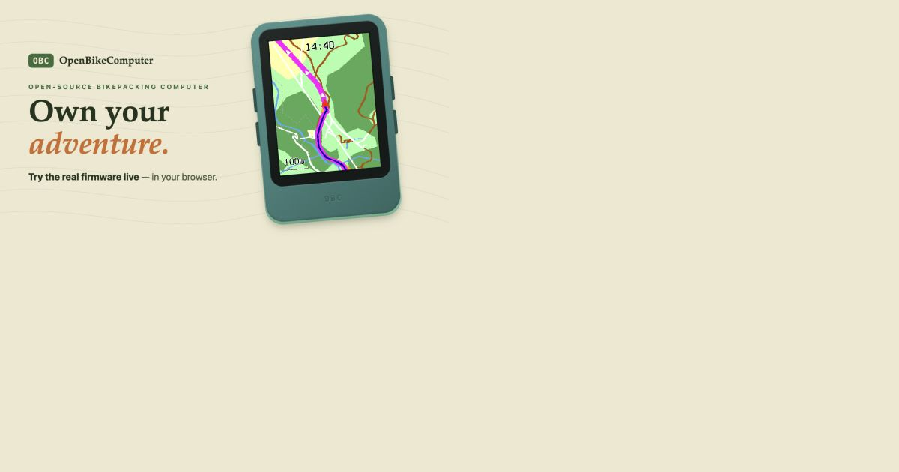](https://openbikecomputer.com/#demo)

</div>

> [!NOTE]
> This project is developed with extensive use of AI coding tools. Don't get out your "AI Slop"
> pitchforks just yet though. Any text you read in the software or documentation that sounds AI
> generated will be replaced once we get closer to releasing this project. The goal is that all
> user-facing text is 100% human-generated!

OpenBikeComputer is a fully open source bikepacking focused GPS cycling computer.
The main features and capabilities we are aiming for are the following (roughly in order of importance):
- Reliable and simple map based tracking and navigation
- Uploading a route from the companion app should work everytime (no BLE connection issues, no unreasonably low limit on pointcount in GPX  files etc.)
- No subscriptions or accounts required for any of the features of the device
- Long battery life, ideally 4+ days between recharges, if you need to recharge it should work reliably with dynamo hubs that provide 5V
- Helps you keep your phone in your pocket by providing all the info you frequently check on the bike:
    - POIS (Shops, water sources, campsites etc.) near you and along the route (including opening hours), with the ability to create a route there on the fly
    - Weather and rain radar (this is the only one that will use BLE to talk to the phone
    - And a fun one: Mountain peaks around you (PeakFinder style) 

This repository contains all the software and hardware files needed to build the OBC and the goal is to eventually provide kits that allow you to build the OBC yourself. The project currently is an active prototype, not a finished product and you can read about the progress of development in our [Blog](https://openbikecomputer.com/blog/). Here are some peeks at the software and hardware designs:


<table>
  <tr>
    <td align="center" width="33%">
      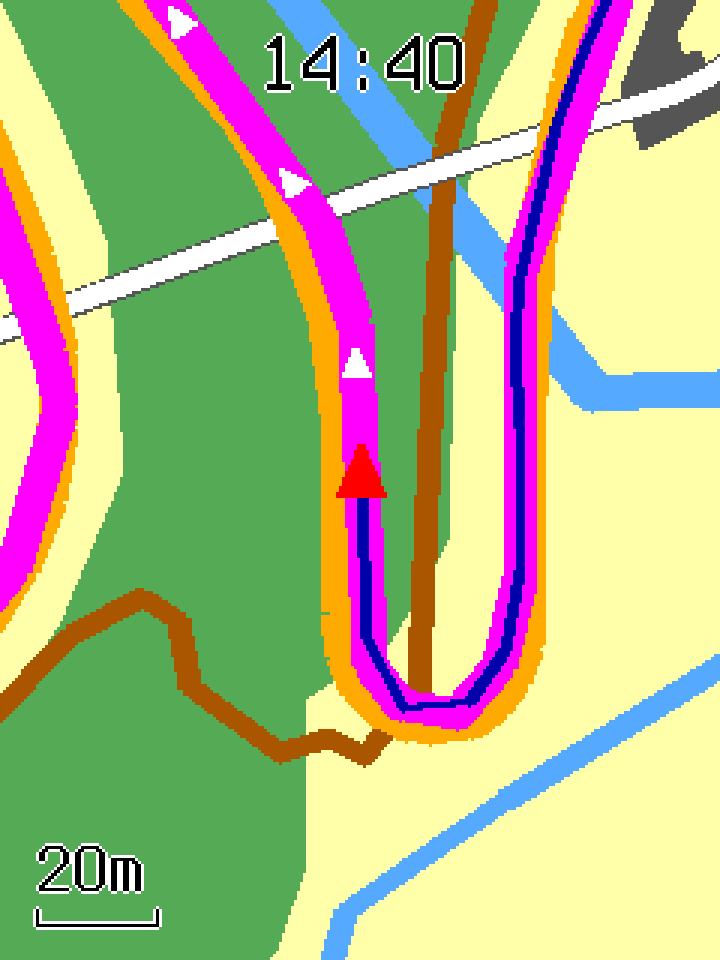
    </td>
    <td align="center" width="33%">
      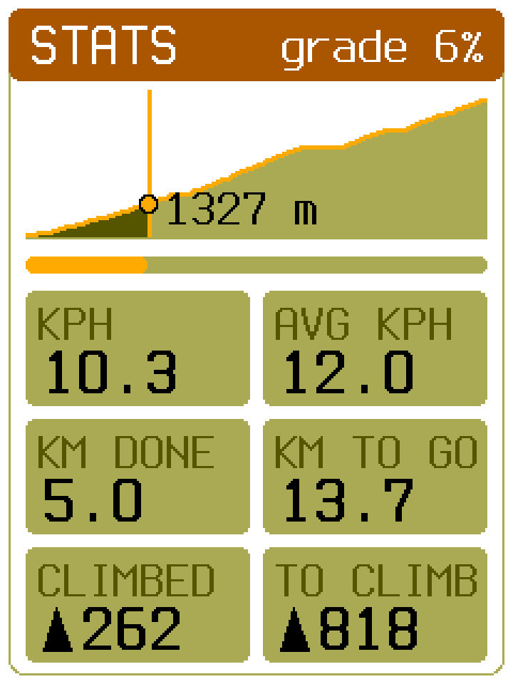
    </td>
    <td align="center" width="33%">
      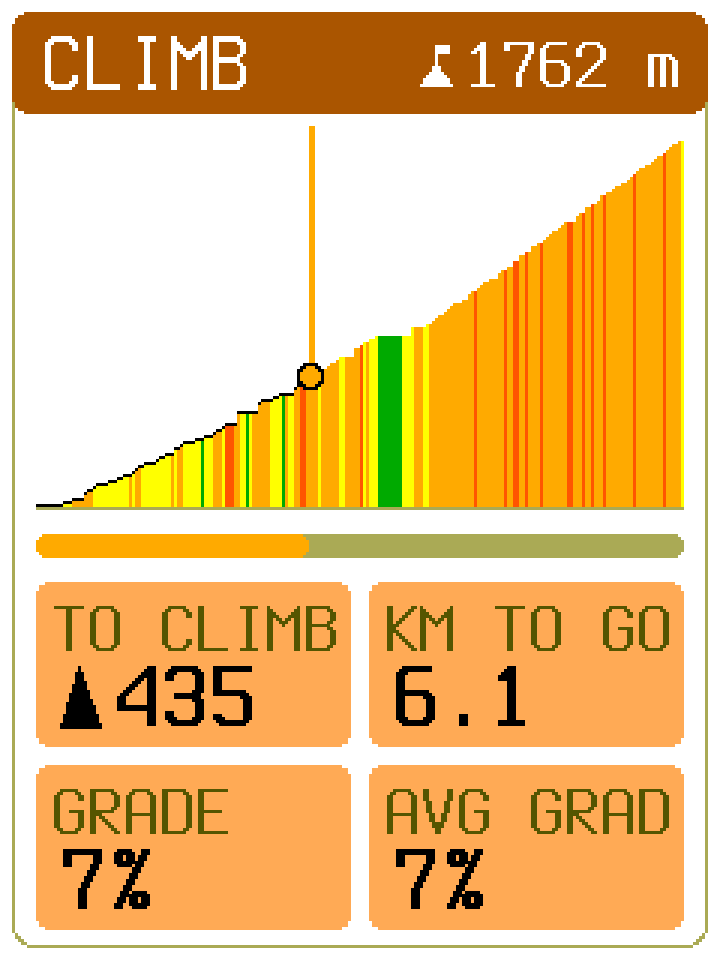
    </td>
  </tr>
  <tr>
    <td align="center"><sub>Follow the route on the offline map.</sub></td>
    <td align="center"><sub>Read your ride data as you go.</sub></td>
    <td align="center"><sub>See the climb ahead of you.</sub></td>
  </tr>
  <tr>
    <td align="center" width="33%">
      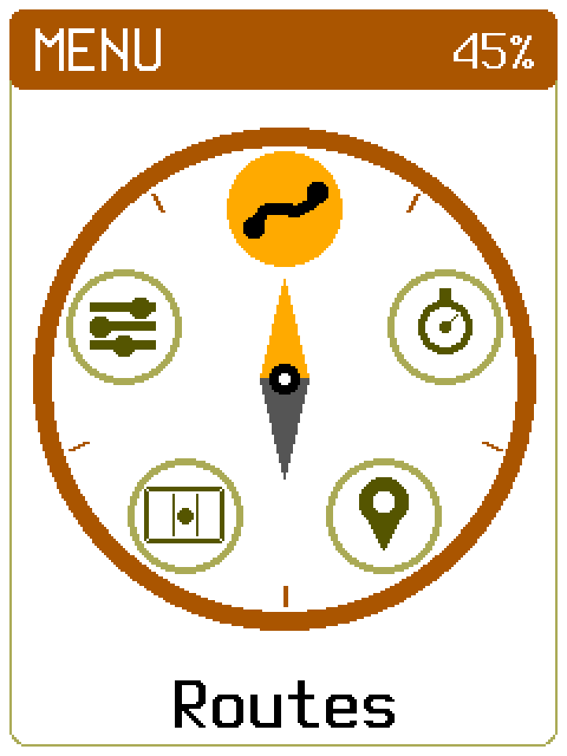
    </td>
    <td align="center" width="33%">
      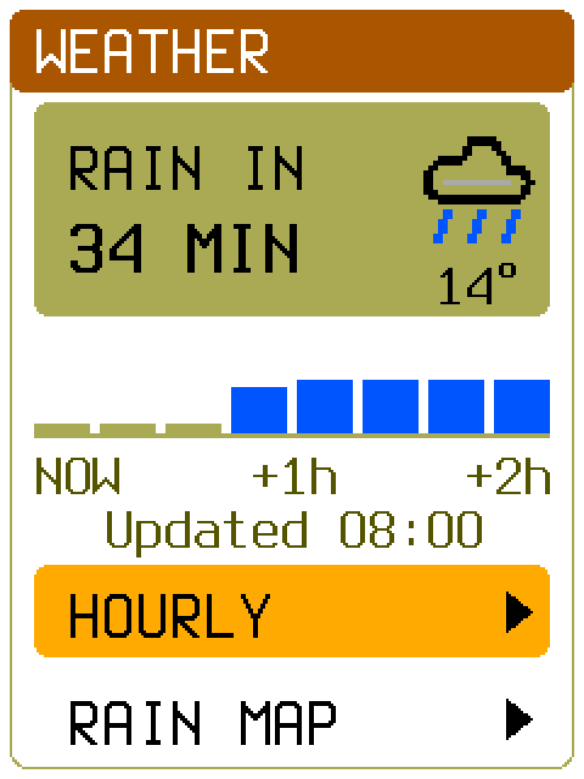
    </td>
    <td align="center" width="33%">
      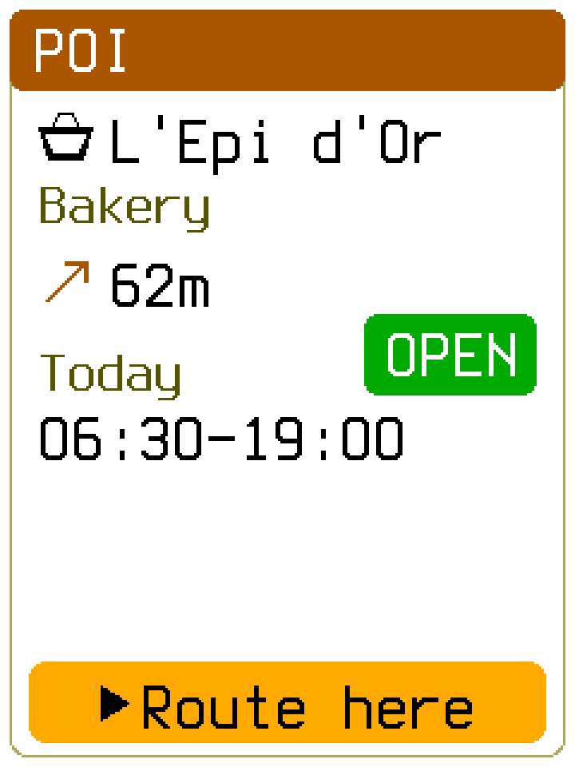
    </td>
  </tr>
  <tr>
    <td align="center"><sub>Reach every screen from one dial.</sub></td>
    <td align="center"><sub>Know when the rain arrives.</sub></td>
    <td align="center"><sub>Find a shop, and when it opens.</sub></td>
  </tr>
</table>

<table>
  <tr>
    <td align="center" width="50%">
      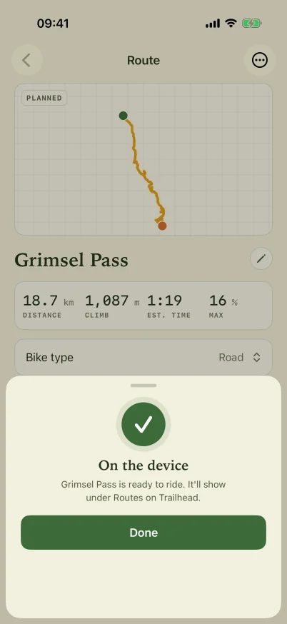
    </td>
    <td align="center" width="50%">
      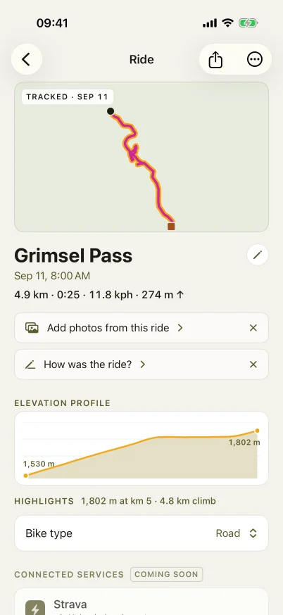
    </td>
  </tr>
  <tr>
    <td align="center"><sub>Send a route to the bike computer.</sub></td>
    <td align="center"><sub>Bring the recorded ride back.</sub></td>
  </tr>
</table>

<table>
  <tr>
    <td align="center" width="50%">
      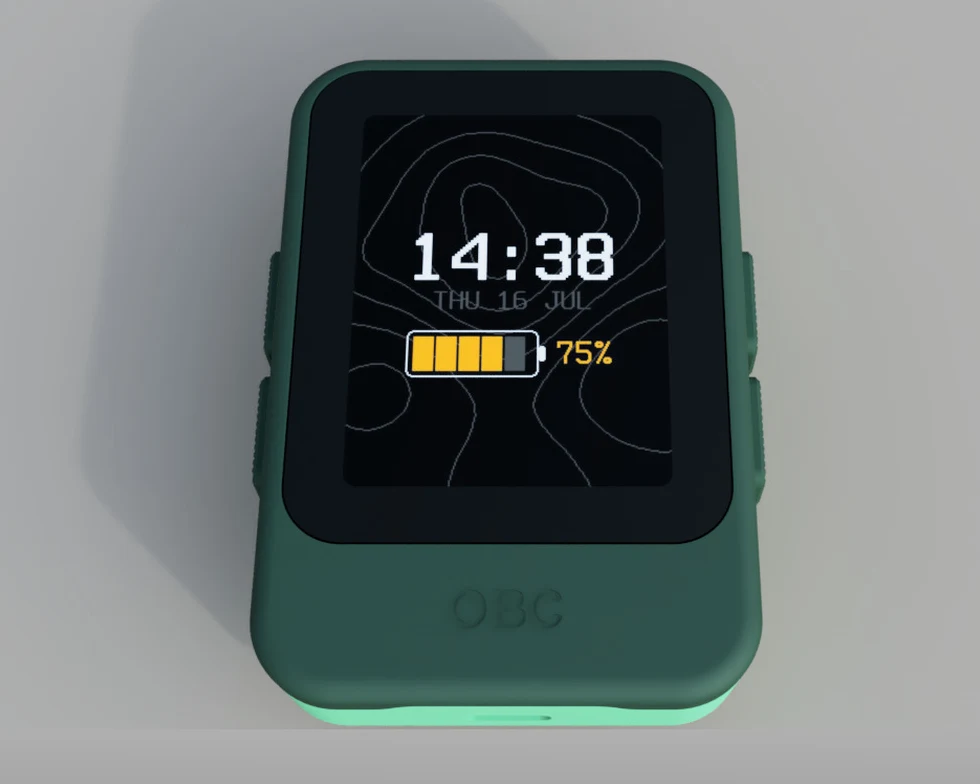
    </td>
    <td align="center" width="50%">
      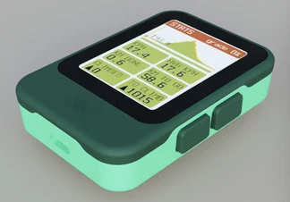
    </td>
  </tr>
  <tr>
    <td align="center"><sub>A concept render of the enclosure.</sub></td>
    <td align="center"><sub>The same device, showing the dashboard.</sub></td>
  </tr>
</table>

<table>
  <tr>
    <td align="center">
      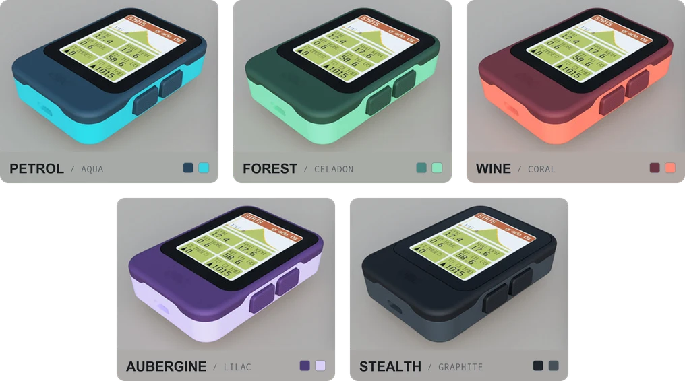
    </td>
  </tr>
  <tr>
    <td align="center"><sub>Five colourways under consideration.</sub></td>
  </tr>
</table>

## Try the simulator

The simulator is the best way to explore the project without hardware. It runs the real device
application in a desktop window and downloads the map, route, terrain, and ride data for the Grimsel
Pass demo on first use.

You need [Rust](https://rustup.rs/), Git, and Python 3.11 or newer. Then run:

```sh
git clone https://github.com/timohueser/OpenBikeComputer.git
cd OpenBikeComputer
cargo install just
./tools/obc sim
```

The first build can take a few minutes. The fixture download is cached for later runs. Run
`./tools/obc setup` once to install the shorter `obc` command, or see the
[simulator guide](apps/obc-sim/README.md) for controls, other scenarios, and headless rendering.

## Roadmap

This is the current direction, not a release schedule.

| Stage | Status |
| --- | --- |
| Shared application, offline maps, routing, ride recording, and weather | Available in the simulator and browser demo |
| iOS companion and BLE/USB transfer flows | Working with the development platform |
| nRF54LM20 development-kit prototype with the 240 × 320 reflective display | Running on hardware |
| Custom PCB and enclosure | In development |
| Integrated, field-tested bike computer | Next major milestone |
| Reproducible hardware build, assembly, and flashing guide | Planned when the custom hardware is ready |

## Current development platform

The hardware build uses the Nordic nRF54LM20 development kit and a Sharp LS021B7DD02 240 × 320
reflective memory LCD. It reads maps and routes from microSD and connects to the companion software
over BLE and USB. The custom PCB and enclosure are still under development. KiCad sources can be found in the repository, CAD sources for the enclosure will be made available later.

## Repository layout

| Path | Purpose |
| --- | --- |
| `firmware/` | Device application, rendering, protocols, storage, board image, and bootloader |
| `host/` | Host tools, map and weather bakers, fixtures, and test support |
| `apps/` | Desktop simulator, desktop shell, and browser/WebAssembly hosts |
| `builder/` | Svelte map builder, presets, and maintainer server |
| `companion-ios/` | SwiftUI companion app and shared iOS package |
| `specs/` | Normative binary, wire, and vector contracts |
| `fixtures/` | Scenario registry, source provenance, and fixture builders |
| `docs/` | Public documentation, website, and project blog |
| `hardware/` | KiCad schematics, PCB layouts, footprints, and component models |
| `ops/` | Service configuration, probes, and runbooks |
| `tools/` | The `obc` development command and repository tooling |

The root Cargo workspace contains the shared `firmware/`, `host/`, and `apps/` crates. The nRF54L
board image, bootloader, and Tauri desktop app use standalone Cargo roots so that their platform
dependencies do not burden normal host builds. The
[architecture guide](https://openbikecomputer.com/software/architecture/) explains the boundaries
and the shared render path.

## Other open bike computers

OpenBikeComputer is not the only open source bike computer project! Here is a (non-exhaustive) list of some other cool ones this project is inspired by:

- [IceNav](https://github.com/jgauchia/IceNav-v3) — an ESP32-based GPS navigator with multi-GNSS
  support and both rendered and vector offline maps.
- [OpenTrailPaper](https://github.com/RaemondBW/OpenTrailPaper) — an ESP32-S3 e-paper computer
  with offline maps, ride recording, and an iOS companion.
- [Pedal Guru](https://github.com/juliannojungle/pedal.guru) — a work-in-progress bike computer
  project for Raspberry Pi, RP2040, and ESP32 platforms.
- [Pi Zero Bikecomputer](https://github.com/hishizuka/pizero_bikecomputer) — a Raspberry Pi GPS
  and ANT+ computer with offline maps, navigation, and FIT ride logging.
- [bike-computer-32](https://github.com/lspr98/bike-computer-32) — a low-cost ESP32-C3 mini-map
  with offline OpenStreetMap data, GNSS positioning, and GPX track overlays.

## Contributing

Contributions are always welcome! This project is in the very early stages and many things are still a little chaotic and not well documented in many areas. Code is written almost exclusively using AI coding agents, but all the hardware design is fully human powered. Help on that front would be especially appreciated. Please just get in contact with 

## License

Software is available under [GPL-3.0-only](LICENSE). Hardware design sources are available under
[CERN-OHL-S-2.0](LICENSE.hardware). Third-party notices are listed in
[`THIRD-PARTY.md`](THIRD-PARTY.md).
