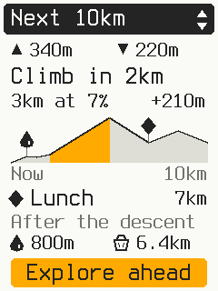
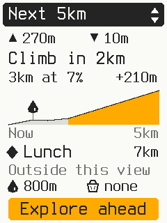
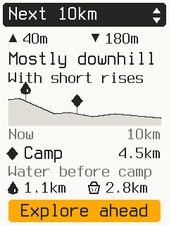
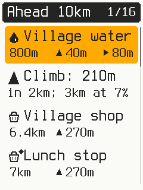
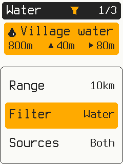

# Ride Assistant: earlier wireframes and handoff

[Issue #1734](https://github.com/timohueser/OpenBikeComputer/issues/1734) is the current handoff.
The material below records the earlier layout study; its scope and branch instructions are
historical.

This collection supports [issue #1734](https://github.com/timohueser/OpenBikeComputer/issues/1734).
It contains the latest **What's next** wireframes and the earlier **Find a place** simulator study.
The reviewed overview is now included in the opt-in simulator study. See the
[simulator controls and limits](../../../apps/obc-sim/README.md#whats-next-study).
The five wireframes below are the earlier handoff, before the endpoint labels and waypoint
explanation line were removed.

Start with the [proposal](../../content/software/ride-assistant-study.md), then compare the five
frames below. The overview layout is reviewed; production data rules and full range presets remain open.
The broader purpose of What's next and the menu consolidation are agreed.

## Continue on another machine

From an existing repository checkout:

```sh
git fetch origin codex/ride-assistant-handoff
git worktree add -b codex/ride-assistant-next ../OpenBikeComputer-ride-assistant-next origin/codex/ride-assistant-handoff
cd ../OpenBikeComputer-ride-assistant-next
```

Use a different local branch/directory name if these already exist. Read this file, the proposal,
and issue #1734 before making changes. The issue can contain decisions made after this snapshot.

This branch includes the simulator study through `4d705452`. Its base is the `remove-weather`
work at `0a449607`; it has not been rebased onto newer development work. The added handoff files
do not change firmware behavior. No local build cache, private map path, or temporary worktree
is required to view these materials.

Suggested first instruction for the next agent:

> Read docs/assets/ride-assistant/README.md, the linked proposal, and issue #1734. Continue
> reviewing the What's next information design with me. Keep the full Up Ahead functionality
> and the existing visit-and-return decisions. Review wireframes before changing firmware.

## Native reviewed screen

See the [current simulator captures](whats-next-study/README.md) for the reviewed overview,
range changes, timeline, drawer, and details. The next section preserves the earlier wireframes.

## Earlier wireframes: What's next

These are layout studies at **240 × 320 pixels**, with the firmware's Terminus bitmap glyphs:
12 × 24 for labels and 14 × 28 for body text. Places, route geometry, and values are fictional.
The ascent/descent totals match the authored profiles. These are not simulator captures.

| Next 10 km | Same ride, next 5 km | A mostly descending ride |
| --- | --- | --- |
|  |  |  |

| Explore ahead | Range, category, and source controls |
| --- | --- |
|  |  |

Open [whats-next/index.html](whats-next/index.html) locally for a gallery with a 1×/2× toggle.
GitHub shows HTML source; the images above can be viewed directly on GitHub. Each frame also has
an SVG beside its PNG. The gallery embeds its images, so the visual page can be downloaded alone;
its proposal and license links need the rest of the checkout.

To regenerate the five frames and gallery from the repository root, use Python with Pillow installed:

```sh
python3 docs/assets/ride-assistant/whats-next/draw.py
```

The generator reads the fonts from `firmware/obc-render/fonts/terminus` relative to the checkout.
The [font license](whats-next/FONT-LICENSE.txt) is included. All images and SVGs are editable study
artifacts; there is no image-generation service or additional font download.

## Decisions to retain

- **One discovery entry:** Ride Assistant in the top drawer. Remove POIs from the main menu and
  bottom drawer. What's next absorbs Up Ahead. Road blocked absorbs the existing detour flow.
- **A broader ride overview:** What's next describes the next selected distance of riding:
  terrain, climbs, planned stops/custom waypoints, and services. The user rejected the earlier
  map above a basic POI list because it did not answer that question.
- **Keep the full browser:** retain Up Ahead categories, source choices, waypoint identity,
  route order, distance/climbing, side/offset hints, details, and selection when returning.
  See the issue for the exact existing behavior to retain. Four visible rows are not a limit
  of four available entries.
- **Choose useful stops:** Find a place can suggest up to four choices, including several shops
  on the way. Do not force a detour result or fill empty slots. Keep broader results accessible.
  The study thresholds are provisional.
- **Accept the whole visit:** Add stop accepts the approach and return/rejoin. Arrival activates
  the accepted return leg before showing an informational card. Dismiss/Back closes the card;
  no second Continue action is required. Rejoining restores the original route. Recording continues.
- **Preserve trust:** no automatic rerouting, typed chat, or on-device AI. Keep landmarks separate
  from Peak View. Unknown elevation, access, opening, and coverage must remain unknown. A bounded
  POI list cannot prove that a service is the last one on the route.

The issue also retains next-town services, easier-route comparisons, manual missed-turn recovery,
landmark identification, and carefully selected worthwhile detours. The first release scope is open.

## Proposal still to review

The latest design uses one distance window for ascent/descent, an elevation strip, the next planned
stop, and service opportunities. Select opens **Explore ahead**, a chronological timeline that
also includes climbs. Relationships such as water before a climb come from route positions and
terrain intervals. Filters scope the detailed list; they do not silently remove terrain or planned
stops from the brief.

Review the information hierarchy across climbing, descending, flat, and crowded rides. Decide
whether one Select into the full timeline is appropriate. Set distance presets and button behavior.
Refine multiple-climb and multiple-waypoint cases, profile marker grouping, missing data, and
the journey shown during an accepted POI visit. The proposal describes these constraints; the
five frames do not yet illustrate every case.

## Existing simulator study

The [visit study collection](visit-study/README.md) has actual firmware-rendered captures and
links to the portable launch instructions. It implements the current shop-visit flow and its
stages. What's next has a separate fixed-data screen and timeline. The other Assistant questions remain placeholders.

Useful source entry points:

- [Device study state](../../../firmware/obc-app/src/assistant_demo.rs) and
  [candidate selection](../../../firmware/obc-app/src/assistant_demo/candidates.rs).
- [Assistant rendering](../../../firmware/obc-app/src/screen/assistant.rs).
- [Simulator fixtures](../../../apps/obc-sim/src/assistant_demo.rs) and
  [simulator README](../../../apps/obc-sim/README.md#ride-assistant-interaction-study).

The study's shops and access legs are synthetic. It does not search real POIs, route access paths,
or detect arrival from GPS. Missing GPX elevations currently become zero in the study; that is
not suitable for production claims. Before testing What's next with custom waypoints, check the
GPX fixture import: it rebuilds a route from track points and does not retain custom waypoints.

The existing route profile and detected climb segments can support the proposed brief. Along-route
distance and lateral POI offset are not the distance or climbing for a rideable visit. Keep those
quantities distinct when joining the current Up Ahead data to the shared place/visit flow.
