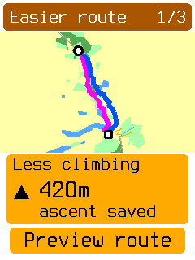
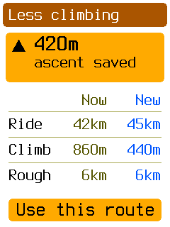
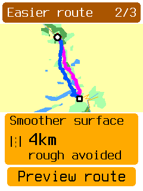
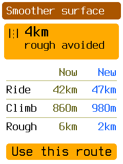
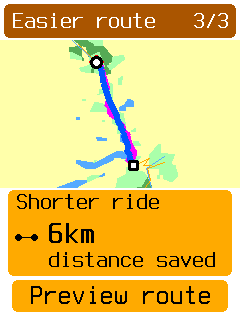
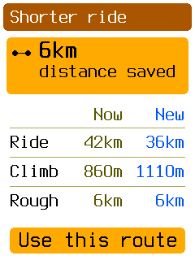

# Easier route study

The reviewed design is **C, map first**. The simulator uses the device map renderer and real
map data, with synthetic alternatives and costs. [The original wireframes](wireframes.html)
are retained as the earlier proposal. Run instructions are in the
[simulator README](../../../../apps/obc-sim/README.md#easier-route-study).

## Reviewed behavior

Up/Down browses Less climbing, Smoother surface, and Shorter ride. The camera stays fixed.
The current route is magenta; the candidate is blue. Comparison lines are thinner than the
normal navigation line. Start and finish have symbols, without a legend or additional labels.

The amber card shows the goal, a small pictogram, a large saving, and a short caption. Select
opens the current/new cost table. The saving stays above the table. The review omits the
same-destination sentence and a separate negative headline. Tradeoffs remain in the table.
Back preserves the selected alternative. **Use this route** activates its prepared route and
returns to Map without restarting recording. The accepted alternative becomes the baseline
when the comparison is reopened.

## Simulator captures

| Goal | Map and card | Review |
| --- | --- | --- |
| Less climbing |  |  |
| Smoother surface |  |  |
| Shorter ride |  |  |

## Mock data and limits

| Route | Remaining distance | Ascent | Rough surface |
| --- | ---: | ---: | ---: |
| Current | 42 km | 860 m | 6 km |
| Less climbing | 45 km | 440 m | 6 km |
| Smoother surface | 47 km | 980 m | 2 km |
| Shorter ride | 36 km | 1,110 m | 6 km |

The host creates three bounded paths with the original route's start and finish. Intermediate
geometry is synthetic and need not follow roads. These cost figures are illustrative, not
measurements of those paths. “Rough” is a placeholder; no surface classification is implemented.
Unknown surface must not count as smooth in production. A shorter route is not necessarily
faster. The simulator does not show ETA estimates.

Alternatives are unavailable during a mock place visit. After a visit, the prepared return
leg still follows the original fixture; production must calculate that leg for the accepted
route. The mock does not preserve required stops or calculate routes from a moving rider's
current position. These limits need explicit treatment in the implementation epic.

## Next design step

The fourth simulator shell is ready for review. After review, draft the implementation epic
and sub-issues for Find a place, What's next, Landmarks, and Easier route, including map creation
and routing. The requested adversarial review belongs to that future epic stage.

## Verification

- `./tools/obc test -p obc-app -p obc-sim`: passed. Focused additions cover unchanged navigation
  before acceptance, Back preserving selection, continued recording, independence from shop
  results, and synthetic route endpoints and map bounds.
- `cargo clippy -p obc-app -p obc-sim --all-targets -- -D warnings`: passed.
- `cargo build -p obc-sim`: passed.
- `cargo fmt --all` and `cargo fmt` for the board, bootloader, and desktop roots: completed.
- `./tools/obc suites check`: passed.
- `python3 docs/build_docs.py --check-links`: passed.
- `git diff --check`: passed.
- Six named device-renderer captures inspected. The menu-entry capture matches the direct
  stage capture. The `p b p p f` script with empty shop results accepts route 23, reaches Map,
  and reports recording active.
- The affected-suite dry run against origin/develop includes earlier branch work. Package
  checks above cover this change; the full branch selection was not run again.

Full CI, the full UI snapshot sweep, resource measurement, board builds, and flashing were
omitted. This is an opt-in simulator prototype; no codec or routing backend is introduced.
