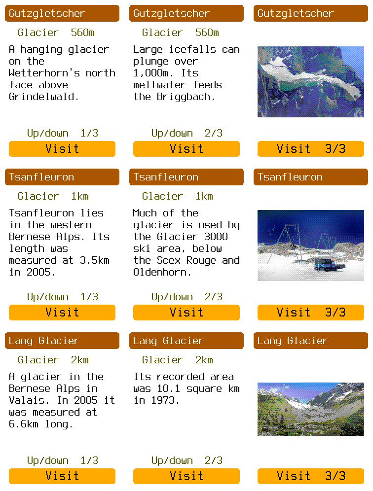
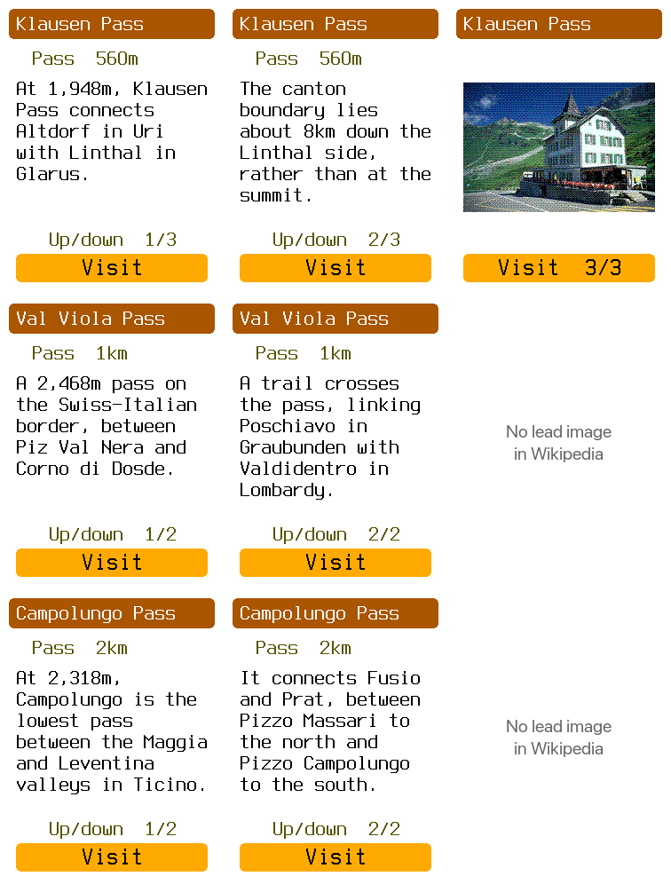

# Random glacier and pass examples

Large 216 × 240 ordered-dither photos are the accepted format. These six examples test the
content, not the image size. Positions and visit routes are synthetic inside the Swiss study
map. They do not describe access to the real places. In particular, a glacier location must
not become a route target without a mapped, accessible approach or viewpoint.

## Sampling

The draw is fixed and reproducible. For each group, collect all IDs in the saved Swiss
snapshot whose P31 type has the glacier or mountain-pass root in its saved P279 closure.
Sort IDs lexicographically and call Python `random.Random(seed).sample(pool, 3)`.
Seeds are `obc-landmarks-2026-09-14-glaciers` and `obc-landmarks-2026-09-14-passes`.
Pools contain 149 glaciers and 293 passes. This draw preceded the revised exclusion rules.
There is no image requirement, English-article requirement, popularity filter, or redraw.

[samples.json](samples.json) records selected IDs, seeds, source revisions, image metadata,
and exact display text. These are random places, not random sentences. Text is edited into
two short pages like the previous prototypes. Gutzgletscher is translated from German; the
others use English articles. This does not implement an automatic text summarizer. Old glacier
measurements keep their dates. The selection and ranking process uses no AI judgments.

Use the chosen article's pageimages lead image, if present. Do not substitute a prettier view.
Val Viola and Campolungo have no lead image in their selected articles, and no P18 image in
the captured Wikidata data. Their simulator entries stay text-only. This is not proof that no
photographs exist elsewhere.

## Glaciers

Rows are Gutzgletscher, Tsanfleuron Glacier, and Lang Glacier. Columns are text page one,
text page two, and photo. All frames are native 240 × 320 output.



Gutzgletscher has an explanatory story about hanging ice and meltwater, but is clearly a
feature to view rather than route onto. Lang's short introduction mainly supplies old size
measurements. Tsanfleuron has more context, while its lead photo shows ski infrastructure.
These examples do not establish uniformly useful text or a reliably explanatory lead image.
They support treating glacier inclusion as a separate decision from passes.

## Passes

Rows are Klausen, Val Viola, and Campolungo. Grey missing-image notes are report annotations,
not extra simulator pages.



The pass descriptions explain which valleys or places connect and why the location matters.
That fits a visitable site better than a glacier centre. Klausen's lead photo is a hotel;
the smaller passes have usable text without a lead image. Missing pictures should not remove
otherwise useful entries.

## Sources

All text is adapted from Wikipedia contributors under
[CC BY-SA 4.0](https://creativecommons.org/licenses/by-sa/4.0/). It is shortened and reworded;
Gutzgletscher is also translated. See samples.json for exact article revision IDs. Image
adaptations are resized, padded, and ordered dithered; each retains its source licence.
Sources are available from the normal Down + Back drawer, including German article URLs.

- **Gutzgletscher:** [Article revision](https://de.wikipedia.org/w/index.php?title=Gutzgletscher&oldid=256787443). Photo by Bgvr: [source](https://commons.wikimedia.org/wiki/File:Gutzgletscher_20160902.jpg), [CC BY-SA 4.0](https://creativecommons.org/licenses/by-sa/4.0/).
- **Tsanfleuron:** [Article revision](https://en.wikipedia.org/w/index.php?title=Tsanfleuron_Glacier&oldid=1338960209). Photo by Zacharie Grossen: [source](https://commons.wikimedia.org/wiki/File:Summer_Snow.jpg), [CC BY-SA 4.0](https://creativecommons.org/licenses/by-sa/4.0/).
- **Lang Glacier:** [Article revision](https://en.wikipedia.org/w/index.php?title=Lang_Glacier&oldid=1338959116). Photo by Hans Hillewaert: [source](https://commons.wikimedia.org/wiki/File:Langgletscher_in_L%C3%B6tschental.jpg), [CC BY-SA 3.0](https://creativecommons.org/licenses/by-sa/3.0/).
- **Klausen Pass:** [Article revision](https://en.wikipedia.org/w/index.php?title=Klausen_Pass&oldid=1362434425). Photo by Roland Zumbühl: [source](https://commons.wikimedia.org/wiki/File:Klausenpass_Hotel_Passhoehe.jpg), [CC BY-SA 3.0](http://creativecommons.org/licenses/by-sa/3.0/).
- **Val Viola Pass:** [Article revision](https://en.wikipedia.org/w/index.php?title=Val_Viola_Pass&oldid=1362438906). No lead image in the selected article.
- **Campolungo Pass:** [Article revision](https://en.wikipedia.org/w/index.php?title=Campolungo_Pass&oldid=1362430513). No lead image in the selected article.

## Image storage

The physical demo reads compiled flash assets, not SD-card files. The simulator also embeds
its example data. The current response speed is not an SD loading benchmark.

[compression.py](compression.py) measures seven large photos: the three accepted examples
and four randomly sampled images. It uses only standard-library code and checks byte-exact
restoration for each transformation. [compression.json](compression.json) saves the results.

| Encoding | Bytes per photo in this sample |
| --- | ---: |
| Raw RGB222 byte per pixel | 51,840 |
| Six-bit packed pixels | 38,880 |
| Six-bit packed non-white rectangle plus bounds | 17,504–28,808 |
| zlib level 6 over raw pixels | 5,329–9,886 |
| zlib level 6 over six-bit packed pixels | 5,790–10,923 |

Packing always saves 25%. Omitting white margins preserves the entire composition: store
rectangle bounds and fill white outside them. It is not a subject crop. In this sample, zlib
compresses the raw six-bit-valued bytes better than an already packed stream. Do not assume
that combining transformations always reduces size.

My proposed sequence is: keep preconverted RGB222; measure SD read plus decode on the device;
then choose a small decoder or simple packing from those results. Store each image separately
so a single photo can load without decompressing a region. No JPEG decoder is needed. The
experiment does not add a codec, map format, or SD reader to firmware. These are measured
sizes, not a country-wide compression ratio or a device latency/RAM result.

## Run and verify

From the repository root, append one of these options to the usual simulator map command:

```sh
--assistant-landmarks glaciers
--assistant-landmarks passes
```

Up/Down selects a place. Select opens its text. Up from the first page opens its photo, when
present. The visit preview is shared with the existing assistant study. Example headless
capture with the normal study GPX:

```sh
target/debug/obc-sim /path/to/grimsel-demo.obcm \
  --assistant-route fixtures/sources/sim-grimsel/tracks/grimsel-climb.gpx \
  --assistant-landmarks glaciers --script puf --expect-screen Assistant --png /tmp/glacier.png
```

Checks run:

```sh
./tools/obc test -p obc-app -p obc-sim
cargo clippy -p obc-app -p obc-sim --all-targets -- -D warnings
cargo build -p obc-sim
python3 docs/assets/ride-assistant/glacier-pass-study/compression.py
python3 docs/assets/ride-assistant/landmark-selection/count.py
./tools/obc suites check
./tools/obc test affected --base origin/develop --dry-run
python3 docs/build_docs.py --check-links
cargo fmt --all
cargo fmt --manifest-path firmware/obc-fw-nrf54l/Cargo.toml
cargo fmt --manifest-path firmware/obc-boot/Cargo.toml
cargo fmt --manifest-path apps/obc-desktop/Cargo.toml
git diff --check
```

From `firmware/obc-fw-nrf54l`, the board commands were:

```sh
cargo build --release --bin display_test --features landmark-photo-demo
cargo run --release --bin display_test --features landmark-photo-demo
```

Verified programming and display startup passed. The installed ELF SHA-256 is
`18f4ffb98685ad00d821c2accf25b309c372b3da51f1979f3dfb6c38cf42e29b`.

Sixteen named sample frames were captured and inspected,
including all twelve text pages. All four image rectangles match the prepared image pixels.
The normal source drawer and the three original photo examples have additional targeted checks.
No full UI sweep was run. Full workspace/affected suites, resource gates, SD performance,
normal-application hardware, and wake profiling were deliberately omitted. The affected dry
run includes unrelated work from this branch's older base.
