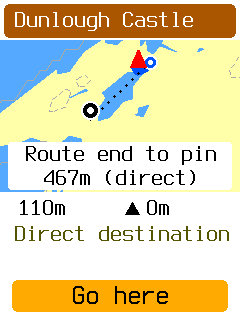
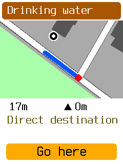

# Find and preview refinement

The device feedback requests a continuous progress indicator, reuse of measured routes, clear
preview markers, and clearer labels. Find keeps route-cost ranking for every candidate. No
simulator-only planner acceleration is included.

## Behavior

- The normal menu label is **Find a place** in all four languages.
- **Finding places** remains visible through query, planning, publication, and release. The next
  queued candidate starts without waiting for the next GPS fix. The planner's work budget is unchanged.
- Find stores measured routes on the card. Opening a result and going Back to reselect load the
  exact route revision and preview shape without another planner search. Changed inputs refuse reuse.
- A bounded list owns the stored candidates. Category exit and pruning remove unused routes.
  Restart reconciles unaccepted Assistant routes through the existing catalog cleanup mechanism.
  Ordinary routes, the active route, and both accepted checkpoint sources remain protected.
- The preview route is thinner. The destination pin and rider are drawn above it. For mapped
  approaches more than 100 m from a place coordinate, a dotted connector and **Route end to pin**
  caption show the direct gap. This is not a measured walking path or an entrance claim.
- Landmark page counts appear in the top-right corner. The place detail button says **Preview route**.

These two frames use the real offline West Cork map and the production simulator paths.

## Checks

Passed:

- `CARGO_TARGET_DIR=... tools/obc test -p obc-app -p obc-host-core`
- `CARGO_TARGET_DIR=... cargo clippy -p obc-app -p obc-host-core -p obc-sim --all-targets -- -D warnings`
- `CARGO_TARGET_DIR=... tools/obc test fixtures -p obc-sim`
- `tools/obc test affected --base origin/develop --dry-run`
- One `firmware/ui-snapshots.sh` sweep: 263 frames; 12 intentional changes, no missing frames.
- `tools/obc suites check`, workspace and standalone formatting, and documentation link checks.
- One successful head device measurement against the recorded baseline. No base image rebuild.

The lifecycle test executes ten scenarios, including Back/reselect without a new route plan,
missing retained source, cancellation, acceptance during exit, interrupted ranking, 24 orphan
candidates after restart, preservation of an ordinary route, and accepted checkpoint recovery.
The added recovery delta passed the whole App and host suites and their Clippy checks.
The free-ride case supplies no active route or route reader. It renders only when the pass requests
an unfrozen map frame, as the board does. It covers all eight candidate plans, stored preview
reopening, and cleanup with a stationary fix.

Independent review found stale-store cleanup and restart orphan problems. Both are fixed and their
deltas were reviewed. Named-frame review and the board fallback delta passed with no open findings.

The full local CI suite and wake-profile isolation sweep were omitted. Focused suites cover the
changed packages; the device run checks the changed scheduling path. CI remains the merge gate.

## Device image

The final `debug-uart` image was built from `7315fa201` with the normal standalone board configuration.
Its SHA-256 is `c2cbe630333d441a884e7ccb5541ad6cdd4dc86ce36e2cab835fdf59f5b84644`.
The report-only resource image is separate and must not be flashed.

[Resource guards](resources.log) on the first head image pass: 309,832 B linked resident, 132,096 B `.uninit`, 9,776 B largest
guarded poll frame, and 49,592 B residual main stack. Resident use is 512 B above the prior
`6c81ddb` debug image. The recorded RAM and stack limits are unchanged. The diagnostic allocation table records App at
52,800 B, a 488 B increase. The final release-ACK correction changes no stored fields. CI checks the
final head resource limits.

The first physical run found a stall after one candidate: the cancellation release no longer
removed a retained route, so its catalog deletion no longer caused a redraw. The release ACK now
marks Find preparation dirty when it is waiting in Releasing. Commit `7315fa201` fixes this edge;
`3fdff39f2` adds the board-style free-ride test. A second flash is required for this physical fix.
No second UI sweep or base resource build was run.

The card keeps the Swiss map, Meiringen route, and fixed location from the
[previous device setup](../next-place-device/README.md). The SD card is not formatted again.

## Physical result

Verified flash completed. The board boots `7315fa2` and reads the unchanged Swiss map and Meiringen
route. The stationary fix is 46.723126 N, 8.194551 E with heading 225 degrees. No route is active.

| Check | Result |
| --- | --- |
| Water category press to ready result frame | 5.801 s, previously 9.628 s |
| Measured candidates | 8, still ranked by route cost |
| Candidate planner time, total | 2.894 s; work limits unchanged |
| Result press to final preview frame | 0.955 s |
| New route calculations on preview open | 0 |
| New route calculations after Back and reselect | 0 |
| Device stack high-water in this check | 34,296 / 49,592 B |

This single stationary comparison is about 40% faster. It is not a worst-case routing guarantee.
The remaining preview time includes catalog settlement and map drawing; it is not another route
search. The image below is read from the actual device framebuffer.

Evidence: [timings](timings.json), [water batch](water-search.log),
[first preview](water-open-preview.log), [Back and reselect](water-reopen-preview.log).

Owner acceptance remains pending for progress continuity, the preview pin and rider, landmark
pagination, and the gap caption. Long rides, active-route excursions, and the broader hardware
matrix in issue #1748 remain separate acceptance work. The device is available for owner testing;
the stationary GPS feed remains active.
