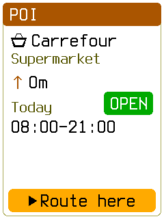
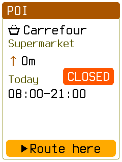
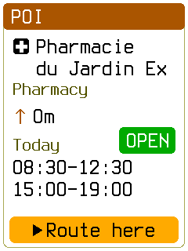

# Simulator clock and real POI hours

The Monaco v15 map retains the original source schedules. Carrefour (OSM node 274497719,
HoursRef 3) opens Monday 08:00–21:00. Pharmacie du Jardin Exotique (node 1876844586,
HoursRef 8) opens Monday 08:30–12:30 and 15:00–19:00. The pinned source PBF and the
stored 29-byte hours blobs agree.

The simulator previously used `--clock` only to seed settings. This did not establish trusted time
or a known local offset. Current opening status was therefore unknown. Explicit `--clock` now
uses `App::stamp_clock` with the given UTC time, a known zero offset, and the phone-time trust
source. `--clock-after-script` supplies a second time through the same entry before final settle.
The closed frame selects Carrefour while open and changes the time with the detail retained.
Queries still exclude places known to be closed.

Named production frames use the pinned `.artifacts/sim-monaco/monaco.obcm` and normal simulator:

```sh
obc-sim monaco.obcm --boot --center 7416969,43730798 --heading 0 --clock 2025-01-06T12:00 --script "B d d w p d d d p f p" --expect-screen PoiDetail --png poi-detail-open.png
obc-sim monaco.obcm --boot --center 7416969,43730798 --heading 0 --clock 2025-01-06T12:00 --clock-after-script 2025-01-06T23:00 --script "B d d w p d d d p f p f" --expect-screen PoiDetail --png poi-detail-closed.png
obc-sim monaco.obcm --boot --center 7413793,43734832 --heading 0 --clock 2025-01-06T12:00 --script "B d d w p d d d d p f p" --expect-screen PoiDetail --png poi-detail-split.png
```





All three frames are distinct and show the stored schedules. Their SHA-256 values are:

- `poi-detail-open.png`: `21e80505c0153d8ca451259d779ddc6bfd5835e92e24628dabd14f039c3a4071`
- `poi-detail-closed.png`: `1f47f0e551a49ab2a2d4a54d1c1650a03ee4053680c6c05d63a52d8c9cf70604`
- `poi-detail-split.png`: `acdb769a5eeb46bb7ac70253e68bc277426a415a8b304be40223a21176e82942`

Validation: `./tools/obc test -p obc-sim` (62 unit and 11 integration tests), simulator all-target
Clippy with warnings as errors, suite registry, workspace and standalone formatting, and
`python3 docs/build_docs.py --check-links`. The named frames used one simulator build. No full
snapshot sweep, firmware image, resource measurement, App suite, or hardware test ran. Snapshot
manifest reconciliation and final CI remain integration work.
