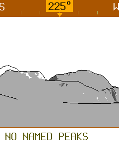

# Shortcut correction acceptance

The main menu always contains Routes, Rides, Map, Peak View and Settings.
Tap Up + Select to open the quick drawer with Bluetooth on/off. Hold both buttons for
500 ms to open Ride Assistant directly. Press the second button within 100 ms of the first.
The hold opens no intermediate drawer. Blocking modals retain input ownership.

A paused GPX replay refreshes the actual stationary position once per second. The replay
and ride clock remain paused. A host contract covers 60 seconds of paused operation and
checks that the fix expires when the receiver stops.

## Validation

- `tools/obc test -p obc-app -p obc-sim -p obc-host-core -p obc-replay -p obc-web-demo`:
  1,251 passed, two manual tests ignored.
- `cargo clippy -p obc-app -p obc-sim -p obc-host-core -p obc-replay -p obc-web-demo --all-targets -- -D warnings`: passed.
- Workspace and all three standalone roots formatted; `git diff --check` passed.
- `tools/obc suites check`: 80 suites and 336 execution units.
- `python3 docs/build_docs.py --check-links`: passed.
- One UI sweep: 263 frames; manifest check passed. Eleven menu/drawer frames changed and
  four Bluetooth-off frames were added. Other frame hashes stayed unchanged.
- Independent adversarial code review and seven named-frame checks completed. The one
  finding, navigation capacity after a full-stack Assistant entry, was fixed and delta-reviewed.

The interactive simulator uses the captured Meiringen map, the real paused track
`ra13-easier/meiringen-loop-from-265.gpx`, and cached `scheidegg` geographic Peak View
terrain. The map has native elevation data; the additional Peak View terrain supplies the
panorama surface. No map or terrain data was rebaked. A separate card copy exercised the
normal menu entry at the same GPS position and heading 225 degrees:

The view has valid terrain but no visible named peak at this position and heading.
GPS coordinates do not need manual entry. The simulator Controls window can change the
heading or play the track.

## Pending hardware acceptance

No physical device was connected. On hardware, check both button orders, short tap,
500 ms hold, release/rearm, blocking modals, Bluetooth persistence and actual radio state,
and Peak View with a live fix and installed terrain. Existing epic hardware acceptance
remains pending. No local shipping-image build or full CI mirror was run for this correction;
CI owns the resource gates.
