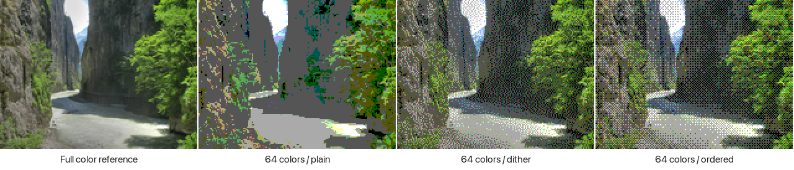
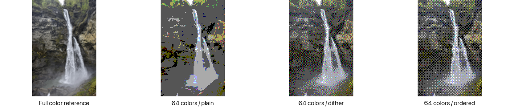
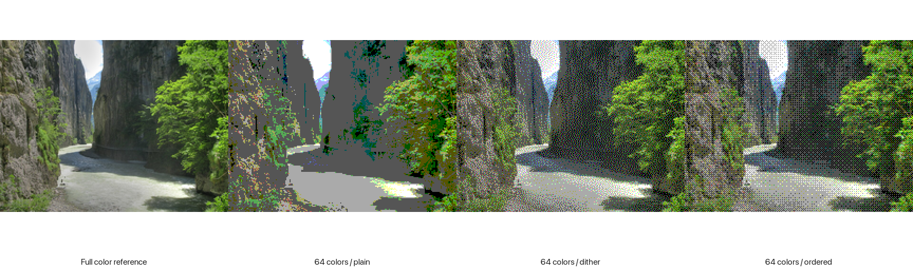
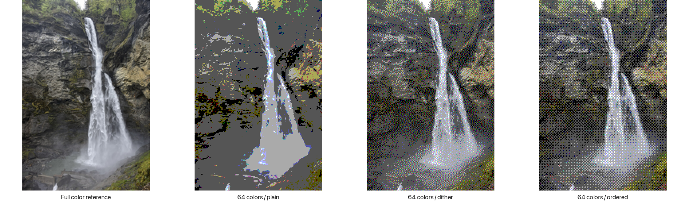

# Landmark photo study

The small ordered-dither samples are now included in the simulator and a display-only board
demo. Both use the same RGB222 pixel assets. The other versions are comparison samples.
The photos are the
lead images returned by Wikipedia's pageimages API for Aare Gorge and Reichenbach Falls.
The source records are in [sources.json](sources.json).

## Small image: 160 × 120 pixel box

Each comparison shows a resized full-color reference, plain device-palette quantization,
Floyd–Steinberg dithering, and ordered 4 × 4 dithering, from left to right. The comparison sheets
use exactly 2× nearest-neighbour enlargement. They do not add detail. The individual files are
at native resolution. Full-color references are not device output.





All photos keep their aspect ratio and full field of view. White margins fill the unused area.
The portrait waterfall therefore occupies about 80 × 120 pixels in the small box. A crop could
use more of that box but would omit part of the waterfall. No image-specific color correction,
contrast adjustment, sharpening, or generated detail was applied.

## Larger image: 216 × 240 pixel box

This leaves room for a header and controls on a 240 × 320 screen.





My preference in these examples is ordered dithering. Plain quantization produces large flat
gray areas. Floyd–Steinberg retains texture but adds colored speckles. Ordered dithering has a
visible pattern, but its color noise is less distracting. This is a desktop comparison of the
simulator gamut. It does not measure the physical panel's contrast or appearance in sunlight.

## Palette and reproduction

The fixed RGB222 palette has channel levels 0, 85, 170, and 255. It is the palette in
[the simulator](../../../../apps/obc-sim/src/palette.rs). Each quantized output was checked:
every channel belongs to those four levels. No adaptive, image-specific palette is used.

ImageMagick 7.1.2-26 did the image processing. The following commands show the 160 × 120 case.
`palette.ppm` is a 64 × 1 P6 image with every RGB combination of those channel levels.
The input is the 960-pixel Wikimedia thumbnail recorded in sources.json.

```sh
magick source.jpg -auto-orient -colorspace sRGB -filter Lanczos -resize 160x120 \
  -background white -gravity center -extent 160x120 -strip reference.png
magick reference.png -dither None -remap palette.ppm -depth 8 -strip plain.png
magick reference.png -dither FloydSteinberg -remap palette.ppm -depth 8 -strip dither.png
magick reference.png -ordered-dither o4x4,4 -depth 8 -strip ordered.png
```

See [ImageMagick's quantization documentation](https://usage.imagemagick.org/quantize/).
For the larger samples, replace both dimensions with 216x240. Quantization follows resizing.

## Image attribution

- **Aare Gorge:** *Aareschlucht 166 7*, by Pazit Polak.
  [Original and attribution](https://commons.wikimedia.org/wiki/File:Aareschlucht_166_7.jpg).
  [CC BY-SA 2.0](https://creativecommons.org/licenses/by-sa/2.0/).
- **Reichenbach Falls:** *Schattenhalb Reichenbachfall 7-05-2024 10-56-28*, by Paul Hermans.
  [Original and attribution](https://commons.wikimedia.org/wiki/File:Schattenhalb_Reichenbachfall_7-05-2024_10-56-28.jpg).
  [CC BY-SA 4.0](https://creativecommons.org/licenses/by-sa/4.0/).

The samples are resized, padded, and, where labelled, quantized or dithered adaptations.
Each photo's adaptations and comparison sheets retain that photo's respective licence.
These licences are distinct from the Wikipedia text licence. No endorsement is implied.

## Storage per image

The simplest proposed storage is one RGB222 byte per pixel, as in the existing framebuffer.
The two high bits are unused. A fixed palette needs no per-image palette table. A decoder could
copy or translate these preconverted pixels; it would not need to decode JPEG. This is a design
option, not an implemented storage contract. Headers, indexes, and attribution add some bytes.

| Image box | One byte per pixel | Packed six bits per pixel |
| --- | ---: | ---: |
| 160 × 120 | 19,200 B / 18.75 KiB | 14,400 B / 14.06 KiB |
| 216 × 240 | 51,840 B / 50.63 KiB | 38,880 B / 37.97 KiB |

Six-bit packing saves 25%, at the cost of unpacking. Dithering changes compressibility, not the
uncompressed size. These calculations include the margins; storing only the image rectangle
could save space. The two resolutions are alternative pack choices, not two images per place.

Measured zlib level-9 sizes of the one-byte pixel streams:

| Image | Plain | Floyd–Steinberg | Ordered |
| --- | ---: | ---: | ---: |
| Aare, 160 × 120 | 4,432 B | 7,898 B | 5,492 B |
| Falls, 160 × 120 | 1,886 B | 4,098 B | 2,735 B |
| Aare, 216 × 240 | 8,085 B | 14,313 B | 9,743 B |
| Falls, 216 × 240 | 6,521 B | 15,048 B | 9,219 B |

[measurements.json](measurements.json) also records the PNG sizes. PNGs are review artifacts;
the PNG format is not proposed for the device. Zlib is only a compression experiment here.
These two images, including their uniform margins, do not predict country-wide compression.

## Switzerland planning estimate

[Taginfo Switzerland](https://taginfo.osm.ch/about) covers Swiss OSM data. Its snapshot dated
11 September 2026 reports **18,281 objects with a wikipedia tag**, containing 14,412 distinct
values. Those objects include routes, settlements, and other non-landmarks. Distinct tag values
are not necessarily distinct places. This is a scope reference, not a production landmark count.

Among wikipedia-tagged objects, 775 also have tourism, 897 historic, 1,270 natural, and 1,327
amenity tags. These groups overlap and include items we would exclude. Conversely, landmarks
linked only through Wikidata are absent. Image availability would reduce the number of photos.
The API snapshots are saved as [key statistics](switzerland-wikipedia.json) and
[tag combinations](switzerland-combinations.json); their source URLs are recorded inside.

A few thousand images is therefore a useful initial planning range, with a larger case to test
broader selection. These are assumptions until we define and run the landmark extraction.

| Photos, one per landmark | 160 × 120, raw RGB222 | 216 × 240, raw RGB222 |
| --- | ---: | ---: |
| 1,000 | 19.2 MB | 51.8 MB |
| 3,000 | 57.6 MB | 155.5 MB |
| 5,000 | 96.0 MB | 259.2 MB |
| 10,000 | 192.0 MB | 518.4 MB |
| 18,281, all wikipedia-tagged objects | 351.0 MB | 947.7 MB |

MB is decimal. Six-bit packing reduces every cell by 25%; compression may reduce it further.
Allow separately for attribution, file indexes, and duplicates. No exact average landmark
density is claimed before selection and deduplication. An optional country image pack looks
feasible in storage terms; selection quality, licensing metadata, and physical display quality
need to be tested before deciding to ship it.
