# Nearby landmarks: simulator study

These are native 240 × 320 captures. Landmark text comes from the sources below. Positions and
access routes are synthetic, placed inside the loaded map. Do not use these captures as access
advice for the real places. The study does not add a landmark backend or map format.

See the [simulator README](../../../../apps/obc-sim/README.md#landmarks-study) for controls.
Next town is removed from the Assistant questions.

| Nearby map | What it is | Interesting fact |
| --- | --- | --- |
| 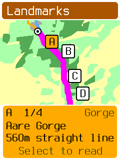 | 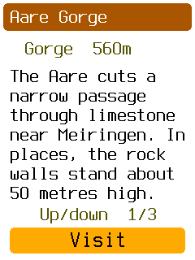 | 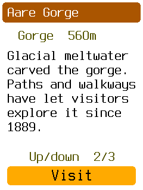 |

| Waterfall | Literary connection | Source |
| --- | --- | --- |
| 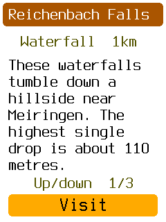 | 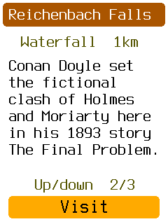 | 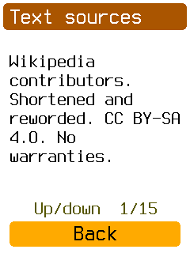 |

| Railway | History | Visit preview | Arrival |
| --- | --- | --- | --- |
| 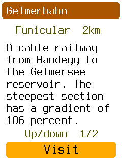 | 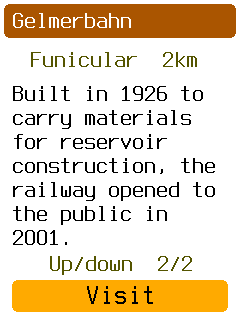 | 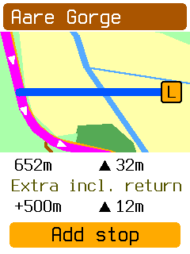 | 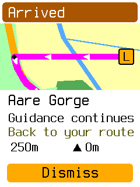 |

Up/Down selects a marker, then changes pages after Select opens the text. Back preserves the
selected landmark. **Down + Back → Sources** opens attribution, the licence URL, and article
URLs without adding pages to each description. Back restores the reading page. **Visit** opens the shared route preview. **Add stop** accepts the complete
visit. Reading another place leaves that accepted destination and return route intact.

Known-closed landmarks are excluded. These four examples have unknown hours. Distances on the
nearby card are straight-line distances from the rider. Route costs in the preview come from the
prepared mock route legs. Four results are a fixture limit, not a production policy.

## Text sources and licence

The landmark descriptions in the simulator and these images are adaptations of text by
Wikipedia contributors. The descriptions are shared under
[Creative Commons Attribution-ShareAlike 4.0](https://creativecommons.org/licenses/by-sa/4.0/).
They are shortened and reworded for the device. The application code retains its repository licence.

| Device name | Article revision | Selected material |
| --- | --- | --- |
| Aare Gorge | [Aare Gorge, revision 1327206534](https://en.wikipedia.org/w/index.php?title=Aare_Gorge&oldid=1327206534) | Limestone gorge, wall height, glacial meltwater, walkways since 1889. |
| Reichenbach Falls | [Reichenbach Falls, revision 1362225684](https://en.wikipedia.org/w/index.php?title=Reichenbach_Falls&oldid=1362225684) | Upper fall height and the fictional events in Conan Doyle's 1893 story. |
| Gelmerbahn | [Gelmer Funicular, revision 1322069534](https://en.wikipedia.org/w/index.php?title=Gelmer_Funicular&oldid=1322069534) | Railway to Gelmersee, 106 percent maximum gradient, 1926 construction, public opening in 2001. |
| Dunlough Castle | [Dunlough Castle, revision 1322295338](https://en.wikipedia.org/w/index.php?title=Dunlough_Castle&oldid=1322295338) | Three towers, lake and cliff setting, defensive wall, foundation in 1207. |

## Photos

| Aare Gorge, accepted size | Reichenbach Falls, accepted size | Photo credit | Photo source |
| --- | --- | --- | --- |
| 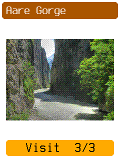 | 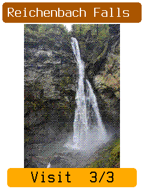 | 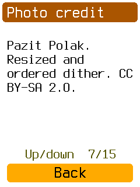 | 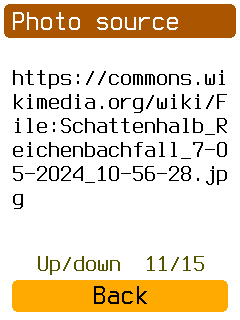 |

Each description has two text pages. Aare Gorge, Reichenbach Falls, and Dunlough Castle add
a 216 × 240 ordered-dither photo page. Up from the first page opens the photo. The source drawer
includes each photo's credit, source URL, and licence URL. The four examples have 15 source
pages in total. Gelmerbahn has no photo. It remains a UI fixture, not a proposed production
category: the [selection proposal](../landmark-selection/README.md) excludes industrial and
transport landmarks.

The [photo study](../landmark-photos/README.md) gives attribution, processing commands, and
storage measurements. Fixed RGB222 assets provide the same pixels to the simulator and the
[display-only board demo](../../../../firmware/obc-fw-nrf54l/README.md#landmark-photo-demo).
No JPEG decoder or landmark map format was added.

## Dunlough Castle and larger photos

| What it is | History | Large photo |
| --- | --- | --- |
| 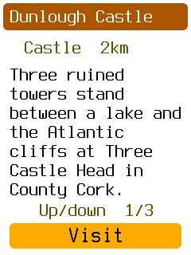 | 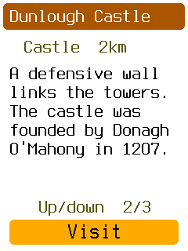 | 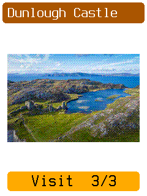 |

Dunlough Castle is a fourth synthetic-location fixture. Its article and photograph describe
the real Irish castle, but its map position and route legs are placed in the Swiss study map.
The [archived size comparison](../landmark-photos/README.md#size-comparison-on-the-device)
shows why the larger size was selected. Visit uses the same detour preview from the photo
page. Large photo pages use the full area between the header and Visit action.

## Verification

```sh
./tools/obc test -p obc-app -p obc-sim
cargo clippy -p obc-app -p obc-sim --all-targets -- -D warnings
cargo build -p obc-sim
./tools/obc suites check
./tools/obc test affected --base origin/develop --dry-run
python3 docs/build_docs.py --check-links
cargo fmt --all
cargo fmt --manifest-path firmware/obc-fw-nrf54l/Cargo.toml
cargo fmt --manifest-path firmware/obc-boot/Cargo.toml
cargo fmt --manifest-path apps/obc-desktop/Cargo.toml
git diff --check
```

The focused app and simulator suites and Clippy passed. The original example text and large
photo pages were captured again after removing the small-photo page. The
[random sample study](../glacier-pass-study/README.md#run-and-verify) records the additional
text, photo, source, and pixel checks. The screen-size assertion still
passes with four landmarks; the view stores indexes and computes distance when needed.
These are targeted captures, not a full UI sweep.

The board command, run from `firmware/obc-fw-nrf54l`, was:

```sh
cargo run --release --bin display_test --features landmark-photo-demo
```

Verified programming succeeded on nRF54LM20A. RTT reported display startup with the larger Aare Gorge photo. The user can assess physical panel appearance. The demo does not
exercise SD, navigation, GPS, or BLE. The source ELF SHA-256 is
`18f4ffb98685ad00d821c2accf25b309c372b3da51f1979f3dfb6c38cf42e29b`.

The affected dry run includes unrelated changes from this branch's older base. The full
workspace gate and affected plan were deliberately omitted. No resource gate, full UI sweep,
external-fixture suite, or normal-application hardware suite was run.

## Source drawer refinement

| Bottom drawer | Licence URL | Article URL |
| --- | --- | --- |
| 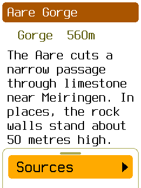 | 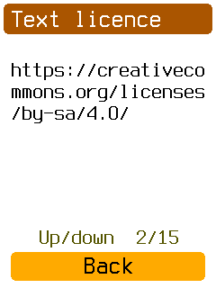 | 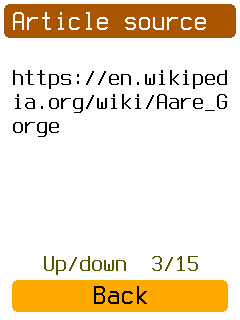 |

The descriptions have two text pages. Attribution remains accessible from the nearby map and
reading pages. The source view lists all four study articles. This uses the existing drawer,
and does not create another button combination. The source action and Back leave navigation
and recording unchanged. The relevant guidance is
[CC BY-SA 4.0 section 3(a)(2)](https://creativecommons.org/licenses/by-sa/4.0/legalcode.en#s3a)
and [Wikimedia's text reuse terms](https://foundation.wikimedia.org/wiki/Policy:Terms_of_Use#7._Licensing_of_Content).
They permit attribution appropriate to the medium and attribution through article URLs.
The drawer is our interpretation of an accessible placement for this small offline screen.

Source drawer placement uses the existing controls. Back restores the reading page and
selection, including the photo page.
