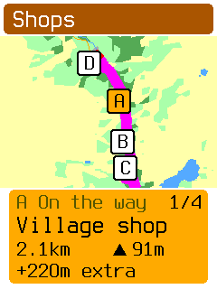
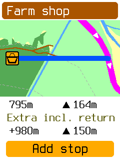
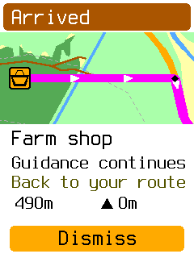

# Find a place: simulator study

These are native **240 × 320** simulator captures from the shop-visit study at `4d705452`, included
in this branch. They provide context for the [What's next design discussion](../README.md).
They do not implement that proposal or the agreed menu consolidation.

| Compare up to four places | Preview the complete visit | Arrival: return guidance is active |
| --- | --- | --- |
|  |  |  |

Open [index.html](index.html) locally to browse the capture gallery. The PNGs beside it can also
be viewed on GitHub. The gallery embeds its images and does not require a running simulator.

## Run and explore

Use the [simulator README](../../../../apps/obc-sim/README.md#ride-assistant-interaction-study)
for build instructions, a supplied Grimsel map/GPX example, button mappings, and all CLI flags.
The same study can use another loaded map with a supplied GPX or a synthetic local route.
For a coastal map, select an inland centre or a GPX; the map's bounding-box centre can be at sea.

The Controls panel has candidate sets, result selection, stage jumps, arrival, and rejoining.
Candidate sets include multiple shops on the way, useful/worse detours, detours only, one result,
and no results. All current visit stages can be selected directly. Other questions and place
categories are placeholders.

**Add stop** accepts the entire visit. At arrival, the accepted return leg becomes active and an
informational card appears. Dismiss/Back leaves guidance active. Rejoining restores the original
route even if the card was ignored. The same recording remains open. After selection, the shop
uses the basket icon instead of its comparison letter.

This is a UI study with fictional places and prepared route legs. It does not verify rideable
access, search map POIs, check availability, or detect arrival from GPS. Its skip-stop action restores
the original route at the current position; it does not yet calculate a safe rejoin path. The
proposed production flow must show a rejoin preview when needed.

## Verification recorded for the firmware study

The following checks passed at `4d705452` before this asset handoff:

```sh
cargo check -p obc-sim
./tools/obc test -p obc-app -p obc-sim
cargo clippy -p obc-app -p obc-sim --all-targets -- -D warnings
./tools/obc suites check
cargo build -p obc-sim --release
cargo fmt --all
git diff --check
```

`cargo fmt` also ran in the board image, bootloader, and desktop standalone Cargo roots.
The focused suites covered candidate filtering, multiple results, stage changes, arrival dismissal,
ignored arrival cards, rejoining, stop removal, recording preservation, and simulator CLI/geometry.

The capture pass produced 27 targeted frames with expected-screen checks and recording active,
using Grimsel GPX, Monaco GPX, and a local Monaco scenario. Named frames were visually checked.
The GUI launched; panel controls were not driven by automated mouse input. Some additional
earlier reference captures are included beside the gallery.

No full UI snapshot sweep, full workspace check, external-fixture suite, browser suite, device
build, resource measurement, or hardware test was run for that study. This handoff adds documents
and assets only; those firmware checks have not been repeated.
