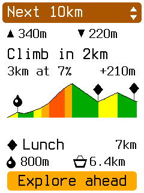
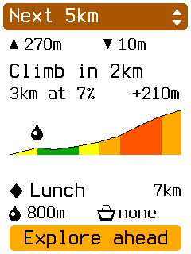
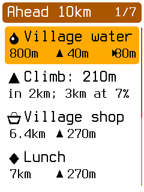
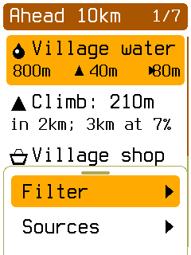
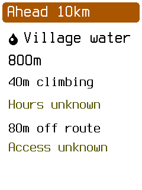
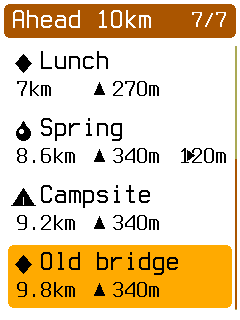

# What's next: simulator study

These are native 240 × 320 captures from the opt-in Ride Assistant prototype.
The overview uses fixed fictional route facts, independent of the loaded map and visit route.
See the [simulator README](../../../../apps/obc-sim/README.md#whats-next-study) for controls and limits.

| Next 10 km | Next 5 km | Explore ahead |
| --- | --- | --- |
|  |  |  |

| Filters | Place facts | End of list |
| --- | --- | --- |
|  |  |  |

Known-closed places are excluded. Unknown hours remain visible. The fixture's Lunch name is an
authored waypoint label, not an inferred purpose. The climb grade colors reuse the Climb screen.
The 5 km and 10 km totals are calculated from the same fixed profile shown on screen.

## Verification

Checks run for this extension:

```sh
cargo check -p obc-sim
./tools/obc test -p obc-app -p obc-sim
cargo clippy -p obc-app -p obc-sim --all-targets -- -D warnings
cargo build -p obc-sim
./tools/obc suites check
python3 docs/build_docs.py --check-links
cargo fmt --all
cargo fmt --manifest-path firmware/obc-fw-nrf54l/Cargo.toml
cargo fmt --manifest-path firmware/obc-boot/Cargo.toml
cargo fmt --manifest-path apps/obc-desktop/Cargo.toml
git diff --check
```

The app and simulator suites passed. Six named captures used the supplied Grimsel map and GPX,
with expected-screen checks. Each image was visually inspected. These are targeted frames,
not a full UI snapshot sweep.

`./tools/obc test affected --base origin/develop --dry-run` selected 65 suites because the
handoff branch has an older base. The full affected plan was deliberately not run. Verification
covered the changed app and simulator packages. No full workspace gate, external-fixture suite,
resource measurement, board build, browser test, or hardware test was run.
