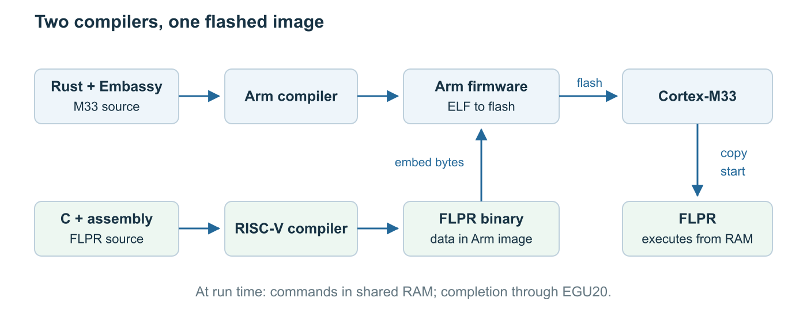
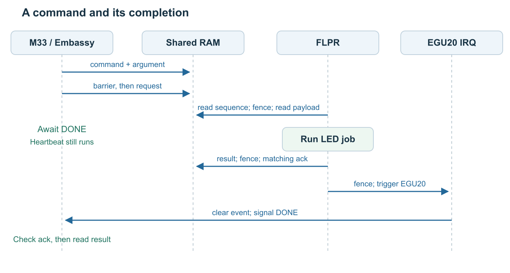
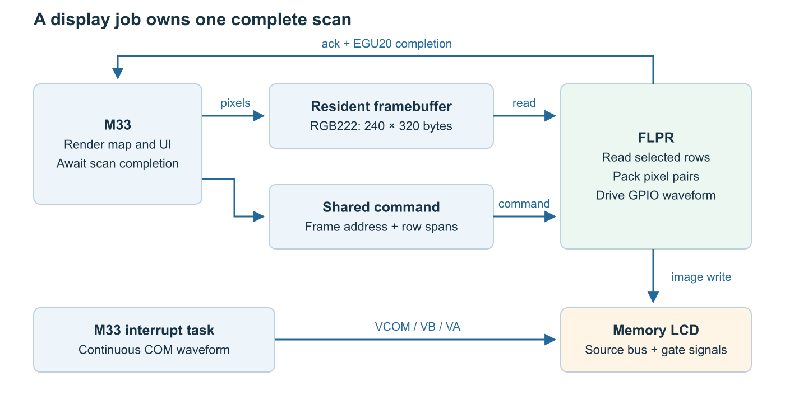

<!--
- Opening: introduce OpenBikeComputer and its Sharp LS021B7DD02 memory LCD.
- Explain the problem: the M33 renders maps and handles other tasks; the panel needs a timed GPIO sequence.
- State the result: the M33 renders pixels; the FLPR packs pixels and generates the display signals.
- Assume embedded experience, but no knowledge of this chip, Embassy, or the FLPR.
- Use the companion example project for complete files. It still needs to be created; add its URL and a fixed release tag before publication.
- The snippets below are excerpts. Do not describe the post alone as a complete buildable project.
- The original full draft and complete examples remain in flpr-display-tutorial.md at the checkout root.
-->

<!-- human-copy:start -->
## So what is this actually about now?
As you, the critical reader, have probably already gathered from the title, this is about how we drive the display of the OpenBikeComputer (OBC). Now you might say, display drivers are a dime a dozen these days, even my 5 year old STM32 comes with built in LTDC to drive all kinds of LCDs. And heck, if your nRF54 does not have that, just use a SPI or I2C display. The issue is that as much as I'd have loved to do that, one of the very early key design requirements for the OBC was that is has to use a MIP (**M**emory **I**n **P**ixel) display. In fact, Garmin moving away from MIP technology more and more on both their bike computers and watches, was one of the reasons that made me consider building my own in the first place.

MIP panels are awesome, they draw basically zero power while showing a static image, which allows days of battery life and an always-on display. They also typically are reflective, meaning they require no active backlight as long as there is an external light source (While riding your bike the sun is a common one). What is not so awesome is how hard they are to come by. There really is only one panel that fits the bill for my basic requirements, of at least 8 colors, a resolution that is not atrociously low, and a size of about 2-3 inches: The [LS021B7DD02 by Sharp Microelectronics](https://www.digikey.de/en/products/detail/sharp-microelectronics/LS021B7DD02/23347701). The only driver IC that can let you drive this display over a SPI bus (the [Epson S1D13C00F00C100 ](https://www.mouser.de/en/ProductDetail/Epson-Timing/S1D13C00F00C100?qs=Wj%2FVkw3K%252BMB3ATL0uFFMGA%3D%3D)) is really hard to source, and was not available anywhere when I built the prototype. So we are stuck with writing a bare metal driver for the display ourselves.

## What is the FLPR, and why should we care?
So we established we need a bare metal driver for the MIP panel. It uses a completely custom parallel data protocol, so there is of course no hardware support built into our processor. This leaves bit-banging it as the only option. And here's the big issue with that: A refresh of the entire display takes about 80 ms. Assuming we get a GPS fix every second, which of course means redrawing the map with our updated position, we would spend almost 10% of our total available processing time on updating the display. That first of all makes for a potentially very laggy and frustrating user experience, but it also drains our battery. The more time the main Cortex-M33 core can spend in sleep mode, the better.

Luckily the nRF54 has a trick up its sleeve for exactly this purpose: a second RISC-V coprocessor, called the FLPR (Fast Lightweight Peripheral Processor). This second core is purpose made to execute time-ciritical I/O operations. Maybe the simplest way to think of it is that it takes a similar role to the hardware SPI or I2C peripherals you are used to, but you get to decide what runs on it. Similar to those this allows us to offload the time consuming bit-banging communication with the display, and frees up the main core for other work while that communication is running in the background.

As a little sidnote, Nordic also provides a range of precompiled "soft peripherals" that you can use without programming the FLPR yourself, currently they offer [sQSPI](https://nrfconnectdocs.nordicsemi.com/ncs/latest/nrfxlib/softperipheral/doc/sQSPI/README.html), [sEMMC](https://nrfconnectdocs.nordicsemi.com/ncs/latest/nrfxlib/softperipheral/doc/sEMMC/README.html), and [sCAN](https://nrfconnectdocs.nordicsemi.com/ncs/latest/nrfxlib/softperipheral/doc/sCAN/README.html), but they say they will expand on this in the future.

So that was the plan of attack, figure out if we can use the FLPR to drive the display, and have the communication between it and the main core be efficient enough to reach some usable refresh rates. Spoiler alert: It worked out really well. And in the rest of this blog I want to give you a step-by-step guide on how to program the FLPR and use it in combination with Rusts [Embassy async framework](https://embassy.dev/).

<!-- human-copy:end -->

<!--
- Expand FLPR: Fast Lightweight Peripheral Processor. Explain that Nordic calls the processor block VPR.
- Identify the Arm Cortex-M33 main core and the RV32EMC RISC-V worker.df
- Explain why the two cores need different compilers and cannot run the same machine code.
- Follow the diagram: compile C and assembly, embed the binary in the Arm firmware, copy it to RAM, then start it.
- Introduce Embassy as async drivers, timers, and an executor on the M33. Explain what an await lets other tasks do.
-->



## 1. Blink an LED with Embassy

<!--
- Put full installation instructions and dependency versions in the companion README.
- Select exactly one Cargo feature: l15 or lm20. Explain the secure app-s configuration.
- Show the board differences: LED 1 is P1.10 on L15 and P1.25 on LM20; both are active high.
- The current example selects LM20A register definitions. Check LM20B HAL and probe support separately.
- Name the debugger USB connector. Explain that probe-rs run flashes the Arm ELF and displays RTT logs.
- Explain no_std, no_main, the Embassy main macro, and the timer await in the short example.
-->

### `src/bin/hello.rs`

```rust
#![no_std]
#![no_main]

use defmt_rtt as _;
use embassy_executor::Spawner;
use embassy_nrf::gpio::{Level, Output, OutputDrive};
use embassy_time::Timer;
use panic_probe as _;

#[embassy_executor::main]
async fn main(_spawner: Spawner) {
    let mut config = embassy_nrf::config::Config::default();
    config.clock_speed = embassy_nrf::config::ClockSpeed::CK128;
    let p = embassy_nrf::init(config);

    #[cfg(feature = "l15")]
    let pin = p.P1_10;
    #[cfg(feature = "lm20")]
    let pin = p.P1_25;
    let mut led = Output::new(pin, Level::Low, OutputDrive::Standard);

    defmt::info!("Hello from Embassy on the M33");
    loop {
        led.toggle();
        Timer::after_millis(250).await;
    }
}
```

### L15 build and flash

```sh
cargo build --release --features l15 --bin hello
probe-rs run --chip nRF54L15 target/thumbv8m.main-none-eabihf/release/hello
```

### LM20A build and flash

```sh
cargo build --release --features lm20 --bin hello
probe-rs run --chip nRF54LM20A target/thumbv8m.main-none-eabihf/release/hello
```

<!--
- Describe the expected result: LED 1 blinks and RTT prints the M33 greeting. Run these commands from the companion project.
-->

## 2. Build and start the FLPR

<!--
- Install a bare-metal GCC that supports rv32emc and ilp32e, plus its matching objcopy.
- Explain that riscv64 in the executable name does not prevent 32-bit output.
- Explain the memory carve: separate FLPR code, data, and stack; a shared page; an unused top page for reserved system memory.
- The M33 linker RAM region must end below the FLPR reservation.
- Generate the Arm memory.x, FLPR linker script, and shared Rust/C constants from one definition.
- Keep the link address, copy destination, and INITPC equal. Do not add a root memory.x that hides the generated one.
-->

```text
                         L15 address       LM20A address
Physical SRAM top        0x20040000        0x20080000
                         ┌───────────────────────────┐
                         │ Leave top 4 KiB unused     │
                         │ System-reserved RAM lives  │
                         │ near the physical RAM top  │
                         ├───────────────────────────┤
Shared page top          0x2003F000        0x2007F000
                         │ Shared page: 4 KiB         │
                         ├───────────────────────────┤
Shared block / stack top 0x2003E000        0x2007E000
                         │ FLPR code + data + stack   │
                         ├───────────────────────────┤
FLPR entry / M33 RAM top 0x2003D000        0x2007D000
                         │ M33 RAM: 244 / 500 KiB     │
                         └───────────────────────────┘
M33 RAM base             0x20000000        0x20000000
```

### Memory addresses in `build.rs`

```rust
let ram_top = if l15 {
    0x2004_0000usize
} else {
    0x2008_0000usize
};
let flpr_base = ram_top - 12 * 1024;
let control_addr = ram_top - 8 * 1024;
```

### RISC-V build in `build.rs`

<!--
- Use this excerpt to explain the compiler options; keep the complete build script in the companion repo.
- Explain freestanding code, the embedded-register ABI, and why this small worker needs no C library.
- Explain the missing C startup and global-pointer setup: startup is supplied below; small-data addressing and relaxation are disabled.
- Explain that objcopy removes the ELF wrapper. The raw binary carries initialized data at its linked address.
-->

```rust
run(Command::new(gcc)
    .args([
        "-march=rv32emc",
        "-mabi=ilp32e",
        "-O2",
        "-ffreestanding",
        "-nostdlib",
        "-nostartfiles",
        "-fno-pic",
        "-fno-stack-protector",
        "-msmall-data-limit=0",
        "-mno-relax",
        "-ffunction-sections",
        "-fdata-sections",
        "-Wall",
        "-Wextra",
        "-Werror",
        "-Wl,--gc-sections",
    ])
    .arg("-I")
    .arg(&out)
    .arg("-T")
    .arg(out.join("flpr.ld"))
    .args(["src/flpr/start.S", "src/flpr/worker.c"])
    .arg("-o")
    .arg(&elf));
run(Command::new(objcopy)
    .args(["-O", "binary"])
    .arg(&elf)
    .arg(&bin));
```

### `src/flpr/start.S`

<!--
- The FLPR begins at an instruction, not an Arm vector table.
- Place _start first in the FLPR linker script. Set the stack pointer, clear aligned bss words, and call C.
- Reserve stack space and assert that static sections fit. The tutorial gives this worker a 4 KiB region with at least 1 KiB left for its stack.
-->

```asm
    .section .text.start, "ax"
    .global _start
    .option norelax
_start:
    la   sp, _stack_top
    la   t0, _bss_start
    la   t1, _bss_end
1:
    bgeu t0, t1, 2f
    sw   zero, 0(t0)
    addi t0, t0, 4
    j    1b
2:
    call flpr_main
3:
    j    3b
```

### Load and launch on the M33

<!--
- Before this excerpt, configure the LED pad, clear the shared block, write its layout tag, and enable the completion interrupt.
- Explain include_bytes! for the generated flpr.bin and Vpr::new for the generated RAM base.
- The HAL does not know the reservation size; the build-time and load-time bounds belong to the example.
- Keep Embassy's default FLPR reset at boot. A debugger reset can leave an earlier FLPR program running.
- Wait for an ALIVE stamp with a deadline. Distinguish bad layout from no boot.
- Never overwrite a live FLPR image. Clearing CPURUN is not a general force-stop for a busy loop.
-->

```rust
assert!(PROGRAM.len() <= 3072);
let mut flpr = Vpr::new(p.VPR, FLPR_BASE as *const u8).unwrap();
flpr.load(PROGRAM).unwrap();
cortex_m::asm::dsb();
flpr.start();
```

## 3. Give the worker a job

<!--
- Introduce one command in flight: request sequence, command, argument, matching acknowledgement, and result.
- Explain that LED 3 belongs to the FLPR: P1.14 on L15 and P1.28 on LM20. The M33 configures the pad first.
- The worker blinks LED 3 in groups of four. An independent Embassy task keeps LED 1 blinking.
- Explain the shared 24-byte layout and repr(C). The C fields have the same widths and order.
- Use raw volatile pointers for the shared fields. Do not create Rust references to memory the FLPR changes.
- Volatile forces accesses; the barriers also order payload and notification writes. Keep both parts of the protocol.
- The FLPR polls when idle. This makes the example simple, but it does not prove a power saving.
-->



### Shared control block

```rust
#[repr(C)]
struct Control {
    magic: u32,
    request: u32,
    command: u32,
    argument: u32,
    ack: u32,
    status: u32,
}
const _: () = assert!(core::mem::size_of::<Control>() == 24);
const CONTROL: *mut Control = CONTROL_ADDR as *mut Control;
```

### Publish the command on the M33

<!--
- Write the command and argument first. The barrier comes before the request sequence, which acts as the command notification.
-->

```rust
DONE.reset();
unsafe {
    addr_of_mut!((*CONTROL).command).write_volatile(COMMAND_BLINK);
    addr_of_mut!((*CONTROL).argument).write_volatile(repeats);
    cortex_m::asm::dsb();
    addr_of_mut!((*CONTROL).request).write_volatile(sequence);
    cortex_m::asm::dsb();
}
```

### Complete the command on the FLPR

<!--
- Show the worker checking a new request sequence, fencing, and reading the payload.
- Describe the bounded blink loop and its ordinary GPIO OUTSET/OUTCLR writes.
- The blink delay is only for visibility. It is not a calibrated display timing method.
- Write the result before the matching acknowledgement. Fence again before triggering EGU20.
-->

```c
CTRL->status = result;
fence();
CTRL->ack = sequence;
fence();
EGU20_TRIGGER0 = 1;
```

### Wake the Embassy task

<!--
- Give EGU20 channel 0 and its interrupt one owner.
- Clear the latched EGU event in the ISR before signaling the task.
- Signal retains an early completion, including one that arrives before the task starts waiting.
-->

```rust
static DONE: Signal<CriticalSectionRawMutex, ()> = Signal::new();

#[interrupt]
unsafe fn EGU20() {
    unsafe { EGU_EVENT0.write_volatile(0) };
    DONE.signal(());
}
```

### Await the matching completion

<!--
- Check the acknowledgement sequence to reject a stale interrupt.
- Order the result read after the acknowledgement.
- Explain the deadline. The tutorial stops on a fault; a production transport also needs recovery.
- Show the success criteria: both LEDs run, RTT reports ALIVE, and one completion follows each group.
-->

```rust
let completed = with_timeout(Duration::from_secs(10), async {
    loop {
        DONE.wait().await;
        let ack = unsafe { addr_of!((*CONTROL).ack).read_volatile() };
        if ack == sequence {
            cortex_m::asm::dmb();
            break;
        }
    }
})
.await;
assert!(completed.is_ok(), "FLPR command timed out");
let status = unsafe { addr_of!((*CONTROL).status).read_volatile() };
assert_eq!(status, 0, "FLPR rejected command");
```

### Build and flash the two-core example

```sh
cargo build --release --features l15 --bin offload
probe-rs run --chip nRF54L15 target/thumbv8m.main-none-eabihf/release/offload

cargo build --release --features lm20 --bin offload
probe-rs run --chip nRF54LM20A target/thumbv8m.main-none-eabihf/release/offload
```

## 4. Give it a display job

<!--
- Transition from a blink argument to a framebuffer address and changed-row spans.
- Explain that the M33 owns rendering policy. The FLPR owns pixel packing and the whole intermittent panel write sequence.
- The display excerpts describe OpenBikeComputer. They do not turn the LED example into a complete panel driver.
- Link the board README for rails, pin mapping, drive settings, connector wiring, and power sequencing.
-->



### One byte per RGB222 pixel

<!--
- Explain four levels per channel and 64 colors total.
- A 240 by 320 frame takes 76,800 bytes, or 75 KiB. An RGB565 frame takes 150 KiB.
- Explain the simple byte indexing and 240-byte row stride. There is one resident frame.
- Quantize RGB565 colors when storing each pixel. The conversion keeps the top two bits; it does not round or dither.
- Distinguish color quantization on the M33 from wire packing on the FLPR.
-->

```text
bit:       7 6  5 4  3 2  1 0
           0 0   R    G    B
format:    0b00_RR_GG_BB

black:     0b00_00_00_00 = 0x00
red:       0b00_11_00_00 = 0x30
white:     0b00_11_11_11 = 0x3F
```

```rust
pub fn rgb565_to_device64_byte(rgb: u16) -> u8 {
    let r = ((rgb >> 14) & 0x3) as u8;
    let g = ((rgb >> 9) & 0x3) as u8;
    let b = ((rgb >> 3) & 0x3) as u8;
    (r << 4) | (g << 2) | b
}
```

### The two area planes

<!--
- Explain that each channel has a two-thirds area block and a one-third area block.
- The high channel bit selects the large block; the low channel bit selects the small block.
- This uses pixel area, not four successive PWM frames. Do not promise a linear measured brightness curve.
- GCK high selects the high-bit plane; GCK low selects the low-bit plane on the same row.
- A rising GCK edge advances to the next row. Each plane gets its own GEN latch pulse.
- The graphic below shows order, not measured timing.
-->

```text
                    one visible row
            |<------------------------------------->|
GCK    _____┌───────────────────┐                   ┌─────
            │                   └───────────────────┘
            ↑                                       ↑
         this row                                next row
              high: send MSBs     low: send LSBs

GEN    _______________┌────┐_______________┌────┐_________
                      │    └───────────────┘    └─────────
                      latch 2/3            latch 1/3

        Each phase: shift data, then pulse GEN.
        Diagram shows order only. It is not a timing scale.
```

### Pack two pixels into GPIO bits

<!--
- Describe the six data lines: R0/G0/B0 for even-x pixels and R1/G1/B1 for odd-x pixels.
- Use zero-based x in the article and explain the datasheet's one-based column naming.
- List the pin positions: R0=6, R1=8, G0=9, G1=10, B0=0, B1=4 on P2; BCK is P2.07.
- Explain shift=1 for the high-bit plane and shift=0 for the low-bit plane.
- Work one example: even red 0x30 plus odd blue 0x03 produces 0x50 in both planes.
- BCK samples on both edges. Each edge takes two pixels: 120 data words and four black flush words per plane.
-->

```c
static inline uint32_t pack_word(const uint8_t *row, uint32_t k,
                                 uint32_t shift)
{
    uint32_t even = row[2u * k];
    uint32_t odd = row[2u * k + 1u];
    uint32_t re = (even >> (4u + shift)) & 1u;
    uint32_t ro = (odd >> (4u + shift)) & 1u;
    uint32_t ge = (even >> (2u + shift)) & 1u;
    uint32_t go = (odd >> (2u + shift)) & 1u;
    uint32_t be = (even >> shift) & 1u;
    uint32_t bo = (odd >> shift) & 1u;
    return (re << 6) | (ro << 8) | (ge << 9) | (go << 10)
         | be | (bo << 4);
}
```

```c
GPIO2_OUTCLR = (~word) & DATA_MASK;
GPIO2_OUTSET = word;
```

<!--
- Explain atomic set/clear masks and why the code does not read-modify-write the whole GPIO output.
- The next word is packed while the current data is on the pins. This combines useful work with settling time.
- The final pair and flush words need separate pacing because there is no next pixel pair to pack.
- The current source clock exceeds the LS021 specified timing limits. State its limited hardware validation.
- Start a new driver within the datasheet limits and measure at the panel connector. Recheck compiler, clock, wiring, and drive changes.
-->

### Read the framebuffer directly

<!--
- Describe the production control block: frame pointer and up to 16 ascending, disjoint row spans.
- A span packs start_row in the high 16 bits and row_count in the low 16 bits.
- There is no second frame or per-row exchange. The FLPR reads and packs each selected row.
- Keep the frame allocated and unchanged until the matching completion.
- The normal presenter holds a shared borrow across its await. Rendering needs a mutable borrow.
- Explain cancellation and timeouts: do not reuse the frame while a worker can still read it.
-->

```c
const uint8_t *row = fb + row_index * 240u;
```

### Only write the changed rows

<!--
- Keep one 32-bit hash per row: 1,280 bytes of hashes for 320 rows, plus a state flag.
- Compare pixel content because an immediate-mode renderer can redraw unchanged pixels.
- Merge adjacent changed rows into spans. Fall back to a full update when the span list overflows.
- Explain hash collisions. A full repaint restores a missed change; the hash is not an exact byte comparison.
- Walk the gate past clean rows with GEN inactive. End the frame after the last changed span.
- A change near the bottom still pays for the gate walk, but not a full data shift for each earlier row.
- Force a full first present and reset diff state after a failed push.
-->

```text
Rows 0..39     Advance gate only; keep stored pixels
Rows 40..51    Shift both color planes and latch each row
Rows 52..319   End the frame; keep stored pixels
```

<!--
- Panel sequence: raise INTB; pulse GSP; run two leading dummy advances; scan selected rows; run six trailing advances; lower INTB; acknowledge.
- Explain that these counts and polarities are LS021 rules, not generic FLPR rules.
- Keep the continuous COM waveform separate from the scan. VCOM and VB are in phase; VA is inverse.
- The default COM driver is a high-priority Embassy interrupt task on the M33. The optional hardware timer/DPPI/GPIOTE path is disabled pending validation.
- For small overlays, explain save, RGB565 composite, requantize, push, and restore. The row hashes keep tracking the clean frame.
- The overlay push is synchronous so its scratch remains transient stack storage. A buffer live across await becomes persistent task-future storage.
- The same FLPR also runs sEMMC for storage. Both images are resident; only one runs at a time.
- Never switch a live scan or storage transfer. The display boundary includes the EGU acknowledgement observed by the M33.
- Keep the multi-job mode switch as an optional extension; start the reader's example with one worker job.
-->

<!--
- Closing: identify the reusable pattern: reserve RAM, build a second program, publish one job, await a matching completion, and retain buffer ownership.
- Link the companion release and the production source files. Use fixed source revisions.
- Before publication, run the examples on both DKs. Confirm LM20B support separately and measure panel waveforms.
- Keep build instructions in the companion README and the full build script in that project. The article should show the mechanisms.
-->
