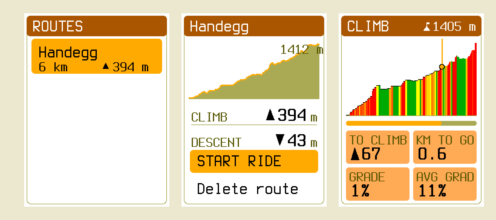

For most of this project's life the device could tell you exactly where a road went
and had no idea whether it went *up*. That is a strange thing to be missing on a
bikepacking computer. The router would happily buy four hundred metres of climbing to
save two hundred metres of distance — in the Alps, on the terrain this thing exists
for. A route you planned on the device itself came out with a height of zero on every
point, so its Climb screen was dead, its profile was a flat line, and its exported GPX
was full of `<ele>0</ele>` — while the identical route imported from Komoot got all of
it. Half the routes got half the product.

That's fixed now, and this is the story of how, including the part where I nearly
shipped 1,412 metres of climbing that did not exist.



## Two fields, and no more

The temptation with elevation is to put it everywhere. A height on every graph node.
A height on every vertex of every edge polyline. Contour lines while you're at it.
Every one of those costs bytes on a card and RAM on a microcontroller, and most of
them have no consumer.

What the router actually needs, it turns out, is one number per direction of every edge:
**how much you climb riding it that way.** So the map format grew by exactly that, and
nothing else:

| §    | record          | before | after | change |
| :--- | :-------------- | -----: | ----: | :----- |
| 8.3  | neighbour entry |   15 B |  17 B | `+ uint16 Ascent M` |
| 8.6  | profile record  |   52 B |  56 B | `+ uint8 Climb Weight`, 3 reserved |

That's the whole format bump. Node records, the edge pool, POIs, geometry, the route
format — byte-identical. I proved it rather than asserting it: a full symbolic dump of
a map packed by the old packer and one packed by the new one match on all 23,574
lines once the two new fields are normalised away. Every feature, every POI, every
junction, every adjacency entry survived the bump untouched.

The reason the ascent lives in the *adjacency entry* and not somewhere more tidy is
the one design constraint that mattered: when A\* settles a node, it reads that record
and nothing else. Put the climb anywhere else and every relaxation costs a second read
off an SD card that already dominates planning time. Two bytes in the record the
router is already holding cost nothing at all.

## An integral, not a difference

The obvious way to compute an edge's ascent is to subtract its endpoints' heights.
The obvious way is wrong, and it is wrong in exactly the case this feature exists for.

A pass road between two junctions that happen to sit at the same altitude has
hundreds of metres of climbing in it and a net change of zero. An endpoint delta
prices it as flat and sends you over the col. So the packer walks each edge's actual
polyline, sampling never more than about 50 m of ground apart — chosen against the
raster rather than the road, since the terrain postings are ~57 m and any coarser
step could stride over a hill entirely — and folds the whole stream through a
dead-banded integrator.

Which raises the question the rest of the design falls out of: *whose* elevation?

If the packer reads one DEM and the device draws its profile from another, the number
you're routed by and the number you're shown differ by tens of metres and nobody can
say which is wrong. So the rule is that terrain is **baked first, into its own
artifact**, and everyone downstream reads that: the packer when it integrates ascent,
the device when it fills a planned route's heights, the altimeter when it needs a
reference. One implementation of the sampling arithmetic, integer-only, over one
file — so the agreement is by construction and not by luck. A pleasant side effect is
that the packer contains no DEM decoder at all; it can't read a GeoTIFF if it wants
to.

## The bill

Terrain is a raster, and rasters are big, so this needed measuring before it needed
designing.

| | |
| :-- | --: |
| Terrain at the shipped posting | ≈ 0.90 MiB per 1000 km² |
| …as a share of a whole map | **+4.4–6.7 %**, in its own file |
| Ascent in the nav graph | 24–130 KB per 1000 km² |
| …as a share of the core map file | ≤ +1.9 % |
| **Total** | **≈ +5–7 %** against a 20 % ceiling I'd agreed to |
| DACH (~482,000 km²) | ≈ 430 MiB, baked once per dataset release |
| Device RAM | under 4 KB — a header, four 512-byte tiles, one memoised directory slot |

The nav-graph half is where the honest reporting comes in. I'd hoped for under
+0.7 % per file and got this instead, measured against the same OSM snapshot so the
numbers are the format and not Geofabrik drift:

| fixture | v11 | v12 | delta |
| :-- | --: | --: | --: |
| `monaco.obcm` | 684 738 | 708 626 | **+3.49 %** |
| `grimsel.obcm` | 2 832 391 | 2 856 199 | +0.84 % |
| `teningen-preview.obcm` | 472 061 | 481 517 | +2.00 % |

Monaco is the outlier because it is a small file with an unusually dense graph — its
routing section is 61 % of the whole file, where Grimsel's is 28 %. Two bytes per
adjacency entry is the floor of the chosen design, rounded up to whole 512-byte
chunks; getting under the bar would have meant moving the ascent out of the record
the router reads, which is the one thing the design exists to avoid. So: missed the
target, kept the design, wrote it down.

## The pass and the valley

The point of all this is that a route changes. Here is a real pair of points in a side
valley above Innertkirchen, planned repeatedly with nothing varying but the profile's
climb weight:

| weight | line | distance | ascent | high point |
| --: | :-- | --: | --: | --: |
| 0 | over the crest | 8 340 m | ▲ 1 008 m | 1 380 m |
| 8 | over the crest | 8 340 m | ▲ 1 008 m | 1 380 m |
| **10** | **round the valley** | **10 914 m** | **▲ 784 m** | **1 066 m** |
| 20 | round the valley | 10 923 m | ▲ 789 m | 1 066 m |

The answer moves once, sharply, between 8 and 10: it trades 2.6 km of extra ground for
224 m less climbing and stops crossing a crest 314 m above the destination. The two
routes share about a quarter of their corridor, so it's a genuinely different line
rather than jitter at the margins. The shipped Road weight is 10 — one rung past that
crossover, deliberately. Mountain bike is 6, and correctly declines the same detour,
which is the product statement rather than a bug: a road rider will ride further to
avoid a hill than an MTB rider will.

It is not free, and I'd rather say so than discover it later. Charging for climb makes
the search slightly less goal-greedy, so the frontier does 4–31 % more work depending
on profile, and on this sparse alpine extract 1–3 % of point pairs that used to plan
now exhaust the search table instead. Every one of those fails as the device's honest
"too far to route here", never as a wrong route — but it's a real cost on a real map.

Time-to-go got the same treatment. There was never a speed model anywhere in the
system, because the map's bike profiles carry dimensionless weights and nothing with
units. There is one now — `distance / v_flat + ascent × k_climb` — which is the
classic "a metre up costs eight to ten flat metres", written in time. Here is the same
route with real elevation and with every height forced to zero, one replay driving
both, so the only difference between the two frames is the terrain:

```compare
before: eta-real.png
after: eta-flat.png
label-before: real terrain
label-after: same route, flattened
caption: 1:19 to go against 0:50 — the 29-minute gap is 1,083 m of climbing at 1.6 s/m. Flattened, the model doesn't special-case anything: ascent-to-go is zero, the second term vanishes, and it answers distance ÷ speed.
```

## 1,412 metres that weren't there

Now the part I'd rather not write.

The device's nav graph legally reaches slightly past the box a terrain file was baked
for — the packer retains complete ways, so roads trail off the edge of the crop. So a
planned route can genuinely begin outside coverage: the first few points sample
nothing.

The route format has no way to say "unknown" for a point's height. It has an `int16`
and that's it. My first fill carried the last known height forward across gaps, which
is right in the middle of a route, and I let it push the initial placeholder — zero —
for the leading points, on the theory that they'd be overwritten by nothing important.

They weren't. Zero anchored the climb integrator at sea level, so the first real
sample arriving at 1,412 m booked the entire thing as ascent. The route's header
claimed 1,412 m of phantom climbing, and every stored per-point cumulative figure
after it was poisoned by the same step. Everything parsed. Every digest verified. The
Climb screen drew a beautiful wall.

The fix is small and the lesson isn't: **don't integrate before you have something to
integrate.** Nothing runs until the first sample actually resolves. And a hole is now
silence everywhere in the system — if any of the four corners a bilinear query touches
has no data, the whole query answers nothing rather than interpolating over the
survivors. A void in a DEM is usually water or radar shadow, which is precisely where
a plausible-looking invented number would be most confidently wrong.

There's one boundary left that I've written into the docs rather than papered over:
those leading points still *store* zero, because the format has no alternative, so
exporting such a route and re-importing it re-books that first step. Export parity
holds for a route lying wholly inside coverage — which is every route on a map whose
terrain was baked for it. The honest fix is a terrain file that covers the graph,
never a fabricated height.

## The barometer finally knows where it is

The last piece is my favourite, because it costs nothing and was sitting there the
whole time.

A barometer measures pressure, not height, and turning one into the other needs a
sea-level reference that nobody on a bicycle has. So the altitude reading drifts by
metres per hour as weather moves through, and only *differences* were ever
trustworthy. The terrain raster is the exact opposite: absolute and weather-immune,
but coarse and knowing nothing about the bridge you're standing on.

Each is precisely the other's calibration. Subtract them at every GPS fix, low-pass
the difference over about five minutes, and that slow average *is* the barometer's
unknown offset. Add it back and you get an absolute elevation that still moves metre
by metre with the barometer's own responsiveness.

I tested it by injecting a −60 m/h barometric drift — several times harsher than a
classic storm — into a replay of the Grimsel climb, and running the same ride twice:
once with terrain beside the map, once without.

```compare
before: altimeter-fused.png
after: altimeter-raw.png
label-before: with terrain
label-after: without
caption: The same drifting ride, 25 minutes in. The raw reading carries the full injected drift and keeps growing; the fused one plateaus at 5 m of lag — exactly what the filter's time constant predicts against a continuously moving reference. Real weather leaves under a metre.
```

Two deliberate non-changes, while I was in there. The **recorded ride is never fused**
— those elevations are the rider's own measurement, and folding the map into them
would count it twice. And with no terrain file the estimate never settles and the tile
reads exactly what it read before, rather than claiming a precision it doesn't have.
The whole feature has a null implementation that reproduces the old behaviour byte for
byte, which is the property that makes the terrain file genuinely optional rather than
optional-in-principle.

There's a side effect I didn't plan and am pleased about: the same offset, re-reduced
to sea level, is a pressure trend with the ride's own climbing subtracted out. That's
the honest signal an offline storm warning needs, and the reason that idea has been
parked for a year.

## What's next

The docs now carry all of this properly — a
[terrain & elevation](../../docs/software/terrain/) page for the argument and the
degrade ladder, the raster's byte tour beside the map's and the route's on
[data formats](../../docs/software/formats/), and the cost model on
[packer & routing](../../docs/software/packer-routing/).

The obvious next thing to do with a height raster is draw with it — contour lines on
the map itself — and I've deliberately left headroom under the size ceiling for that.
Whether it earns its bytes on a 240×320 reflective panel is still an open question,
and one I'd rather answer with a prototype than a plan.
