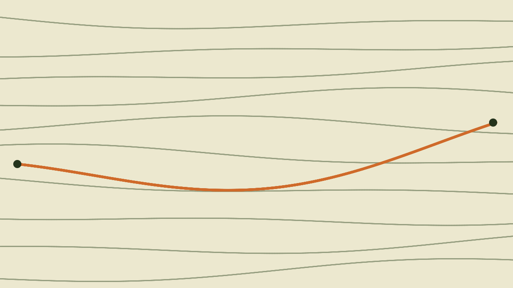

The docs explain how OpenBikeComputer *works*. What they can't hold is the story of
building it — the milestones, the detours, the parts that arrived bent. That's what
this log is for: short entries from the workbench, written as things happen.



## What an entry can do

Entries are plain markdown files in the repo, one folder per post with its images
sitting right next to the text. The renderer is the same tiny stdlib-only Python
that builds the docs, so nothing about publishing changed — push to `main` and CI
ships it.

Every image opens in a lightbox (click the map above — scroll zooms, drag pans).
And for the kind of change that's hard to describe in words, there's a slider:

```compare
before: render-before.png
after: render-after.png
label-before: Rev A
label-after: Rev B
caption: Drag the handle — placeholder art standing in for a real before/after.
```

## CAD parts you can grab

The bit I'm most pleased with: entries can embed models straight from the CAD
export. A small host-side tool converts a STEP file to GLB once, and the page gets
an orbit viewer — hand-rolled WebGL, a few KB, no engine dependency.

```model
glb: demo-case.glb
caption: A placeholder case — drag to orbit, scroll to zoom, double-click to reset.
```

When there's a real enclosure to show, the same block will carry a
**Download STEP** button next to it, so you can pull the part into your own CAD.

## Following along

There's an [Atom feed](../feed.xml) if you want entries delivered, and the
[docs](../../docs/) remain the place where the concepts live. See you out there.
