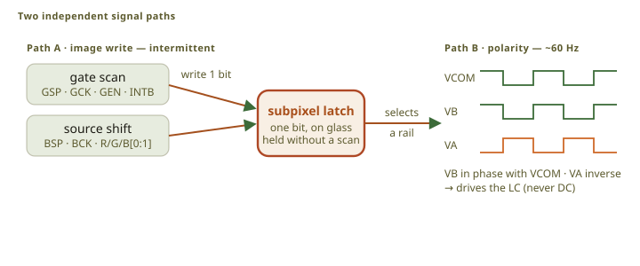
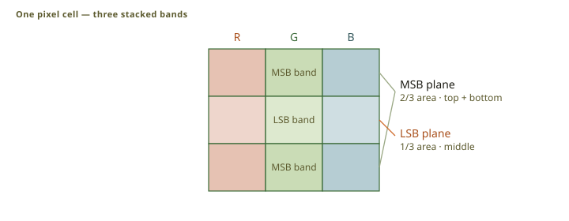
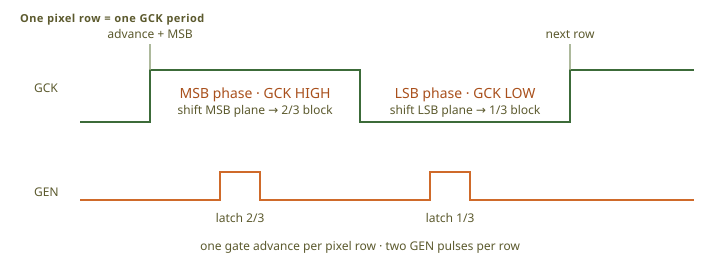

# Display protocol

The device uses a Sharp LS021B7DD02 reflective memory-in-pixel LCD of 240 × 320 pixels. Every
subpixel has a one-bit latch on the glass, so the panel keeps its image with no scan traffic. That
is the property the device is built around: a map left on the screen costs almost nothing. The
framebuffer is RGB222, which is four levels per channel and 64 colors.

## Two signal paths

<figure class="fig">

Scroll horizontally to see the full diagram.

<figcaption>Path A writes the pixel latches. Path B continuously drives the liquid crystal at approximately 60 Hz. A stored bit selects the <code>VA</code> or <code>VB</code> rail.</figcaption>
</figure>

Writing an image and driving the liquid crystal are separate. The write is intermittent and pushes
one bit into each subpixel latch. The polarity waveform is continuous, and the stored bit selects
which rail the subpixel follows.

Never stop that waveform while the panel has power: a liquid crystal held at a DC bias is damaged.
A hardware timer generates it, so a busy or sleeping processor cannot interrupt it.

## Pixel encoding

<figure class="fig">

Scroll horizontally to see the full diagram.

<figcaption>The connected MSB bands cover two-thirds of the subpixel. The LSB band covers one-third. The two bits give four visible levels.</figcaption>
</figure>

The panel makes four levels per channel by area: each subpixel has a large block and a small block,
two thirds and one third of its area. The two bits of a channel are those two blocks, so a level
needs no lookup table.

## Gate scan

<figure class="fig">

Scroll horizontally to see the full diagram.

<figcaption>Send the MSB plane while <code>GCK</code> is high. Send the LSB plane while <code>GCK</code> is low. Pulse <code>GEN</code> after each plane.</figcaption>
</figure>

A row is written in one clock period, in two phases: the larger block while the clock is high and
the smaller while it is low, with a latch pulse after each. One period advances one row. A frame
raises the envelope signal, writes the rows, and drops it again; with the envelope low the panel
holds what it has.

### Partial update

The presenter compares row hashes and sends only the changed row spans. The scan advances past
unchanged rows without latching them and stops after the last changed row, so a frame costs what
changed and not what the screen holds. That is how a clock digit costs a few rows.

## Power-on, power-off, and retention

Write a black frame at power-on, settle, then start the waveform. Write the safe state at power-off
before the waveform stops. Refresh a static image at least every two days.

## Timing

The signal names, their rails, and every timing limit are the panel datasheet's, and the
implementation holds them in one place: the [wire packer](src:firmware/obc-display/src/ls021/wire.rs)
builds the bus words, the [COM driver](src:firmware/obc-fw-nrf54l/src/com.rs) makes the polarity
waveform, and the [scan program](src:firmware/obc-fw-nrf54l/src/flpr/flpr_scan.c) runs on the
coprocessor that writes the panel.

The current scan clocks the source bus faster than the datasheet maximum. It passed a visual test
on one panel at room temperature, which is not production validation.

Panel power follows the update rate, and partial updates are what keep the average near the cost of
holding an image.

## Implementation

- COM driver: [`com.rs`](src:firmware/obc-fw-nrf54l/src/com.rs), [`com_hw.rs`](src:firmware/obc-fw-nrf54l/src/com_hw.rs)
- Scan program: [`flpr_scan.c`](src:firmware/obc-fw-nrf54l/src/flpr/flpr_scan.c)
- Wire packer: [`wire.rs`](src:firmware/obc-display/src/ls021/wire.rs)
- Presenter: [rendering pipeline](../../software/rendering/)
