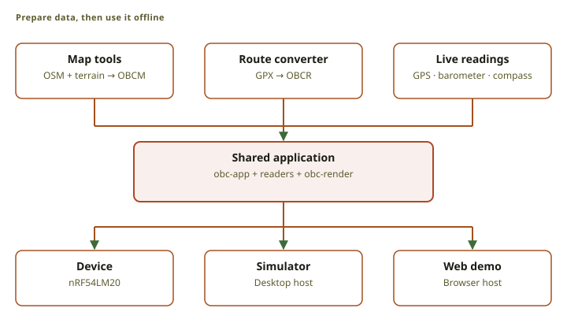

# OpenBikeComputer documentation

OpenBikeComputer is an open-source bikepacking computer in development. The prototype provides
offline maps, route navigation, and ride recording.

## Start here

- [Try the device](../#demo): explore a ride in the browser demo.
- [Prepare a map](../builder/): choose coverage and download a map.
- [Build your own](build/): check the status of the build guide.
- [Work on the software](src:README.md): find setup instructions and the source code.

## How the system fits together

<figure class="fig">

Scroll horizontally to see the full diagram.

<figcaption>The tools convert maps and routes to compact binary files. The device, simulator, and web demo use the same application and rendering code. Device sensors supply live data.</figcaption>
</figure>

The device reads compact binary formats straight from storage. The conversion work happens on a
computer, before the ride.

## Where to find what

  <a class="doc-card" href="software/rendering/">
    Software
    <h3>Rendering pipeline</h3>
    
Projection, level of detail, quadtree culling, rasterization, and display output.

  </a>
  <a class="doc-card" href="software/architecture/">
    Software
    <h3>System architecture</h3>
    
Runtime layers, host boundaries, the frame loop, and the routing seam.

  </a>
  <a class="doc-card" href="software/formats/">
    Software
    <h3>Data formats</h3>
    
The OBCM, OBCR, ride, terrain, catalog, and cell formats.

  </a>
  <a class="doc-card" href="software/ui/">
    Software
    <h3>The UI system</h3>
    
Screens, input gestures, settings, overlays, and render-on-demand behavior.

  </a>
  <a class="doc-card" href="hardware/">
    Hardware
    <h3>Hardware</h3>
    
The nRF54LM20 development platform and the reflective memory LCD.

  </a>

## The stack at a glance

| Layer | Crate / file | What it does |
| :-- | :-- | :-- |
| Map packer | [`obc-pack`](src:host/obc-pack) | Converts OSM PBF data to OBCM cells. |
| DEM baker | [`obc-dem`](src:host/obc-dem) | Converts Copernicus GLO-30 data to OBCD terrain cells. |
| Cell assembler | [`obcm-assemble`](src:host/obcm-assemble) | Combines OBCM and OBCD cells into one verified OBCM map. |
| Elevation | [`obc-elevation`](src:firmware/obc-elevation) | Reads OBCT data and supplies shared elevation calculations. |
| Map reader | [`obc-reader`](src:firmware/obc-reader) | Reads OBCM indexes, styles, features, POIs, and navigation data. |
| Route reader | [`obc-route`](src:firmware/obc-route) | Reads OBCR routes and provides conversion, matching, and profiles. |
| Renderer | [`obc-render`](src:firmware/obc-render) | Draws maps without allocation. |
| Application | [`obc-app`](src:firmware/obc-app) | Controls screens, input, navigation, and ride recording. |
| Simulator | [`obc-sim`](src:apps/obc-sim) | Hosts the application on a desktop. |
| Web demo | [`obc-web-demo`](src:apps/obc-web-demo) | Hosts the application in WebAssembly. |
| Builder bridge | [`obc-builder-bridge`](src:builder/wasm) | Converts routes, assembles maps, and renders previews in the browser. |

Start with [System architecture](software/architecture/). Then read
[Rendering pipeline](software/rendering/) and [Data formats](software/formats/).

These pages explain how the system works and why. The [`specs/`](src:specs) directory defines the
exact binary and wire contracts.
