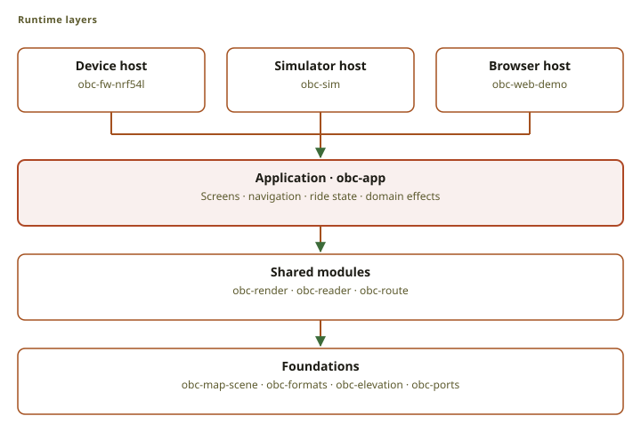
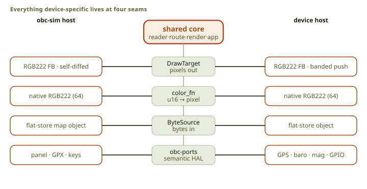
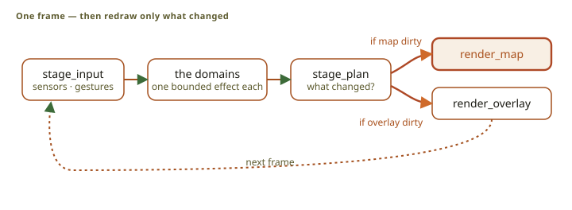
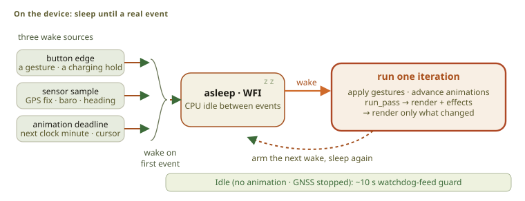
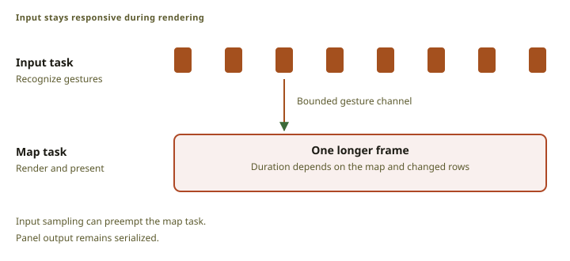

# System architecture

Hardware-specific code stays at the system boundary. The device, the simulator, the
[browser demo](../../) and the iPhone run the same `no_std` application core. Each host supplies
storage, sensors, input, and display.

## Runtime layers

Dependencies point from the hosts to the shared core. The core does not depend on a host, so new
hardware cannot reach into the application.

<figure class="fig">

Scroll horizontally to see the full diagram.

<figcaption>Read from top to bottom: each layer uses the shared layers below it. This overview groups responsibilities; it is not a complete Cargo dependency graph.</figcaption>
</figure>

[`App`](src:firmware/obc-app/src/app.rs) is the composition root. The
[Navigator](src:firmware/obc-app/src/navigator.rs) owns the active route, route matching, guidance,
and planner pacing. The [UI runtime](src:firmware/obc-app/src/ui_runtime.rs) owns screens, timers,
and dirty regions. The [host protocol](src:firmware/obc-app/src/host.rs) defines bounded commands
and events.

The host owns [`RenderScratch`](src:firmware/obc-render/src/lib.rs) and lends it to each render
call. The memory a frame needs is therefore not part of application state.

Four foundation crates carry no policy:

- [`obc-formats`](src:firmware/obc-formats) defines the persistent byte constants and byte I/O.
- [`obc-map-scene`](src:firmware/obc-map-scene) separates map sources from the renderer.
- [`obc-elevation`](src:firmware/obc-elevation) reads terrain and applies the shared elevation rules.
- [`obc-ports`](src:firmware/obc-ports) defines the semantic host interfaces.

## Four hosts, one core

- [`obc-fw-nrf54l`](src:firmware/obc-fw-nrf54l) is the device.
- [`obc-sim`](src:sim/desktop) is the desktop simulator.
- [`obc-web-demo`](src:sim/web-demo) is the browser demo.
- [`obc-ios-host`](src:sim/phone/host) is the iPhone host.

[`obc-host-core`](src:sim/host-core) holds the behavior that the three non-device hosts share.

The iPhone host runs the application over one card file. The phone supplies the position, heading,
altitude, and battery level. It is a development tool: it tests the user interface, position
tracking, route following, and ride recording against real sensors and a real rider. It cannot show
device speed, power use, the display driver, or the Bluetooth link. Only the device shows those.

<figure class="fig">

Scroll horizontally to see the full diagram.

<figcaption>A host supplies pixels, color conversion, random-access bytes, and semantic hardware values.</figcaption>
</figure>

The host supplies bytes through [`ByteSource`](src:firmware/obc-formats/src/io.rs), which reads any
offset on request. A map therefore does not have to fit in RAM. Every host reads its objects from
the same [flat store](src:sim/host-core/src/flat_store.rs); only the medium differs, which is a
card on the device, a sparse file on the simulator, and memory pages in the browser.

A reader pins one object revision while it reads. A replacement object gets a new revision, and the
open reader keeps its bytes until it closes. A map or a route can therefore be replaced while the
rider looks at it.

Recording is the write path with the same rule. The
[recorder](src:sim/host-core/src/flat_recorder.rs) appends bounded batches, writes periodic
checkpoints, and closes a ride with a footer. An interrupted ride restarts from its last
checkpoint, because the samples before that point are already durable.

[`obc-ports`](src:firmware/obc-ports/src/lib.rs) defines the sensor, input, settings, and track
interfaces. A sensor poll drains a mailbox. It does not start a bus transaction.

## The per-frame loop

<figure class="fig">

Scroll horizontally to see the full diagram.

<figcaption>The host renders only dirty regions. A static screen does not cause a map render.</figcaption>
</figure>

The application renders on demand. It repaints a region only when the facts that the region draws
have changed, so a static screen costs no processor and no panel traffic.

<figure class="fig">

Scroll horizontally to see the full diagram.

<figcaption>The device sleeps between events. A hardware timer generates the display COM signal without CPU work.</figcaption>
</figure>

[`App::run_pass`](src:firmware/obc-app/src/device_core/pass.rs) takes what the platform finished,
what changed underneath it, and what the rider did. It runs every domain in a fixed order and
returns a plan: what to repaint, when to run again, and at most one bounded effect for each domain.

Each effect carries an operation token, and its answer must return that token. A late answer to a
cancelled operation is therefore refused instead of applied. Effects carry small identifiers and
results; bulk data stays in caller-owned buffers.
[`obc-host-core`](src:sim/host-core/src/dispatch.rs) performs the effects for the frame-stepped
hosts. The board performs the same effects with its own asynchronous execution.

## On-device routing: the router seam

Navigator owns the planning lifecycle and issues one physical operation at a time. The
[host executor](src:sim/host-core/src/dispatch.rs) and the
[board executor](src:firmware/obc-fw-nrf54l/src/ride.rs) do only the work Navigator asks for. They
never start the next step or publish a route on their own.

| Operation | Executor work | Result Navigator waits for |
| --- | --- | --- |
| Acquire | Claim the workspace and hold the map source, and the route source for a detour. | Sources and workspace are held. |
| Step | Run one bounded search, trim, or preview step against those sources. | Progress, a preview, or a failure. |
| Commit | Publish the completed route or the accepted detour. | The new route identifier, or a failure. |
| Release | Finish or cancel pending work and return the workspace. | The workspace is available. |

Planning stays bound to the sources it started with: the exact map object and route revision. A
changed source invalidates the result. The executor cannot substitute the current map halfway
through a plan, so a preview always describes the route the rider reviewed.

Publication writes a new route object and never overwrites the original. A detour is planned the
same way, and the rider sees its cost before it replaces the active route.

The router projects each route endpoint onto stored road geometry and accepts a road within a fixed
radius. Sparse lookup anchors make long road edges discoverable. The search is profile-weighted A*
with a widening epsilon ladder: a wider bound gives an answer where a tight one runs out of table
space. A fixed search table holds the frontier, so the practical range follows the size of that
table and not a distance limit. The constants are in
[`nav.rs`](src:firmware/obc-route/src/nav.rs).

If the map carries terrain, the planner samples it for route elevations, and the shared integrator
calculates climb and descent. A map without terrain still plans routes.

A **visit** is one complete route: a ride to a mapped approach for the selected place, a return or
forward connection, and the remaining original route. The rider reviews it before it becomes
active, and acceptance is one durable transaction, so a restart can offer to resume it. The
[shared builder](src:firmware/obc-route/src/visit.rs) composes the route, and
[Navigator](src:firmware/obc-app/src/navigator/visit.rs) owns the requests and the phase changes.

## Staying responsive: the two planes

The device runs two cooperating execution planes. The high-priority input plane samples the buttons
and recognizes gestures. The map plane applies the gestures and owns all rendering and panel
output. A bounded channel carries gestures from one to the other.

<figure class="fig">

Scroll horizontally to see the full diagram.

<figcaption>The input plane recognizes gestures during a map render. The map plane owns all rendering and panel output.</figcaption>
</figure>

A map frame takes hundreds of milliseconds. Without the split, a button press during a frame would
be seen late or lost. The simulator runs the same `InputPlane` inline, because gesture recognition
depends only on raw input and time.

## Source index

- Application and dirty state: [`app.rs`](src:firmware/obc-app/src/app.rs)
- Input recognition: [`input_plane.rs`](src:firmware/obc-app/src/input_plane.rs)
- Display output: [`obc-display`](src:firmware/obc-display)
- Storage: [`obc-storage`](src:firmware/obc-storage)
- Sensor adapters: [`obc-platform`](src:firmware/obc-platform) and [`obc-sensors`](src:firmware/obc-sensors)
- Map formats: [data formats](../formats/)
- Rendering: [rendering pipeline](../rendering/)
- UI: [UI system](../ui/)
- Terrain: [terrain and elevation](../terrain/)
