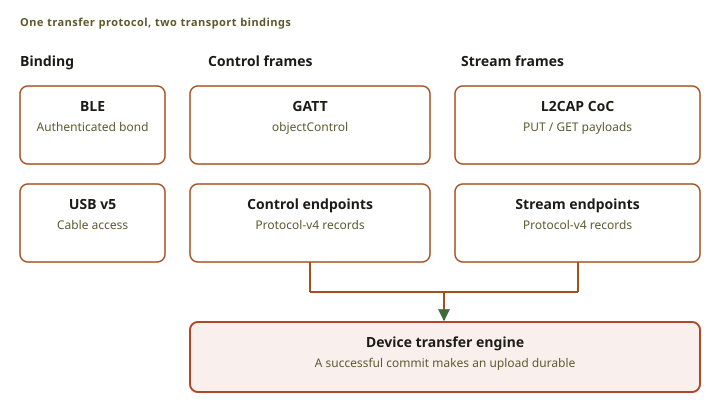
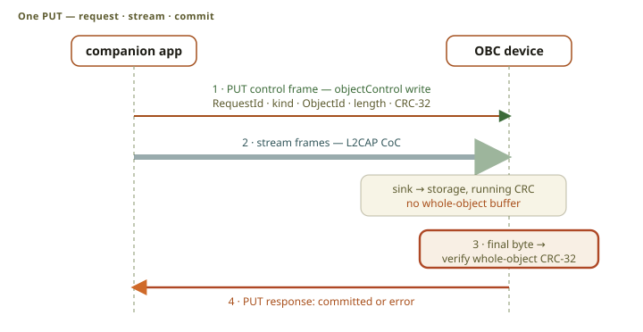
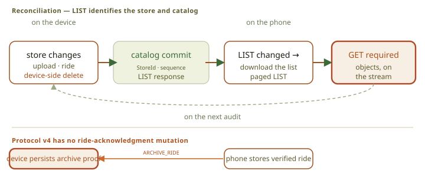

# The companion link

The companion link moves stored objects between the device and a client: routes and maps in, rides
out. Bluetooth and USB carry the same protocol frames, so there is one transfer engine and one set
of rules. Bluetooth adds the device-local controls: pairing, the clock, the settings, and bond
removal. USB carries objects and device information only.

The normative contracts are the [flat-store protocol](src:specs/FLAT_Store_Protocol.md), the
[card format](src:specs/FLAT_Store_Format.md), and the
[BLE control surface](src:specs/obc-ble-interface-spec.md).

## Two planes: control and data

<figure class="fig">

Scroll horizontally to see the full diagram.

<figcaption>BLE and USB carry the same protocol-v4 frames. BLE pairing, clock, and settings controls remain outside this transfer protocol.</figcaption>
</figure>

The protocol has a control channel and a stream channel. Control frames select an operation and
report its result; stream frames carry the payload. Only one transfer is active at a time, which
keeps the device's buffers fixed.

Over Bluetooth the control channel is a GATT characteristic and the stream channel is an L2CAP
channel; over USB each plane is a pair of bulk endpoints. The frame bytes are identical.

The operations are the ones a small object store needs: list the catalog, check one object, get,
put, remove, cancel the active transfer, format the card, and arm an uploaded firmware package.
There is no negotiation, no session, and no unsolicited status frame: a client lists first, and
lists again when the store identity or the commit sequence changes.

Link credits and packet completion do not mean the data is safe. Only a store commit does.

## Objects

The store holds routes, trips, rides, one map, the firmware package, and the rollback reserve.
Object identifiers are never reused; a create starts at revision one and a replace raises the
revision. A catalog entry carries the kind, length, CRC, and display name, so a client can show the
store without downloading anything.

## Transfers and commits

<figure class="fig">

Scroll horizontally to see the full diagram.

<figcaption>A PUT is one request. A successful response follows the store commit. The current board checks length and CRC but has no object-specific payload validator.</figcaption>
</figure>

An upload declares the identity, the expected revision, the length, and the CRC before any bytes
move, and the device writes into an unpublished allocation. After the last byte it checks all four
and only then commits. An error or a lost link makes the new bytes unreachable and leaves the old
object exactly as it was. There is no resume: a half-written object is not a state the store can be
in.

The current [board policy](src:firmware/obc-fw-nrf54l/src/flat_store.rs) checks the length and the
CRC, but does not yet parse the payload for its kind, so a successful upload is not proof that the
object can be read.

A download serves one committed revision and reports its length and CRC, and the client verifies
both. Removing an object removes its head and its retained revision in one commit, and cannot
remove an active recording.

### Reconciliation

<figure class="fig">

Scroll horizontally to see the full diagram.

<figcaption>LIST supplies the store identity, commit sequence, and catalog entries. Clients use it to reconcile state.</figcaption>
</figure>

A reply can be lost after the device has committed, so a client must be able to ask what happened
instead of guessing. After an interrupted replacement, a status request says whether the revision
became the head. After a lost create, whose identifier the client never learned, the client lists
the catalog, matches the kind, length, CRC, and name, and removes the duplicates it finds. A
notification is never evidence.

Rides become downloadable when their recording flag clears. The phone downloads the listed
revision, verifies it, saves it in one atomic archive generation, and reports success only after
the file is durable.

The phone then sends the device proof that it holds that exact finalized ride, and the device
commits and reads back that proof. Proof turns the synced indicator on. It is deliberately not a
deletion trigger: routes and rides stay on the device until the rider removes them, and a full card
offers the rider an age-based cleanup instead of deciding alone. The durable format is in the
[metadata contract](src:specs/Ride_Archive_Metadata.md).

## Pairing and the Bluetooth controls

<figure class="fig">

Scroll horizontally to see the full diagram.

<figcaption>One passkey creates one bond. Later connections use the stored keys. A bonded device rejects a second phone.</figcaption>
</figure>

Pairing uses Secure Connections passkey entry: the device shows six digits and the rider types them
on the phone. That produces one authenticated bond, and the device stores one phone. While a bond
exists it refuses a second phone, so a bike computer in a group ride cannot be taken over from the
next wheel.

**Forget phone** removes the stored keys. It writes and verifies the empty persistent slot first,
then removes the host keys, because the order decides what a failure leaves behind. Controller
cleanup has no receipt, so the screen asks for a restart to finish. A disconnect proves nothing
about stored keys. A factory reset runs the same removal, so the setup that follows can pair a
phone again.
It also deletes personal card data. Maps stay installed, so setup does not require another map
download. Reset waits for card deletion to finish. A card failure keeps the reset screen open for
Retry.

Device information, the battery level, and the protocol version are readable before pairing.
Everything else needs an authenticated, encrypted link. The clock is set by the phone or by a GPS
fix; the local offset has to come from the phone or the rider.

## Sensors: the device as central

<figure class="fig">

Scroll horizontally to see the full diagram.

<figcaption>The device is a BLE peripheral for the phone and a BLE central for sensors.</figcaption>
</figure>

For the phone the device is a peripheral. For sensors it is a central, on the same radio at the
same time. It supports the standard heart rate, cycling power, speed and cadence, and battery
services, with one saved slot each for heart rate, power, and cadence.

Sensors use their own saved address and have nothing to do with the phone bond. A reading older
than a few seconds becomes unavailable rather than stale, and the recorder stores the fresh samples
with the ride. The device does not stream live sensor values to the phone.

## Where the two transports differ

| Property | Bluetooth | USB |
| :-- | :-- | :-- |
| Protocol frames | Same | Same |
| Authorization | Authenticated bond | Physical cable access |
| Device-local controls | Available | Not available |
| Device information | GATT services | Control request |

USB frames travel inside length-prefixed records, and a record can span packets. There is no
mass-storage mode: the firmware stays the only owner of the card, so a computer can never leave the
card in a state the firmware did not make.

## Implementation

- Protocol engine: [`obc-link`](src:firmware/obc-link/src/flat)
- Flat store: [`obc-storage`](src:firmware/obc-storage/src/flat)
- BLE and USB adapters: [`ble`](src:firmware/obc-fw-nrf54l/src/ble), [`usb`](src:firmware/obc-fw-nrf54l/src/usb)
- USB host library: [`obc-usb`](src:builder/usb)
- iOS protocol client: [`OBCProtocolV4`](src:companion-ios/Packages/OBCKit/Sources/OBCProtocolV4)
- Builder USB client: [`builder/web/src/lib/usb`](src:builder/web/src/lib/usb)
- BLE codecs and sensor decoders: [`obc-ble`](src:firmware/obc-ble)
