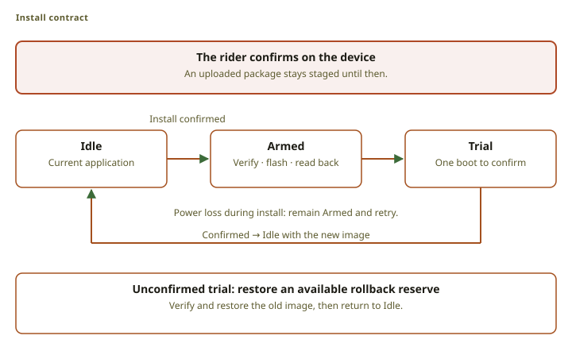
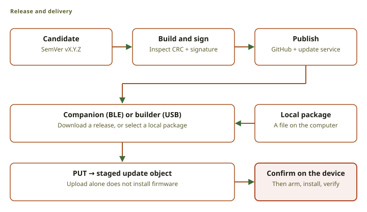
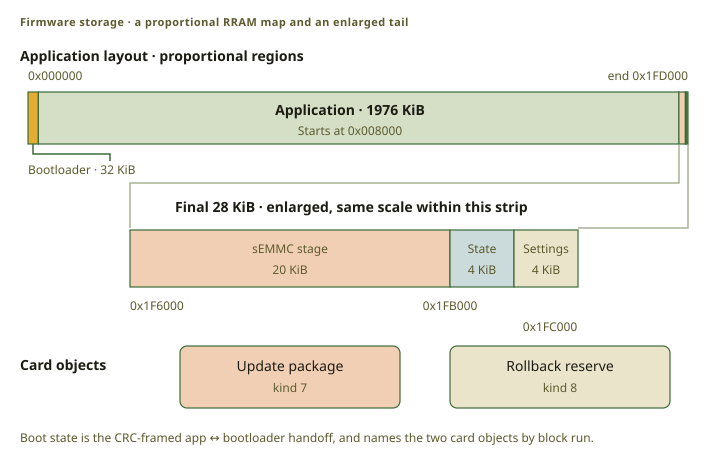

# Firmware updates

The device has one application slot and a small bootloader, and the update design reserves storage
for the previous image. An update package uses the [OBCU format](src:specs/OBCU_Spec.md) and is
stored as an ordinary object on the card.

Uploading a package does not install it. Installation is a separate, explicit step, and the rider
takes it on the device: the System menu checks the staged package and asks for a confirmation
before anything is armed. The install request the link carries is a second route to the same arm,
and the current [board policy](src:firmware/obc-fw-nrf54l/src/flat_store.rs) refuses it, because a
client must not be able to reboot a bike computer that nobody is holding.

## The trust model

<figure class="fig">

Scroll horizontally to see the full diagram.

<figcaption>The state transitions describe the install contract and bootloader. The rider's confirmation on the device is what starts this flow.</figcaption>
</figure>

The chain is built so that every failure has one safe answer:

- The device verifies the package structure, the image CRC, the signature, and the version before
  it arms anything.
- It refuses to install while a ride is recording or when the battery is too low.
- The store reserves the rollback space before it writes the boot handoff.
- The bootloader verifies the whole staged image before it erases the application.
- A power loss during installation leaves the state armed, and the next boot repeats the whole
  install.
- The new image gets one trial boot under a watchdog. An image that does not confirm itself is
  replaced from the reserve.
- A blank or invalid boot-state page means idle, and the bootloader starts the current
  application.

If the card cannot be read before the erase, the bootloader retries for about a minute and then
starts the old image. After the erase has started there is no old image to fall back to, so it
retries until it can finish the install or the rollback.

## Package validation

The package carries a CRC for integrity and an Ed25519 signature for authenticity. The signed
message covers a context string, the version, the image length, and the image, so a package cannot
be replayed as a different version. The application verifies the signature before it arms; the
bootloader verifies the image CRC before it erases. See the
[OBCU specification](src:specs/OBCU_Spec.md).

## Release publication

An owner prepares a candidate in the release console, which fixes the source commit and the
requirement revision. Candidate verification runs the ordinary CI suite and builds the firmware. A
tag push publishes nothing by itself.

Publication is gated on verification, not on a green build alone: every active requirement needs an
approved coverage plan, and every test that plan cites has to pass for this candidate. A missing or
failing test blocks publication unless an administrator records an exception for that candidate,
with a reason, and the report says which requirements were accepted that way. The
[publication workflow](src:.github/workflows/verification-publish.yml) re-checks the frozen
evidence, tags the tested commit, and publishes the firmware that was already built. Nothing is
rebuilt at publication.

The GitHub release is the archive: the binaries, the package, the checksums, and the frozen
verification report. The workflow also copies the package and a small manifest to the update
service, which clients read to find the current version, its size, and its digest. There are two
channels, stable and prerelease, and the path of a published package never changes.

## Three ways a package arrives

<figure class="fig">

Scroll horizontally to see the full diagram.

<figcaption>Release clients stage an update package. The install itself starts on the device.</figcaption>
</figure>

The companion app uploads a package over Bluetooth, the map builder uploads one over USB, and
either client can upload a local file. The card is not user-accessible, so a computer cannot copy a
package onto it directly.

Both clients check the package header, the CRCs, and the size before they upload, and check the
manifest size and digest for a published package. They do not verify the signature: the device owns
the trusted key, and a check on the client would prove nothing about the device.

A client offers only a strictly newer release, and offers nothing for a development build whose
version is not a release version. After the upload it sends the arm request, naming the staged
object and its revision. The board refuses that request today and the rider confirms the install on
the device instead. The device checks the structure, the CRC and the signature before it arms, shows
the running and the staged version side by side, and refuses to arm while a ride is recording.

## The chain, layer by layer

| Check | Performed by | Purpose |
|---|---|---|
| HTTPS | client | authenticates the update service |
| Manifest size and digest | client | detects a wrong or incomplete download |
| Install confirmation | rider, on the device | authorizes the install |
| Signature | device application | authenticates the package |
| Version monotonicity | device application | prevents downgrade and reinstall |
| Image CRC | application and bootloader | detects storage or transfer corruption |
| Trial confirmation | new application | proves the new image can start |

The signature is the load-bearing check, and it does not depend on the download server: a
compromised server cannot produce an accepted package without the signing key. The manifest digest
detects a bad download and nothing more, because the manifest and the package come from the same
service.

## RRAM layout

<figure class="fig">

Scroll horizontally to see the full diagram.

<figcaption>Both RRAM strips are proportional within their own scales. The enlarged tail makes the small regions readable; the card objects have variable sizes.</figcaption>
</figure>

The bootloader has no filesystem, no radio, no display driver, and no asynchronous executor. It
uses blocking storage and RRAM operations, because everything it must do has to work when the
application does not exist. It does keep the display's polarity waveform and the watchdog running
during an install.

## Implementation

- OBCU and boot-state formats: [`OBCU_Spec.md`](src:specs/OBCU_Spec.md)
- Install protocol: [`FLAT_Store_Protocol.md`](src:specs/FLAT_Store_Protocol.md)
- Shared update logic: [`obc-dfu`](src:firmware/obc-dfu)
- Bootloader: [`obc-boot`](src:firmware/obc-boot)
- Package tool: [`obc-mkimage`](src:host/obc-mkimage)
- Release workflow: [`release.yml`](src:.github/workflows/release.yml)
- Web release client: [`release.ts`](src:builder/app/src/lib/firmware/release.ts)
- iOS release client: [`Firmware`](src:companion-ios/Packages/OBCKit/Sources/OBCTransport/Firmware)
