# Data formats

The device reads binary objects straight from storage through a random-access byte interface, and
parses no text format while it rides.

The files in [`specs/`](src:specs) are the normative contracts and define every byte. This page
says what each format is for and why it has that shape.
[`obc-formats`](src:firmware/obc-formats) holds the shared constants and byte primitives.

| Format | Use | Main consumer |
| --- | --- | --- |
| OBCM | Map, POIs, navigation, terrain, and article collections | Device |
| OBCR | Route geometry, statistics, and waypoints | Device |
| Ride object | Recorded samples and summary | Device and companion |
| OBCT | Terrain height raster | Device and map tools |
| OBCC | Map-builder catalog | Website and desktop app |
| OBCA | Cell and assembly rules | Map tools |

Values are little-endian and coordinates are signed microdegrees. A reader uses checked arithmetic
and refuses an unsupported version at the header, not halfway through a frame.

<figure class="fig">

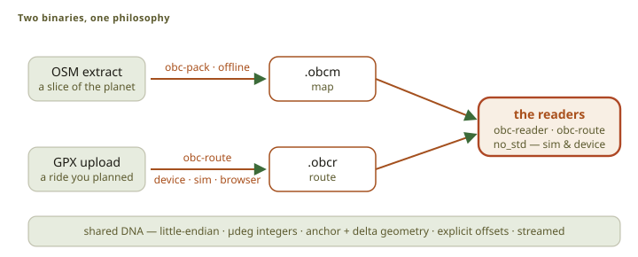

Scroll horizontally to see the full diagram.

<figcaption>OBCM and OBCR use the same byte and streaming conventions.</figcaption>
</figure>

## OBCM — the map

One OBCM object holds everything the device draws and routes on, so a rider installs one file.
Offsets are stored in scaled units, so a 32-bit offset still reaches the end of a large map.

<figure class="fig">

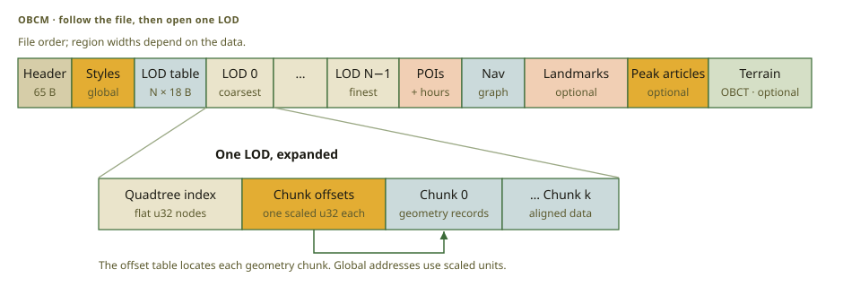

Scroll horizontally to see the full diagram.

<figcaption>Each LOD repeats the same index-and-chunks structure. The ribbon shows file order, not relative region sizes.</figcaption>
</figure>

The map is a pyramid of pre-simplified levels of detail. Each level is independent and states the
coarsest scale it serves, so the renderer opens one level and reads nothing else.

<figure class="fig">

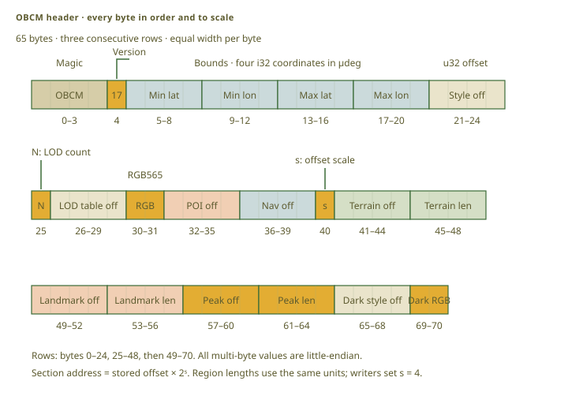

Scroll horizontally to see the full diagram.

<figcaption>Field widths show their actual byte sizes. Small fields have leader labels. The second row continues directly after byte 24.</figcaption>
</figure>

The header addresses the global sections. An absent section has a zero offset and length, which is
how a map without terrain, landmarks, or peak articles says so. The paired Light and Dark style
tables apply to the same geometry at every level. [OBCM](src:specs/OBCM_Spec.md) defines each field.

### The quadtree index

<figure class="fig">

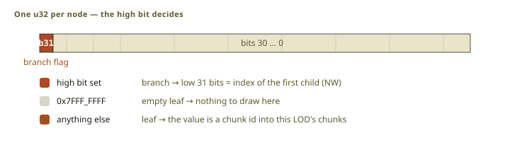

Scroll horizontally to see the full diagram.

<figcaption>Branches point to four consecutive children. Readers derive child bounds from the parent bounds.</figcaption>
</figure>

Each level indexes its geometry with a quadtree of 32-bit words. A reader derives a child's bounds
from its parent's, so no node stores a box and one comparison prunes a whole branch.

### Features: an anchor, then deltas

<figure class="fig">

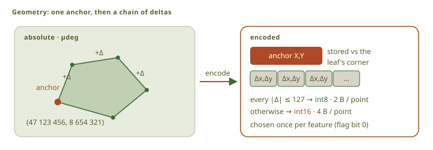

Scroll horizontally to see the full diagram.

<figcaption>Anchor and delta encoding keeps common geometry records small.</figcaption>
</figure>

A feature stores one anchor relative to its leaf and then coordinate deltas, because map geometry
is dense and local.

<figure class="fig">

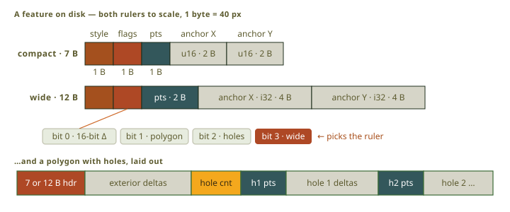

Scroll horizontally to see the full diagram.

<figcaption>The compact header is the common form. The wide form supports large anchors or point counts.</figcaption>
</figure>

A reader validates a whole feature before it publishes any geometry, and drops an invalid one as
one unit. Half a coastline is worse than no coastline.

### POIs: services and named summits

<figure class="fig">

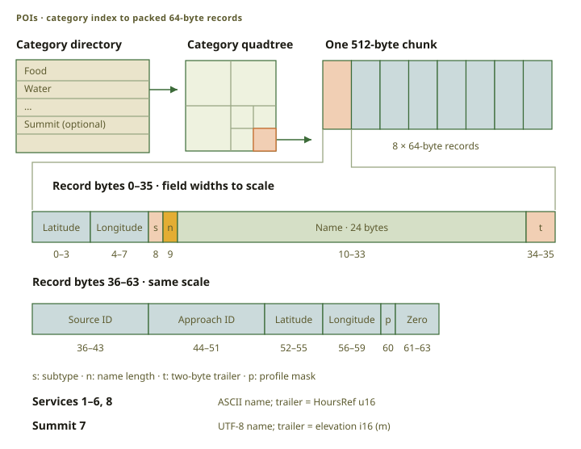

Scroll horizontally to see the full diagram.

<figcaption>The two ruler rows show the 64-byte record at one scale. Source identity and an optional mapped approach follow the display fields.</figcaption>
</figure>

Each POI category has its own index, so a search for water reads no campsite records. A record
carries its source identity and, where a source node lies on a routable way, a mapped approach.
That approach is what lets the device plan a ride to a place instead of to a coordinate beside it.
Separate categories hold named summits and settlement names. See
[OBCM section 7](src:specs/OBCM_Spec.md).

### Opening hours: a pooled weekly schedule

<figure class="fig">


Scroll horizontally to see the full diagram.

<figcaption>The packer converts opening-hours text to fixed weekly schedules. The device does not parse the source grammar.</figcaption>
</figure>

The packer converts the opening-hours grammar into fixed weekly schedules in a shared pool, so the
device never parses text and identical hours cost one copy. A rounded time or a rule the packer
cannot express sets a flag, and a flagged schedule reports Unknown.

### The navigation graph: a routable network

<figure class="fig">

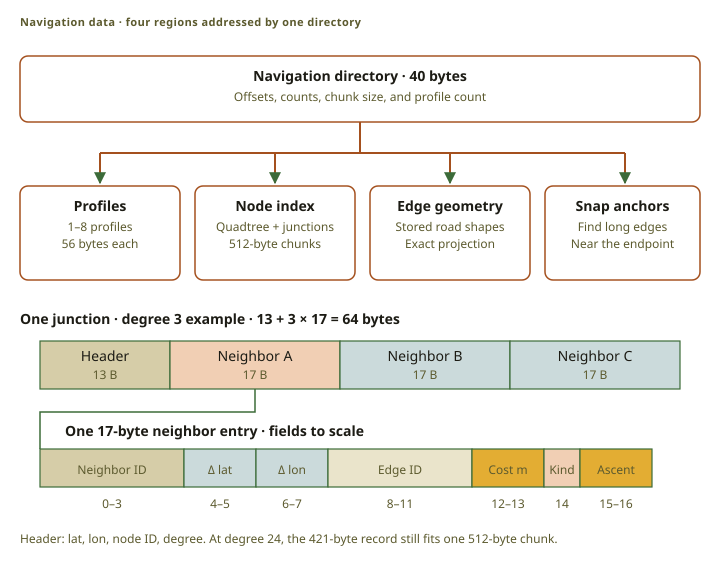

Scroll horizontally to see the full diagram.

<figcaption>The directory addresses four regions. A junction record is 13 + 17 × degree bytes. Inline neighbor coordinates, cost, way kind, and ascent avoid another record read during relaxation.</figcaption>
</figure>

The routing network is baked into the map. A junction record repeats each neighbor's coordinate,
cost, way kind, and ascent. That costs bytes and saves reads: relaxing a junction uses the chunk
that is already open, and a search on this device is limited by storage reads.

<figure class="fig">

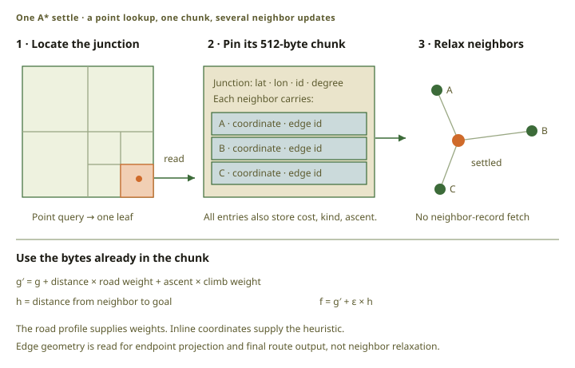

Scroll horizontally to see the full diagram.

<figcaption>The junction chunk supplies the data for each relaxation. Costs include distance, road-profile weight, and directional ascent; ε weights the goal-distance heuristic.</figcaption>
</figure>

The search uses junction records alone, and reads edge geometry only to project the endpoints and
write the finished route. Long edges carry sparse lookup anchors, so a road stays discoverable far
from its junctions. See [the router seam](../architecture/#on-device-routing-the-router-seam).

## OBCR — the route

An OBCR route holds the ordered geometry, the measured statistics, the waypoints, and, for an
accepted visit, the tie back to the original route. The statistics are measured from the geometry
the file keeps, so the summary and the route agree.

Missing elevation is an explicit unknown value, because zero meters is a valid height at the coast.
An unknown point pauses ascent integration instead of adding a false climb. See the
[OBCR specification](src:specs/OBCR_Spec.md).

## Recorded rides

<figure class="fig">

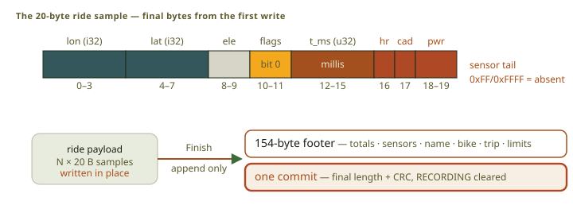

Scroll horizontally to see the full diagram.

<figcaption>Ride finalization does not rewrite sample data.</figcaption>
</figure>

A ride is a run of fixed-size samples with a summary footer appended at the end. Finalization does
not rewrite the samples, so a long ride closes in constant time and an interrupted recording keeps
everything written before the interruption. The footer also records the bike type and the trip day
that the ride started on, so the device and the phone group the rides of a trip without dates. It
keeps the rider's maximum heart rate and FTP from the start too, so a ride keeps its effort zones
when the rider changes those settings later. The byte contract is in
[the BLE interface specification](src:specs/obc-ble-interface-spec.md).

## OBCT — the terrain raster

<figure class="fig">

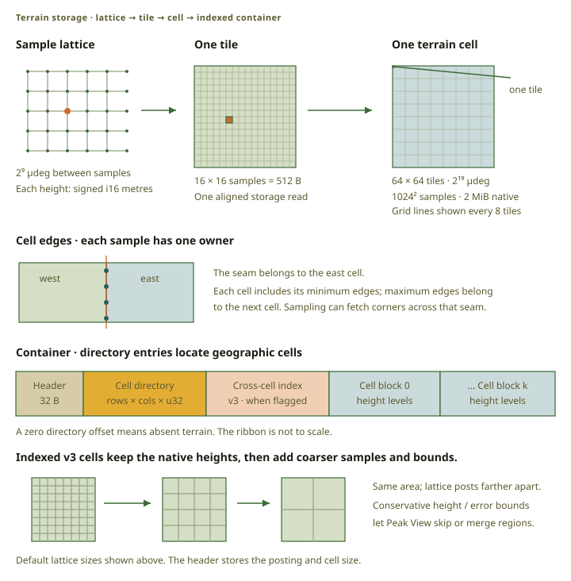

Scroll horizontally to see the full diagram.

<figcaption>Native height bytes retain the same lattice and tile order. Indexed OBCT v3 adds a height pyramid and conservative bounds; ordinary elevation sampling still reads native tiles.</figcaption>
</figure>

OBCT stores heights as signed meters on a fixed lattice, in small tiles, with a directory of cells.
A tile is the unit of reading, so sampling one position touches a small part of the file. An
assembled map carries one OBCT container, and the map reader hands that region to the terrain
reader as a byte window. See [terrain and elevation](../terrain/).

## Streaming: resident against on-demand

<figure class="fig">

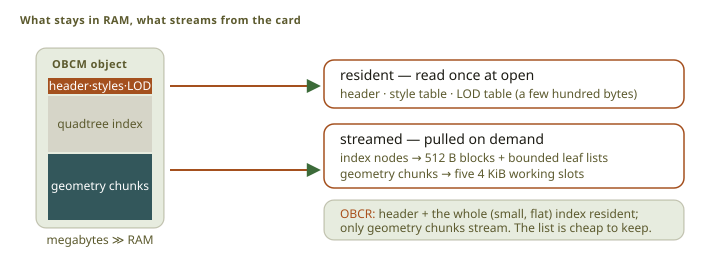

Scroll horizontally to see the full diagram.

<figcaption>Large map, route, and terrain objects do not have to fit in RAM.</figcaption>
</figure>

Every reader takes bytes through [`ByteSource`](src:firmware/obc-formats/src/io.rs) and keeps only
its small tables in memory: the map header, styles, and level table; the route index; the terrain
header and a few tiles. Indexes and geometry stream as the frame needs them. That is what lets a
map larger than the device's RAM be drawn at all.

## The catalog — the map builder's source of truth

OBCC is the map-builder catalog, and the device never reads it. Its root publishes the map schema,
the skins, the region selections, the cell index for each band, the terrain metadata, and the
license information. It pins every object by length and digest: a map is assembled from files
fetched over a network, so the catalog, not the transport, decides what the right bytes are.

The split between schema and skin is why a map can be restyled cheaply. The schema controls
geometry, levels, style identifiers, routing, and chunk size, and changing it needs a rebake. A
skin controls only colors, weights, line style, paint order, and priority, and changing it does
not. See [`OBCC_Spec.md`](src:specs/OBCC_Spec.md).

## Cells and assemblies

OBCA defines a global grid of power-of-two cells and the rules for joining them. A region is baked
once as cells, and every map a rider selects is assembled from those cells.

<figure class="fig">

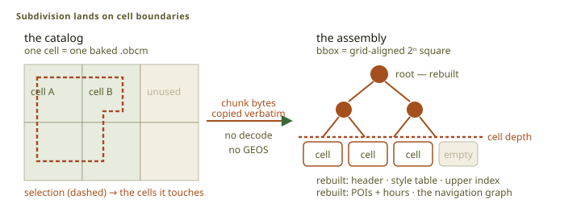

Scroll horizontally to see the full diagram.

<figcaption>Exact grid alignment preserves leaf-relative feature anchors. The assembler copies geometry bytes without decoding them.</figcaption>
</figure>

The cell grid and the map quadtree share one global origin, so a leaf of the assembled map is a
leaf of a cell. Feature anchors are relative to their leaf and stay correct, and the assembler
copies geometry chunks without decoding them. It rebuilds only the global parts: the header, the
tables, the POIs, the hours pool, the navigation graph, and the terrain container. Routing nodes on
a seam merge when their coordinates are equal.

All cells in one assembly share the schema revision and the map version. The assembler writes the
selected Light and Dark presentation records into one file. The browser runs the
same engine as the command line, through [`obc-web-assemble`](src:apps/obc-web-assemble), and
verifies the result with the production readers. See [`OBCA_Spec.md`](src:specs/OBCA_Spec.md).

## Source index

- Format constants and byte I/O: [`obc-formats`](src:firmware/obc-formats)
- OBCM reader: [`obc-reader`](src:firmware/obc-reader)
- OBCR reader, converter, and router: [`obc-route`](src:firmware/obc-route)
- OBCT reader and sampler: [`obc-elevation`](src:firmware/obc-elevation)
- OBCM packer: [`obc-pack`](src:host/obc-pack)
- Terrain baker: [`obc-dem`](src:host/obc-dem)
- Map assembler: [`obcm-assemble`](src:host/obcm-assemble)
