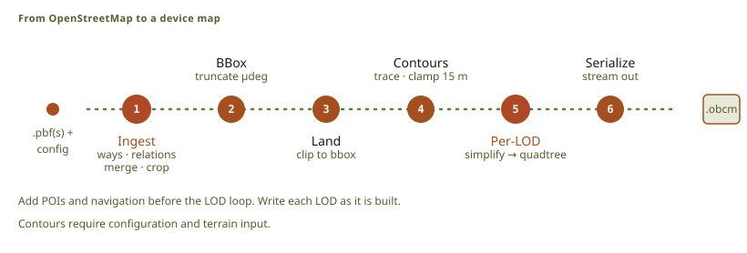
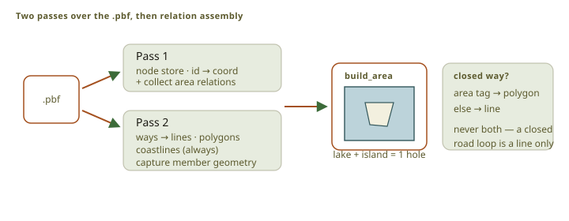
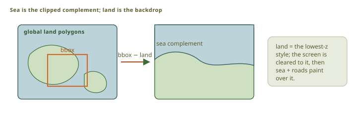
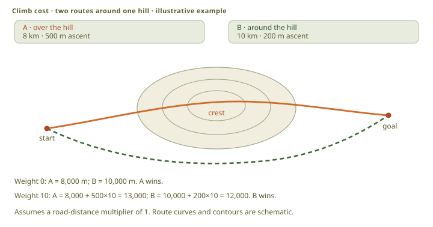
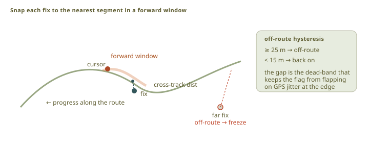

# Packer and routing

[`obc-pack`](src:host/obc-pack) converts OpenStreetMap extracts into the OBCM map format, with the
POIs, the opening hours, the contours, and the navigation graph the device plans routes on. The
GPX converter writes OBCR routes, and the matcher puts the live position on the active route.

Everything expensive happens here, on a computer, so that the device only reads.

## Packing a map

<figure class="fig">
<div class="diagram-scroll" role="region" aria-label="Diagram; scroll horizontally to see all content" tabindex="0" style="--diagram-width: 820px">

</div>
<div class="diagram-hint" aria-hidden="true">Scroll horizontally to see the full diagram.</div>
<figcaption>The packer ingests OSM data, adds generated features, builds each LOD, and writes one OBCM map.</figcaption>
</figure>

The pipeline ingests the sources, measures the content, adds the land, sea, and contour features
that OSM does not supply, builds the POIs and the navigation graph, then builds each level of
detail and writes the map. It holds about one level's quadtree at a time.

### Styling: first match wins

The `features` object in the configuration is ordered, and the first matching tag key and value
gives a way its style. An exact value beats the catch-all. A way that matches nothing is dropped,
which is how the map stays small: a class of feature is in the map because the style asked for it.

<figure class="fig">
<div class="diagram-scroll" role="region" aria-label="Diagram; scroll horizontally to see all content" tabindex="0" style="--diagram-width: 720px">

</div>
<div class="diagram-hint" aria-hidden="true">Scroll horizontally to see the full diagram.</div>
<figcaption>A way uses the first matching tag key. An exact value has priority over the catch-all value.</figcaption>
</figure>

The shipped style works inside the panel's 64 colors, and that limit shapes it. Two one-pixel
dashed lines have only their color to separate them, so where the colors run out a line gets a
different shape instead: cableways and ski lifts use a ticked line, the third line style beside
solid and dashed. These marks report the OSM way type. They do not rate difficulty.

### Ingest: two passes, then assemble

<figure class="fig">
<div class="diagram-scroll" role="region" aria-label="Diagram; scroll horizontally to see all content" tabindex="0" style="--diagram-width: 720px">

</div>
<div class="diagram-hint" aria-hidden="true">Scroll horizontally to see the full diagram.</div>
<figcaption>The ingester reads nodes and relations first. It then resolves ways and assembles area relations.</figcaption>
</figure>

The ingester reads each source twice: the first pass stores node coordinates and collects area
relations, and the second resolves ways and captures relation members. It then assembles polygons
and holes with GEOS. A closed way becomes a polygon only when its tags say it is an area, so a road
that returns to its start stays a line.

A bounding box adds a selection pass before those two. It keeps each selected way whole, with the
nodes and relation members it needs, so roads do not stop at an artificial edge. Complete objects
can reach outside the box, so the map's own bounding box is larger than the request and is not the
box to ask for next time.

Several sources can be read in the same passes. For a duplicate object the first file listed wins,
and objects are emitted in ascending identity order, so the same inputs always give the same map.

One pack covers a limited area, and the packer refuses a larger region before it reads any data.

### Land and sea

<figure class="fig">
<div class="diagram-scroll" role="region" aria-label="Diagram; scroll horizontally to see all content" tabindex="0" style="--diagram-width: 720px">

</div>
<div class="diagram-hint" aria-hidden="true">Scroll horizontally to see the full diagram.</div>
<figcaption>The packer clips the land dataset to the map. It stores the sea complement when land is the backdrop.</figcaption>
</figure>

OSM supplies coastlines but no land fill. The packer clips a cached global land-polygon dataset to
the map, and where land is the backdrop it stores only the sea, because most maps are mostly land.

### Contours, traced from the terrain

The packer traces contours from the [terrain raster](../terrain/) with marching squares, and skips
a lattice square when a corner has no height. It writes ordinary line features, so contours use the
same levels, quadtree, and renderer as everything else. A flag marks them as the terrain layer,
which lets the renderer hide their ink without removing their bytes.

Their color is chosen for a 64-color panel: it keeps a clear brightness difference from rock,
forest, grass, and the land base, and stays out of the warm group that tracks and paths use.

### Extracting POIs

<figure class="fig">
<div class="diagram-scroll" role="region" aria-label="Diagram; scroll horizontally to see all content" tabindex="0" style="--diagram-width: 720px">

</div>
<div class="diagram-hint" aria-hidden="true">Scroll horizontally to see the full diagram.</div>
<figcaption>The packer classifies, normalizes, and deduplicates POIs before it builds the POI index.</figcaption>
</figure>

A fixed table maps tags to the categories the device browses, and the first matching row wins.

A place gets a route approach only when one of its source nodes belongs to a routable way, or, for
an area, one of its own boundary nodes. A road that merely passes nearby is not access: the device
must not route to a gate that does not exist.

Named summits get their own category for Peak View, with elevation in place of opening hours.

The device font holds only ASCII, Latin-1 and Latin Extended-A, so the packer spells every other
character in Latin, or takes `name:en`, rather than store question marks.

### Parsing opening hours

<figure class="fig">
<div class="diagram-scroll" role="region" aria-label="Diagram; scroll horizontally to see all content" tabindex="0" style="--diagram-width: 720px">

</div>
<div class="diagram-hint" aria-hidden="true">Scroll horizontally to see the full diagram.</div>
<figcaption>The packer converts supported opening-hours rules to one fixed weekly schedule.</figcaption>
</figure>

The packer parses the part of the grammar that fits a weekly schedule: weekday ranges and lists, up
to two intervals a day, overnight intervals, all day, closed, and a representative seasonal week.
It rounds times to a quarter of an hour and flags a result it rounded or trimmed.

The device turns a schedule into Open, Closed, or Unknown. A missing or flagged schedule is
Unknown, and so is an untrusted clock: a GPS fix gives UTC, and UTC does not say when a bakery
opens. The local offset has to come from the rider or the phone.

### Building the navigation graph

<figure class="fig">
<div class="diagram-scroll" role="region" aria-label="Diagram; scroll horizontally to see all content" tabindex="0" style="--diagram-width: 720px">

</div>
<div class="diagram-hint" aria-hidden="true">Scroll horizontally to see the full diagram.</div>
<figcaption>The packer converts routable OSM ways to a navigation graph. Shared OSM nodes form graph junctions.</figcaption>
</figure>

Shared OSM node identities become junctions. The packer splits ways there, removes duplicate edges,
and drops small disconnected components. A legality filter rejects private access, motor roads, and
bicycle prohibitions, and each accepted edge is classified by highway and surface into one way-kind
byte, which is what the profile weights read. See
[OBCM section 8](src:specs/OBCM_Spec.md).

An assembled map keeps one graph: the assembler copies each surviving edge geometry record
unchanged and rebuilds the identities, the adjacency, and the indexes.

### Weighting the graph: bike profiles

A map carries four bike profiles in fixed order: Road, Gravel, MTB, and Touring
([OBCM §8.6](src:specs/OBCM_Spec.md)). A profile gives a multiplier for each highway class and
surface, and a climb weight.

Every multiplier is at least one, and zero means forbidden. That is not a style choice: A* needs a
heuristic that never overestimates, and a multiplier below one would make the straight-line
distance an overestimate and the answer wrong.

### Weighting the climb

<figure class="fig">
<div class="diagram-scroll" role="region" aria-label="Diagram; scroll horizontally to see all content" tabindex="0" style="--diagram-width: 720px">

</div>
<div class="diagram-hint" aria-hidden="true">Scroll horizontally to see the full diagram.</div>
<figcaption>Directional ascent measures all uphill travel along an edge. A longer path can cost less when it avoids enough climb.</figcaption>
</figure>

Each adjacency stores the ascent for its own direction, integrated along the edge with a small dead
band so that sampling noise is not counted as climbing. A missing sample pauses the integration
instead of reading as flat ground.

```text
edge_cost = weighted_distance + ascent_m × climb_weight
```

A descent never reduces the cost. A profile with a higher climb weight therefore accepts a longer
way round to avoid a hill, which is the whole point of having profiles.

### Building the LOD pyramid

<figure class="fig">
<div class="diagram-scroll" role="region" aria-label="Diagram; scroll horizontally to see all content" tabindex="0" style="--diagram-width: 720px">

</div>
<div class="diagram-hint" aria-hidden="true">Scroll horizontally to see the full diagram.</div>
<figcaption>Each LOD applies its configured filters. The packer then builds and writes its quadtree.</figcaption>
</figure>

Each style names the coarsest level it may appear at, and each level applies its own filters:
sub-pixel polygons are removed, fills and lines that look the same are merged, short joined lines
are dropped, and coarse land cover is generalized.

<figure class="fig">
<div class="diagram-scroll" role="region" aria-label="Diagram; scroll horizontally to see all content" tabindex="0" style="--diagram-width: 720px">

</div>
<div class="diagram-hint" aria-hidden="true">Scroll horizontally to see the full diagram.</div>
<figcaption>A quadtree node becomes a leaf when its features fit the chunk and ring limits.</figcaption>
</figure>

A node becomes a leaf when its features fit the chunk size and the ring limit; otherwise it splits
and its features are clipped into the children, so a feature that crosses a boundary appears in
both. The device walks the same flat quadtree, so the packer's decision is the renderer's index.

### The builder

The product builder assembles published cells; it does not run the packer. A selection can mix
named regions, boxes, lassos, and GPX corridors, and the builder unions them before it prices or
downloads anything, so overlapping parts do not pay twice. It verifies every object against the
catalog, and the assembler verifies the finished map with the production readers.

One Svelte application serves the website, the desktop app, and the maintainer server; the host
modules differ in transport and storage, never in the selection or assembly algorithm. The website
is static and the cells live in object storage, so publishing a new region does not deploy the
website.

## Following a route

<figure class="fig">
<div class="diagram-scroll" role="region" aria-label="Diagram; scroll horizontally to see all content" tabindex="0" style="--diagram-width: 760px">

</div>
<div class="diagram-hint" aria-hidden="true">Scroll horizontally to see the full diagram.</div>
<figcaption>The GPX converter keeps exact ride statistics and reduces only the displayed geometry.</figcaption>
</figure>

The GPX converter writes an OBCR route. It measures the geometry it keeps, so the statistics
describe the stored route and not the source file, and it preserves elevation changes, surface
transitions, and the boundaries of missing data. The same `no_std` converter runs on the device, in
the simulator, and in the browser.

### Map-matching: a forward-biased cursor

<figure class="fig">
<div class="diagram-scroll" role="region" aria-label="Diagram; scroll horizontally to see all content" tabindex="0" style="--diagram-width: 720px">

</div>
<div class="diagram-hint" aria-hidden="true">Scroll horizontally to see the full diagram.</div>
<figcaption>The matcher searches forward from its route cursor. It freezes progress when the rider is off-route.</figcaption>
</figure>

The matcher keeps a cursor on the route and searches a window around it, with more range forward
than backward. The bias is what stops a loop or a there-and-back route from matching the earlier
pass. The first fix searches the whole route, and a skip-ahead sets a floor that later matches
cannot fall back through.

The rider goes off route past one distance and back on route below a smaller one, and the gap
between the two stops GPS noise from switching the state. While off route the cross-track distance
stays live and the route progress stays where it was.

## Landmark and peak content

The host compiles landmark text and photos from captured Wikidata, Wikipedia, and Commons
responses into the map. The candidates are the places the region's own OpenStreetMap extract tags
with a Wikidata item: an explicit tag, never a name or a position match. So the search for them
needs no network, it is bounded by the region instead of a box around it, and every landmark has a
map object the rider can ride to. A class query over Wikidata stays available for natural
curiosities, whose places are often unmapped, and it is off unless the operator asks for it.

Selection is deterministic: a fixed list of permitted types, matched through subclass steps, with
excluded types winning. There is no popularity score and no per-place judgement, so the same
snapshot always gives the same landmarks. Lakes, mountains, and glaciers are
excluded even where a permitted type also matches: lake names belong on the map and mountains
belong in Peak View. Mountain passes are kept.

Each usable article is kept in the four UI languages, and the device picks its own language, then
English, then the language the baker stored. Text and photos carry separate credits, and an asset
whose credits do not fit is rejected; a rejected photo still leaves readable text. Photos are
converted to the panel palette with ordered dithering at a fixed size, with no crop and no
image-specific correction.

Peak articles are a separate collection, linked only by an explicit tag on the OSM summit node: a
name and a coordinate cannot prove an article is about that summit. One article can serve several
summits. See the [compiler](src:host/obc-pack/src/landmarks/mod.rs).

Landmarks are an artifact class of the bake, beside the map cells and the terrain. The bakery runs
them per curated region: the region's own boundary polygon selects the sources, a cache holds the
raw capture, and the tree holds one compiled artifact for each region. The capture reads live
sources, so it is the only step of a bake that two runs can disagree on. It is resumable, the run
says when it starts one, and everything after it is a pure function of the bytes it wrote. Three
documents decide what a region asks for: its candidate list, its boundary, the category policy, and
the shared language set. A change in any of them is captured again, into its own directory, and a
region is compiled again when its captured sources move.

The cell bake reads those artifacts from the tree; there is no landmark flag. Each cell is cut
with the compiled content of every region in the run whose coverage selects it, and the packer
merges the artifacts by QID: one record for each place, and the same record whatever order the artifacts
arrive in. A cell on a border is ground in two regions, so it carries both sides. A cell's cache
key holds the artifacts it was cut from and no others, so a re-captured region re-cuts the cells
that region reaches and leaves the rest of the tree alone.

Verify re-computes each artifact's digest, so one that moved after the cut fails the tree.
Publish uploads the artifacts and records them in the catalogue. Nobody downloads one: the cells
already carry the content, so the published copies are provenance.

## Attribution and share-alike

OpenStreetMap data is under the Open Database License 1.0. A rendered map is a Produced Work, and
the device gives the required attribution on its About page. A published `.obcm` map is a
Derivative Database: the catalog declares `ODbL-1.0` and publishes the license text, and anyone who
distributes that map data is bound by the same terms. A map with terrain-derived contours also
carries the [Copernicus attribution](../terrain/#attribution).

Landmark content is not OpenStreetMap: the catalogue states the class credit and the licences a
region's texts and photos are under. Each place keeps its own notices.

## Implementation

- Packer pipeline: [`pipeline.rs`](src:host/obc-pack/src/pipeline.rs)
- Configuration: [`config.rs`](src:host/obc-pack/src/config.rs)
- OSM ingest: [`ingest.rs`](src:host/obc-pack/src/ingest.rs)
- POIs and opening hours: [`poi.rs`](src:host/obc-pack/src/poi.rs), [`hours.rs`](src:host/obc-pack/src/hours.rs)
- Landmark preparation: [`landmarks`](src:host/obc-pack/src/landmarks/mod.rs)
- Landmark discovery: [`discover.rs`](src:host/obc-pack/src/landmarks/discover.rs)
- Landmark bake stage: [`landmarks.rs`](src:host/obc-bake/src/landmarks.rs)
- Navigation graph: [`nav.rs`](src:host/obc-pack/src/nav.rs)
- Quadtree: [`quadtree.rs`](src:host/obc-pack/src/quadtree.rs)
- Builder: [`builder/`](src:builder)
- Web assembler: [`obc-web-assemble`](src:apps/obc-web-assemble)
- Device router: [`nav.rs`](src:firmware/obc-route/src/nav.rs)
- Route matcher: [`matcher.rs`](src:firmware/obc-route/src/matcher.rs)
- GPX converter: [`convert.rs`](src:firmware/obc-route/src/convert.rs)
