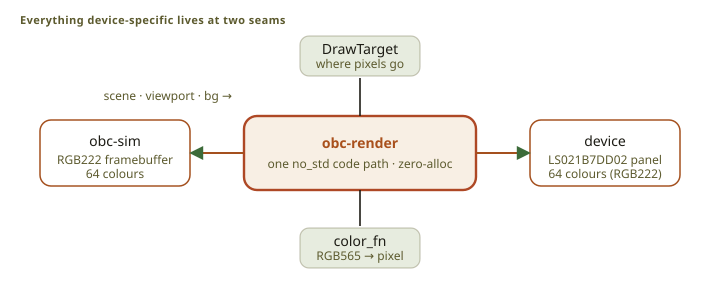
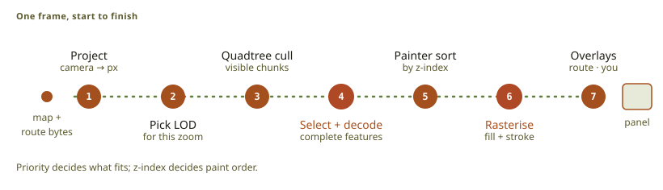
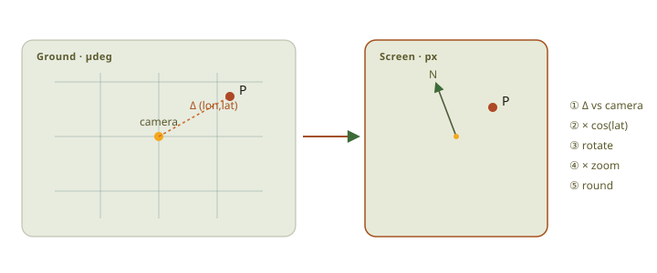
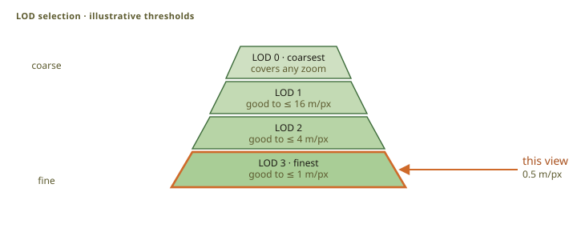
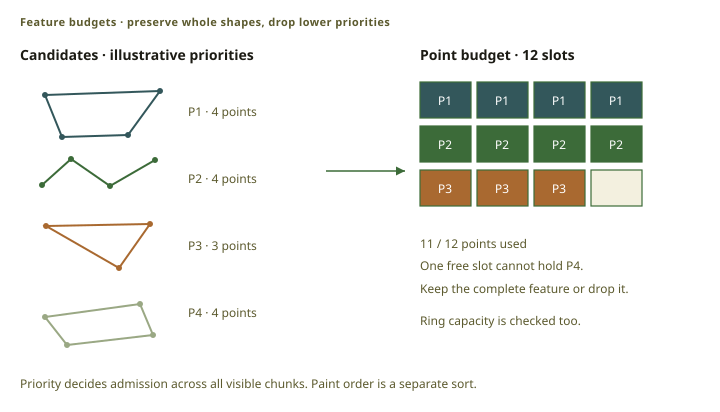
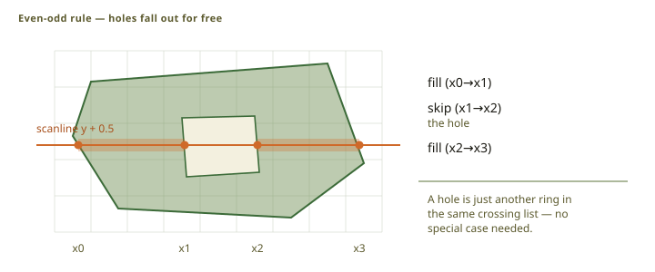
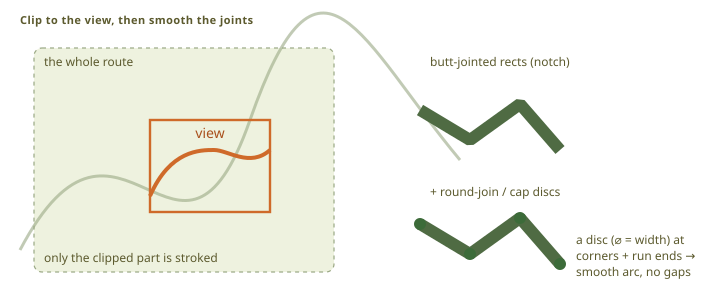
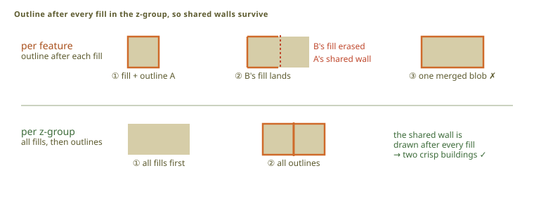
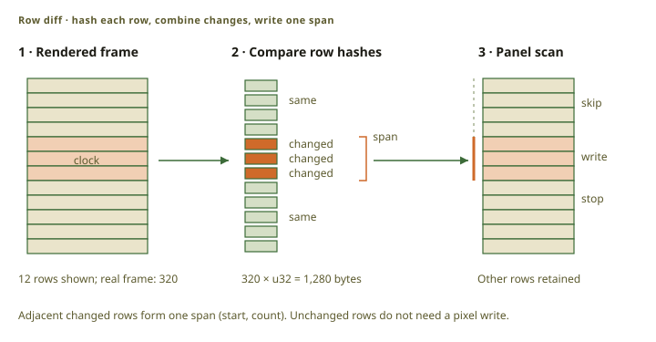

# The rendering pipeline

The renderer turns streamed map data into one 240 × 320 frame. It uses fixed buffers and allocates
no memory, so a dense city cannot cost more memory than open country.

## Shared render path

[`obc-render`](src:firmware/obc-render) is a `no_std` crate. The device, the simulator, and the
browser draw with the same geometry code, so a frame on a desktop is the frame the panel shows.

<figure class="fig">

Scroll horizontally to see the full diagram.

<figcaption>The renderer receives a map scene, a pixel target, and a color conversion function.</figcaption>
</figure>

A render call receives the map scene, the viewport, the presentation options, a draw target, a
color function, and the scratch buffers. The
[reader adapter](src:firmware/obc-reader/src/scene.rs) streams map chunks through the scene
interface, which exposes no file offsets and no cache slots, so the renderer does not know what
storage it draws from.

## Frame stages

<figure class="fig">

Scroll horizontally to see the full diagram.

<figcaption>A frame selects visible data, draws it in z-order, and adds overlays.</figcaption>
</figure>

Each stage narrows the work: the selection stages decide what is drawn, and only what survives them
is decoded, projected, and rasterized.

## Projection

<figure class="fig">

Scroll horizontally to see the full diagram.

<figcaption>Projection keeps the camera delta precise. It then corrects longitude, rotates, scales, and rounds.</figcaption>
</figure>

[`Viewport`](src:firmware/obc-render/src/viewport.rs) keeps the camera position, zoom, latitude
correction, and rotation. The transform holds the offset from the camera as an integer before it
converts to floating point, so precision does not fall away far from the origin.

## Level of detail

<figure class="fig">

Scroll horizontally to see the full diagram.

<figcaption>The renderer selects the finest LOD that supports the current meters-per-pixel value.</figcaption>
</figure>

The renderer selects the finest level whose stated scale still supports the current
meters-per-pixel value. The selection uses zoom and latitude only, never the panel size, so the
same geographic view selects the same level on every host.

## Visible chunks

<figure class="fig">

Scroll horizontally to see the full diagram.

<figcaption>The quadtree walk prunes nodes outside the viewport. It streams candidates from intersecting leaves.</figcaption>
</figure>

The reader walks the quadtree and descends only into nodes that meet the viewport. It limits the
depth and refuses a backward child reference, because a damaged map must not be able to make the
device loop. It does not limit how many chunks it returns: the next stage owns the budget.

## Feature selection

A dense view holds more geometry than the frame buffers. Each style carries a retention priority,
and a higher-priority feature can displace a lower-priority one across the whole view. Priority
decides what survives; paint order decides what covers what.

<figure class="fig">

Scroll horizontally to see the full diagram.

<figcaption>Pass A stores candidate metadata and an opaque token. Pass B decodes selected candidates.</figcaption>
</figure>

Selection runs in two passes. The first stores only the style, bounds, size, and an opaque token
for each candidate; the budget is applied in memory; the second decodes only what was admitted.
Decoding is the expensive step, so nothing is decoded to be thrown away.

<figure class="fig">

Scroll horizontally to see the full diagram.

<figcaption>The point counts and capacity are illustrative. Selection compares complete candidates across all visible chunks; higher-priority candidates can displace lower-priority ones.</figcaption>
</figure>

A feature is dropped as one unit: the renderer never publishes part of a polygon. `RenderStats`
reports drops, decode failures, malformed data, cache activity, and stage time, which is how a map
that draws badly is diagnosed without a debugger.

## Paint order

Spans are sorted by paint order, and equal values keep collection order, so a frame is
deterministic.

## Polygon fill

<figure class="fig">

Scroll horizontally to see the full diagram.

<figcaption>The even-odd fill rule supports concave polygons and holes.</figcaption>
</figure>

The filler uses the even-odd scanline rule, which handles concave rings and holes with one rule and
no separate hole test.

## Line stroke

<figure class="fig">

Scroll horizontally to see the full diagram.

<figcaption>The stroker clips lines before rasterization. It removes subpixel duplicate points.</figcaption>
</figure>

One-pixel lines go through Embedded Graphics. A wider segment becomes a convex quadrilateral filled
as spans, and discs close the ends and sharp joints. Line width follows zoom, except for styles
fixed at one pixel, such as contours.

A dashed line measures its pattern along the screen arc from the first point of the line, including
the part the view clip removed, so the dashes stay at the same place on the map while the camera
moves.

### Road casing

<figure class="fig">

Scroll horizontally to see the full diagram.

<figcaption>The casing pass starts at the road z-band. Road fills then cover casing inside intersections.</figcaption>
</figure>

A casing is the darker outline of a road. The renderer draws every casing at the start of the road
paint band and then every road fill, so a casing stays above the land fill and no casing line
crosses an intersection.

### Polygon outlines

<figure class="fig">

Scroll horizontally to see the full diagram.

<figcaption>The renderer fills every polygon in a z-group before it draws the outlines.</figcaption>
</figure>

For the same reason, the renderer fills every polygon of a paint group before it outlines them,
which keeps one shared wall between two adjacent buildings.

## Map overlays

After the base map come the active route and its chevrons, the breadcrumb trail, the waypoints and
the rider marker, and the status indicators, through the same stroker and filler as the map.

## Frame storage and presentation

<figure class="fig">

Scroll horizontally to see the full diagram.

<figcaption>The presenter stores one u32 hash for each of the 320 panel rows. It combines adjacent changes into spans and sends only those rows to the panel.</figcaption>
</figure>

The device holds one frame byte per pixel in the panel's own 64-color gamut. The presenter hashes
each panel row, joins the changed rows into spans, and sends only those. A partial update is what
makes the panel cheap: an unchanged row costs no transfer and no scan time. The simulator
implements the same display contracts, so its output is the same frame.

A transient overlay, such as hold feedback, is not stored in the clean base frame. The presenter
reads the base window, composites the overlay, and sends the result, so clearing the overlay needs
no map render.

## Landmark and peak photos

A photo in an article is decoded into the same resident frame as the map, in bounded steps. There
is no image buffer and no resident decoder: each step writes more pixels into the frame and
releases the shared work area before it presents, so a photo never delays a gesture. An interrupted
photo starts again; an unreadable one leaves the text and credits available.

## Source map

- Renderer and scratch budgets: [`lib.rs`](src:firmware/obc-render/src/lib.rs)
- Projection: [`viewport.rs`](src:firmware/obc-render/src/viewport.rs)
- Collection and selection: [`collect.rs`](src:firmware/obc-render/src/collect.rs)
- Polygon and line rasterization: [`fill.rs`](src:firmware/obc-render/src/fill.rs), [`stroke.rs`](src:firmware/obc-render/src/stroke.rs)
- Streamed map contract: [`obc-map-scene`](src:firmware/obc-map-scene/src/lib.rs)
- OBCM adapter and quadtree walk: [`scene.rs`](src:firmware/obc-reader/src/scene.rs)
- Frame and presenters: [display contracts](src:firmware/obc-display/src/display_contracts), [LS021](src:firmware/obc-display/src/ls021)

See [system architecture](../architecture/) for the host loop and [data formats](../formats/) for
the map format.
