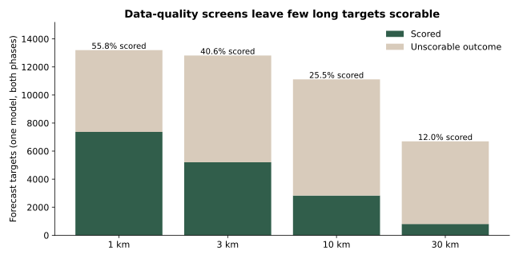
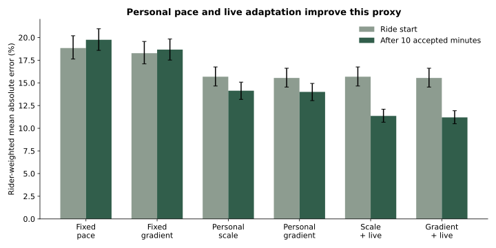
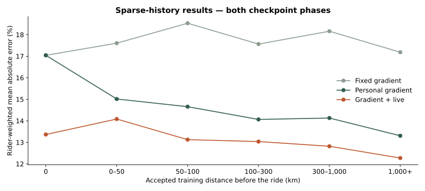
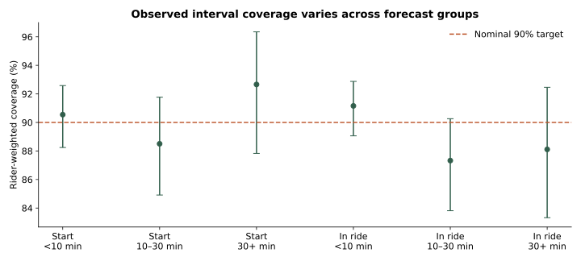
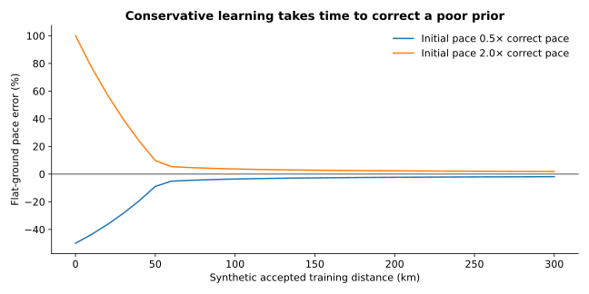

# Ride-time estimation: first FitRec evaluation

**Status: experimental.** This report evaluates the reviewed Python prototype on held-out riders. It measures **movement-screened elapsed interval time**, not verified moving time. Short stops can remain inside a recorded interval.

## Findings

- At in-ride checkpoints, **Gradient + live** has **11.19% rider-weighted mean absolute percentage error**, versus 18.67% for fixed gradient estimates. Median forecast error is 8.12%; the 90th percentile is 23.54%.
- The nominal 90% range covers **90.27%** of outcomes after giving each rider equal weight (95% rider-bootstrap interval: 88.26–91.94%).
- **Mountain-bike range coverage is only 74.17%** across both checkpoint phases (1,313 targets from 51 riders). Aggregate coverage hides this important failure.
- The simpler **Scale + live** model reaches 11.35% error. The extra personal gradient terms improve the mean by only **0.16 percentage points** (95% interval 0.10–0.24).
- Only **16,215 of 43,825 available targets (37.0%)** can be scored under the primary recording-quality rule. This selected cohort does not establish all-day ETA, pushing, or two-hour water-gap accuracy.

**Assessment:** personal pace learning and live adjustment merit further work. The extra gradient learner has a small incremental benefit in this experiment. The prediction ranges are not ready for device use: mountain-bike coverage falls well below the stated level. Dense original rides and reliable route attributes are needed to establish performance on the intended bikepacking use cases.

## 1. Review and implementation

An independent adversarial reviewer and the primary agent agreed the algorithm was ready for an experimental prototype. The review verified the centered summaries, quadratic ride-offset elimination and bounded coordinate update. It found three issues that were corrected before the final test:

1. Per-ride coefficient movement now scales with accepted evidence: `Delta = s_ride * delta`. Tiny rides cannot each unlock a full step toward old evidence.
2. Overlapping recordings are excluded. A complete earlier-starting ride cannot teach the model about a later record's future.
3. Nonfinite objective values explicitly reject a numerical update.

The reviewer confirmed those implementation corrections. No test-set outcome was used to choose settings. The current multiplier applies to the entire remaining route, without forecast decay.

## 2. Dataset and experiment boundaries

[FitRec / Endomondo](https://cseweb.ucsd.edu/~jmcauley/datasets/fitrec.html) was selected because it provides repeated cycling histories with rider identifiers, positions, timestamps and altitude. SimRa does not supply persistent rider identifiers; GeoLife has a more limited cycling-labelled subset. FitRec therefore best fits this first longitudinal experiment.

| Stage | Riders | Records |
| --- | --- | --- |
| Raw cycling candidates | 860 | 121956 |
| Structurally usable cycling records | 860 | 121776 |
| Development: initial-curve fitting | 498 | 18929 |
| Separate interval calibration | 177 | 6491 |
| Held-out replay | 185 | 7114 |

The raw file contains 253,020 workouts across all sports. The cycling extraction rejects 180 records with unusable array lengths. 103,865 usable cycling records contain exactly 500 points. Across stored cycling intervals, rounded timestamp spacing has median 9 seconds and 95th percentile 33 seconds.

Each rider is assigned to development, calibration or test by a fixed SHA-256 rule. Only the first 60 candidate rides per rider are considered, in chronological order; overlap exclusions do not refill that quota. The test cohort excludes 311 overlapping records. These are disjoint rider sets, not random GPS-point splits.

The real-data model uses **one pooled cycling context plus gradient**. Some activities are labelled mountain bike, but generic bike labels do not establish road, gravel or touring categories. There are no surface labels or map matching in this replay. Bike/surface transfer is tested only on synthetic data.

### Timing and route assumptions

A scored target requires every intervening interval to have positive spacing at most 30 seconds, GPS displacement at least 3 metres, interval-average GPS speed from 1 to 80 km/h, and a finite usable elevation profile. These are dataset screens, not a validated firmware motion classifier. They exclude slow pushing and some genuine difficult terrain. A short stop inside an accepted interval remains possible.

Distance is the sum of GPS chords. Gradient is a trailing spatial secant over approximately 200 metres of recorded altitude. Features clamp to the outer ±20% anchors; profile slopes above ±50% fail the data screen. The recorded geometry and altitude serve as a known-route proxy. Real planned-route and map-elevation errors are absent from this experiment.

Forecasts are issued at ride start and the first boundary after 10 accepted minutes. Targets are the next recorded route point at least 1, 3, 10 or 30 km ahead, chosen before outcomes are inspected. Targets beyond the recorded route are not offered. An intervening invalid interval makes the outcome unscorable; separated windows are never joined. Baseline evidence is committed only at the original ride boundary.



| Target | Offered | Scored | Scored fraction |
| --- | --- | --- | --- |
| 1 km | 13,199 | 7,369 | 55.8% |
| 3 km | 12,816 | 5,207 | 40.6% |
| 10 km | 11,115 | 2,835 | 25.5% |
| 30 km | 6,695 | 804 | 12.0% |

Number of scored targets with at least two hours of observed elapsed time: **1**. This count describes selected completed targets; it does not establish coverage of two-hour gaps in general.

## 3. Accuracy on held-out riders

The main metric is **rider-weighted mean absolute percentage error**: first average absolute relative errors within each rider, then average riders equally. This prevents prolific recorders from dominating. Median and 90th-percentile errors, and mean absolute minutes, pool individual forecasts. A 10% error on a 30-minute target corresponds to 3 minutes.

All models see the same issued targets and outcome screen. Fixed pace and the fixed gradient curve come from development riders. Personal scale learns one correction to that curve. Personal gradient also learns gradient-anchor corrections. The two live variants apply their current multiplier to the whole forecast.



### After 10 accepted minutes

| Model | Rider-weighted error | Median error | 90th-percentile error | Mean absolute minutes |
| --- | --- | --- | --- | --- |
| Fixed pace | 19.75% | 15.80% | 38.55% | 1.83 |
| Fixed gradient | 18.67% | 15.28% | 36.27% | 1.81 |
| Personal scale | 14.14% | 10.25% | 28.41% | 1.22 |
| Personal gradient | 14.00% | 10.10% | 27.91% | 1.21 |
| Scale + live | 11.35% | 8.31% | 23.96% | 1.07 |
| Gradient + live | 11.19% | 8.12% | 23.54% | 1.05 |

This phase contains 9,660 scored targets from 172 riders. The paired improvement over fixed gradient estimates is 7.47 percentage points, with a 95% rider-bootstrap interval of 6.27–8.74. Bootstrap resampling keeps each rider's records together (2,000 resamples, fixed seed). These intervals describe uncertainty across sampled riders, not a per-route guarantee.

The rider-weighted signed relative error is **+6.64%**. Positive values mean the model overestimates duration on average; the point estimates retain a directional bias.

### At ride start

| Model | Rider-weighted error | Median error | 90th-percentile error |
| --- | --- | --- | --- |
| Fixed pace | 18.84% | 14.12% | 34.80% |
| Fixed gradient | 18.27% | 13.53% | 33.80% |
| Personal scale | 15.68% | 12.07% | 30.08% |
| Personal gradient | 15.54% | 11.94% | 29.74% |

Live multipliers start at one, so their ride-start estimates equal the corresponding personal baseline. Start and in-ride rows have different eligible targets; compare models within a phase rather than treating the phase difference as a controlled experiment.

## 4. Sparse personal histories



| Prior accepted km | Riders | Targets | Fixed gradient | Personal gradient | Gradient + live |
| --- | --- | --- | --- | --- | --- |
| 0 | 119 | 356 | 17.04% | 17.04% | 13.37% |
| >0–50 | 139 | 643 | 17.61% | 15.01% | 14.08% |
| 50–100 | 129 | 715 | 18.53% | 14.66% | 13.13% |
| 100–300 | 150 | 2424 | 17.56% | 14.06% | 13.04% |
| 300–1,000 | 135 | 6597 | 18.16% | 14.13% | 12.82% |
| 1,000+ | 88 | 5480 | 17.19% | 13.31% | 12.27% |

Both checkpoint phases are included. Distance counts accepted baseline-learning observations, not annual riding distance. Rider and route composition changes across bins. The chart is a diagnostic comparison, not proof of a causal learning curve for every rider.

## 5. Prediction ranges

Reference error distributions come from separate calibration riders. Each personal buffer retains 32 errors per group; the reference distribution has weight 32. The six groups combine ride phase with predicted duration below 10, 10–30, or at least 30 minutes. One calibration slot per group is reserved prospectively, in ascending target-distance order. A censored slot is not replaced with a later successful target.

This is an empirical mixture, not a conformal coverage guarantee. Full valid errors remain in calibration; the baseline learner's clipping does not erase tail errors.



| Forecast group | Targets | Riders | Coverage | Above upper bound | Median range width |
| --- | --- | --- | --- | --- | --- |
| Start / <10 min | 4963 | 168 | 90.55% | 5.60% | 2.24 min |
| Start / 10–30 min | 1163 | 140 | 88.50% | 7.61% | 9.40 min |
| Start / 30+ min | 429 | 95 | 92.66% | 2.54% | 24.98 min |
| In ride / <10 min | 7246 | 172 | 91.16% | 4.44% | 1.35 min |
| In ride / 10–30 min | 1823 | 156 | 87.33% | 5.97% | 6.93 min |
| In ride / 30+ min | 591 | 112 | 88.11% | 6.52% | 19.93 min |

Coverage and upper exceedance give each rider equal weight. Width pools forecasts. Good aggregate coverage does not establish coverage for a particular unfamiliar surface, rider or water source.

### Activity-label subgroups

| Recorded sport | Riders | Targets | Rider-weighted error | Coverage |
| --- | --- | --- | --- | --- |
| bike | 162 | 14181 | 12.65% | 91.12% |
| bike (transport) | 41 | 721 | 14.79% | 87.84% |
| mountain bike | 51 | 1313 | 17.44% | 74.17% |

These rows use Gradient + live at both phases. Activity labels are subgroup descriptions, not reliable bike/surface inputs to this reduced model. Mountain-bike coverage is a failure of the current range method on this selected subgroup. The pooled model and missing terrain attributes are possible contributors, but this experiment does not identify the cause. These held-out results must not be used to tune a replacement and then claim a new independent test on the same riders.

## 6. Stricter sampling sensitivity

| Maximum spacing | Scored targets, both phases | In-ride error | In-ride coverage |
| --- | --- | --- | --- |
| 30 seconds | 16215 | 11.19% | 90.27% |
| 15 seconds | 6391 | 11.76% | 89.33% |

The 15-second screen was specified before the final test. It uses the same configuration and 30-second calibration reference. It changes the selected cohort, learning evidence, and some in-ride checkpoint positions. It is a robustness check, not a paired comparison of identical routes or a separately calibrated 15-second estimator.

## 7. Synthetic robustness and numerical checks

Synthetic cases test expected behaviour under controlled inputs. They do not establish real-world accuracy.



| Case | Observed result |
| --- | --- |
| One 50% slower ride after 20 stable rides | Flat baseline changes 2.62% |
| Unobserved MTB + rough surface + climb combination | -16.74% pace error after 100 synthetic training rides |
| Float32 versus float64, 120 development rides | Maximum grid pace difference 0.000010% |
| Eight sweeps versus independent bounded least-squares solver | Maximum grid pace difference 0.000012% |
| Reference solver failures | 0 |
| Rejected baseline updates in primary held-out replay | 0 |

The cold-prior curves expose a real tradeoff: clipping and conservative updates delay correction of a poor default. The synthetic transfer case also includes regularization bias. The converged reference uses an independent bounded least-squares solve of the same quadratic; it does not revisit historical clipping.

## 8. Compute and memory

| Configuration | Learner arrays | Interval arrays + live scalars | Subtotal |
| --- | --- | --- | --- |
| 9 coefficients | 512 B | 848 B | 1,360 B |
| 16 coefficients | 1,352 B | 848 B | 2,200 B |

Nine coefficients are used in the FitRec gradient-only replay. Sixteen represent the illustrative four-bike, five-surface, nine-anchor model. These are actual NumPy array payload sizes, plus the two live scalars. They exclude Python objects, pending forecasts, input preprocessing, route storage and temporary arrays. Reference distributions are fixed data suitable for flash.

On this host, the median nine-coefficient finish step was 0.695 ms and the 99th percentile was 0.753 ms. The primary six-model replay took 128.9 seconds for 7,114 rides. Some measurements ran alongside another replay. These are host measurements, not nRF54 estimates.

Python tracing of learner construction and updates peaked at 7,304 B for 16 coefficients, and 10,560 B including finalization. This trace covers the learner, not the complete Python process or the interval component. The replay caches input route arrays on the host. Only the learner state is intended to remain fixed-size on the device.

## 9. What remains before device integration

- Validate actual moving time, stops and pushing on dense original recordings.
- Add reliable surface association and bike labels before judging full-model transfer.
- Validate long forecasts on data that can actually score them.
- Compare the small gain from personal gradient corrections with their implementation cost on new development data.
- Address the mountain-bike coverage failure and establish an uncertainty policy for unsupported terrain and combinations.
- Benchmark the Rust kernel and complete working memory on the nRF54LM20.

## 10. Reproduction and provenance

The [prototype README](src:host/ride-time-prototype/README.md) gives the complete commands. The aggregate result and frozen configuration are stored with the prototype. Downloaded records and per-forecast CSV files remain in local caches; this report includes no GPS tracks or rider identifiers.

Source citation: Jianmo Ni, Larry Muhlstein and Julian McAuley, *Modeling heart rate and activity data for personalized fitness recommendation*, WWW 2019. [Dataset and published terms](https://cseweb.ucsd.edu/~jmcauley/datasets/fitrec.html).

Raw archive: 1,995,378,519 bytes. SHA-256:

```text
31a49f8ec2fa5d038983e7b3bfe35f5f7eabee581180c803023f011f046681b9
```

Configuration, reference-distribution and estimator-source hashes were frozen before held-out evaluation. The report checks that they still match. The result remains an initial experiment, not a production accuracy claim.
