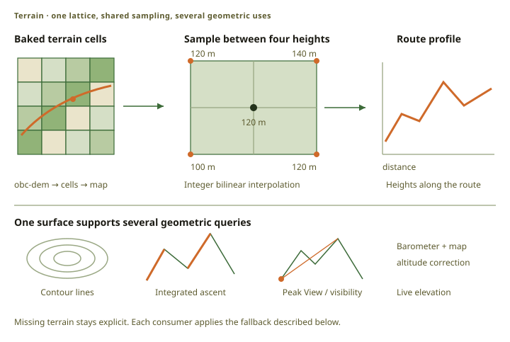

# Terrain and elevation

One terrain raster serves every elevation function: the contours on the map, the climb on a route,
the ascent a router weighs, the altimeter, and Peak View. The source is
[Copernicus DEM GLO-30](https://dataspace.copernicus.eu/explore-data/data-collections/copernicus-contributing-missions/collections-description/COP-DEM),
and [`obc-dem`](src:host/obc-dem) converts it to the OBCT format.

## Data flow

<figure class="fig">

Scroll horizontally to see the full diagram.

<figcaption>The center-sample example uses equal weights. The packer and device share elevation rules; Peak View additionally uses the baked surface index.</figcaption>
</figure>

Terrain cells are baked and revised separately from map cells, and the assembler copies the
selected cells into the terrain region of the map. A map schema change therefore does not force a
new terrain bake.

## One sampling truth

The packer and the device use the same `no_std` sampler,
[`obc-elevation`](src:firmware/obc-elevation). This matters more than it sounds: the packer bakes
the ascent the router weighs, and the device measures the climb the rider sees. If the two sampled
differently, a route would promise one climb and report another.

[OBCT section 5](src:specs/OBCT_Spec.md) specifies the integer interpolation exactly, so an
independent implementation returns the same whole-meter height. Cells own their seam samples, so a
position on a cell boundary has one answer.

Only `obc-dem` decodes the source DEM. The packer never touches GeoTIFF data.

### Missing height is not zero

The sampler returns nothing when terrain is unavailable or a required corner has no data, and no
consumer may read that as zero, because zero meters is a valid height at the coast.

An unknown sample pauses ascent integration and the next valid run starts a new reference, so a
gap in coverage contributes no climb instead of a false one. A route records which of its segments
had complete coverage, and a profile leaves the gaps empty.

| Function | Behavior without terrain |
| :-- | :-- |
| Map rendering | Continues. Baked contours do not need the raster. |
| Routing | Continues, on the graph's baked ascent. |
| Imported route | Keeps the heights the source supplied. |
| Device-planned route | Heights stay unknown, and the route records incomplete coverage. |
| Ride recording | Stores the barometer measurement. |
| Current elevation | Uses the raw barometric estimate. |
| Time estimate | Treats the remaining ascent as zero. |

### Navigation coupling

The ascent stored on each navigation edge belongs to a terrain revision, and the catalog records
which revision the network was baked from. The bake refuses a network whose terrain revision does
not match, because routing costs and route profiles must describe one surface.

## Crest lifts

A 30 m grid cannot hold a rock tower. At Engelberg the Copernicus surface runs about a hundred
meters below the summit of the Hahnen, and a panorama drawn from it loses the shape that makes the
mountain recognisable.

The bakery corrects this with a **crest lift**. Where a finer national elevation model says the
ground inside a sample's own cell stands well above our surface, and the ground there is convex,
the baker raises that sample. The convexity test is what keeps a steep flat face and a mountain
pass unchanged: only a crest moves.

The sample rises by the gap between the two models, not to the highest ground in its cell. On a
slope most of that height is the cell's own fall, and lifting by it would raise the ground all
around a summit. The highest measured ground stays the ceiling, so a lift never invents height.

Copernicus stays the base model, and a national model can only lift: it measures bare ground, so it
sits below Copernicus over every forest and town. Coverage may stop at any sample, so a model that
ends at a border is not a problem, and a cell with no finer coverage is identical to a cell baked
without one.

The lift goes into the baked sample, so the contours, the ascent, the route profile, the altimeter,
and Peak View all keep reading one surface. A change of finer model is therefore a new terrain
revision, which also re-bakes the navigation graph. Only the cells the changed source reaches are
baked again.

Each finer model keeps its own attribution, and it must travel with the map. See
[Attribution](#attribution).

## Peak View

Peak View draws the horizon around the rider and names the summits on it. It uses the loaded map
and the current position: the named summits come from the map's own summit category, and their
visibility is tested against the terrain.

The bakery writes a surface index for this one purpose. Coarse height levels and conservative
height bounds let the renderer skip terrain that cannot be visible and draw large smooth areas
without visiting every sample. There are no stored viewpoints and no stored images: the panorama is
computed where the rider stands.

A visibility test uses the greater of the summit's recorded height and the sampled surface, so a
narrow peak is not rejected because the grid samples below its top. The four lattice corners under
the rider are clamped to the rider's own height, so the ground the rider stands on never blocks the
view.

Candidates are ranked by their angle above the horizon, and one place is reserved per sector for
the tallest summit there, so a single high massif cannot take every label.

The view is 60° wide and starts below the horizon. A summit above the window opens the frame
upward and widens it by the same ratio, because the horizontal and vertical scales must stay equal
or the drawn shape of a mountain is wrong. Lighting has a fixed world direction, so turning changes
neither the scale nor the shading.

Opening Peak View needs a recent fix, and it asks for one even when no ride is recording. The
renderer prepares the current view first and fills the rest of the circle in the background, and a
hatch shows what is not drawn yet. Turning toward an unfinished view gives it priority.

**Live** follows the compass. **Select** enters **Browse** on the most prominent visible peak, and
further steps walk the visible peaks, turning the view only when there is no next peak. Where the
map carries content for a summit, a mark appears. Content is text, a photo, or both: Select opens
the text pages and the photo, and a summit with a photo and no text opens on the photo. The photo
has to help the rider recognise the mountain, so the bakery prefers a picture taken at a distance
and puts a picture taken on the summit last.
**Down + Back** opens the sources, because credits must travel with the content. An article is
linked by the summit's OSM identity alone: a name and a coordinate cannot prove that an article
describes that summit.

Peak articles are reached only through Peak View. Other places are in Ride Assistant landmarks.

## Terrain in the map

The assembler verifies each selected cell against the catalog, copies the cells into one container,
and puts that container in the map's terrain region. The device reads terrain from there and from
nowhere else.

`obc-pack --terrain` is a different operation: it samples terrain input to trace
[contours](../packer-routing/#contours-traced-from-the-terrain) and to integrate
[edge ascent](../packer-routing/#weighting-the-climb). It does not copy that input into its output
map.

The posting and the cell size are header fields, so changing them is a re-bake and not a format
version. See the [OBCT specification](src:specs/OBCT_Spec.md) for the limits and the byte layout,
and [OBCC section 13](src:specs/OBCC_Spec.md) for the catalog contract.

## Attribution

The data requires an exact attribution. The text is stored once, as the `copernicus-glo-30`
entry of the [source registry](src:data/sources.toml), and the bakery copies it into the catalog
terrain block, so every consumer reads it from the catalog and none of them hard-codes it. The
device About page is the one exception: it shows the text pre-wrapped, and a test compares it with
the registry. A map with terrain-derived contours needs the attribution too.

A map with [crest lifts](#crest-lifts) also carries the attribution of each finer model it used.
The catalog lists those models with their required credit and license, copied from the reference
archive that holds the wording. A consumer that shows one shows all of them. The map builder shows
them on the map summary card.

Map data carries the OpenStreetMap credit of the same registry.

## Implementation

- OBCT contract: [`OBCT_Spec.md`](src:specs/OBCT_Spec.md)
- Reader and sampler: [`obc-elevation`](src:firmware/obc-elevation)
- DEM converter: [`obc-dem`](src:host/obc-dem)
- Terrain publisher: [`terrain.rs`](src:host/obc-bake/src/terrain.rs)
- Map assembly: [`terrain.rs`](src:host/obcm-assemble/src/terrain.rs)
- Edge ascent: [`nav.rs`](src:host/obc-network/src/nav.rs)
- Altimeter fusion: [`altitude.rs`](src:firmware/obc-app/src/altitude.rs)
