# The UI system

The UI is a `no_std`, allocation-free system for a 240 × 320 display and four buttons. It draws
immediately: there is no retained widget tree, and a screen writes the frame it wants.

The screen drawings below are schematics. They explain behavior. They are not pixel captures.

## Screen model

Each `Screen` variant owns its state by value. One table generates the enum, dispatch,
and capabilities. Shared behavior reads those capabilities rather than matching variants:

| Capability | What it decides |
| --- | --- |
| `kind` | `Base`, `Overlay` or `Settings`. The overlay and settings behaviors hang off it. |
| `base` | `Map`, `LiveRiding` or `Chrome`. It gates map reads, live-data repaint, and the Bluetooth indicator. |
| `reader` | When the screen needs the streamed map at draw: never, always, or for articles, a photo, or POI data. |
| `render_key` | Which set of facts a repaint of this screen depends on. |
| `recess` | A drawer draws this screen again one shade down, instead of leaving it standing. |
| `idle_exempt` | The idle-return timeout must never take this screen away. |
| `ride_view` | A deliberate ride view: the idle timeout leaves it while a ride is tracked. |
| `browse_exempt` | A deliberate browse view: the idle timeout does not return it to Home when no ride is tracked. |
| `blocks_chords` | While it is on top, the device-wide drawer chords are refused. |
| `blocks_escape` | While it is on top, the global Back-hold escape does not leave it. |

<figure class="fig">


Scroll horizontally to see the full diagram.

<figcaption>Each screen owns typed state. The <code>Screen</code> enum provides static dispatch without heap allocation.</figcaption>
</figure>

A screen handles one gesture, returns a transition, and draws the current frame.

<figure class="fig">


Scroll horizontally to see the full diagram.

<figcaption>Input handling uses mutable <code>Ctx</code>. Drawing uses read-only <code>Render</code> data and borrowed render resources.</figcaption>
</figure>

Input can change state; drawing receives read-only state and borrowed resources.
The [`screen` module](src:firmware/obc-app/src/screen/mod.rs) owns the interfaces
and dispatch. Host drawing generics stop at that boundary.

## Navigation

The screen stack holds at most ten screens, and Home is always the first.

<figure class="fig">

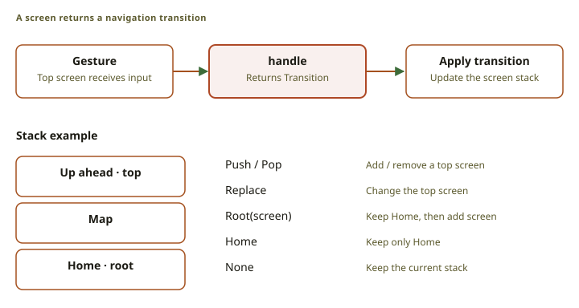

Scroll horizontally to see the full diagram.

<figcaption>A screen returns a transition, and <code>screen::apply</code> runs it. Cards land on
the stack without it.</figcaption>
</figure>

| Transition | Stack operation |
| --- | --- |
| `None` | Keep the stack. |
| `Push(screen)` | Add a top screen. |
| `Pop` | Remove the top screen, except Home. |
| `Replace(screen)` | Replace the top screen. |
| `OverRoot(screen)` | Keep Home and the view under it, and add one screen. |
| `Root(screen)` | Keep Home and add one screen. |
| `Home` | Remove all screens above Home. |

Stack changes cancel incomplete holds. Each screen defines Back: leave an editor,
cancel work, change riding view, or pop.

## Input

<figure class="fig">


Scroll horizontally to see the full diagram.

<figcaption>The recognizer combines button state and elapsed time. A chord consumes both presses and does not also emit their individual gestures.</figcaption>
</figure>

| Gesture | Source |
| --- | --- |
| `Step(n)` | Up or Down step |
| `Press` | Select release within 200 ms |
| `Hold` | Select held for 500 ms |
| `Back` | Back release within 200 ms |
| `BackHold` | Back held for 500 ms |

Release between the tap and hold thresholds cancels the hold. A hold fires at its
threshold, so the rider feels when it commits.

The application handles `BackHold` above the stack. It closes the drawer and opens
or reuses the main menu. First-use setup, blocking cards, the recovered-ride card,
and confirmed shutdown refuse it until the rider finishes them.

### Chords

Buttons pressed within 100 ms form a chord. It consumes both individual gestures
and stays latched until both buttons are released.

| Chord | Meaning |
| --- | --- |
| Up + Select, released before 500 ms | Open or close the universal quick drawer |
| Up + Select, held for 500 ms | Open Ride Assistant |
| Down + Back | Open or close the current screen's contextual drawer |
| Up + Down | Reserved |
| Select + Back | Reserved |

Reserved chords consume both presses. The first Up or Down step waits for the chord
window; an earlier release steps immediately to keep taps responsive.

## Drawers

Drawers are sheets over the current screen. Opening one replaces the other.

The **universal quick drawer** descends with brightness, Bluetooth, settings, and
power. Brightness appears only on platforms with a controllable backlight.

The **contextual drawer** rises with the screen's secondary actions. A shared drawer
handles input and drawing from a static row table. Without a table, no sheet opens.

Riding views list Up ahead, Detour, POIs, and Routes in that order. Unavailable rows
are recessed and inactive. An action replaces the sheet; Back returns to the riding view.

A **value** row opens an editor with a notch per choice and a committed-value tick.
Bike type has four choices. A **switch** row flips in place.

Screen-specific settings belong in that screen's drawer. A build check rejects
duplicate settings bindings, except brightness, Bluetooth, and bike type.

The screen under a drawer is frozen. Only the drawer's facts trigger repaint.
Menus dim to separate the sheet from its base. Maps remain undimmed to avoid
an expensive redraw.

An incoming card closes the drawer. Dismissing it returns to the underlying screen.

### What the map drawer controls

Map display holds switches for the clock, the scale bar, and the contour layer, and a Map icons
menu with switches for peaks, landmarks, and the service categories. Icons stay upright at their
source coordinates as the map rotates, and a group appears only at scales where its icons help
instead of crowd. Placement takes the nearest unobstructed icon from each enabled group in turn, so
one dense category cannot take the screen from the others.

Settlement names have no switch. Each class appears within a scale band, when the
place roughly fits the screen. Names disappear when too small or large to help,
and avoid each other and visible chrome.

### Detour

Detour leaves the route and comes back to it. It needs a routing graph in the map and a matched
position on the route.

<figure class="fig">

Scroll horizontally to see the full diagram.

<figcaption>The rider selects a rejoin point, reviews the result, and commits the new route.</figcaption>
</figure>

Up and Down move the rejoin point ahead. Review compares distance and climb with
the replaced stretch. Committing preserves completed geometry and inserts the detour.

## Hold to confirm

<figure class="fig">

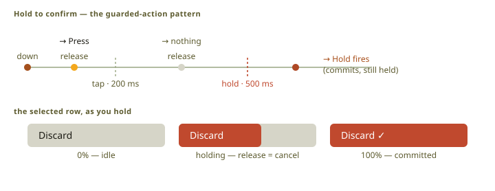

Scroll horizontally to see the full diagram.

<figcaption>A guarded action runs only when the hold reaches its threshold. The live fill shows hold progress.</figcaption>
</figure>

A destructive action requires a hold, and the row draws its progress. The action runs only when the
hold reaches its threshold.

<figure class="fig">

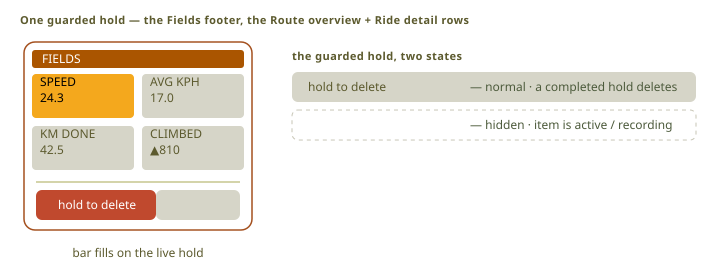

Scroll horizontally to see the full diagram.

<figcaption>Delete actions use the same guarded-row contract. A hold on another row has no effect.</figcaption>
</figure>

Delete lives on one row. A hold anywhere else deletes nothing.

## Ride Assistant

Hold **Up + Select** to open Ride Assistant over the riding view. It closes previous
pages and cancels their searches or pending detours. Back returns to the ride.
Find a place, What is next, Nearby landmarks, and Easier routes use installed offline data.

### Find a place

Find alternates nearby places with places along the next route stretch. It calculates
outward and return legs, then composes the full route when a result opens.
The drawer sets the result count; the default is four.

Places known to be closed now are hidden, which the rider can turn off for every category at once.
A place with unknown hours stays in the list and is never labelled open. Opening hours are
information: they never block a preview, and the device reports the status now, not a guess at the
status on arrival.

With a route, review compares the **visit**, return and remaining journey against
the original remainder. Without a route, the place is a direct destination.
Acceptance starts recording if needed; browsing changes nothing.

A place is routable only where the map gives it a mapped approach. A straight-line distance never
promises a rideable connection.

### What is next

The overview freezes a 5 km or 10 km window: ascent, descent, next climb, waypoint,
water, and shop. Explore ahead opens its timeline with drawer filters.
Hold to refresh; figures stay fixed while the rider reads.

### Nearby landmarks

Landmarks keeps a stable page of nearby sites. Select opens text and an available
photo. **Down + Back** opens sources, so credits travel with content.
Closed sites stay readable and visitable from outside.

### Easier routes

Easier routes runs bounded searches for less climbing, smoother surfaces, and shorter
distance under the rider's bike profile. Results must improve their goal within an
added-cost bound; discovery is not exhaustive.

The comparison camera stays fixed. Select opens a current-and-new table.
**Use this route** accepts it and keeps recording. Shorter distance does not promise
shorter time; the device has no arrival model.

## POI browser

<figure class="fig">


Scroll horizontally to see the full diagram.

<figcaption>The POI browser has seven categories. Each page holds at most eight nearby places.</figcaption>
</figure>

The POI menu lists the service categories, and a category returns pages of nearby places.

<figure class="fig">


Scroll horizontally to see the full diagram.

<figcaption>The list keeps a fixed snapshot. Only the bearing arrow uses live position data.</figcaption>
</figure>

The page and its order are fixed while the list is open, so a list does not reorder under a rider's
thumb as the position updates. Only the bearing arrow follows the live fix.

<figure class="fig">

Scroll horizontally to see the full diagram.

<figcaption>The detail screen reads opening hours once. The bearing and distance remain live.</figcaption>
</figure>

The detail screen reads the schedule once and calculates today's state from the local clock. A
definite open or closed answer needs a trusted clock and a known local offset. Anything else is
Unknown.

## Settings

Pages sit under one hub, every page a list of rows in the drawers' grammar:

| Row | Looks like | Press |
| --- | --- | --- |
| Door | label, chevron | opens a page |
| Value | label, value under it, chevron | opens the editor as a sheet over the page |
| Switch | label, slider | flips in place |
| Action | label, red when destructive | acts; a destructive one needs a hold |
| Info | label, value under it | nothing; the cursor skips it |
| Language | a pick list: flag, own name, a tick on the committed one | commits and returns |

A changed value is written when the rider leaves the Settings subtree, not once per step.

Settings do not live on the card, so they survive a card change. The UI languages are English,
German, French, and Spanish, and the build generates the translation table from four catalogs and
fails on a missing or extra key.

## Route cleanup

The device deletes nothing by itself. When a route upload fails because storage is full, it offers
cleanup: choose an age in weeks and hold to confirm. Cleanup keeps the active route, routes newer
than that age, and routes whose date is unknown, because an unknown date is not evidence that a
route is old. See [ride reconciliation](../companion-link/#reconciliation).

## Repaint policy

Rendering is on demand. A static screen with no input, data change, or timer stays idle.

### The render key

Each screen declares its drawing facts. Frame work compares them before and after,
then repaints changed regions. A new heart rate updates its grid and map effort band.
Local state, such as a selection, requests repaint directly. Extra repaint is safe;
missing repaint is a defect.

<figure class="fig">

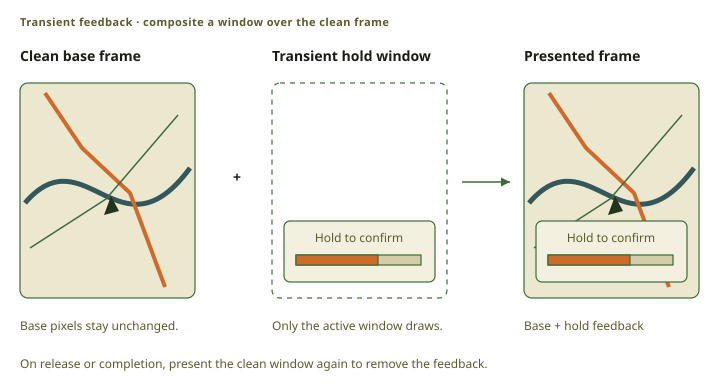

Scroll horizontally to see the full diagram.

<figcaption>This illustrates hold feedback, not a retained notification screen. Cards and drawers follow their own screen-stack and repaint rules.</figcaption>
</figure>

The overlay presenter reads the clean base frame, adds the overlay, and leaves the base frame
unchanged.

## Screens the companion pushes

The companion can open modal cards for pairing, route and trip updates, and warnings. The scheduler
gives each type a fixed priority, and a new card never replaces a hold in progress. The passkey card
cannot be dismissed before pairing ends.

## Riding data

### Climbs

<figure class="fig">

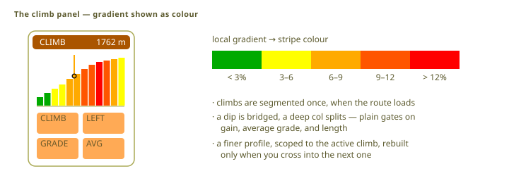

Scroll horizontally to see the full diagram.

<figcaption>The climb view shows the current climb profile and four climb values.</figcaption>
</figure>

The route processor supplies the climb segments and their profiles. Climb joins the riding views
only while a climb is active.

### Waypoints

<figure class="fig">

Scroll horizontally to see the full diagram.

<figcaption>Map, route, and statistics views use the same route-distance axis for waypoints.</figcaption>
</figure>

Waypoints come from the route file, and Navigator tracks the next one from the matched position.
The map, route, and statistics views place them on the same route-distance axis, so a waypoint is
at the same progress in all three.

### Up ahead

<figure class="fig">

Scroll horizontally to see the full diagram.

<figcaption>Nearby POIs use geographic distance. Up-ahead entries use distance along the route.</figcaption>
</figure>

Nearby POIs use the distance through the air. Up ahead uses the distance along the route, which is
the distance a rider actually has to ride.

<figure class="fig">

Scroll horizontally to see the full diagram.

<figcaption>The Up-ahead view merges two sorted sources without copying rows.</figcaption>
</figure>

Each corridor pass adds one row at its nearest point. Leaving and returning adds
another encounter; a road bend does not.

A saved cursor applies only to its list. Changing filters selects the first row
still ahead, so a previous scroll cannot skip nearer matches.

## Main rider flow

<figure class="fig">

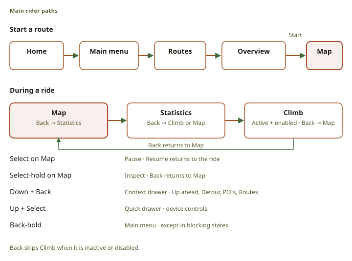

Scroll horizontally to see the full diagram.

<figcaption>Start opens Map on a clean ride stack. Back cycles the available riding views. Drawers and Inspect keep a direct return to the ride.</figcaption>
</figure>

Home opens the main menu, a route selection opens its overview, and Start opens Map on a clean ride
stack. During a ride, Back cycles the riding views, a press pauses, and Back-hold reaches the main
menu. Map Inspect is entered with a Select hold, and Back leaves Inspect before it changes views.
Idle return removes abandoned chrome: it returns to Home when there is no ride, and to Map during
one.

## Visual vocabulary

Each shared mechanism has one owner, one module per concept under `screen/vocab/`:

| Module | What it owns |
| --- | --- |
| `chrome` | The framed page header, the card glyphs, the Recalculating banner, and the shared text and stroke helpers. |
| `list` | The scrolling list: the wrapping cursor, the window math, the row cursor, the separators, and the scrollbar. |
| `rows` | The row grammar the settings pages and the drawers share (door, value, switch, action, info), the stat-ledger row, and the guarded action rows. |
| `card` | Selection, input, and drawing for the action rows of full-screen cards. |
| `tiles` | The rounded stat panes of the riding grid and the Fields editor, and the waypoint panel. |
| `band` | The elevation band: the filled silhouette, the connected top stroke, and the peak label. |
| `fmt` | One formatter per printed quantity and output style. |
| `marquee` | The one long name a frame scrolls, by whole characters. |
| `pager` | The two-page auto-flip the detail compositions share. |
| `sheet` | The drawer sheets' shared motion and marks. |
| `spinner` | The compass needle a working screen waits behind. |

Long names end in two dots. One selected name per frame can scroll: a list row,
detail title, or Peak View peak. Monospace fonts scroll by substring.
The riding waypoint tile scrolls once per name change, then rests.

<figure class="fig">

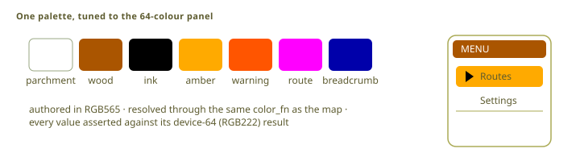

Scroll horizontally to see the full diagram.

<figcaption>All screen colors use the shared RGB565-to-RGB222 conversion.</figcaption>
</figure>

Palette constants are written once and converted to the panel's 64 colors by the framebuffer, so a
screen never picks a device color by hand.

## Adding a screen

One module and one row declare a screen. The row alone does not put it on the glass:

| Step | Where |
| --- | --- |
| The state type, `handle`, and `draw`. | a new module under [`screen/`](src:firmware/obc-app/src/screen) |
| The module declaration, the variant, and its capabilities. | [`screen/mod.rs`](src:firmware/obc-app/src/screen/mod.rs): its `mod` line and the `screens!` table |
| Every string it prints, in four languages. | the catalogs under [`i18n/`](src:firmware/obc-app/i18n) |
| The way in: a menu, drawer or settings row, a companion card, or the module that owns the work. | with that entry point, usually outside `screen/` |
| A seed, and the gestures that reach a page the first frame does not draw. | [`harness/copy_fit.rs`](src:firmware/obc-app/src/harness/copy_fit.rs) |
| A sweep frame, whose `expect` names the variant it must reach, and its digest row — one row per language for a `langs` frame. | [`ui-frames.toml`](src:firmware/ui-frames.toml), then `obc shot --accept` records the digest in [`ui-snapshots.sha256`](src:firmware/ui-snapshots.sha256) |

The acceptance test is the copy-fit gate over every reachable screen and language.

## Source map

| Subject | Source |
| --- | --- |
| Screen table, capabilities, contexts, and transitions | [`screen/mod.rs`](src:firmware/obc-app/src/screen/mod.rs) |
| Gesture recognition | [`input.rs`](src:firmware/obc-app/src/input.rs), [`input_plane.rs`](src:firmware/obc-app/src/input_plane.rs) |
| Repaint state | [`dirty.rs`](src:firmware/obc-app/src/dirty.rs), [`render_key.rs`](src:firmware/obc-app/src/render_key.rs), [`ui_runtime.rs`](src:firmware/obc-app/src/ui_runtime.rs) |
| Shared screen primitives | [`screen/vocab/`](src:firmware/obc-app/src/screen/vocab) |
| Settings and translations | [`settings.rs`](src:firmware/obc-app/src/settings.rs), [`i18n/`](src:firmware/obc-app/i18n) |
| Find a place and visits | [`find_place.rs`](src:firmware/obc-app/src/find_place.rs), [`visit.rs`](src:firmware/obc-route/src/visit.rs) |
| POI and Up-ahead views | [`poi_list.rs`](src:firmware/obc-app/src/screen/poi_list.rs), [`whats_next.rs`](src:firmware/obc-app/src/screen/whats_next.rs) |

See [system architecture](../architecture/) for the host loop and [rendering pipeline](../rendering/)
for pixel generation.
