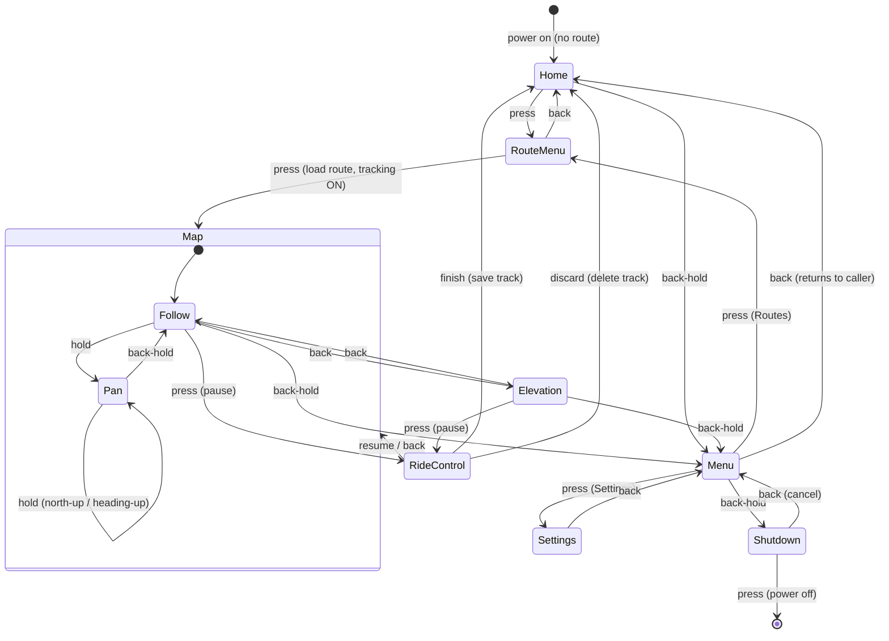

# Bikepacking Computer — UI & Control Spec (v1 draft)

A handoff spec for the firmware agent. Covers the input model, the complete
control flow, per-screen gesture bindings, ride/tracking semantics, and the
visual design language.

---

## 1. Hardware context

- **Display:** 240×320 portrait, 64-color reflective **MIP** panel. Sunlight-readable,
  holds its image without power, no backlight (front-light optional). Colors render
  matte/muted; no smooth gradients — design with flat fills, dithering for shading,
  and crisp 1px linework.
- **MCU:** Nordic nRF54L (Cortex-M33, BLE).
- **Input:** **one rotary encoder with push** + **one back button**. No touchscreen.
- **Housing:** 3D-printed; encoder + button are the only moving controls.
- **Connectivity:** companion phone app over BLE for uploading routes/tiles and
  downloading recorded tracks.

---

## 2. Input model

Five distinct gestures total:

| Gesture | Notation used below |
|---|---|
| Rotate encoder | `turn` |
| Encoder short press | `press` |
| Encoder long press | `hold` |
| Back short press | `back` |
| Back long press | `back-hold` |

Global rule: **`back-hold` toggles the Menu** from any main screen (Home, Map,
Elevation) — **except inside Pan mode, where `back-hold` exits Pan**. **`hold`
enters Pan mode** from the Map (and, once in it, toggles north-up / heading-up).

---

## 3. Operating modes & screens

The device is always in one of three modes:

- **Idle** — no route active. Shows the **Home** screen (screensaver).
- **Riding** — a route is active and tracking is running. Shows the **Map** or the elevation/data screen.
- **Paused** - shows ride control.

Screens:

1. **Home** — idle screensaver (time + battery).
2. **Route menu** — pick a route to load.
3. **Map** — live navigation, shows map route and breadcrumb, nothing else. 
4. **Pan mode** — sub-mode of Map for looking around (same as map, smal visual indicators for pan direction)
5. **Elevation** — elevation profile + ride stats.
6. **Ride control** — pause overlay: Resume / Finish / Discard.
7. **Menu** — Routes / Settings.
8. **Settings** — device settings, palceholder for now.
9. **Shutdown prompt** — power-off confirmation.

Two bridges connect the modes:
- **Idle → Riding:** loading a route (in Route menu) starts tracking and opens the Map.
- **Riding → Idle:** Finish or Discard (in Ride control) clears the active route and returns to Home.

---

## 4. Control-flow diagram

> Note: Menu and Ride control are overlays. `back` from them returns to **whichever
> screen opened them** (Home, Map, or Elevation) — the diagram draws the common
> targets; the table in §5 is authoritative.

---

## 5. Per-screen gesture reference

Authoritative bindings. `–` = unbound (no-op, reserved).

| Screen | `turn` | `press` | `hold` | `back` | `back-hold` |
|---|---|---|---|---|---|
| **Home** | – | → Route menu | – | – | → Menu |
| **Route menu** | scroll routes | load route → Map (tracking ON) | – | → caller (Home/Menu) | – |
| **Map / Follow** | zoom | pause → Ride control | enter Pan mode | → Statistics | → Menu |
| **Pan mode** | pan along axis | toggle axis (U-D ↔ L-R) | toggle N-up / heading-up | recenter on you | exit → Follow |
| **Elevation** | move cursor (altitude scrub) | pause → Ride control | enter Zoom mode | → Map | → Menu |
| **Elevation Zoom** | zoom about the cursor | pause → Ride control | exit → cursor | exit → cursor | → Menu |
| **Ride control** | choose option | select (Resume / Finish / Discard) | – | Resume (cancel) | – |
| **Menu** | scroll (Routes / Settings) | open selected | – | → caller | → Shutdown prompt |
| **Settings** | move / adjust | change / toggle | – | → Menu | – |
| **Shutdown prompt** | move (Power off / Cancel) | confirm selection | – | cancel → Menu | – |

---

## 6. Ride & tracking semantics

- **Tracking starts** the moment a route is loaded (Route menu `press`).
- **Pause** = encoder `press` on Map or Elevation. Tracking pauses **immediately**
  and Ride control opens. Movement while paused is **not recorded** → resuming
  leaves a gap in the recorded track. (This is intended behavior.)
- **Resume** — continue recording on the same track (gap preserved).
- **Finish** — close and **save** the recorded track to local storage for later
  BLE sync; clear active route → Home.
- **Discard** — **delete** the recorded track; clear active route → Home.
- **No dynamic rerouting in v1.** If the rider goes off-route, keep recording the
  breadcrumb and show a small "off route · NNN m" readout. Do not nag or reroute.

---

## 7. Visual design language

Theme: an **explorer's field map** — adventure-game palette and pixel iconography,
but clean, glanceable data. No game chrome (no health bars / XP / fantasy framing) at all.

**Where the frame appears:** menus (Menu, Route menu, Settings, Shutdown) use the
wood-and-parchment frame. Elevation uses a parchment body with the same dark HUD strip on top.

**Palette (muted for reflective MIP — tune to the panel's actual gamut):**

| Role | Hex |
|---|---|
| Land / sage | `#7C9A63` |
| Forest | `#4F6B43` |
| Water | `#33575B` |
| Trail / clay | `#B5763E` |
| Road / tan | `#D8C79C` |
| Parchment (panels) | `#EADFC0` |
| Parchment shade (tiles) | `#DFD0AB` |
| Wood frame mid | `#5B3F28` |
| Wood frame dark / HUD | `#2E251A` |
| Ink (text) | `#2C2114` |
| Accent amber/gold — active route + "you" | `#E3A52B` |
| Breadcrumb (cool, dotted) | `#6E8FA0` |
| Warning | `#C0492E` |

Or something like that, needs to work with the 64 color palette of the LS021B7DD02 MIP display.

**Typography:** bitmap/pixel fonts (sharp at low res, on-theme). Suggested free
options: `m5x7` / `m3x6` (Daniel Linssen), Pixellari, monogram; `Silkscreen` for
headers/labels and `VT323` for numbers were used in the mockups as stand-ins. Keep
numeric/glanceable data in the most legible face.

---

## 8. Screen content

- **Home:** large centered **time** + **battery**; light adventure styling. (Keep minimal for v1.)
- **Map:** use what we have right now obv, will be styled later (using stylesheets)
- **Elevation:** elevation profile with traveled-portion shading + a movable **cursor** (carries a current-elevation
  readout), a thin amber progress bar, and a 2×3 (wxh) stat grid: **Speed**, **Avg. Speed**, **done (km)**,
  **to go (km)**, **climbed (m)**, **to climb (m)**. **Cursor mode (default):** `turn` scrubs the cursor along the
  full profile to read elevation/grade anywhere; it springs back to your live position after a few seconds idle.
  `hold` enters **Zoom mode** (a small magnifying-glass icon marks it — no zoom numbers/labels): `turn` zooms the
  profile centred on the frozen cursor, and `hold` or `back` exits, springing back to the full route + live cursor.
  Backed by a load-time LOD pyramid, so zoom never re-reads the route.
- **Ride control:** vertical list — Resume / Finish / Discard -
- **Menu:** List of Menu options, currently: Routes / Settings.
- **Route menu:** scrollable route list (name · km · total climb)
- **Settings:** list (e.g. brightness/front-light, units, clock, map orientation).
  Exact contents TBD make placeholder for now!
- **Shutdown prompt:** Power off / Cancel confirmation.

---

## 9. Architecture notes (recommended)

- **Data over BLE:** routes + tiles in via the app; recorded tracks out to the app
  for the user to keep/share.
- **MIP rendering:** matte muted fills, dither for any shading, crisp 1px lines,
  maximize contrast for direct-sun legibility, redraw only on change (panel holds image).

---

## 10. Open questions / assumptions to confirm

1. **`back-hold` → Menu is treated as global** (Home, Map, Elevation). Confirm
   Elevation should be included.
2. **Ride control `back` = Resume** (cancel the pause). Confirm vs. "stay paused."
3. **Menu / Ride control `back` returns to the calling screen** (history-based).
4. **Mid-ride route change:** opening Menu → Routes while riding and loading a new
   route — does it replace the current route and restart tracking? Behavior TBD.
5. **Stat tiles** (done / to-go / climbed / to-climb) — final set, or allow swapping
   one for live grade / ETA while moving?
6. **Settings contents** — not yet defined.
7. **Power-on resume** of an in-progress route — assumed yes; confirm.
8. Reserved/unbound gestures: Home `hold`, Ride control `hold`. (Map `hold` enters
   Pan; Pan binds all five gestures; Elevation `hold` now enters/exits the profile
   Zoom mode — DONE.) Available for future features.
