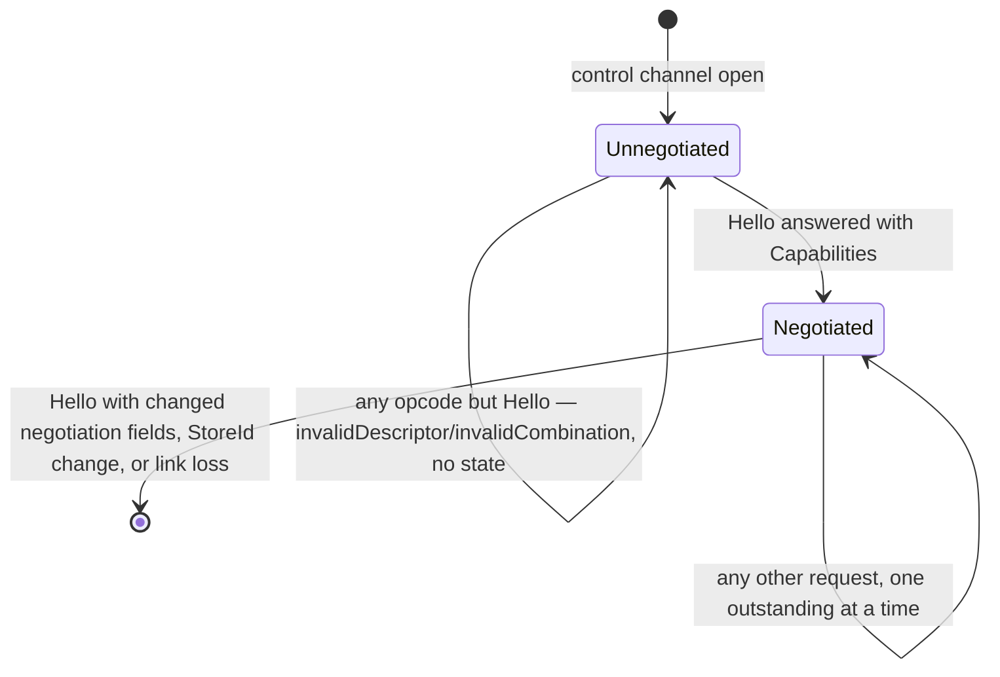
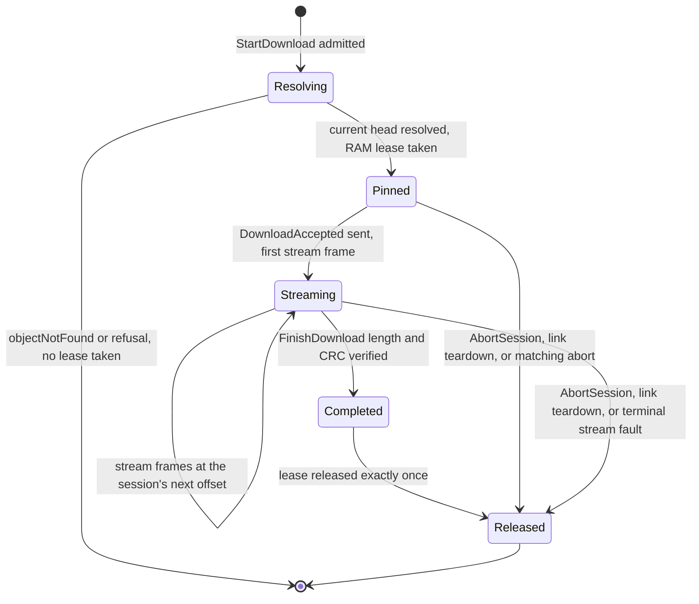

# Device Object Protocol v3 wire contract

Status: **normative** for the Device Object System v2 control and stream wire protocol. Its wire
major is **3** and minor is **0**. This is a clean cutover: a peer implementing this contract does
not translate or serve the legacy descriptor protocol.

This document owns framing, negotiation, transfer sessions, idempotency, result and error codecs,
and BLE/USB record binding. The [system contract](Device_Object_System_v2.md) owns identities and
ownership invariants, the [registries](Device_Object_Registries_v2.md) own object kinds and bounded
domain schemas, and the [storage format](OBC2_Storage_Format.md) owns persistence. Domain changes
may allocate semantic details and metadata fields only through the registry and shared vectors;
they may not change this common wire contract implicitly.

## 1. Representation and hard limits

`MUST`, `MUST NOT`, `SHOULD`, and `MAY` have their RFC 2119 meanings. Integers are unsigned
little-endian. Reserved fields and inactive fixed-width alternatives are encoded as zero and
rejected when nonzero. Sixteen-byte identities are opaque bytes copied without UUID field
reordering.

Every multi-byte field is byte-packed at exactly the stated offset. No wire structure in this
document contains implementation alignment padding: a field always begins where the preceding field
ends, and a stated total size is the exact sum of its fields plus its explicitly reserved bytes.

Every `u64` length, offset, and byte-count field is bounded by ResourceLimits to at most
`0xFFFF_FFFF` in v3.0, but the field width is normative: a codec MUST decode and encode the full
unsigned 64-bit range (a JavaScript codec uses `BigInt`, not `Number`) and MAY additionally
validate the advertised bound. A codec that silently truncates to 32 bits is nonconforming.

Coordinate scaling is per-schema and is deliberately not uniform: volume-manifest bounding boxes use
signed microdegrees while the weather request context uses signed degrees times 10,000,000. Each
field states its own scale and no decoder infers one scale from another.

Control and stream frames carry no protocol checksum of their own. Frame integrity is delegated to
the link layer (BLE Link Layer CRC and retransmission, USB packet CRC and retry). The CRC fields in
this document cover object payloads and cursors, never the frames that carry them.

CRC is CRC-32/IEEE: reflected polynomial `0xEDB88320`, initial and final XOR `0xFFFFFFFF`, with
`crc32("123456789") == 0xCBF43926`. It detects accidental corruption; it is not identity,
authentication, authorization, or an idempotency proof.

| Limit | Value |
|---|---:|
| Minimum negotiated control frame, header included | 192 bytes |
| Maximum control frame, header included | 512 bytes |
| Minimum negotiated stream frame, header included | 64 bytes |
| Maximum stream frame, header included | 4096 bytes |
| Metadata envelope | 128 bytes |
| Catalog projection metadata | 96 bytes |
| Error diagnostic text | 64 UTF-8 bytes |
| Logical-kind and draft-part capabilities | 16 total |
| Retained terminal operation results | 64 |
| Default upload checkpoint granule | 262,144 bytes |

The negotiated limit is the smaller supported value advertised by the two peers. A value below a
protocol minimum fails Hello with `resourceLimit`; no reduced dialect exists. Values above a hard
maximum are `invalidFrame` before allocation. A kind's advertised maximum object length remains
authoritative even when a transport could carry more.

The 192-byte control minimum is derived, not padding: a maximum catalog entry is the 44-byte page
prefix plus a 36-byte entry prefix plus 96 metadata bytes, or 176 payload bytes and the 16-byte
control header. The largest mandatory v3.0 StartUpload descriptor
is likewise 48 fixed bytes plus a 128-byte metadata envelope. The maximum text-bearing ErrorBody is
112 payload bytes. Implementations MUST recompute these maxima in shared codec tests when any
constituent limit or prefix changes.

Those two 176-byte figures are **schema ceilings**, and the floor is deliberately derived from the
ceilings rather than from today's registry. No registered kind reaches either one: the largest
registered catalog envelope is route's 82 bytes, making the largest producible catalog entry
`44 + 36 + 82 = 162` payload bytes, and the largest registered Put envelope is weather's 68 bytes,
making the largest producible StartUpload `48 + 68 = 116`. A conforming v3.0 device therefore never
emits a 176-byte catalog page or accepts a 176-byte StartUpload; those sizes exist as the bound a
new registered schema may grow into without renegotiating the floor, and the shared vectors treat
them as ceiling cases rather than as positive traffic.

The floor carries the complete v3.0 encoding of every message and nothing beyond it. A request whose
complete encoding exceeds the negotiated control frame is unsendable. The client MUST NOT truncate,
split, or drop a field to make it fit; it either renegotiates a larger frame on a new connection or
treats the operation as unsupported on this link and reports that to its caller.

The following 16-byte types are not interchangeable: `StoreId`, `OperationId`, and `DraftPartRef`.
A draft is identified by its parent `OperationId`; each part has a child `OperationId`. A
`DraftPartRef` is an opaque reference minted for a sealed part under exactly one parent and resolved
only after parent/principal authorization. It is neither a logical object identity nor a physical
generation identity, and it carries no decodable structure at all.

## 2. Control frame

Every control transport record contains exactly one control frame with this 16-byte header:

| Offset | Size | Field | Rule |
|---:|---:|---|---|
| 0 | 4 | magic | ASCII `OBCP` (`4F 42 43 50`) |
| 4 | 1 | major | `3` |
| 5 | 1 | minor | `0` |
| 6 | 2 | opcode | Section 4 |
| 8 | 2 | flags | response bit 0, error bit 1, more bit 2 |
| 10 | 2 | payload length | exact bytes after this header, at most 496 |
| 12 | 4 | RequestId | nonzero; a response echoes its request |

Flags `3..15` are zero. Requests have no flags. Successful responses set `response`; errors set
`response|error`. `more` is valid only on a paged Capabilities, QueryCatalog, or QueryDraft
response. A client does not reuse a RequestId while its request is outstanding. There are no
unsolicited control frames.

A zero RequestId is unanswerable, because every response echoes its request and a zero echo is
itself illegal. A receiver therefore treats a zero-RequestId frame exactly like untrusted framing:
it emits no response and closes that control record stream. `invalidDescriptor/zeroRequestId` is the
recorded and logged reason for that close; it is never transmitted.

`invalidFrame` means that a transport record cannot be established as one complete frame: bad
record length, truncation, trailing bytes, bad magic, payload-length mismatch/overflow, or a frame
outside negotiated bounds. If enough control header is trustworthy, the adapter returns an error;
otherwise it closes that record stream. `invalidDescriptor` means that a complete frame has an
illegal field value, reserved bit, enum, field combination, ordering, or nested length. An
unsupported parseable wire version is `incompatibleVersion`, not either malformed category.

### 2.1 Protocol evolution

Every message in this document is a fixed layout. There is no extension block, no per-message
extension header, and no in-band mechanism for a peer to attach a field this document does not
define. A frame that carries a byte past the end of its stated layout is `invalidFrame` for the
trailing bytes it contains, exactly as any other length disagreement is.

Evolution is therefore a version decision rather than a framing one. Appending a field at the tail
of an existing **request** message, or adding a message, is a **wire minor** bump: a client learns
the device's minor from Capabilities byte 55 (Section 5) and MUST NOT use a feature gated above it.
Response tails are frozen within a major — the device has no channel to learn the client's minor,
so a longer response would be `invalidFrame` at a v3.0 client — and a message that ends in a
`ResultEnvelope` (Section 10) can never grow a tail in either direction, because the envelope body
is defined as the remainder of the frame. Anything else — changing, reordering, resizing, or
reinterpreting a field that already exists — is a **major** bump, which defines its own frames and
its own header value and is not negotiated inside these.

Metadata envelopes are a different mechanism and are unaffected: they are registry-governed, carry
their own field codec in Section 2.2, and remain the one place a domain adds a bounded declared fact
without touching this contract.

### 2.2 Metadata envelope boundary

A metadata envelope starts with `schema_id u16`, `schema_version u8`, `flags u8`,
`encoded_field_bytes u16`, and `field_count u16`, followed by exactly the stated field bytes. Its
total length is therefore `8 + encoded_field_bytes`. Put and patch envelopes are at most 128 bytes,
so their encoded fields are at most 120 bytes. Catalog envelopes are at most 96 bytes, so their
encoded fields are at most 88 bytes. The header flags are zero.

Each field is `tag u16`, `value_length u16`, then exactly that many value bytes. The tag's high bit
is the critical bit and its low 15 bits are a nonzero base tag. Fields are strictly increasing by
base tag and base tags are unique; changing only the critical bit does not create another field.
`encoded_field_bytes` equals the exact sum of every `4 + value_length`, and `field_count` equals the
number of fields. Truncation, trailing bytes, padding, a zero base tag, integer overflow, or a
schema-disallowed width is `invalidDescriptor/noncanonicalMetadata`. A duplicate base tag is
`invalidDescriptor/duplicateField` and a base tag that does not strictly increase is
`invalidDescriptor/outOfOrderField`; those two details exist for exactly this condition and no
other, and a decoder that reports `noncanonicalMetadata` for them is nonconforming.

Schema integers use their exact registered width and little-endian encoding; signed values use
two's-complement at that width. Booleans are one byte and exactly `0` or `1`. Byte strings are
copied verbatim at their registered exact or bounded length. Text length counts encoded bytes.
Text MUST be shortest-form valid UTF-8 and contain no NUL, C0/C1 control, surrogate, or
noncharacter scalar. Noncharacters are `U+FDD0..U+FDEF` and every scalar whose low 16 bits are
`FFFE` or `FFFF`. Accepted bytes are canonical as-is: encoders and decoders MUST NOT normalize,
trim, case-fold, or otherwise rewrite them. Empty text is allowed only when its schema explicitly
permits it. Floating-point and platform-sized numeric fields are not metadata wire types.

The registries assign each field's exact critical bit, type, width/range, and required/optional
status. Schema ID exactly matches the containing logical ObjectKind, schema version is the one
advertised for that operation/projection, and every registered required field appears exactly once.
Even a schema with no fields uses its canonical eight-byte header with both counts zero. Mutating
requests reject every unknown field, whether critical or not. Response decoders
reject unknown critical fields and may skip a well-formed unknown noncritical field. This header
and the exact field sum give a decoder an unambiguous end-of-envelope boundary; silently ignoring a
requested mutation is forbidden.

Shared vectors include empty envelopes, every registered scalar/string form, critical and
noncritical unknowns, duplicate/out-of-order base tags, malformed UTF-8/forbidden scalars, exact
120/88-byte field-body maxima, and one-byte-over failures. Codec tests assert the schema ceilings
arithmetically — that `44 + 36 + 96` and `48 + 128` both equal 176, and that `176 + 16` is the
192-byte floor — rather than as byte vectors. No legal envelope reaches either ceiling, because
every registered schema's maximum is below it and both the per-kind maximum and the registered field
widths are enforced, so a 176-byte ceiling fixture would necessarily be a fixture a conforming
decoder must reject. The per-kind maxima a device can actually produce — a 116-byte weather
StartUpload and a 162-byte route catalog entry page — are the positive ones.

## 3. Authentication, principals, and ownership

The transport adapter establishes a stable principal scope and a connection generation. BLE derives
the scope from the authenticated application/bond identity. USB attachment establishes the device's
**local principal**: physical possession of the port is the authorization boundary for that link,
and v3.0 defines no challenge, pairing, or handshake on it. Every operation authorized for the local
principal is therefore available over USB, including InstallUpdate; the signature, digest, target,
and version-monotonicity checks of Section 9 remain the trust boundary for what may run on the
device. A locally entered developer/unlocked mode may establish a distinct local-development
principal and is reported by Capabilities. It cannot be enabled remotely.

Authorization is per opcode and, where applicable, per ObjectKind. Capability advertisement is
not authorization. The minimum matrix is:

| Operation | Required authority |
|---|---|
| Hello/Capabilities | may be unauthenticated; protected facts may be suppressed |
| CheckpointUpload, FinishUpload, FinishDownload, AbortSession, stream data | exact current SessionId owner |
| QueryOperation, QueryDraft, AbortOperation | authenticated owner of the operation/draft |
| QueryCatalog, QueryWeatherRequest, StartDownload, FinishDownload | authenticated domain read authority |
| StartUpload, CheckpointUpload, FinishUpload, BeginDraft, StartDraftPart, FinalizeDraft, DeleteObject, SetMetadata | authenticated domain write authority |
| InstallUpdate | authenticated update-install authority |
| AcknowledgeRideImported | authenticated ride-write authority |
| GetDeviceStatus, GetConfig, Echo | authenticated principal of any kind |
| SetConfig, SetClock, ResetStore | authenticated device-control authority |
| ForgetBond | authenticated bonded BLE principal; `unsupportedCapability/opcode` on every other link kind |

CheckpointUpload, FinishUpload, FinishDownload, AbortSession, and stream data additionally require
the exact current SessionId owner, as the first row says; the domain-authority rows above are the
authorization that admits the operation that issued the session.

Authentication and authorization precede object-existence, revision, operation-status, and busy
facts. An `OperationId` claim stores an opaque stable principal-scope digest. Reconnect by the same
principal may resume/query it. A different principal receives `authorizationFailed`, not status or
`operationIdConflict`.

The local principal is one scope, not one cable. USB attachment, the device's own user interface,
and every device-local producer the storage contract names — ride recording and publication,
weather-context change, post-boot update state, sideload import — share that single principal scope
and therefore one principal-scope digest. The consequence is deliberate and is stated rather than
discovered: a cable client may query and abort a UI-initiated operation, because it is not a
different principal. A BLE application identity is a different identity and cannot reach any of
them. Because attachment *is* the authentication on USB, a USB Capabilities page reports auth state
`1` from the first frame; auth state `0` is reachable only on the test link kind before its
harness authenticates.

The principal scope is an identity, not a cable. Wherever the same authenticated identity is
established on two link kinds it is one principal scope, so an operation claimed over BLE is owned
by that same application over USB and the reverse. Resuming or querying the same OperationId across
transports is therefore legal and MUST NOT be rejected merely because the link kind changed; only
the SessionId, which is a per-link ephemeral capability, is invalidated by the change. The USB local
principal and a BLE application identity are different identities, not the same identity on two
cables, so work claimed by one is not resumable by the other.

A SessionId is valid only with its link kind, principal scope, and connection generation. A
reconnect makes every earlier SessionId stale even for the same principal. Wrong-owner stream,
finish, checkpoint, or disconnect handling cannot advance or release a current session.
The transfer coordinator is the sole issuer and revoker of SessionIds; the adapter contributes only
the link kind and the connection generation that scope them and never mints, reassigns, or recycles
a value on its own. Within one connection generation, the coordinator never issues the same nonzero
SessionId twice, including after its earlier session terminates. It maintains a monotonically
advancing allocator or an equivalent used-set; the adapter closes and reconnects before the nonzero
`u32` space would be exhausted. Numeric reuse is permitted only in a new connection generation,
where the generation owner check makes every old capability stale.

## 4. Operation registry

Requests and successful responses share an opcode; the response flag distinguishes direction.

| Opcode | Operation | Mutation/claim |
|---:|---|---|
| `0x0001` | Hello / Capabilities | no |
| `0x0100` | StartUpload / UploadAccepted | durable logical Put claim |
| `0x0101` | CheckpointUpload | no new claim |
| `0x0102` | FinishUpload | completes upload claim |
| `0x0110` | StartDownload / DownloadAccepted | no |
| `0x0111` | FinishDownload | no |
| `0x0120` | AbortSession | session teardown only |
| `0x0130` | BeginDraft | yes |
| `0x0131` | StartDraftPart / DraftPartAccepted | durable child claim |
| `0x0132` | FinalizeDraft | completes parent claim |
| `0x0200` | QueryOperation | no |
| `0x0201` | QueryCatalog | no |
| `0x0202` | QueryDraft | no |
| `0x0203` | QueryWeatherRequest | no |
| `0x0300` | DeleteObject | yes |
| `0x0301` | SetMetadata | yes |
| `0x0302` | AbortOperation | yes |
| `0x0310` | InstallUpdate | yes |
| `0x0311` | AcknowledgeRideImported | yes |
| `0x0400` | GetDeviceStatus | no |
| `0x0401` | GetConfig | no |
| `0x0402` | SetConfig | no |
| `0x0403` | SetClock | no |
| `0x0404` | ForgetBond | no |
| `0x0405` | Echo | no |
| `0x0406` | ResetStore | no; destructive device-control |

The `0x04xx` block is the device-control plane of Section 16. Those operations carry no
OperationId, claim nothing, and never touch the catalog; the mutation/claim column reads `no` for
them in the same sense it does for a query. `ResetStore` is the one member that changes durable
state — it destroys a store and creates a new `StoreId` — and it still claims no OperationId and
retains no result, which is why it stays in this block rather than becoming an object operation.

Unknown opcodes are `unsupportedCapability`. Unsupported known operations are likewise rejected;
they are never forwarded through a generic repository facade.

## 5. Hello and complete capability discovery

Hello is 12 bytes:

| Offset | Size | Field |
|---:|---:|---|
| 0 | 1 | minimum wire major |
| 1 | 1 | maximum wire major |
| 2 | 2 | client maximum control frame |
| 4 | 2 | client maximum stream frame |
| 6 | 4 | client feature flags; zero in v3.0 |
| 10 | 1 | page kind: resource limits `0`, subject capabilities `1` |
| 11 | 1 | zero-based page index |

Capabilities has this 56-byte common prefix followed by either one 56-byte ResourceLimits body or
up to two complete 20-byte subject entries:

| Offset | Size | Field |
|---:|---:|---|
| 0 | 1 | selected wire major, `3` |
| 1 | 1 | OBC2 storage format version, `1` |
| 2 | 2 | status flags |
| 4 | 16 | StoreId, zero only when store-available is clear |
| 20 | 2 | negotiated maximum control frame |
| 22 | 2 | negotiated maximum stream frame |
| 24 | 4 | durable upload checkpoint granule |
| 28 | 2 | retained result capacity, exactly `64` |
| 30 | 2 | metadata envelope limit, `128` |
| 32 | 2 | catalog metadata limit, `96` |
| 34 | 2 | protocol minimum control frame, `192` |
| 36 | 2 | protocol minimum stream frame, `64` |
| 38 | 1 | link kind: BLE `1`, USB `2`, test `3` |
| 39 | 1 | auth state: unauthenticated `0`, authenticated `1` |
| 40 | 4 | capability revision |
| 44 | 4 | command flags |
| 48 | 2 | total subject count, at most 16 |
| 50 | 1 | returned page kind |
| 51 | 1 | returned page index |
| 52 | 1 | returned subject count, zero on resource page |
| 53 | 1 | total pages of this kind |
| 54 | 1 | ResourceLimits codec version, `1` |
| 55 | 1 | device wire minor, `0` in v3.0 |

Byte 54 is the same number the ResourceLimits block repeats at its own byte 0. A server MUST emit
equal values; a client that observes a mismatch MUST reject that page and abandon discovery rather
than decode either block, because the two disagree about how to read the second.

Byte 55 is the device's wire minor within the selected major, and it is the only place a minor is
learnable: Hello negotiates the major alone, and a peer cannot be asked to guess a minor from the
header of a frame it has already had to parse. A client MUST NOT use a feature gated on a minor
above this value; doing so earns `incompatibleVersion/unsupportedMinor`, which is exactly the
condition this byte exists to make avoidable. The value never decreases within one StoreId and
firmware image.

Status flags are store available bit 0, authenticated bit 1, heavy-transfer busy bit 2, and
developer/unlocked mode bit 3. Command flags advertise QueryOperation bit 0, QueryCatalog bit 1,
QueryDraft bit 2, QueryWeatherRequest bit 3, BeginDraft bit 4, StartDraftPart bit 5, FinalizeDraft
bit 6, AbortOperation bit 7, InstallUpdate bit 8, AcknowledgeRideImported bit 9, GetDeviceStatus
bit 10, GetConfig bit 11, SetConfig bit 12, SetClock bit 13, ForgetBond bit 14, Echo bit 15, and
ResetStore bit 16.
Other bits are zero. A device clears ForgetBond bit 14 on a link kind that cannot carry it, and a
request for an operation whose bit is clear is `unsupportedCapability/opcode`.

Each subject entry is exactly 20 bytes: namespace `u8` (logical ObjectKind `1`, DraftPartKind `2`),
reserved `u8`, kind code `u16`, operation flags `u16`, policy flags `u16`, Put schema version `u8`,
patch schema version `u8`, catalog schema version `u8`, reserved `u8`, and maximum length `u64`.
Operation flags are put bit 0, get bit 1, delete bit 2, set-metadata bit 3, resumable upload bit 4,
resumable download bit 5, and draft-finalize bit 6. Draft-part subjects advertise put and optional
resumable upload only; all three schema versions are zero because StartDraftPart has no metadata
envelope or catalog. The patch schema version is not negotiated and takes exactly two legal values:
the registered patch schema version `128` when the subject's set-metadata operation flag is set, and
zero when it is clear. Any other value, in either direction, is `invalidDescriptor`. The byte stays
in the layout so a decoder reads one shape for every subject, not so a device may offer a choice.
Policy flags are USB
recommended bit 0, external power required bit 1, authenticated
principal required bit 2, and fixed singleton bit 3. Other bits are zero.

Page kind `0` has only index zero and returns the ResourceLimits block in Section 5.1. Page kind `1`
uses `first_subject = page_index * 2`, returns up to two entries in ascending
`(namespace, kind_code)` order, and sets `more` when another subject page exists. Total pages is one
for resources and `ceil(total_subject_count / 2)` for subjects. A device that advertises no subject
at all reports total subject count zero and total subject pages zero, and answers subject page zero
with the common prefix, returned subject count zero, and `more` clear; only a subject page index
above zero is `invalidDescriptor` in that case. Capability revision identifies the
snapshot used for a page. Its value is **immutable within one connection generation**: the subject
registry and the fixed resource limits are compiled facts of the running firmware image, a device
cannot gain or lose a kind while a connection is up, and a StoreId change tears the connection down
rather than re-advertising. Ephemeral status flags and currently available reservation bytes are
snapshots and never churn it either. A client may therefore rely on one value across a whole
discovery, and `catalogChanged/capabilitySnapshot` is reserved and never emitted in v3.0 because
there is no in-connection change for it to report. Across connections the value is monotonic, so a
client comparing it against a cached page detects a firmware change; the adapter reconnects before
it wraps. A nonzero resource-page
index or an index beyond the last subject page is `invalidDescriptor`. The server never silently
truncates the registry. At the minimum 192-byte frame, the 176-byte payload easily holds either the
common prefix plus ResourceLimits (112 bytes) or the prefix plus two subject entries (96 bytes).

The resource page sets `more` when subjects exist; a subject page sets it when another subject page
exists. Discovery is complete only after resource page zero and every subject page have been read
under one capability revision.

### 5.1 ResourceLimits

The resource page reports fixed product/storage capacities plus one current reservation-space
snapshot. Admission still reports authoritative required/available values in ErrorBody. This lets
a client avoid a workflow the device can never accommodate without treating discovery as a lease.
The block is exactly 56 bytes.

The fixed values in the table below are **not authoritative here**. Every one of them is frozen in
[`OBC2_Storage_Format.md`](OBC2_Storage_Format.md) §2, which is the single authority; they are
repeated in this block only so a codec can size its buffers and validate a page without reading the
storage contract. Where the two documents disagree, the storage contract wins and this mirror is
corrected. Raising any of them requires a format/resource review there, not an edit here.

| Offset | Size | Field | Value |
|---:|---:|---|---:|
| 0 | 1 | codec version | 1 |
| 1 | 1 | block length | 56 |
| 2 | 2 | flags | 0 |
| 4 | 2 | logical catalog heads across all kinds | 256 |
| 6 | 1 | normal active claimed operations | 8 |
| 7 | 1 | resumable upload/work slots | 4 |
| 8 | 1 | active draft parents | 1 |
| 9 | 1 | sealed/streaming draft parts of the one active parent | 32 |
| 10 | 1 | children referenced by one manifest | 32 |
| 11 | 1 | simultaneously mounted map data files | 11 |
| 12 | 1 | live reader leases | 4 |
| 13 | 1 | retained previous generations | 8 |
| 14 | 2 | retained terminal results | 64 |
| 16 | 2 | inactive-work horizon in later terminal commits | 256 |
| 18 | 2 | reserved | zero |
| 20 | 8 | maximum single-generation length | `0x0000_0000_FFFF_FFFF` |
| 28 | 8 | currently available reservation bytes | dynamic |
| 36 | 2 | route catalog heads | 64 |
| 38 | 2 | trip catalog heads | 16 |
| 40 | 2 | ride catalog heads | 128 |
| 42 | 2 | weather catalog heads | 1 |
| 44 | 2 | volume-manifest catalog heads | 8 |
| 46 | 2 | update-package catalog heads | 8 |
| 48 | 1 | simultaneously attached heavy stream sessions | 1 |
| 49 | 1 | reserved maintenance/cancellation/recovery claims | 1 |
| 50 | 1 | active-or-recoverable ride slots | 1 |
| 51 | 5 | reserved | zero |

The one-heavy-transfer coordinator allows one simultaneous streaming session. The four work slots
are durable resumable upload records, not concurrent streams. A device that omits an optional kind
still reports its fixed storage partition limit here; the subject registry is the authority for
whether that kind is usable. Journal capacity was formerly reported at byte 18; it is an internal
durability parameter that no client can act on, so the field is reserved and encoded zero. The
maximum single-generation length is a storage limit on one physical generation; its FAT rationale
belongs to the storage contract and is not restated here.

Normal requests cannot consume the maintenance/cancellation/recovery claim. When all eight normal claims are
occupied, a new AbortOperation may claim the reserved slot and unwind one target. Recovery uses the
same slot with priority. If that slot is occupied, a different new AbortOperation returns
`busy/maintenanceCancellationRecoveryClaim` with owner `maintenance` and guidance `owner release`; it does not
partially cancel or claim a normal slot. A retry of the OperationId already owning the reserved slot
resumes it. The reserved claim is released only after its AbortResult or recovery result is durable.

### 5.2 Connection state machine

A control connection has exactly two states, and Hello is the only transition between them.

Before negotiation the only acceptable opcode is Hello. Any other opcode, including a query, is
`invalidDescriptor/invalidCombination` and creates no state; a device MUST NOT admit, claim, or
resume anything on an unnegotiated connection. Negotiation completes when the first Hello receives
a Capabilities response.

After negotiation, Hello repeats only to page capability discovery. A repeated Hello MUST carry
byte-identical negotiation fields — minimum major, maximum major, client maximum control frame,
client maximum stream frame, and client feature flags — and may differ only in page kind and page
index. A Hello that changes any negotiation field is `invalidDescriptor/invalidCombination`: there
is no renegotiation within a connection, because a live SessionId, a negotiated frame limit, and a
capability revision are all scoped to the negotiation that produced them. A client that needs
different terms disconnects and reconnects.

**One frame per record, strictly alternating.** Each control record carries exactly one frame and
each request has exactly one response frame; there is no multi-frame response. Paging is done with
requests, not with extra response frames: a `more` flag means "issue the next request", each page is
its own request under its own RequestId, and the snapshot token — capability revision, catalog
cursor, or draft revision — is what binds the pages together. A client is free to interleave other
requests between two pages, since the snapshot token, not adjacency, is what makes a page set
coherent. Repeated Hello discovery requests are the one exception, and only in that their
negotiation fields MUST stay byte-identical as stated above.

At most one control request may be outstanding per direction on each link. A client MUST NOT send a
new control request before the previous request's response has been received.
A device that receives a second request while one is outstanding
answers the new request `busy/normalOperationClaims`, owner set to this connection's own link kind,
guidance retry after owner release, and does not disturb the request in flight. This bound is what
makes RequestId reuse safe and keeps an adapter's receive path free of a reordering buffer.

An error raised before negotiation completes is still a Section 12 ErrorBody in a Section 2 frame,
and it is bounded by the 192-byte protocol minimum rather than by a negotiated limit: no limit has
been negotiated yet. A device therefore never emits a pre-Hello error larger than 192 bytes
including the header, which is why the text-free 48-byte body and the 64-byte floor of Section 14.0
are the only sizes an unnegotiated link has to be able to carry.

## 6. Upload and draft protocols

Only one heavy transfer may own the device transfer coordinator. Resource limits are checked after
authorization and idempotency lookup but before storage allocation.

### 6.1 StartUpload

StartUpload is only a logical-object Put. It is a fixed 48-byte prefix followed by exactly one
metadata envelope:

| Offset | Size | Field |
|---:|---:|---|
| 0 | 16 | OperationId |
| 16 | 2 | ObjectKind |
| 18 | 1 | target mode: create `0`, replace `1` |
| 19 | 1 | resume: restart at zero `0`, resume permitted `1` |
| 20 | 8 | LogicalObjectId |
| 28 | 8 | expected object Revision |
| 36 | 8 | declared length |
| 44 | 4 | expected whole-object CRC |
| 48 | 8..128 | exactly one metadata envelope |

Create encodes logical ID and expected revision as zero. Replace requires the logical identity
supplied by the repository and its exact expected revision. Other combinations are
`invalidDescriptor`. The minimum request payload is 56 bytes and the maximum is 176 bytes,
including its envelope.

Zero is not a sentinel in either field. Target mode alone distinguishes the two encodings: in create
mode both fields are constrained to zero because there is nothing yet to name, and in replace mode
both carry arbitrary opaque `u64` values, zero included, exactly as the repository reported them. A
device MUST NOT treat a zero LogicalObjectId or a zero expected Revision in replace mode as absent,
as a wildcard, or as a create request. The same rule governs BeginDraft.

For a fixed-singleton kind, store initialization reserves one stable LogicalObjectId whether or not
a head exists. StartUpload always uses replace mode with that identity and the repository's current
Revision; it may create the first head as the singleton-specific replace semantic. Create mode and
any other identity are rejected. The weather singleton's identity is whatever LogicalObjectId the
device allocated for it and reports through QueryCatalog and QueryWeatherRequest. A client MUST NOT
assume, derive, or reject any particular value for it, zero included, and `WeatherRequestId` is
never that identity: it names a request context, not an object.

The compare-and-swap token for every "expected Revision" field in this document is the entry
Revision the repository last reported for that entry — the value carried by a QueryCatalog entry or
by the ObjectResult of the mutation that produced it. UploadAccepted's repository Revision observed
at admission is a diagnostic snapshot of the repository at the moment of admission and is NOT the
next CAS token; a client that feeds it back into a later expected-Revision field will observe
`revisionConflict` as designed.

UploadAccepted disposition `0` is exactly 64 bytes:

| Offset | Size | Field |
|---:|---:|---|
| 0 | 1 | disposition, accepted `0` |
| 1 | 1 | target mode |
| 2 | 2 | flags: resumed-work bit 0, restart-at-zero bit 1; other bits zero |
| 4 | 16 | OperationId |
| 20 | 4 | fresh SessionId |
| 24 | 8 | assigned/named LogicalObjectId |
| 32 | 8 | repository Revision observed at admission |
| 40 | 8 | authoritative durable next offset |
| 48 | 4 | checkpoint granule |
| 52 | 2 | maximum stream payload |
| 54 | 2 | reserved |
| 56 | 4 | finalized prefix CRC over `[0, durable next offset)` |
| 60 | 4 | reserved |

The finalized prefix CRC is the same quantity Section 6.2 defines for a checkpoint response, taken
over the durable prefix this response reports. It is zero when the durable next offset is zero,
which is the only case in which zero is not a computed CRC. It exists so a resuming client can
satisfy Section 6.2's comparison obligation from the acceptance alone, without a checkpoint
round trip it has no offset to request.

Disposition already terminal `1` is `u8 disposition`, three reserved bytes, then the typed
ResultEnvelope from Section 10. A same-intent in-progress operation receives a fresh SessionId
bound to the current connection and the same reservation/work; issuing it atomically revokes any
SessionId previously bound to that work, so at most one session is ever live for one work record.
Frames bearing the revoked identifier are stale and handled by Section 13's discard rule. A retained
Aborted operation does not use a disposition: it returns a `response|error` control frame containing
exactly its bare 48-byte, text-free terminal ErrorBody. No stream session is created for either
terminal replay.

The resume byte is a preference, not a demand, and it has exactly two legal values. Any other value
is `invalidDescriptor/unknownEnum`. It is admitted against the durable work the device actually
holds, and every combination is accepted — a resume is never a reason to refuse an upload:

| Resume byte | Durable work present | Kind advertises resumable upload | Outcome |
|---|---|---|---|
| permitted `1` | yes | yes | durable next offset is the last durable checkpoint, resumed-work set |
| permitted `1` | yes | no | work is discarded and restarted, restart-at-zero set |
| permitted `1` | no | either | durable next offset zero, both flags clear |
| restart `0` | yes | either | work is discarded and restarted, restart-at-zero set |
| restart `0` | no | either | durable next offset zero, both flags clear |

Resuming is therefore the single case where all three of work, permission, and kind policy agree;
everything else restarts at zero. Restart-at-zero and resumed-work are never both set.
Restart-at-zero forces the reported durable next offset to zero and the finalized prefix CRC to
zero, and the client streams from byte zero.

All three resumable acceptances — UploadAccepted, DraftPartAccepted, and the FinalizeDraft
acceptance — carry these flags in the same place: a `u16` at offset 2, with resumed-work bit 0 and
restart-at-zero bit 1. The byte at offset 1 is whatever that message needs (target mode here,
reserved in the other two), so one decoder reads the flag word identically in all three.

An acceptance carrying restart-at-zero is emitted **only after** the durable restart record of
[`OBC2_Storage_Format.md`](OBC2_Storage_Format.md) §7 is synchronized. The device has recorded
durable next offset zero and the empty-prefix CRC before it invites the client to stream from byte
zero, so a cut immediately after the acceptance cannot leave recovery comparing a stale prefix CRC
against rewritten bytes.

### 6.2 CheckpointUpload and finalized-prefix CRC

The CheckpointUpload request is exactly 12 bytes:

| Offset | Size | Field |
|---:|---:|---|
| 0 | 4 | SessionId |
| 4 | 8 | received next offset |

The offset equals the session's in-memory next offset and is an exact multiple of the checkpoint
granule, except at the declared end, where it equals the declared length. The response is exactly
20 bytes:

| Offset | Size | Field |
|---:|---:|---|
| 0 | 4 | SessionId |
| 4 | 8 | durable next offset |
| 12 | 4 | finalized prefix CRC |
| 16 | 4 | checkpoint sequence |

The checkpoint sequence starts at `1` for the first durable checkpoint of one work record, strictly
increases by one for each subsequent durable checkpoint of that record, and never wraps. It is
scoped to the work record, not to the session, so it continues across a resume rather than
restarting. Exhausting the `u32` space is `resourceLimit/uploadWorkSlots`; at the 262,144-byte
default granule it is unreachable for any object this contract admits.

The prefix CRC is ordinary finalized CRC-32/IEEE over exactly bytes `[0, durable_next_offset)`,
including the final XOR. A resume implementation may invert that final XOR to restore its rolling
state. The response is emitted only after payload bytes and the work record containing offset,
finalized CRC, and sequence are durable. A resumed client that retained prefix bytes MUST compare
their finalized CRC against the device's before sending new bytes; mismatch requires restart at zero
or AbortOperation, never concatenation onto an unverified prefix. The device's value is available
without a further round trip: UploadAccepted, DraftPartAccepted, and the FinalizeDraft acceptance
each carry the finalized prefix CRC of the durable next offset they report, and a checkpoint
response carries it for every later checkpoint.

### 6.3 FinishUpload

FinishUpload request is exactly `SessionId u32`. The engine verifies length and whole-object CRC,
seals the bytes, and invokes the typed validator. Under the store commit lock it rechecks singleton
reservation or expected revision immediately before publication. Conflict leaves the old logical
head unchanged and durably aborts the operation. A logical StartUpload or parent-manifest session
returns ObjectResult wrapped in ResultEnvelope. A StartDraftPart session returns DraftPartResult.

Before publication, failures produce a terminal aborted result. Publication and terminal success
are one durable commit. A lost response therefore means unknown delivery, not failed mutation; the
client queries its OperationId.

A FinishUpload naming a session whose operation is already terminal is `invalidSession`, whether the
operation committed or aborted: the session was released by that terminal commit and no longer
exists to be finished. The result is retrieved with QueryOperation on the OperationId, never by
re-finishing.

### 6.4 AbortSession and AbortOperation

The AbortSession request is exactly 8 bytes:

| Offset | Size | Field |
|---:|---:|---|
| 0 | 4 | SessionId |
| 4 | 1 | reason: client-cancelled `1`, request-superseded `2`, user-requested `3` |
| 5 | 3 | reserved |

Its response payload is exactly one byte: `0` means the
session was detached and `1` means it was already terminal. Stale/wrong owner is `invalidSession`
and changes nothing. Detaching a resumable upload preserves its durable work; detaching a
restart-only upload durably aborts it.

AbortOperation is the explicit persistent cancellation command. Its 40-byte request is:

| Offset | Size | Field |
|---:|---:|---|
| 0 | 16 | new OperationId for this abort command |
| 16 | 16 | target OperationId (parent or ordinary operation) |
| 32 | 1 | reason: client-cancelled `1`, superseded `2`, user-requested `3` |
| 33 | 7 | reserved |

It requires the target's owning principal. A draft-parent cancellation has this exact durable
sequence:

1. Claim the abort command in the cancellation/recovery slot and commit the parent state
   `aborting`; this rejects every new child and FinalizeDraft.
2. In deterministic `(DraftPartKind, part_key)` order, durably terminal-Abort each nonterminal
   child and release its work. Already sealed/terminal child results are unchanged.
3. Durably terminal-Abort the target parent with its text-free cancellation ErrorBody and remove
   the draft parent row.
4. Durably commit the abort command's AbortResult, then release the reserved claim and respond.

Each transition is bounded and recovery resumes at the first incomplete step after any cut. The
target parent never receives an AbortResult; that typed success belongs only to the separate abort
command. For a non-parent target, the durable sequence is claim the abort command, mark the target
terminal Aborted, then commit the abort command's AbortResult. If the target was already terminal, it is unchanged and the
abort result says `already terminal`. No success response is sent before the abort command result
is durable. Repeating the abort command is idempotent by its own OperationId.

### 6.5 BeginDraft, StartDraftPart, and FinalizeDraft

BeginDraft creates bounded multipart work and claims the future logical publication under its
parent OperationId. Its request is exactly 52 bytes:

| Offset | Size | Field |
|---:|---:|---|
| 0 | 16 | parent OperationId |
| 16 | 2 | final ObjectKind |
| 18 | 1 | target mode: create `0`, replace `1` |
| 19 | 1 | reserved |
| 20 | 8 | LogicalObjectId, zero for create |
| 28 | 8 | expected Revision, zero for create |
| 36 | 8 | declared final manifest length |
| 44 | 4 | declared final manifest CRC |
| 48 | 2 | exact expected part count |
| 50 | 2 | reserved |

Only a kind whose operation flags permit draft finalization is valid; v3.0 uses volume manifest.
The exact part count is nonzero and no greater than the advertised maximum. Target field rules
match StartUpload. Exactly one draft parent may be active at a time, so a BeginDraft issued while
another parent is open — including one belonging to another principal, and including a device-local
map import — is refused `busy/draftParents` with owner set to that parent's owner and guidance retry
after owner release, before any claim. A repeat of the open parent's own OperationId and intent is
not a second parent and resumes as usual. BeginDraft disposition `0` is a four-byte disposition/reserved prefix followed
by exactly 28 bytes: parent OperationId `[16]`, draft revision `u64`, expected parts `u16`, state `u8`
(open `0`), and reserved `u8`. Disposition already terminal `1` is the same prefix followed by the
parent's ObjectResult envelope. BeginDraft remains InProgress after disposition `0`; it does not
consume a terminal-result slot until finalization or abort.

A retained Aborted parent is replayed as `response|error` plus its bare text-free ErrorBody, not as
a BeginDraft disposition.

StartDraftPart is exactly 64 bytes:

| Offset | Size | Field |
|---:|---:|---|
| 0 | 16 | child OperationId |
| 16 | 16 | parent OperationId |
| 32 | 2 | DraftPartKind |
| 34 | 2 | reserved |
| 36 | 8 | part key |
| 44 | 8 | declared length |
| 52 | 4 | expected CRC |
| 56 | 1 | resume: restart at zero `0`, resume permitted `1` |
| 57 | 7 | reserved |

The child OperationId must be distinct from the parent and every other child. The part kind must be
advertised. `(DraftPartKind, part_key)` is unique within the parent. Section 6.1's resume table
governs a part's resume admission unchanged, reading "kind advertises resumable upload"
against the DraftPartKind subject. DraftPartAccepted disposition `0` is exactly 72 bytes:

| Offset | Size | Field |
|---:|---:|---|
| 0 | 1 | disposition, accepted `0` |
| 1 | 1 | reserved |
| 2 | 2 | flags: resumed-work bit 0, restart-at-zero bit 1; other bits zero |
| 4 | 16 | child OperationId |
| 20 | 16 | parent OperationId |
| 36 | 4 | SessionId |
| 40 | 2 | DraftPartKind |
| 42 | 2 | reserved |
| 44 | 8 | part key |
| 52 | 8 | durable next offset |
| 60 | 4 | checkpoint granule |
| 64 | 2 | maximum stream payload |
| 66 | 2 | reserved |
| 68 | 4 | finalized prefix CRC over `[0, durable next offset)` |

Disposition `1` is the common four-byte disposition prefix followed by the retained DraftPartResult
envelope. The finalized prefix CRC carries Section 6.2's meaning and is zero when the durable next
offset is zero.

A retained Aborted child is replayed as `response|error` plus its bare text-free ErrorBody. The
accepted response contains no DraftPartRef: that opaque reference does not exist
until sealing is durable and appears only in DraftPartResult and QueryDraft's sealed entry.

FinalizeDraft request is exactly the parent OperationId `[16]`. It does not claim a new operation
or add semantic intent; BeginDraft already bound target, expected revision, manifest length/CRC,
and exact child count. After every declared child is sealed, disposition `0` returns this 64-byte
parent-manifest acceptance:

| Offset | Size | Field |
|---:|---:|---|
| 0 | 1 | disposition, accepted `0` |
| 1 | 1 | reserved |
| 2 | 2 | flags: resumed-work bit 0, restart-at-zero bit 1; other bits zero |
| 4 | 16 | parent OperationId |
| 20 | 4 | fresh SessionId |
| 24 | 8 | assigned/named LogicalObjectId |
| 32 | 8 | repository Revision observed at admission |
| 40 | 8 | authoritative durable manifest offset |
| 48 | 4 | checkpoint granule |
| 52 | 2 | maximum stream payload |
| 54 | 2 | reserved |
| 56 | 4 | finalized prefix CRC over `[0, durable manifest offset)` |
| 60 | 4 | reserved |

The finalized prefix CRC covers the durable manifest prefix and carries Section 6.2's meaning; it is
zero when the durable manifest offset is zero. Disposition already terminal `1` is the common
four-byte disposition prefix followed by the
parent ObjectResult envelope. Missing/nonsealed children return a retryable domain-state error and
create no session. FinishUpload verifies the manifest against BeginDraft's declared length/CRC,
matches every opaque child ref byte for byte against the sealed rows of this same parent, requires
exactly the declared number of unique `(DraftPartKind, part_key)` entries, and rejects missing,
foreign, repeated, or unsealed refs. Publication makes the logical manifest and all referenced parts reachable atomically. It
returns the parent's ordinary committed ObjectResult; no physical GenerationId is exposed. The
expected revision from BeginDraft is rechecked under the commit lock.

A retained Aborted parent is replayed from FinalizeDraft as `response|error` plus its bare
text-free ErrorBody, with no disposition or session.

## 7. Downloads

The StartDownload request is exactly 28 bytes:

| Offset | Size | Field |
|---:|---:|---|
| 0 | 2 | ObjectKind |
| 2 | 2 | flags: reserved bit 0, start offset bit 1 |
| 4 | 8 | LogicalObjectId |
| 12 | 8 | reserved |
| 20 | 8 | start offset |

Inactive and reserved fields are zero and a nonzero encoding is `invalidDescriptor/reservedBits`.
Flag bit 0 and the eight bytes at offset 12 are burned rather than removed: they carried a requested
revision in an earlier draft of this contract, and no v3.0 peer sets either.

**A download always resolves the current committed head.** There is no way to address an older
revision, and the device holds no history a client could ask for: QueryCatalog reports heads, a
download names a logical object, and the pinned bytes are that object's head at admission. A client
that needs an older payload keeps its own copy. `objectNotFound/requestedRevision` is registered,
reserved, and never emitted in v3.0. A nonzero start offset is allowed only when the kind advertises
resumable download.

DownloadAccepted is exactly 60 bytes:

| Offset | Size | Field |
|---:|---:|---|
| 0 | 16 | StoreId |
| 16 | 4 | SessionId |
| 20 | 8 | LogicalObjectId |
| 28 | 8 | pinned Revision |
| 36 | 8 | total length |
| 44 | 4 | whole-source CRC |
| 48 | 8 | accepted start offset |
| 56 | 2 | maximum stream payload |
| 58 | 2 | reserved |

Resolve and lease occur before this response. The lease is a RAM capability over the head generation
this response reports, and it needs no durable record of its own; a later replace or delete is what
moves those bytes into durable retention, as the storage contract requires. Replace or
delete changes visibility but not the pinned bytes. The accepted start offset always equals the
offset the request asked for — zero when the start-offset flag is clear. The device has no
discretion to move it: a start offset it cannot honour is refused at admission, never silently
adjusted, so a client never diffs the two values.

The FinishDownload request is exactly 16 bytes:

| Offset | Size | Field |
|---:|---:|---|
| 0 | 4 | SessionId |
| 4 | 8 | received whole-source length |
| 12 | 4 | whole-source CRC |

Length and CRC include a locally retained prefix when start offset was
nonzero. Successful empty response releases the lease exactly once. A malformed finish retains the
session until matching abort or disconnect so it cannot release another reader's lease.

A download is not a claimed operation, so none of these states is an operation phase and
`QueryOperation` never reports one.

## 8. Queries

### 8.1 QueryOperation and the 64-result bound

Request is one OperationId. The response begins with state `u8` and three reserved bytes:

| State | Value | Remaining bytes |
|---|---:|---|
| Unknown | 0 | none |
| InProgress | 1 | 24-byte progress body |
| Committed | 2 | ResultEnvelope |
| Aborted | 3 | ErrorBody without diagnostic text |

The progress body is exactly 24 bytes:

| Offset | Size | Field |
|---:|---:|---|
| 0 | 1 | subject namespace: none `0`, logical ObjectKind `1`, DraftPartKind `2` |
| 1 | 1 | phase |
| 2 | 1 | flags |
| 3 | 1 | reserved |
| 4 | 2 | subject kind |
| 6 | 2 | reserved |
| 8 | 8 | assigned LogicalObjectId |
| 16 | 8 | durable offset | Phases are prepared `0`, streaming `1`,
sealed `2`, validating `3`, publishing `4`, external-handoff `5`, draft-open `6`,
and aborting `7`; these are the storage contract's phase names, projected onto this enum by
[`OBC2_Storage_Format.md`](OBC2_Storage_Format.md) §5.3. Flags are resumable bit 0,
session-currently-attached bit 1, and
logical-ID-present bit 2; bits `3..7` are zero. Attachment is advisory and grants no ownership.

The originating claim fixes every progress field according to this matrix. A phase outside its row,
a nonzero kind in namespace none, or a nonzero ID/offset where the matrix says zero is an internal
state/codec error and MUST NOT be emitted.

| Originating claim | Namespace and kind | Allowed phases | Flags, ID, and durable offset |
|---|---|---|---|
| StartUpload `0x0100` | logical `1`, request ObjectKind | `0..4`, aborting `7` | resumable reflects claimed policy; attached only while that session exists; ID-present set; ID is assigned/named object; offset is durable payload prefix, declared length in phases `2..4`; aborting has no attachment |
| StartDraftPart `0x0131` | draft part `2`, request DraftPartKind | `0..4`, aborting `7` | resumable/attached as above; ID-present clear and ID zero; offset is durable part prefix, declared length in phases `2..4`; aborting has no attachment |
| BeginDraft/FinalizeDraft parent `0x0130` | logical `1`, final ObjectKind | draft-open `6`, `0..4`, aborting `7` | ID-present set; draft-open/aborting have offset zero and no attached session; manifest phases use resumable/attached and durable manifest offset |
| DeleteObject `0x0300` | logical `1`, request ObjectKind | `3`, `4`, aborting `7` | only ID-present set; ID is target; offset zero |
| SetMetadata `0x0301` | logical `1`, request ObjectKind | `3`, `4`, aborting `7` | only ID-present set; ID is target; offset zero |
| AbortOperation command `0x0302` | none `0`, kind zero | aborting `7` | flags, ID, and offset zero |
| InstallUpdate `0x0310` | logical `1`, update `7` | `3`, `4`, `5` | only ID-present set; ID is package; offset zero |
| AcknowledgeRideImported `0x0311` | logical `1`, ride `3` | `3`, `4`, aborting `7` | only ID-present set; ID is ride; offset zero |

An ID field with ID-present clear is zero. With the bit set, zero remains a valid opaque
LogicalObjectId. A terminal claim is never reported InProgress.

The store retains exactly the latest 64 terminal committed or durably aborted operations in
store-global commit order; active work does not occupy those slots. The window is store-global in
the strict sense: terminal results of device-local producers — ride finalization, weather-context
transitions, post-boot update state, and sideload import — occupy the same 64 slots and can
therefore evict a link client's result without that client having issued a single further request.
A client cannot bound its own uncertainty by counting only its own mutations. Unknown means only
that the ID is neither active nor retained. It cannot distinguish never claimed from evicted. A client must
settle uncertainty before 64 later terminal operations complete. After possible eviction it MUST
NOT replay the old OperationId or issue the same intended mutation under a new ID without an
independent domain-state reconciliation.

The device cannot close this hole on the client's behalf, and the contract says so rather than
implying otherwise. Once a create's result has been evicted, a replay of that intent under a fresh
OperationId is indistinguishable from a genuinely new create and will publish a second object: a
create has no prior Revision to compare against, so there is no compare-and-swap to fail. Replace,
delete, and set-metadata keep their protection across eviction because each carries an expected
Revision that a duplicated mutation would violate. Reconciling a possibly-evicted create against the
catalog before reissuing it is therefore a client obligation, not a device guarantee.

### 8.2 QueryCatalog

The request is exactly 28 bytes:

| Offset | Size | Field |
|---:|---:|---|
| 0 | 2 | ObjectKind |
| 2 | 2 | flags: expected-revision bit 0, cursor bit 1 |
| 4 | 8 | expected repository Revision |
| 12 | 16 | cursor |

With neither flag, both fields are zero
and the current first page is requested. Expected-revision alone is an incremental unchanged
check: an exact match returns the response prefix with zero entries, a zero cursor, and no `more`
flag even when the catalog is nonempty. A mismatch is `catalogChanged` with current Revision; the
client then requests a current first page without the expected-revision flag. Cursor requires both
bits and an expected revision equal to the cursor revision. Other combinations are
`invalidDescriptor`.

Cursor bytes are repository Revision `u64`, next entry index `u16`, ObjectKind `u16`, and CRC-32
over current StoreId followed by those first 12 cursor bytes. They are opaque to application code
despite their normative codec. A revision mismatch is `catalogChanged` with current-revision
presence and retry guidance refresh.

The response prefix is exactly 44 bytes:

| Offset | Size | Field |
|---:|---:|---|
| 0 | 16 | StoreId |
| 16 | 2 | ObjectKind |
| 18 | 2 | entry count |
| 20 | 8 | repository Revision |
| 28 | 16 | next cursor |

The next cursor is zero unless `more` is set. Each entry begins with a 36-byte prefix:

| Offset | Size | Field |
|---:|---:|---|
| 0 | 8 | LogicalObjectId |
| 8 | 8 | object Revision |
| 16 | 8 | length |
| 24 | 4 | CRC |
| 28 | 2 | flags, zero in v3.0 |
| 30 | 2 | metadata length |
| 32 | 4 | reserved |

followed by exactly that many metadata bytes. Metadata length is
`8 + encoded_field_bytes` and at most 96. Entries are ordered by LogicalObjectId. A page returns
only as many whole entries as fit the negotiated control frame, and never more than ten; an entry is
never split across pages. The frame bound is the binding one for every kind this registry defines:
the smallest registered projection is ride's 41-byte envelope, so one entry is 77 payload bytes and
the 496-byte payload maximum admits five. The ten-entry ceiling is therefore headroom for a future
smaller projection, not a page size any v3.0 device can reach. At least one whole entry is returned
whenever one remains, and a schema whose maximum entry cannot fit the negotiated frame is an
internal contract error rather than an empty page. One ceiling-sized entry makes a
`44 + 36 + 96 = 176` byte payload and therefore fits the 192-byte control minimum exactly, so the
frame-fit rule reduces the count to one only at that minimum; the largest entry any registered
schema actually produces is route's `44 + 36 + 82 = 162`. Entry flags are zero in v3.0 and nonzero
values are rejected.

Ten entries and the frame-fit bound are both **ceilings**. A device may return fewer whole entries
than either allows, for its own bounded-buffer reasons, and a client MUST page until `more` clears
rather than inferring completion from a count. The maximum-count vector pins what the reference
device is permitted to emit at a given frame size; it is not a requirement that every device fill a
page.

### 8.3 QueryDraft

QueryDraft request is exactly 44 bytes:

| Offset | Size | Field |
|---:|---:|---|
| 0 | 16 | parent OperationId |
| 16 | 2 | flags: expected revision bit 0, cursor bit 1 |
| 18 | 1 | requested limit, 1 through 6 |
| 19 | 1 | reserved |
| 20 | 8 | expected draft revision |
| 28 | 16 | cursor |

With neither flag, both fields are zero and the current first page is requested. Expected-revision
alone requires an exact match and then returns that snapshot's first page; a mismatch is
`catalogChanged`. Cursor requires both flags and the same expected revision. Other combinations are
`invalidDescriptor`. Cursor is draft revision `u64`, next entry index `u16`, zero `u16`, and CRC-32
over current StoreId, parent OperationId, then those first 12 cursor bytes. This
binds a cursor to one store and parent. Draft revision increments exactly when a child is durably
claimed, sealed, or durably aborted, and never for a durable payload checkpoint, exactly as
[`Device_Object_Registries_v2.md`](Device_Object_Registries_v2.md) §2.1 states. A
mismatch is `catalogChanged`. This gives each page one stable snapshot; clients restart from page
zero after a change.

QueryDraft is defined only while the parent claim is InProgress. The terminal commit removes the
draft-parent row; no finalized/aborted row is retained for paging. When the parent has a retained
terminal result, QueryDraft returns `objectNotFound/operationTerminal` with guidance
`query OperationId now`; the client uses QueryOperation for the ObjectResult or terminal ErrorBody.
When neither an active parent nor retained result exists, it returns
`objectNotFound/draftParentUnknown`. This distinction is emitted only after principal ownership is
authorized.

The 44-byte response prefix is parent OperationId `[16]`, draft revision `u64`, next cursor `[16]`,
count `u8`, flags `u8` (manifest-streaming bit 0, aborting bit 1), and reserved `u16`. The next
cursor is zero unless `more` is set, exactly as in Section 8.2. Up to six 68-byte
entries follow:
child OperationId `[16]`, DraftPartRef `[16]`, DraftPartKind `u16`, reserved `u16`, part key `u64`,
state `u8`, entry flags `u8` with no bit defined in v3.0, reserved `u16`, durable offset `u64`,
declared length `u64`, and CRC `u32`. The entry flags byte is an inactive fixed-width alternative
under Section 1: it is encoded zero and a nonzero value is `invalidDescriptor/reservedBits`.
Assigning a bit in it is a major bump, exactly as Section 2.1 says for reinterpreting any existing
field.
DraftPartRef is zero unless state sealed `2`; states are prepared `0`, streaming `1`, sealed `2`,
and aborted `3`. Entries are strictly ordered by `(DraftPartKind, part_key)`, which is unique within the
draft. The device returns no more than the request limit and only as many whole entries as fit the
negotiated frame. At least one entry fits the minimum. The largest response is
`44 + 6*68 = 452` payload bytes, below 496.

### 8.4 QueryWeatherRequest

The request payload is empty. The authenticated weather-read response is exactly 96 bytes:

| Offset | Size | Field |
|---:|---:|---|
| 0 | 16 | StoreId |
| 16 | 8 | current WeatherRequestId |
| 24 | 8 | request-context revision |
| 32 | 4 | flags: head-present bit 0 |
| 36 | 8 | reserved weather LogicalObjectId |
| 44 | 8 | current weather repository Revision |
| 52 | 8 | head WeatherRequestId; inactive zero when head-present is clear |
| 60 | 4 | required centre latitude, signed degrees times 10,000,000 |
| 64 | 4 | required centre longitude, signed degrees times 10,000,000 |
| 68 | 4 | required radius metres |
| 72 | 8 | earliest issued UTC, signed Unix seconds |
| 80 | 8 | required valid-until UTC, signed Unix seconds |
| 88 | 1 | context state: pending `1`, satisfied `2` |
| 89 | 7 | reserved |

The singleton ID and repository Revision remain authoritative with no head. The request-context
revision changes whenever the desired weather context/request changes. Latitude/longitude and UTC
fields use little-endian two's-complement signed representations.

When no durable weather request context exists, an authorized query returns
`objectNotFound/weatherRequestContext`; it
does not synthesize a zero WeatherRequestId or an empty context. The store-reserved singleton
identity becomes visible with the first real context.

Weather StartUpload metadata carries the request ID plus the coverage/freshness facts frozen by the
domain registry; the validator requires those facts to match the payload. A bundle publishes when it
answers the **current** request: its request ID is the current one, its validated facts satisfy that
request's coverage and validity predicates, and its expected object revision still matches under the
commit lock. A bundle whose request context is no longer current is rejected at validation with the
weather registry's `requestMismatch`, terminally, and the current request stays pending until a
bundle that answers it arrives. There is no ranking, request history, superseded-publication path,
or second singleton identity.

## 9. Direct mutations

DeleteObject request is exactly 36 bytes: `OperationId[16]`, ObjectKind `u16`, flags `u16`
(expected revision bit 0 is mandatory), LogicalObjectId `u64`, and expected Revision `u64`.

SetMetadata starts with the same 36 bytes, followed by exactly one metadata envelope. Its minimum
payload is 44 bytes. A patch envelope is well-formed with zero fields, so an
empty patch is not a codec error; it is refused as a request, with
`invalidDescriptor/emptyMetadataPatch`, because a mutation that changes nothing would still consume
an OperationId, a claim, and a catalog commit. Unknown requested fields are likewise rejected.
Metadata changes in the same catalog commit and never through a sidecar.

InstallUpdate request is exactly 32 bytes: `OperationId[16]`, update LogicalObjectId `u64`, and
expected Revision `u64`. It requires an authenticated update-install principal and a package in
VerifiedReady state that independently passes signature, digest, target, version monotonicity, size,
power, and runtime-safety policy. CRC is irrelevant to trust. Upload never installs. No physical
confirmation is required for this explicit authenticated command, which is precisely why the
admission checks below are mandatory rather than advisory.

Version monotonicity is a mandatory admission check, not a host courtesy: the device MUST compare
the pinned package's version against the running image's and MUST refuse a package that is not
strictly newer with `semanticValidation` in the update-package namespace, detail `downgradeDenied`,
guidance reject permanently. Anti-rollback is enforced on the device because the authority that
decides what runs on the device cannot be the peer asking for the change.

Runtime-safety policy is likewise enumerated rather than left to implementation taste. Admission
MUST refuse, with the update-package namespace's nonterminal `unsafeRuntimeState` or
`unsafePowerState`, while any of the following holds: a ride is actively being tracked; unsaved ride
data has not reached durable storage; or the power source or state of charge is below the device's
install threshold. These are retryable conditions and do not terminally claim the OperationId.

Install crash ordering is normative: (1) durably claim OperationId; (2) validate the exact pinned
package; (3) durably commit install intent; (4) durably write and verify the boot handoff; (5)
durably commit the terminal install-requested result; (6) send and drain the response; (7) reboot.
Recovery resumes steps 3--5 idempotently and reports InProgress phase `external-handoff`
until both intent and handoff are durable. A terminal result is never visible before the handoff.

These steps are the wire-visible projection of the arming protocol in
[`OBC2_Storage_Format.md`](OBC2_Storage_Format.md) §10, and the two numberings correspond exactly:
step 1 here is OBC2 step 1's claim, step 2 here is the rest of OBC2 step 1 (revalidation, rollback
snapshot, Armed-blob construction), step 3 here is OBC2 step 2's `prepared` HandoffRef, step 4 here
is OBC2 steps 3 and 4 (the OBCU page write with readback and the `armed` HandoffRef), step 5 here is
OBC2 step 5's terminal journal record, and steps 6 and 7 here are OBC2 step 6. The per-cut recovery
outcomes for each of them are frozen in OBC2 §10.1, whose rows this contract does not restate.

The trust boundary is the one frozen by [`OBCU_Spec.md`](OBCU_Spec.md): the application
independently verifies the package's Ed25519 signature and digest before arming the handoff, and the
bootloader independently revalidates the package's structure and CRC framing and enforces trial
boot, health confirmation, and rollback. Cryptographic signature verification is not a bootloader
obligation and this contract does not impose one.

InstallUpdate is not cancellable once it has been admitted. From the moment its claim is durable it
occupies phases `3`, `4`, and `5` only, and it never enters `aborting`: steps 3 through 5 are an
external handoff that recovery must complete, so unwinding it would leave the boot handoff and the
durable result disagreeing. An AbortOperation naming an InstallUpdate target is refused with
`unsupportedCapability/nonCancellableOperation`, guidance reject permanently. The refusal is decided
in preflight, before the abort command's own OperationId is durably claimed, so it creates no state
and burns no identifier. Declining the update is done before InstallUpdate, by not sending it.

AcknowledgeRideImported request is exactly 32 bytes: `OperationId[16]`, ride LogicalObjectId `u64`,
and expected Revision `u64`. It is sent only after the client durably stores and verifies the
download. Download completion alone does not change import state.

Every expected revision above is checked during admission and again under the store commit lock.
Responses are ObjectResult envelopes with the operation-specific outcome.

## 10. Typed terminal results

ResultEnvelope is `result_type u8`, three reserved zero bytes, then exactly one typed body. The
envelope carries no body length because it is always the final element of the payload that contains
it: a decoder that meets a ResultEnvelope takes the remainder of the frame as its body and MUST
reject any trailing byte beyond the typed body's fixed size. No v3.0 message places a field after a
ResultEnvelope, and a future message that needs one must carry an explicit body length instead.

| Type | Value | Body size |
|---|---:|---:|
| ObjectResult | 1 | 64 |
| DraftPartResult | 2 | 88 |
| AbortResult | 3 | 56 |

ObjectResult is:

| Offset | Size | Field |
|---:|---:|---|
| 0 | 16 | OperationId |
| 16 | 16 | StoreId |
| 32 | 2 | ObjectKind |
| 34 | 2 | outcome |
| 36 | 8 | LogicalObjectId |
| 44 | 8 | new object Revision |
| 52 | 8 | length |
| 60 | 4 | CRC |

Outcomes are committed `0`, deleted `2`, metadata changed `3`, update-install-requested `4`, and
ride-imported `5`. Value `1` named a committed-for-superseded-weather-request outcome and is
registered, reserved, and never emitted in v3.0; a weather bundle either answers the current request
and commits as `0` or is rejected. Length and CRC describe the committed/new head, or deleted old
head for delete.

DraftPartResult is exactly 88 bytes and has no LogicalObjectId or GenerationId:

| Offset | Size | Field |
|---:|---:|---|
| 0 | 16 | child OperationId |
| 16 | 16 | StoreId |
| 32 | 16 | parent OperationId |
| 48 | 16 | DraftPartRef |
| 64 | 2 | DraftPartKind |
| 66 | 2 | reserved |
| 68 | 8 | part key |
| 76 | 8 | length |
| 84 | 4 | CRC |

AbortResult is exactly 56 bytes:

| Offset | Size | Field |
|---:|---:|---|
| 0 | 16 | abort-command OperationId |
| 16 | 16 | StoreId |
| 32 | 16 | target OperationId |
| 48 | 1 | disposition: cancelled `0`, already terminal `1`, already absent `2` |
| 49 | 7 | reserved |

`already absent` is returned only when authorization can be established
without leaking another principal's target.

Unknown result types/outcomes are preserved as bytes by diagnostic tooling but are not success to
a client that cannot name them.

## 11. OperationId claims and canonical intent

An OperationId is store-global, but status and control remain restricted to its principal scope.
After authentication, authorization, descriptor validation, and canonical intent construction, the
store atomically performs one of four actions under its claim lock:

1. no claim: proceed to resource preflight and the durable claim described below;
2. claimed by another principal: return `authorizationFailed` without comparing or exposing intent;
3. same principal and digest: return/resume the existing claim or retained terminal result;
4. same principal and different digest: return `operationIdConflict` without mutation.

For an unclaimed ID, owner/resource/space preflight, target admissibility (such as an AbortOperation
naming a non-cancellable target), and explicitly retryable domain preconditions
(such as temporary power/runtime safety) may fail without creating state. Once preflight succeeds,
the durable claim is the first mutation and precedes payload creation or any externally
visible side effect. The same atomic BeginWork/command-claim record also reserves the logical ID,
singleton slot, parent target, or draft part slot when applicable; no crash gap exists between claim
and reservation. Recovery never executes an unclaimed side effect; it resumes or durably aborts an
incomplete claimed operation. Terminal commit atomically replaces active claim state with its
result. A claim cannot be forgotten before terminal state.

AbortOperation is the only link request whose new claim uses the cancellation/recovery slot rather
than a normal claim slot; its saturation and recovery priority are frozen in Section 5.1.

FinalizeDraft is the one carve-out from the four actions above. It addresses an existing claim — the
BeginDraft parent — **by OperationId alone**: it computes no canonical intent, makes no second
claim, and the digest comparison of actions 3 and 4 is skipped by rule rather than passing
trivially. Ownership is still checked, and an OperationId that names no active parent of this
principal is `objectNotFound/draftParentUnknown` or, once the parent is terminal,
`objectNotFound/operationTerminal`, never `operationIdConflict`.

For every operation-bearing mutation request, same-intent replay of retained success uses the
operation's typed successful response, while retained Aborted replay is always a `response|error`
frame for that request opcode containing exactly the stored 48-byte ErrorBody with text length
zero. It has owner none, clears retry delay/expected offset/required/available presence, and may
retain only an authoritative conflict Revision. QueryOperation is intentionally different: its
successful state `Aborted` is followed by the same bare ErrorBody so status can be inspected
without turning the query itself into a failed request.

A replayed terminal ErrorBody is a durable record, not a live diagnosis, and is therefore exempt
from Section 12's per-category presence requirements: its presence bits are exactly as described
above regardless of what its category would require in a live response. No decoder needs a rule for
that, because Section 12's presence requirements bind senders only and a decoder never rejects a
body over a present or absent optional field. It carries both status bits — durable claim exists and
that claim is terminal — set, which is the discriminator available to a client that wants to
recognise a replay, and its retry guidance is forced to reject permanently `0`
whatever guidance the original live failure carried. Retrying a terminal operation cannot change
its outcome, so replaying the original guidance would invite an infinite retry of a decision the
store has already made permanent.

Every canonical intent for a **wire-initiated** operation begins with this exact 36-byte prefix:

| Offset | Size | Bytes |
|---:|---:|---|
| 0 | 16 | ASCII `OBC-DOS3-INTENT` plus one `00` byte (DOS = Device Object System; `3` = wire major 3) |
| 16 | 16 | current StoreId |
| 32 | 2 | opcode |
| 34 | 1 | intent codec version, `1` |
| 35 | 1 | zero |

The OperationId is the lookup key and is not repeated in the digest. The principal scope is claim
ownership and is not part of semantic intent. The following exact suffixes are appended. There is
no struct padding.

| Operation | Canonical suffix, in order |
|---|---|
| StartUpload | ObjectKind `u16`; target mode `u8`; zero `u8`; LogicalObjectId `u64`; expected Revision `u64`; length `u64`; CRC `u32`; envelope length `u16`; exact canonical metadata envelope |
| BeginDraft | final ObjectKind `u16`; target mode `u8`; zero `u8`; LogicalObjectId `u64`; expected Revision `u64`; manifest length `u64`; manifest CRC `u32`; exact part count `u16`; zero `u16` |
| StartDraftPart | parent OperationId `[16]`; DraftPartKind `u16`; zero `u16`; part key `u64`; length `u64`; CRC `u32` |
| DeleteObject | ObjectKind `u16`; LogicalObjectId `u64`; expected Revision `u64` |
| SetMetadata | ObjectKind `u16`; LogicalObjectId `u64`; expected Revision `u64`; envelope length `u16`; exact canonical metadata envelope |
| AbortOperation | target OperationId `[16]`; reason `u8`; seven zero bytes |
| InstallUpdate | update ObjectKind `u16` value `7`; LogicalObjectId `u64`; expected Revision `u64` |
| AcknowledgeRideImported | ride ObjectKind `u16` value `3`; LogicalObjectId `u64`; expected Revision `u64` |

FinalizeDraft does not make a second claim and has no intent suffix. Its only request field is the
parent lookup key. Repeating it resumes the bound manifest stream or returns the retained parent
result; manifest length and CRC were already part of the BeginDraft intent.

Resume policy, RequestId, SessionId, connection, transport, chunks,
and human text are excluded. Inactive target fields are included as their required zero bytes, so
there is one encoding per intent. Full SHA-256 is the equality authority; CRC or a truncated digest
is forbidden.

Device-local producers do not use this prefix. Their intents are the ASCII-tagged schemes the
storage contract freezes — `O2-LOCAL-WX-INTENT\0`, `O2-LOCAL-UPD-INTENT\0`, and
`O2-LOCAL-IMP-INTENT\0` — and the resulting SHA-256 lands in the same 32-byte digest field of the
same claim and terminal rows. The field holds either form and the store never distinguishes them:
claim lookup is by OperationId, and the digest participates only through byte equality against the
digest already stored under that ID. The two families cannot collide, because the wire prefix begins
`OBC-DOS3-INTENT\0` and every local tag begins `O2-`, so no input to one scheme is an input to the
other.

## 12. Error body and retry matrix

ErrorBody has a 48-byte prefix and optional diagnostic text:

| Offset | Size | Field |
|---:|---:|---|
| 0 | 2 | category |
| 2 | 2 | detail namespace: common `0` or ObjectKind |
| 4 | 2 | detail code |
| 6 | 1 | retry guidance |
| 7 | 1 | owner: none `0`, BLE `1`, USB `2`, test `3`, local producer `4`, maintenance `5` |
| 8 | 2 | presence bits |
| 10 | 4 | retry-after milliseconds |
| 14 | 8 | expected offset |
| 22 | 8 | current Revision |
| 30 | 8 | required bytes |
| 38 | 8 | available bytes |
| 46 | 1 | text length, at most 64 |
| 47 | 1 | reserved |
| 48 | N | non-authoritative UTF-8 text |

Presence bits are retry delay bit 0, expected offset bit 1, current revision bit 2, required bytes
bit 3, available bytes bit 4, durable claim exists bit 5, and claim is terminal bit 6. Bits `7..15`
are zero. Inactive values
are zero. Categories other than
`semanticValidation` use namespace zero. Semantic validation uses the affected ObjectKind when one
owns the rule; the device-control plane owns no ObjectKind, so its semantic refusals use namespace
zero and the common detail row below. Text is optional and never drives behavior.

The presence requirements in the matrix below bind **senders**. A decoder MUST NOT reject an
ErrorBody because an optional field is present where it expected none, or absent where the category
would normally require one; it reads what the bits say and reports the category. This is what makes
the replayed terminal bodies of Section 11 decodable without a special case, and bit 6 is the
discriminator a client may test if it wants to know it is looking at one.

Category `0` is reserved and invalid. A sender never emits it and a receiver treats it as a
malformed body rather than as an unknown future category.

The owner byte and the link-kind byte of Section 5 are distinct namespaces that deliberately agree
where they overlap: owner values `1`, `2`, and `3` are exactly the BLE, USB, and test link kinds, so
"owner set to this connection's own link kind" is a copy rather than a translation, while `0`, `4`,
and `5` are owner-only values with no link-kind meaning. A decoder still reads each byte against its
own table and never converts one enum into the other beyond that stated correspondence.

Bits 5 and 6 answer the one question a client cannot otherwise settle from an error alone: what has
happened to the OperationId it used. Bit 5 set means a durable claim exists for that OperationId
under this principal. Bit 6, meaningful only when bit 5 is set, means that claim is now terminal.
The three legal combinations are exactly the three answers a client needs:

| Bits | Meaning | Client obligation |
|---|---|---|
| 5 clear | no durable claim exists for this OperationId under this request | the same OperationId may carry the same intent again |
| 5 set, 6 clear | the operation is claimed and still live | resume it or query it; do not reissue it under a new identifier |
| 5 set, 6 set | the claim is terminal and the identifier is spent | never reuse it; obtain the outcome with QueryOperation or from the replayed result |

Their values are determined by where the failure occurred, not by the category. Every error raised
before the durable claim — version, framing, authentication, authorization, descriptor/schema,
preflight, and the retryable domain preconditions of Section 11 — clears both. Every error raised
against an already-claimed operation that is still live sets bit 5 and clears bit 6; that is the
ordinary case for `invalidOffset` on a live upload, `checksumFailure/durablePrefix`, a mid-stream
`mediaIo`, `invalidSession` against a live claim, and a `busy` refusal after the claim exists. Every
error that reports or replays a terminal outcome sets both, and a retained Aborted replay always
sets both. `operationIdConflict` clears both, because the conflicting claim belongs to a different
intent and the request's own intent was never claimed. A response that would be ambiguous — a
`mediaIo/uncertainCommit` where the device cannot determine whether its claim reached durable
storage — clears both and pairs that with guidance query OperationId now, because "may have been
claimed" is not "claimed".

A receiver MUST NOT reject a frame because its diagnostic text is malformed. Text is
non-authoritative, and refusing an error body would destroy the only report of a real failure to
protect a field that drives nothing. A receiver renders text lossily — replacing or dropping any
byte sequence that is not valid, non-control, non-noncharacter UTF-8 — and never parses it, matches
on it, or derives behaviour from it. Only the text length field is structural: a length above 64, or
a length that disagrees with the frame's payload length, is `invalidFrame` as usual.

| Code | Category | Permitted guidance | Required presence/detail rule |
|---:|---|---|---|
| 1 | incompatibleVersion | user action | detail unsupported major/minor |
| 2 | unsupportedCapability | never, user action | detail opcode/kind/feature |
| 3 | authenticationFailed | user action | no protected fields |
| 4 | authorizationFailed | user action | no protected fields |
| 5 | busy | retry delay, owner release | owner required; delay required for retry-delay |
| 6 | invalidFrame | never, reconnect/query | category-scoped framing detail |
| 7 | invalidDescriptor | never | category-scoped descriptor detail |
| 8 | invalidOffset | resume expected offset | expected offset required |
| 9 | invalidSession | reconnect/query | no owner token or protected state |
| 10 | objectNotFound | never, query now, refresh | no existence detail beyond authorized target |
| 11 | revisionConflict | refresh | current revision required |
| 12 | insufficientSpace | retry delay, user action | required and available bytes required |
| 13 | checksumFailure | retry same, user action | prefix mismatch uses expected offset |
| 14 | semanticValidation | never, retry same, retry delay, user action | ObjectKind namespace permitted; domain registry freezes the allowed choice |
| 15 | mediaUnavailable | retry delay, user action | delay required when retry-delay |
| 16 | mediaIo | retry delay, reconnect/query, user action | no false committed/aborted inference |
| 17 | cancelled | never | category-scoped cancellation detail |
| 18 | linkLost | reconnect/query | operation-bearing requests only |
| 19 | operationIdConflict | new ID for new intent | no prior intent/status disclosure |
| 20 | resourceLimit | retry delay, user action | required/available when meaningful |
| 21 | catalogChanged | refresh | current revision required |
| 22 | internal | retry delay, user action | stable category detail when known |

Retry guidance values are reject permanently `0`, retry same request `1`, retry after supplied delay `2`, retry
after owner release `3`, reconnect then query OperationId `4`, query OperationId now `5`, resume at
expected offset `6`, refresh catalog/domain state `7`, use a new OperationId only for genuinely new
intent `8`, and retry only after user action `9`.

Detail codes are category-scoped; the same number in another category has no relationship. Detail
zero means no narrower fact. A v3.0 sender uses only this complete table (or the semantic registry):

| Category | Namespace | Nonzero detail codes |
|---|---:|---|
| incompatibleVersion | 0 | unsupportedMajor `1`, unsupportedMinor `2` |
| unsupportedCapability | 0 | opcode `1`, logicalKind `2`, draftPartKind `3`, feature `4`, schemaVersion `5`, nonCancellableOperation `6` |
| authenticationFailed | 0 | missingCredential `1`, invalidCredential `2`, expiredCredential `3` |
| authorizationFailed | 0 | principalScope `1`, operationOwner `2`, domainRead `3`, domainWrite `4`, installAuthority `5`, deviceControl `6` |
| busy | 0 | heavyTransfer `1`, normalOperationClaims `2`, uploadWorkSlots `3`, draftParents `4`, draftParts `5`, readerLeases `6`, maintenanceCancellationRecoveryClaim `7`, maintenance `8`, rideSlot `9`, retainedPrevious `10` |
| invalidFrame | 0 | malformedHeader `1`, recordLength `2`, magic `3`, payloadLength `4`, frameBounds `5`, truncated `6`, trailingBytes `7` |
| invalidDescriptor | 0 | reservedBits `1`, unknownEnum `2`, invalidCombination `3`, nestedLength `4`, noncanonicalMetadata `5`, duplicateField `6`, outOfOrderField `7`, unsupportedFlags `8`, zeroRequestId `9`, emptyMetadataPatch `10` |
| invalidOffset | 0 | unexpectedOffset `1`, checkpointBoundary `2` |
| invalidSession | 0 | unknown `1`, staleConnection `2`, wrongPrincipal `3`, wrongLink `4`, wrongDirection `5` |
| objectNotFound | 0 | logicalObject `1`, requestedRevision `2`, draftParentUnknown `3`, operationTerminal `4`, resumableWork `5`, weatherRequestContext `6` |
| revisionConflict | 0 | object `1`, repository `2`, singleton `3` |
| insufficientSpace | 0 | reservationBytes `1`, catalogCapacity `2`, retainedPrevious `3` |
| checksumFailure | 0 | wholePayload `1`, durablePrefix `2`, cursor `3` |
| semanticValidation | ObjectKind or 0 | with an ObjectKind, exactly the selected registry's semantic detail table; with namespace `0`, the device-control plane's clockRegression `1` |
| mediaUnavailable | 0 | noCard `1`, unmounted `2`, recoveryReadOnly `3` |
| mediaIo | 0 | read `1`, write `2`, synchronize `3`, uncertainCommit `4` |
| cancelled | 0 | clientCancelled `1`, superseded `2`, userRequested `3`, workExpired `4` |
| linkLost | 0 | control `1`, stream `2` |
| operationIdConflict | 0 | intentDigest `1` |
| resourceLimit | 0 | minimumControlFrame `1`, minimumStreamFrame `2`, objectLength `3`, normalOperationClaims `4`, uploadWorkSlots `5`, draftParents `6`, draftParts `7`, manifestChildren `8`, readerLeases `9`, catalogHeads `10`, mountedFiles `11`, rideSlot `12` |
| catalogChanged | 0 | catalogSnapshot `1`, draftSnapshot `2`, capabilitySnapshot `3` |
| internal | 0 | invariant `1`, codec `2`, recoveryReconciliation `3` |

Category and detail must agree. Unknown received details are preserved for forward diagnostics but
do not change category retry behavior; a v3.0 implementation never invents an unregistered detail.
The presence and guidance requirements above bind live responses. A retained terminal body replayed
under Section 11 is exempt from them, as that section states.

Nine registered details are **reserved and never emitted in v3.0**. They are kept registered rather
than removed so their numbers stay burned, and each names either the live counterpart a client must
handle instead or the reason nothing can produce it:

| Reserved | Emitted instead |
|---|---|
| `insufficientSpace/retainedPrevious` | nothing; see the next row |
| `busy/draftParts` | nothing; the one active parent owns the whole part budget, so no other owner can hold parts against it, and its own declared count is validated at `BeginDraft` (Section 6.5) |
| `resourceLimit/draftParents` | `busy/draftParents` — a second `BeginDraft` while a parent is active is an ownership refusal reporting that parent's owner, not a compiled-capacity failure |
| `busy/retainedPrevious` | nothing; the retained-generation table cannot be exhausted. Its eight entries exceed every reason that can hold one at once — four live leases, two update-rollback entries, and one weather domain-retention entry — so admission's capacity proof never fails and no request observes a full table |
| `resourceLimit/rideSlot` | `busy/rideSlot` — the single ride slot is occupied by an active or recoverable ride, which is an owner (`local producer`), not a compiled capacity the client can plan around |
| `busy/maintenance` | nothing; v3.0 has no maintenance mode distinct from the reserved cancellation/recovery claim, which reports `busy/maintenanceCancellationRecoveryClaim` |
| `catalogChanged/capabilitySnapshot` | nothing; capabilities are immutable within a connection generation (Section 5) |
| `objectNotFound/requestedRevision` | nothing; a download resolves the current head and no request names another revision (Section 7) |
| `objectNotFound/resumableWork` | nothing; the resume byte is a preference and an upload with no resumable work is accepted at offset zero (Section 6.1) |

Validation precedence is version/framing, authentication, authorization, descriptor/schema,
idempotency claim/intent, owner/resources, compare-and-swap, size/space, then domain validation.
A later check may run early only when it cannot leak protected state; the observable error still
follows this order.

## 13. Stream frame, faults, and teardown

Every stream transport record contains one 16-byte header and payload:

| Offset | Size | Field |
|---:|---:|---|
| 0 | 4 | SessionId |
| 4 | 8 | absolute payload offset |
| 12 | 2 | payload length |
| 14 | 1 | direction: upload `1`, download `2`, status `3` |
| 15 | 1 | flags: fault bit 0, terminal bit 1 |

Data directions have nonempty payload, zero flags, and exact offset equal to the session's next
offset (except a negotiated download start). Status direction has offset zero. A fault status sets
fault and contains exactly 24 bytes: category `u16`, detail `u16`, expected next offset `u64`,
durable next offset `u64`, disposition `u8`, and three reserved bytes. Dispositions are resume with
new session `0`, operation durably aborted `1`, and stream transport closed/query status `2`.
Only namespace-zero transport category/details from Section 12 are valid in this compact body;
semantic/domain errors use a correlated control response.

The legal flag combinations are exhaustive, per direction, and every other combination is
`invalidFrame`:

| Direction | Flags | Meaning |
|---|---:|---|
| upload `1`, download `2` | `0` | ordinary data frame; any nonzero flag on a data direction is rejected |
| status `3` | fault bit 0 | nonterminal fault; the session may still be resumed under a new SessionId (disposition `0`) |
| status `3` | fault bit 0 + terminal bit 1 | terminal fault; the session is released and the operation is durably aborted or must be queried (dispositions `1` and `2`) |
| status `3` | `0` or terminal bit 1 alone | reserved; rejected in v3.0 |

Terminal without fault is reserved because a stream has no successful terminal frame: success is
FinishUpload or FinishDownload on the control link, never a stream flag.

A SessionId released during the current connection generation is not immediately forgotten. The
receiver keeps a tombstone for every session it released in this generation and silently discards
frames bearing one, sending neither data acknowledgement nor fault and never closing the transport:
a late frame from a session the peer has already been told about is ordinary in-flight traffic, not
an attack. The tombstone set is bounded by the sessions issued in one connection generation, which
Section 3 already bounds and which a reconnect clears wholesale, since a new generation makes every
earlier SessionId stale by the generation check alone. A SessionId that was never issued in this
generation is untrusted framing and closes the stream transport, as below.

For an owned, parseable stream frame with wrong offset, direction, or allowed payload size, the
receiver sends a fault status before releasing that SessionId. A resumable upload is detached at
its last durable checkpoint; a restart-only upload is durably aborted. A structurally unframeable
record, untrusted SessionId, or inability to deliver a fault closes the stream transport. The
control transport may remain available for StartUpload resume or QueryOperation. Stream errors are
never silently dropped and never reported as successful Finish.

Payload bytes beyond the last acknowledged checkpoint may be discarded. Download sources and
leases remain immutable for the session. Link teardown calls the transfer coordinator once with
the exact `(link kind, principal scope, connection generation)`; stale teardown is a no-op. It
detaches active resumable upload work, durably aborts active restart-only upload work to a terminal
Aborted state with a retained text-free ErrorBody, and releases a matching download lease exactly
once. This mirrors AbortSession in Section 6.4: work that cannot be resumed is never left occupying
a slot in the hope of a reconnection that could not use it.

A client that loses the link with a mutation outstanding and does not receive its terminal response
within an adapter-specific bound SHOULD issue QueryOperation on that OperationId as its first
operation-bearing request after reconnecting, before deciding whether to retry anything. A lost
response is unknown delivery, not a failed mutation, and the query is the only way to learn which.

## 14. BLE and USB record bindings

The common frame bytes above are identical on both links. Adapters own only authentication facts,
record boundaries, pacing, timeout, and drain completion.

### 14.0 Attachment, version discovery, and frame limits

Every binding provides exactly two record channels: a **control channel** carrying one Section 2
frame per record in strict request/response order, and a **stream channel** carrying one Section 13
frame per record. A binding that cannot provide both cannot carry this protocol.

**Version discovery precedes framing.** Hello negotiates the wire major between two peers that can
already exchange OBCP frames, which is exactly what a peer of a different major cannot do. Each
binding therefore exposes the wire major as a transport-level fact readable before any frame is
sent, and each binding below names its own carrier: on BLE it is the open `protocolVersion`
characteristic the legacy contract already served, now reporting `3`; on USB it is the interface
descriptor, because the legacy USB binding carried its identity inside a framed exchange and a
framed exchange is precisely what a peer of another major cannot perform. This is the whole of the
answer to a legacy peer: an app built for wire major 1 or 2 reads `3`, or fails to match the
descriptor it expects, and takes its existing version-mismatch path — the
explicit, non-silent incompatible-version outcome this contract requires. It never reaches a frame
it would have to misparse, and the device never serves a legacy dialect to produce that outcome.

**Major and minor.** The control header's major is `3` for every frame defined by this document; a
future major defines its own frames and its own header value and is not negotiated inside these.
Hello's minimum/maximum major pair exists so a client that implements several majors can say so, and
the device selects one and reports it in Capabilities byte 0; a client that implements only this
document sends `3` for both. The minor is not negotiated at all: the header minor is `0` for v3.0
frames, and the device's own wire minor is learned from Capabilities byte 55 (Section 5).

**Frame limits are derived from the link, then negotiated, and they fail closed.** Each binding
below defines the largest control and stream frame its records can carry. A peer's advertised
maximum in Hello or Capabilities MUST NOT exceed that transport ceiling, and the negotiated limit is
the smaller of the two advertised values as Section 1 requires. If the transport ceiling for control
records is below the 192-byte protocol minimum, no negotiation is possible: the device answers Hello
with `resourceLimit/minimumControlFrame` and guidance retry only after user action, and admits
nothing on that connection. If the ceiling is below even a 64-byte frame — the 16-byte header plus a
text-free ErrorBody — that refusal itself is undeliverable, and the adapter disconnects rather than
truncating an error. The same rule applies to the stream channel against the 64-byte stream minimum,
reported as `resourceLimit/minimumStreamFrame`.

**BLE attachment.** The device serves the OBC Control service and advertises its 128-bit UUID as the
legacy contract describes; discovery, the stable static random address, bonding, and the reconnect
lifecycle are unchanged by this protocol. The service and the three characteristics that carry v3
are spelled out in full, because a 16-bit shorthand is not what a client registers:

| UUID | Name | Properties | Role |
|---|---|---|---|
| `3C920000-9916-4EBA-ABC2-342FE08F6B10` | OBC Control service | — | the advertised service |
| `3C920008-9916-4EBA-ABC2-342FE08F6B10` | `protocolVersion` | read, open | exactly two bytes, `u16` = `3` — the pre-framing version fact above |
| `3C920007-9916-4EBA-ABC2-342FE08F6B10` | `psm` | read, open | `u16` dynamic L2CAP PSM of the stream channel |
| `3C920009-9916-4EBA-ABC2-342FE08F6B10` | `objectControl` | Write Request + Indicate, authenticated | the control channel |

`3C920009` is a first assignment in the OBC Control base. The legacy blocks `0001`, `0002`, `0004`,
and `0005` carry no v3 meaning and a v3 client MUST NOT use them; `3C920003` and `3C920006` remain
retired and are never reassigned. Encryption and LESC authentication gate `objectControl` and the
channel opened on the PSM. `protocolVersion` is deliberately open so a peer can learn it cannot talk
to this device without first bonding to it, and `psm` is open for a plainer reason: the PSM is a
routing number, not a secret, and the channel opened on it requires encryption anyway, so gating the
read would only make a client bond before it could learn it has nothing to say. The authenticated
bond identity is the principal scope of Section 3.

**The `protocolVersion` read is length-defined.** A v3 device serves exactly two bytes, `u16` value
`3`, which is precisely the legacy contract's version-only variant; it never appends a store epoch
or any other field, so a legacy central decoding that read by length sees the shape it already
handles and takes its version-mismatch path. The reverse directions are stated too: a v3 client that
reads `u16` value `2` reports an incompatible device version to its user and attempts no frame, and
a v3 client that does not find the characteristic at all fails discovery closed rather than assuming
a version.

**Subscription and channel order.** A client MUST enable indications on `objectControl` (write its
Client Characteristic Configuration descriptor) before its first control write. A device MAY discard
a control frame received while the client is unsubscribed, because it has nowhere to deliver the
response and a silently dropped response is worse than a dropped request. The stream channel is
opened by the client after Hello has been answered and before the first Start\* that needs a stream;
`psm` may be read at any time, including before Hello.

**Effective stream limit.** Hello and Capabilities advertise capabilities, and no MUST about frame
size can be enforced at Hello time on BLE because the CoC does not exist yet. The effective stream
frame limit is therefore `min(negotiated stream maximum, CoC SDU)`, fixed at CoC establishment and
constant for that channel's lifetime. The device validates the 64-byte protocol floor at CoC
establishment and refuses the channel below it with `resourceLimit/minimumStreamFrame`; every
session start validates its frames against the effective limit, not against the advertised one.

**BLE frame limits.** One ATT Write Request value carries at most `ATT_MTU - 3` bytes, and so does
one indication value, so the transport ceiling for control records is `ATT_MTU - 3` in both
directions. Carrying the 192-byte protocol minimum therefore requires `ATT_MTU >= 195`, and the
device's preferred 247-byte ATT MTU yields a 244-byte ceiling. ATT MTU exchange completes before
Hello; a client MUST NOT advertise a control maximum above the ceiling the exchange produced, and a
device MUST clamp its own advertised maximum to it rather than negotiating a frame it cannot
indicate. The stream ceiling is the CoC's negotiated SDU limit, which segmentation makes independent
of the link-layer PDU size.

**USB attachment.** The vendor-specific interface presents one control bulk endpoint pair and one
stream bulk endpoint pair, framed as Section 14.2 describes. Both endpoint pairs carry
length-prefixed records from the first byte, so USB has no in-band place to put a version fact ahead
of framing: **the descriptors are the carrier.** The v3 vendor interface keeps
`bInterfaceClass = 0xFF` and `bInterfaceSubClass = 0x00` and reports `bInterfaceProtocol = 3`, the
wire major, and the device descriptor's `bcdDevice` carries that major in its high byte, `0x0300`.
The legacy binding's interface reports `bInterfaceProtocol = 0x00` with `bcdDevice = 0x0010`, which
are the values the shipped firmware and the legacy contract's §10 already fix. Device matching
therefore settles the version before a single record is exchanged: a legacy host filtering on its
own protocol byte does not match a v3 interface, a v3 host does not match a legacy one, and neither
reaches a frame it would have to misparse. No device-information or identity exchange participates
in version discovery on this link. The transport ceiling is the negotiated record maximum of Section
14.2 and is not bounded by the endpoint packet size, since a record may span packets. Enumeration of
that interface establishes the local principal of Section 3: the cable is the authorization boundary
on this link, there is no challenge or handshake to complete, and the first control record is
admitted under that principal. Everything the local principal may do is therefore reachable by
plugging in, which is why the update trust boundary is the package signature and the
version-monotonicity check rather than the link.

### 14.1 BLE

- One `objectControl` Write Request value contains one complete control frame. One confirmed
  indication on the same characteristic contains its complete response, which is why the client's
  indication subscription precedes its first write. Prepare/execute writes and
  notification-only terminal responses are not a v3 framing mechanism.
- One L2CAP CoC SDU on the channel opened at the advertised PSM contains one complete stream frame.
  A frame never spans SDUs and an SDU never contains multiple frames. The effective stream limit is
  the `min(negotiated, SDU)` value fixed at CoC establishment in Section 14.0.
- CoC credits provide pacing only; they do not acknowledge application durability. Only a
  CheckpointUpload response advances the durable upload offset.
- Before an update reboot, the terminal InstallUpdate indication must receive its confirmation and
  previously accepted outbound records must complete, or the adapter's bounded drain timeout must
  expire. Timeout cannot undo the durable result; reconnect/boot state resolves it.
- A device that swaps its advertised service UUID to wake a companion for a pending weather request
  changes only what is on air. The wake is a link-layer affordance; the weather request context
  itself crosses the connection as QueryWeatherRequest (Section 8.4) and through no characteristic.

### 14.2 USB

- Control OUT and IN are independent ordered byte streams. Each record is `record_length u16`
  followed by exactly that many control-frame bytes. Length includes the 16-byte DOS header and is
  16 through the negotiated control maximum. The negotiated maximum itself must be at least 192.
- Stream OUT and IN use the same `record_length u16` prefix followed by one complete stream frame.
  Length is 17 through the negotiated stream maximum. USB packet boundaries have no protocol
  meaning; a record may span packets, but records are neither interleaved nor concatenated without
  their prefixes.
- A zero, out-of-range, prematurely terminated, or overrun record length is `invalidFrame` and
  resets only the affected USB record stream before session teardown is reported to the coordinator.
- Before update reboot, the terminal response record and all earlier IN records must complete at
  the USB device-controller/bus layer, or the bounded drain timeout must expire. Completion is
  transport drain, not proof that the host application persisted the response.

Large-object USB recommendation is a capability policy bit, not a separate operation, sink,
checksum, validator, or publication path.

## 15. Exactly-once state transitions

Upload follows `claimed -> prepared -> streaming -> sealed -> validating -> publishing ->
terminal`. A draft parent adds `draft-open` before its manifest phases, and InstallUpdate replaces
`publishing` with `publishing -> external-handoff`. Download follows
`resolving -> pinned -> streaming -> completed -> released` and is not a claimed operation, so it
has no phase projection; `released` is where the lease is given back exactly once, which is why the
machine does not end at `completed`. Direct mutation follows
`claimed -> validating -> publishing -> terminal`. Any claimed
operation except InstallUpdate, which Section 9 makes non-cancellable, may enter `aborting` in place
of its next phase.

`prepared`, `streaming`, `sealed`, `validating`, `publishing`, `external-handoff`, `draft-open`, and
`aborting` are the storage contract's phase names, and Section 8.1 projects exactly those onto the
wire enum. The two bracketing words above are not phases: `claimed` names the durable claim record
that precedes the first phase, and `terminal` names the durable result that replaces the last one.
Neither has a phase byte or a wire value, because an operation in either state is reported as its
claim's first phase or as `Committed`/`Aborted` with a result. Only the matching owner advances
a session. Before publishing, failure leaves the logical head unchanged. Publication and terminal
result retention are one store commit; response failure after it cannot undo success.

Draft part sealing atomically stores its opaque DraftPartRef and DraftPartResult without a logical
catalog head. FinalizeDraft atomically publishes the manifest, referenced-part reachability, and
ObjectResult. AbortOperation atomically records cancellation before releasing work. Store recovery
chooses the last durable state and never guesses from transport delivery.

The retained terminal window is bounded, not eternal exactly-once memory. Within the advertised
64-result window, same OperationId and intent deterministically resumes or returns the same result.
Outside it, safe recovery moves to domain-state reconciliation; blind replay is prohibited.

## 16. Device control operations

The `0x04xx` opcodes are the device-control plane. They read or set device state — identity,
diagnostics, configuration, clock, bonding — and they are deliberately outside the object system:
none of them carries an OperationId, claims a slot, creates a generation, touches the catalog, or
occupies a retained-result slot. Their only correlation is RequestId, and the one-outstanding rule
of Section 5.2 governs them exactly as it governs a query. There is no QueryOperation
answer for a device-control command and none is needed.

Most of the plane is idempotent — GetDeviceStatus, GetConfig, SetConfig, ForgetBond, and Echo all
leave the same state and return the same response when reissued — so a client that loses a response
simply reissues under a new RequestId. Two are not, and the difference is stated rather than papered
over. A reissued `SetClock` may be refused as a regression once the first one has been trusted, and
a reissued `ResetStore` echoing a StoreId that no longer exists is refused rather than resetting a
second time. In both cases the reissue is harmless, and in both cases the refusal is the honest
answer; a client that wants the current truth reads it back with GetDeviceStatus.

The whole plane is card-independent. Every operation below MUST work with no card inserted, an
unsupported filesystem, or a recovery-failed store, and none of them may block on a mount. A device
that does not implement the plane clears its command-flag bits and answers `unsupportedCapability`
with detail `opcode`; a principal that may not use a supported one receives `authorizationFailed`
with detail `deviceControl`. All bodies are fixed little-endian layouts with no alignment padding,
and reserved bytes are zero and rejected when nonzero, exactly as Section 1 requires.

**GetDeviceStatus `0x0400`.** The request payload is empty. The response is exactly 64 bytes:

| Offset | Size | Field |
|---:|---:|---|
| 0 | 2 | firmware version major |
| 2 | 2 | firmware version minor |
| 4 | 2 | firmware version patch |
| 6 | 2 | hardware revision |
| 8 | 16 | device serial, opaque bytes |
| 24 | 4 | boot count |
| 28 | 8 | uptime seconds since boot |
| 36 | 4 | worst observed stack high-water bytes |
| 40 | 2 | status flags: card present bit 0, developer/unlocked bit 1; other bits zero |
| 42 | 1 | mount class |
| 43 | 1 | zero |
| 44 | 4 | firmware build number |
| 48 | 16 | StoreId; zero unless mount class is `3`, `4`, or `6` |

Mount classes are no card `0`, unsupported filesystem `1`, initializing `2`, mounted `3`, mounted
with at least one degraded entry `4`, recovery-failed read-only `5`, and mounted store-wide degraded
`6`. Classes `1` through `6` are
exactly the mount classification of [`OBC2_Storage_Format.md`](OBC2_Storage_Format.md) §12, whose
table this enum reproduces and does not extend: class `4` is dynamic, becoming reportable at the
first failed lazy pin of one catalog entry while the store stays writable, and class `6` is the
store-wide degradation that no single entry owns. Class `0` is the one case that classification
never sees, because no medium is present to classify. The device serial is the same 16 opaque bytes the system
contract's companion persistence key names, and it is not a StoreId: replacing the card changes the
StoreId and never the serial. Uptime and stack high-water are diagnostics and drive no protocol behaviour.

**GetConfig `0x0401` and SetConfig `0x0402`.** Device configuration is device state, not a catalog
object: it has no LogicalObjectId, no Revision, no compare-and-swap, and no OperationId. SetConfig
is idempotent — applying the same block twice leaves the same state and returns the same response —
and it is a whole-block write, so a client reads the current block, edits it, and writes it back.
GetConfig's request payload is empty; SetConfig's request payload is one config block; both
responses are the config block as it stands after the request, so a caller never has to re-read to
learn what was applied. That response is also a durability statement: SetConfig persists the block
to device settings storage **before** it responds, so a device that answers and then loses power
comes back with the block the client was told about. Config lives in device settings, not on the
card, which is why the whole plane still works with no card present. The block is exactly 56 bytes:

| Offset | Size | Field | Value |
|---:|---:|---|---|
| 0 | 1 | codec version | `1` |
| 1 | 1 | block length | `56` |
| 2 | 2 | flags | zero |
| 4 | 1 | device-name length | `0` through `32` |
| 5 | 1 | unit flags | imperial distance/speed/elevation bit 0, Fahrenheit bit 1, 12-hour clock bit 2; other bits zero |
| 6 | 1 | weather refresh | off `0`, 15 minutes `1`, 30 minutes `2`, 60 minutes `3`, 120 minutes `4` |
| 7 | 1 | zero | — |
| 8 | 32 | device name | name bytes then zero padding to 32 |
| 40 | 16 | zero | — |

The name field carries exactly `device-name length` bytes followed by zero padding to 32; no
terminator is required at full length, and a nonzero byte at or beyond the stated length is
`invalidDescriptor`. Name bytes obey Section 2.2's text rules — shortest-form UTF-8 with no NUL,
C0/C1 control, surrogate, or noncharacter scalar — and a zero length means the device advertises its
factory default name rather than an empty one. An unknown codec version, a block length other than
56, a name length above 32, a reserved unit-flag bit, or a weather-refresh value above `4` is
`invalidDescriptor`. Because the block is whole and fixed, there is no absent field and no
absent-means-leave-untouched rule to reason about.

**SetClock `0x0403`.** The request is exactly 16 bytes: epoch seconds `i64` at offset 0, source `u8`
at offset 8 — companion `1` or GPS `2` — and seven zero bytes at offset 9. The response is exactly
16 bytes: the device's clock in signed Unix seconds `i64` at offset 0 after the request, the source
byte the device is now trusting at offset 8, clock state at offset 9 — untrusted `0`, trusted `1` —
and six zero bytes at offset 10. An unknown source value is `invalidDescriptor/unknownEnum`. Which
sources a device trusts is its own policy and this contract does not widen it: the trusted time the
weather request context and the trusted-creation catalog fact of
[`Device_Object_Registries_v2.md`](Device_Object_Registries_v2.md) depend on is the same clock, so a
device that does not accept the offered source refuses with `unsupportedCapability`, detail
`feature`, guidance reject permanently, and leaves its clock unchanged. Setting the clock never
rewrites a trusted-time fact a domain has already validated and stored.

The value is refused as well as the source. Once the clock is trusted, a **companion**-sourced
SetClock that would move it backwards is refused with `semanticValidation` in namespace zero, detail
`clockRegression`, guidance reject permanently, and the clock is left where it was: a domain that
has already stamped a trusted UTC on a stored fact cannot have that ordering pulled out from under
it by a peer whose own clock may be wrong. A **GPS**-sourced set is never refused as a regression —
it is the device's own better source, and the existing trusted-clock policy is that it wins — and no
set of any source is refused while the clock is still untrusted. This is why SetClock is not
idempotent: reissuing it after a lost response may be refused as a regression against the value the
first request already applied, which is harmless, and the response's clock and state bytes are how a
client learns which happened.

**ForgetBond `0x0404`.** The request is exactly 8 bytes: scope `u8` at offset 0 — this bond `1` or
every bond `2` — and seven zero bytes. The response payload is empty. It is a BLE-only command
issued over the bonded link. A device clears command-flag bit 14 on a link kind that cannot carry a
bond, and the outcome follows from that one rule rather than from the request's contents: on any
other link kind the device answers `unsupportedCapability`, detail `opcode`, guidance reject
permanently, exactly as it answers any other cleared capability bit. The
device removes the bonding material only after its response has been sent and the adapter's drain
has completed or timed out; the link then drops, and a peer that expects a further response on it is
wrong. Removing a bond removes no object, so nothing on the card changes.

**Echo `0x0405`.** The request payload is zero or more bytes with no internal structure and the
response payload is those bytes byte-identical. It exists for link bring-up and throughput
measurement and has no other meaning: the device MUST NOT interpret, log, or store the payload. Its
maximum length is the negotiated control frame less the 16-byte header, which is exactly the bound
every control frame already has, so an over-long echo is unsendable rather than a new limit; a
record that arrives longer is `invalidFrame` as usual. Echo allocates nothing beyond the frame
buffer the adapter already owns and never competes with a heavy transfer.

**ResetStore `0x0406`.** This is the wire form of the explicit format/reset that
[`OBC2_Storage_Format.md`](OBC2_Storage_Format.md) §12 makes the only transition out of an
unusable, foreign, or unwanted store. It is destructive and irreversible: every object, operation
result, and lease is destroyed, and the store that comes back has a new `StoreId`. Staged files under
`/OBC2/IMPORT` survive, because they are the rider's bytes rather than the store's, and the new
store imports them at its first mount. The request is exactly 16 bytes:

| Offset | Size | Field |
|---:|---:|---|
| 0 | 16 | StoreId being destroyed, echoed as confirmation; all-zero only when the mount class makes it unknowable |

The echo is the confirmation, and it is checked before anything is deleted. It MUST equal the
StoreId the device currently reports. The all-zero form is admitted only in the two classes that
report no StoreId at all — initializing `2` and recovery-failed `5` — where there is nothing for a
client to echo; in every class that does report one, an all-zero echo, or any other mismatch, is
`invalidDescriptor/invalidCombination` and nothing is destroyed. The response is exactly 16 bytes:

| Offset | Size | Field |
|---:|---:|---|
| 0 | 16 | the new StoreId born from the reinitialization |

The response is sent only after the first checkpoint gate of the new store is durable, so the
StoreId it returns is one the device will still report after a reboot. ResetStore is the one member
of this plane that needs the medium: with no card it answers `mediaUnavailable/noCard`, and on a
volume classified unsupported it answers `mediaUnavailable/unmounted`, because the device never
formats a volume whose geometry or filesystem it does not accept. Authorization is the
device-control authority of Section 3: the local principal — the cable and the device's own UI — and
an authenticated BLE principal may issue it, and every other principal receives
`authorizationFailed/deviceControl`. Reset closes every connection, session, and lease as §12
requires, so a client treats its own connection as ended after the response and rediscovers.
ResetStore claims no OperationId and retains no result; a client that loses the response reads
GetDeviceStatus, compares the StoreId, and does not reissue blindly.
