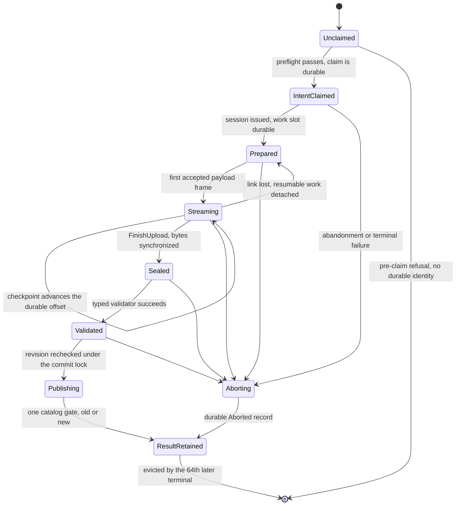

# Device Object System v2 contract

> **Superseded** by Epic #1256 / FS2. Do not extend; deletion lands in FS11 (#1393).

Status: **normative** for Device Object System v2 (DOS v2). DOS v2 uses OBC control wire protocol
major **3**. The architecture generation and wire major deliberately differ because the existing
descriptor protocol already uses wire major 2.

This document is the small system-level contract: ownership, identity, state, and durability. The
implementable byte and domain contracts are split by responsibility:

- [`Device_Object_Protocol_v3.md`](Device_Object_Protocol_v3.md) — control/stream bytes, operations,
  errors, retry behavior, authorization, and BLE/USB bindings;
- [`OBC2_Storage_Format.md`](OBC2_Storage_Format.md) — private FAT layout, records, crash protocol,
  recovery, leases, and bounded resources;
- [`Device_Object_Registries_v2.md`](Device_Object_Registries_v2.md) — object/draft kinds, metadata,
  result/detail registries, and narrow domain semantics;
- [`Device_Object_Vectors_v2.md`](Device_Object_Vectors_v2.md) — independent-codec vector and
  transcript requirements.

These four documents and this index are one versioned normative suite. A change is incomplete
unless every affected document and shared vector changes together. The
[decision record](../docs/decisions/DOS1-device-object-system-v2-contract.md) explains rationale but
does not override the suite.

DOS v2 objects are not everything the wire carries. The one v3 control link also carries a small
**device-control plane** — status and diagnostics, the bounded device configuration, the clock, bond
removal, and a link echo — frozen in the wire contract's device-control section. Those commands are
device state, not objects: they carry no OperationId, claim nothing, publish nothing, occupy no
retained result, and are answerable with no card present. Everything else in this document — the
identities, the claim point, the publication boundary, the bounded exactly-once window — describes
the object system alone, and no device-control command may be given object semantics to avoid
defining a new object kind.

The previous [`obc-ble-interface-spec.md`](obc-ble-interface-spec.md) describes the legacy
descriptor protocol. It remains useful only during coordinated development. A shipping DOS v2 peer
neither translates nor serves it.

## 1. Language and representation

`MUST`, `MUST NOT`, `SHOULD`, and `MAY` have their RFC 2119 meanings. All integers are unsigned
little-endian unless explicitly signed. Reserved fields and absent fixed-width optional values are
zero and decoders reject nonzero encodings.

CRC is CRC-32/IEEE: reflected polynomial `0xEDB88320`, initial and final XOR `0xFFFFFFFF`, with
`crc32("123456789") == 0xCBF43926`. It detects accidental corruption. It is never authentication,
identity, deduplication proof, or authorization.

## 2. Ownership boundaries

The architecture has six owners with narrow semantic seams:

1. A BLE or USB adapter owns physical framing, peer identity/authentication facts, notify or drain
   ordering, and the negotiated frame limit. It implements one bounded `ByteLink` seam.
2. One board-owned `TransferCoordinator` owns the single heavy-transfer slot, SessionId, fixed
   staging buffer, current offset, and matching-owner teardown.
3. The common transfer engine owns ordered framed bytes, CRC, checkpoint/resume, and terminal
   delivery. It has one upload and one download state machine for both links.
4. A blob transaction owns one prospective immutable generation through durable claim, append,
   checkpoint, seal, typed validation, publication, or durable abort.
5. One `CardStore` owns the mounted FAT volume, catalog commit store, reader leases, recovery, and
   garbage collection.
6. Concrete borrowed repositories own authorization, semantic validation, catalog projections,
   metadata policy, and domain commands.

The device-control plane has no owner in that list, and that is the point: status, configuration,
clock, bond removal, and echo are answered by the coordinator and the link layer from device state,
with no storage, repository, or transaction owner involved at all. `ResetStore` is the single
exception in that it destroys a store, and even it does so by asking `CardStore` for the explicit
reset the storage format defines rather than by acquiring any object-system capability.

Transport code cannot select filenames, validators, logical revisions, or domain policy.
Repositories cannot send link frames, drain endpoints, or retain a filesystem owner. CardStore
does not grow a union of every domain method: it lends transaction, lease, and catalog capabilities
to one concrete repository at a time.

Storage-private `GenerationId` and paths do not cross the public repository/client seam. Multipart
repositories receive an opaque parent-bound `DraftPartRef`; it conveys no authority, carries no
recoverable structure, and only CardStore resolves it to a sealed generation — by looking it up
among the rows it stored at seal — while validating and committing the matching manifest.

## 3. Mechanically distinct identities

Every first-party language uses distinct types with no implicit cross-conversion.

| Type | Representation | Scope and rule |
|---|---:|---|
| StoreId | 16 opaque bytes | Born with the first valid OBC2 checkpoint. Reformat/card replacement creates a new value. |
| LogicalObjectId | `u64` | Opaque inside one StoreId and ObjectKind. No sentinel or client-reserved band. |
| Revision | `u64` | Monotonic repository/object compare-and-swap token. Zero is a value, never absence. |
| GenerationId | `u64` | Store-private immutable payload identity. Never a companion link. |
| OperationId | 16 opaque bytes | Globally unique client/local-producer mutation identity, chosen before intent claim. |
| SessionId | nonzero `u32` | Ephemeral capability for one stream and one authenticated connection owner. |
| RequestId | nonzero `u32` | Control request/response correlation only. |
| WeatherRequestId | `u64` | Durable weather-domain request identity, never a control RequestId. |
| DraftPartRef | 16 opaque bytes | Device-issued random reference scoped to one durable multipart parent; never authorization. |

Sixteen-byte identities are copied verbatim and have no integer/UUID field byte order. Their
diagnostic spelling is 32 lower-case hexadecimal digits in wire-byte order. UUID field reordering
is forbidden.

A companion persistence key is `(device serial, StoreId, ObjectKind, LogicalObjectId)`. Revision is
its concurrency token. Filenames, display names, CRC, length, OperationId, DraftPartRef, and
GenerationId are not logical identity.

OperationIds are never reused by a conforming producer, including after their result is evicted.
Changing StoreId changes intent identity, so work from a removed card cannot attach to its
replacement.

## 4. Repository revisions and immutable publication

Each repository has one monotonic Revision. A logical mutation increments it exactly once; an
entry's Revision is the repository revision of that entry's latest mutation. The same ordering
drives compare-and-swap, snapshot catalog paging, and coalescing CommitEvent catch-up.
Revision never wraps; a repository at `u64::MAX` rejects further mutation as `resourceLimit` until
an explicit StoreId-changing reset.

`CommitEvent` is that catch-up signal and nothing more: an in-process notification a repository
emits after a catalog commit's validity gate is durable, carrying StoreId, repository, ObjectKind,
LogicalObjectId, the new Revision, and the operation's terminal outcome. It is not a wire message,
has no frame, opcode, or codec, and no peer subscribes to it; a client learns the same facts by
querying the catalog or the operation. Consecutive events for one repository may be coalesced into
the latest Revision, because a consumer that reads the current state loses nothing by skipping
intermediate ones. A consumer that missed events across a reboot obtains the identical catch-up from
the recovered repository Revision, so no durable event queue exists. DOS4 implements it; this
contract only fixes that it fires after the gate and never before.

A download always resolves the current committed head, and the device offers no way to address an
older one. There is no client-visible history: the catalog reports heads, a download names a logical
object, and the bytes it streams are the head that object had when the download was admitted. A
client that needs an older payload keeps its own copy rather than expecting the device to.

A displaced generation is therefore retained only while something concrete still needs it, and the
storage format enumerates those reasons exactly: a live reader lease pinning bytes a peer is
streaming, an update rollback holding the way back to the running image, and one bounded
domain-retention entry the weather repository uses to keep the previous bundle usable across a
context change. A displaced generation with no such reason is collectable immediately. The retention
table is bounded and its capacity exceeds the sum of every reason that can hold an entry at once, so
a mutation is never refused for want of a retention slot; capacity preflight proves that rather than
discovering it at publication.

A reader lease is a RAM-only capability, but the *reason bit* it sets on a retained entry is
durable, and the two must not be confused. Recovery clears an orphaned lease reason through a
durable retention record before garbage collection may act on that generation; clearing it only in
memory would let GC delete bytes the durable catalog still names. The storage format owns the
record, the ordering, and the bound on how many such records one recovery may append.

Transferred or locally produced bytes always create a prospective physical generation. Existing
generations are never overwritten. Publication occurs only after bytes are sealed and synchronized,
length/CRC checks pass, the concrete typed validator succeeds, and the expected Revision is
rechecked under the CardStore commit lock.

One durable catalog record contains the logical/repository transition, new Revision, canonical
OperationId intent digest, and terminal result. Its final validity gate is the only publication
point. Before that gate recovery exposes the old state; after it recovery exposes the new state and
the queryable result. Response loss changes delivery, not truth.

Metadata update, delete, ride acknowledgement, and update-install request use the same commit
discipline. Multipart child sealing is durable draft work, not publication; only the parent's
manifest commit makes its sealed children reachable as a release.

Device-local producers publish through exactly that path. A ride finalization, a weather-context
transition, a post-boot update-state observation, and a **sideload import** of a file staged on the
card by a reader each run under the one device-local principal scope, each with its own OperationId,
its own durable
claim, the same validation, and the same single catalog gate; none of them has a private shortcut
into the catalog. That scope is the same **local principal** the wire contract establishes at USB
attachment and gives the device's own user interface, so a cable client may query and abort
locally-initiated work — it is not a stranger to it. A staged file is untrusted foreign bytes until its import publishes, and it is
deleted only after that gate. Because every terminal result shares one store-global window, a local
producer's result occupies the same retention as a link client's and can evict it. The storage
format owns the staging area, the derived local identities, and the per-mount bound on how many
staged files one mount imports.

## 5. Operation identity and bounded exactly-once scope

After authentication, authorization, complete descriptor/schema validation, and preflight checks
that intentionally do not claim an operation, storage durably records `(StoreId, principal,
OperationId, full SHA-256 canonical intent)` before accepting mutation bytes or reporting a durable
reservation. That record is the claim point. The wire contract freezes the canonical bytes and
which rejection classes occur before or after it.

There is exactly one carve-out, and it is device-local. A ride recording is claimed by its domain
journal record: that record *is* the durable claim, binding the local OperationId, the reserved
GenerationId, and the recovery revision before any payload byte exists, while deliberately not
occupying an active-operation row and not being answerable to a status query until seal — a ride in
progress has no remote claimant to answer. It becomes an ordinary claimed operation at seal under
the identity that first record already fixed. No other subject, local or remote, may create payload
bytes ahead of an active-row claim.

The same OperationId and digest resumes or returns its work/result. The same OperationId with a
different digest is `operationIdConflict` and changes nothing. Session, RequestId, connection,
transport, chunking, and resume preference never participate in logical intent.

The store retains exactly the latest 64 terminal records, committed or durably Aborted, ordered by
terminal catalog sequence. The window is store-global across producers: a device-local ride,
weather, update-state, or import result consumes a slot exactly as a link client's does, so a client
cannot bound its own uncertainty by counting only its own mutations. Active work is separately
bounded and does not consume those slots.
Within that advertised window a lost result is recoverable through `QueryOperation`, including
after disconnect/reboot. The 64th newer terminal record deterministically evicts the oldest.

This is a bounded exactly-once guarantee, not an unbounded tombstone service. After eviction,
`Unknown` cannot distinguish never-seen from previously terminal. First-party clients persist
OperationId before sending, query uncertain jobs promptly, never reuse it, and reconcile catalog or
domain state after an evicted uncertainty; they never blindly replay it. Devices expose capacity
64, and client tests prove retention after 63 newer terminals and eviction by the 64th. No
wall-clock retry promise or hidden operation archive exists.

## 6. Session ownership and concurrency

A SessionId is valid only with its adapter link kind, authenticated principal, and connection
generation. Reconnect creates a new generation even for the same principal. A SessionId from
another wire or older connection cannot append, finish, abort, release a lease, or tear down the
current owner.

Only the coordinator may issue/revoke sessions. It never reuses a numeric SessionId within one
connection generation; it reconnects before exhausting the nonzero space. Wrong-owner data or
teardown leaves the current session and storage capability unchanged. Link loss releases ephemeral ownership, not durable
resumable work. A later authenticated same-principal request obtains a fresh SessionId at the last
durable offset. Durable abandonment addresses OperationId rather than a stale session.

Reader pin acquisition linearizes catalog resolution and lease allocation under CardStore.
Replacement or delete does not retarget/revoke an acquired lease. Lease tokens include slot
generation so a stale close cannot decrement a reused slot.

## 7. Explicit state boundaries

An upload follows:

```text
Unclaimed -> IntentClaimed -> Prepared -> Streaming -> Sealed
          -> Validated -> Publishing -> ResultRetained
```

The same machine with every transition named, including the ones that leave the happy path:



Failure before intent claim has no durable operation identity. Failure after claim is either a
retryable InProgress state or a durable Aborted terminal record. During Publishing the one catalog
gate selects old versus new. No state reports success before ResultRetained. An armed update install
is the one claimed operation that never enters Aborting: from its durable claim it runs through an
external handoff that recovery must complete, so the wire contract refuses a cancellation of it
before that cancellation claims anything.

The three vocabularies are one state machine seen from three layers. This document's prose names,
the wire's `QueryOperation` phase enum, and the storage record's phase byte map exactly:

| System prose state | Wire phase | Storage phase byte |
|---|---|---|
| Unclaimed; Received/Authenticated/Authorized | none — not reportable, no durable identity | none — no active row |
| IntentClaimed | prepared `0` | prepared `1` |
| Prepared | prepared `0` | prepared `1` |
| draft parent before its manifest phases | draft-open `6` | draft-open `2` |
| Streaming | streaming `1` | streaming `3` |
| Sealed | sealed `2` | sealed `4` |
| Validated; DomainValidated | validating `3` | validating `5` |
| Publishing; Committing | publishing `4` | publishing `6` |
| armed update install awaiting its boot handoff | external-handoff `5` | external-handoff `7` |
| Aborting | aborting `7` | aborting `8` |
| ResultRetained | none — reported as Committed or Aborted with its result | none — active row replaced by a terminal result |

The wire enum deliberately does not separate IntentClaimed from Prepared: a claim with no session
yet and a prepared transfer are the same fact to a client, which learns the difference from the
attachment flag rather than from a distinct phase. The wire and storage numbering differ because
each was allocated in its own order; neither is derived from the other, and a codec MUST translate
through this table rather than by arithmetic. A download projects no phase at all: it is not a
claimed operation.

A download follows:

```text
Resolving -> Pinned -> Streaming -> Completed -> Released
```

The pinned source never changes. Matching completion or abort releases it once. A malformed finish
or stale-owner teardown cannot release another reader's generation.

A command follows:

```text
Received -> Authenticated -> Authorized -> IntentClaimed
         -> DomainValidated -> Committing -> ResultRetained
```

Revision and safety facts are rechecked immediately before the commit. An implementation may do
expensive validation outside the owner lock, but cannot publish from a stale admission-time check.

## 8. Recovery, resource, and transport invariants

Recovery is incremental and idempotent. Until the catalog and active-work projection are known,
queries return recovery-in-progress rather than premature Unknown. Corruption never triggers
filename reconstruction, silent reformat, or speculative deletion. Garbage collection deletes
only a known-format generation proven unreachable from heads, retained predecessors, transitive
manifest children, update trial/rollback state, active/sealed work, and live leases.

Mounting classifies the medium before it trusts anything on it. A card carrying a filesystem this
format does not define — exFAT, a partitionless volume, an unknown layout — or one whose geometry
breaks the format's program-page assumptions is an **unsupported
filesystem**: a class of its own, distinct from a fresh card, from a recovery-failed store, and from
a degraded one, and one the device never writes to or formats. A missing or unreadable generation
file is narrower than any of those: it degrades exactly the one catalog entry that names it, at the
first pin that needs it, while the store stays mounted and writable. Only a lost gated metadata
record, a lost single-copy filesystem structure, or a recorded store-wide condition such as an
unreconciled update installation reaches a store-wide class. The storage format enumerates the
classes and the wire contract reports them verbatim; neither this document nor the wire invents one.

Durability rests on gated records and program-page separation, not on an assumption that a sector
write is atomic; the storage format's media and filesystem fault model owns those rules and this
document does not restate them. That model is also where the single-copy exposure of the FAT boot
sector, the FSInfo sector, and the directory sectors is named: losing one of them loses the location
of every metadata file at once, which is a store fault rather than a record fault, and no amount of
A/B redundancy inside the format defends against it.

All queues, work slots, draft parts, catalog projections, results, leases, frames, and metadata are
bounded by compiled and advertised capacities. Oversize or over-capacity work is refused before
payload transfer or partial allocation. No operation allocates an unbounded queue, creates a task,
or requires a whole large payload in RAM. The catalog projection itself is card-resident: RAM holds
a bounded index over it, not the projection, and the storage format fixes both that index's shape
and the rule that no implementation may move the projection into RAM to save a re-read.

BLE and USB share every semantic policy: identities, operations, offsets, CRC, validators,
checkpointing, publication, results, and owner checks. Physical authentication, frame carriage,
credit/endpoint pacing, timeout, and terminal drain are adapter facts frozen in the wire binding's
attachment section, including which link establishes which principal; this document does not
restate an attachment, characteristic, or endpoint. Transport preference is a capability/cost hint,
never a different object kind or storage path.

## 9. Update safety

Uploading an update publishes only VerifiedReady after independent signature, digest, target,
version/downgrade, and size validation. CRC is not trust. A separate authenticated and authorized
InstallUpdate command may automatically arm and reboot without physical confirmation after power
and runtime safety checks. Version monotonicity is a mandatory admission check on the device, not a
courtesy of the host asking for the install, and the runtime-safety checks explicitly include no
ride being tracked and no unsaved ride data as well as the power threshold. A package staged by
sideload import reaches VerifiedReady the same way and installs by the same explicit command; the
device's own UI, acting as a local principal, is one of the principals that may issue it.

The OBC2 format defines the crash-safe catalog-to-boot-handoff protocol. The trust boundary is the
one the update-image format freezes: the **application** independently verifies the package's
Ed25519 signature and digest before it arms the handoff, and the **bootloader** independently
revalidates the package's structure and CRC framing and enforces trial boot, application health
confirmation, and rollback. Cryptographic signature verification is not a bootloader obligation and
this suite does not impose one. Merely completing transport can never install an update.

## 10. Coordinated cutover

DOS v2 is one breaking cutover across firmware, on-card storage, iOS, TypeScript clients, desktop,
simulator, and test devices. Existing descriptor versions, 16-bit identities, sentinel bands,
filename identity/reconciliation, temporary upload names, held-magic promotion, private domain
runners, and old card objects are not translated or imported.

A legacy peer receives an incompatibility result only where the new header can be parsed; otherwise
discovery fails closed. An old card initializes a new OBC2 StoreId. Legacy directories remain
non-authoritative until explicit cleanup. Runtime dual read, dual write, compatibility forwarding,
and best-effort translation are forbidden.
