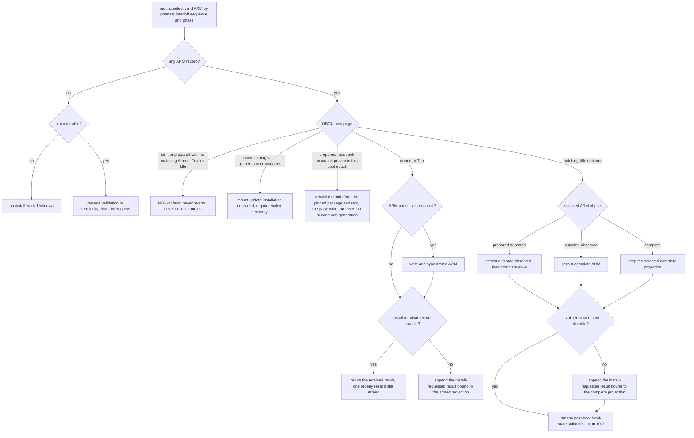

# OBC2 storage format

- Status: normative for Device Object System v2
- Format version: 1
- Wire contract: [`Device_Object_Protocol_v3.md`](Device_Object_Protocol_v3.md)
- Replaces: every earlier device-object catalog, staging, promotion, and sidecar mechanism

This document specifies the private, crash-safe FAT representation owned by `CardStore`. It does
not specify domain validation, wire framing, or a filesystem-shaped public API. Integers are
little-endian. Byte offsets are zero-based. Reserved bytes are written as zero and must be zero
when read. A decoder rejects arithmetic overflow, duplicate keys, out-of-order entries, an unknown
nonzero tag, or a count above its stated capacity before using any derived offset.

There is no DOS v1 import, discovery, dual-write, or fallback path. An explicit format/reset is the
only transition from another card layout and creates a new `StoreId`.

## 1. Ownership and durability vocabulary

`CardStore` is the only component allowed to mutate `/OBC2`. Its policy layer owns operation
claims, catalog compare-and-swap, revisions, draft membership, result retention, reachability, and
garbage collection. A FAT adapter owns paths, file handles, allocation, reads, writes, and
`sync_media`. Domain repositories provide validated projections and immutable payloads; they never
open these files directly.

`sync_media` means that all earlier filesystem changes, block-cache writes, card commands, and the
card's final not-busy state have completed successfully. It covers the payload bytes, the FAT chain
that reaches them, and the directory entry when and only when the recorded length changed. An
adapter that can only flush a software buffer does not implement this contract; section 13.1 states
the complete adapter obligation. A failed sync has an uncertain outcome and is resolved by
recovery; it is never evidence that the preceding mutation did not commit.

Every gated record has a body and a physically disjoint 512-byte gate sector. Writers invalidate
and synchronize an old gate before reusing its body, synchronize the complete new body, then write
and synchronize the new gate. Journal slots are the single exemption: a slot's gate carries the
epoch, so every slot of an earlier epoch is already inert against the selected checkpoint and is
rewritten body-then-gate with no preceding invalidation, saving one write and one sync per commit.
Checkpoint, WORK, RIDE, ARM, and INIT slots are not exempt. Readers require both CRCs and all
structural invariants. Together with the fault model in section 1.1 this detects every torn-write
case that model admits, with CRC-32's residual collision probability; CRC is not an authenticity
mechanism.

CRC fields use CRC-32/IEEE: reflected polynomial `0xEDB88320`, initial value and xor-out
`0xFFFF_FFFF`, and check value `CRC32("123456789") = 0xCBF43926`. A CRC field is treated as zero
while its containing record is checksummed.

### 1.1 Media and filesystem fault model

A 512-byte sector write is **not** assumed to be all-or-nothing. A cut during programming may
corrupt any sector inside the media program page being programmed. The program page `P` is a format
constant of 16,384 bytes. DOS2 may measure a smaller physical page on the shipped media, but a
measured value never shrinks an on-card stride; the strides below are fixed by this format version.

Every OBC2 metadata file is a whole number of 16,384-byte slots and every gated slot begins at a
multiple of that stride **inside its file**. File offsets are not physical addresses, so that fact
alone proves nothing about program pages: the geometry preconditions below are what turn a slot
stride into a physical page.

**Volume geometry preconditions.** Both are normative and are decided before anything on the card
is trusted:

1. the cluster size — `bytes_per_sector × sectors_per_cluster` — MUST be a whole multiple of the
   16,384-byte program page, so it is exactly 16,384 or 32,768 bytes;
2. the first byte of the FAT data region MUST be 16,384-aligned relative to the card's physical
   LBA 0. The check is computable from the partition entry and the BPB alone:
   `(partition_start_lba + reserved_sector_count + fat_count × fat_size_sectors + root_dir_sectors)
   × bytes_per_sector` must be a multiple of 16,384, where `root_dir_sectors` is the FAT16 fixed
   root-directory region and zero on FAT32.

Mount computes both before it looks for `/OBC2`. A volume that fails either mounts **unsupported
filesystem** with its own diagnostic, distinct from the diagnostic for an unrecognised filesystem
type, and nothing is written. This is a statement about how a card was prepared, not a repair step,
because the device never formats: the SD Association formatter's 4 MiB partition alignment with
16 KiB or 32 KiB clusters satisfies both conditions, as does an untouched factory SDHC/SDXC format
at those cluster sizes. The check is filesystem-type-neutral — a FAT16 volume that satisfies both is
admitted and a FAT32 volume that fails either is not — but at the card sizes this product uses only
FAT32 volumes reach these cluster sizes in practice, so guidance offered to a rider says FAT32.

Under those preconditions a file's cluster chain may be arbitrarily fragmented without weakening
anything. Every cluster begins at a physical multiple of 16,384 and spans a whole number of program
pages, so the physical address of file offset `o` is `cluster_start + (o mod cluster_size)` and both
terms are multiples of 16,384 whenever `o` is. Every 16,384-aligned offset of a file on such a
volume is therefore physically page-aligned.

That is the whole isolation argument. Each 16,384-byte slot occupies exactly one program page and no
two slots share one **because slots are page-sized and page-aligned**, not because of any distance
between them: slot `k` and slot `k + 1` are in different pages for that reason alone, and each
65,536-byte checkpoint file occupies four exclusive pages. Padding a file of an alternating pair to
a whole number of strides is what places its second slot on a stride boundary; the padding is not
itself the guarantee. A slot's body and its own gate deliberately share one page: a cut anywhere
inside the slot invalidates the whole slot, which is exactly the "this record never became durable"
outcome the gate exists to expose.

The fault-isolation assumption is that a write may corrupt sectors inside the program page being
written and does not corrupt bytes lying in another program page. DOS2 must validate this assumption
on the shipped media; a violation is a format-version matter, not a runtime workaround.

The alternating gated pairs are `CAT0.CHK`/`CAT1.CHK`, `ARM0.HND`/`ARM1.HND`, and the two `WORK`
slots at file offsets 0 and 16,384. The sequential slot arrays — 256 journal slots and 16 `RIDE.ACT`
slots — occupy one page each, so writing slot `k` cannot damage slot `k - 1`, and section 6.3's
all-slot scan turns any loss that does occur into a fail-closed mount rather than a silent
rollback.

A torn `RIDE.ACT` page destroys at most the slot being written. Recovery falls back to the newest
valid earlier slot, losing at most one ride-checkpoint interval of samples and elapsed time, and
truncates the GEN payload to that slot's durable offset. That bounded loss is accepted for a ride
journal and is not a store fault.

Staged sideload files are outside this model in the other direction: they carry no gate, no CRC, and
no sequence, so a torn or truncated staged file is not a store fault at all. It fails its import's
domain validation like any other bad payload and leaves the store exactly as it was.

The FAT boot sector, the FSInfo sector, and directory sectors are single-copy structures outside
this model; only the FAT itself is mirrored, and only when the volume declares two copies. Losing
one of those sectors destroys file locations for the whole store: it is an unrecoverable store
fault, not a gated-record fault, and mounts recovery-failed and read-only with evidence preserved.
It is never silently reinitialized. Section 13.1 requires the adapter to stop rewriting them on
every sync, so that this exposure is confined to initialization and to writes that change a
recorded length.

The remaining volume preconditions are normative too. The card carries an MBR partition table; the
OBC2 partition type is `0x04`, `0x06`, `0x0B`, `0x0C`, or `0x0E`; the filesystem is FAT16 or FAT32
and satisfies both geometry preconditions above; the volume is at most 2 TiB; and every file length
is at most `0xFFFF_FFFF`. exFAT, partitionless superfloppy volumes, a misaligned data region, a
cluster size that is not a whole program page, and every other layout are an **unsupported
filesystem**: a mount class distinct from a fresh card, from a corrupt store, and from a degraded
store. The device never formats a card and never writes to a volume it classifies as unsupported.

## 2. Contract capacities

These are v1 format and product limits, not values inferred from available RAM at runtime. This
section is the sole authority for them; any other document that lists them, including the wire
contract's resource-limit mirror, restates values owned here and is corrected against this table.
The wire ResourceLimits block reports them, while per-subject capabilities report maximum lengths;
admission enforces every limit before creating payload bytes. Raising a limit requires a resource
review; changing a fixed array size or file size is an OBC2 format-version change.

| Limit | Value |
| :-- | --: |
| Logical catalog heads, all kinds | 256 |
| Route heads | 64 |
| Trip heads | 16 |
| Ride heads | 128 |
| Weather heads | 1 |
| Volume-manifest heads | 8 |
| Update-package heads | 8 |
| Normal active claimed operations | 8 |
| Reserved maintenance/cancellation/recovery claims | 1 |
| Active resumable upload/work records | 4 |
| Attached heavy stream sessions, system-wide | 1 |
| Active draft parents | 1 |
| Sealed or streaming draft parts | 32 |
| Children referenced by one manifest | 32 |
| Simultaneously mounted map data files on the current board | 11 |
| Live download leases | 4 |
| Retained previous generations | 8 |
| Active or recoverable ride journals | 1 |
| Terminal operation results | 64 |
| Journal slots | 256 |
| Journal compaction trigger | 192 valid slots |
| Inactive-work retention horizon | 256 later terminal commits |
| Maximum one embedded FAT generation | `0xFFFF_FFFF` bytes |

Map draft parts do not consume logical-head slots. A selected volume manifest may reference at most
11 files that must be held open together on the current board; an unselected manifest may contain
up to 32 children. Selection is rejected before publication if its mount set exceeds the board
limit. Per-kind limits and the all-kind limit are both enforced.

One draft parent at a time is a deliberate simplification rather than a resource cut: the 32-part
budget belongs entirely to that parent, so the part budget and the parent's declared count are the
same number and no global-versus-declared reservation arithmetic exists. The eight retained-previous
entries likewise exceed the seven a legitimate workload can hold at once — four live leases, two
update-rollback entries, and the one weather domain-retention entry — so the table has one entry of
margin and admission never has to refuse a mutation for want of one.

There is deliberately no wall-clock work TTL. The device cannot assume trusted time, so resumable
work expires after 256 terminal commits following its last durable progress, evaluated as section
6.1 states. Expiry is itself a
terminal `Aborted` commit before files become collectable. If no commits occur, work remains
resumable; the bounded active-work capacity prevents unbounded growth.

The 64-result guarantee is likewise count-bound. A terminal result remains queryable while it is
one of the latest 64; the 64th newer terminal commit evicts it. After eviction, `QueryOperation`
returns `Unknown`, which is an indeterminate old outcome, not permission to retry that identity. A
client must never reuse an `OperationId` for the lifetime of its installation, even after card
reset or a result becomes unknown. OBC2 stores no unbounded tombstone set to compensate for a
client violating that rule.

## 3. FAT tree and identity mapping

Firmware creates uppercase FAT 8.3 names only. It does not require rename.

```text
/OBC2/
  CAT0.CHK       checkpoint A, 65,536 bytes
  CAT1.CHK       checkpoint B, 65,536 bytes
  COMMIT.JNL     256 fixed slots, 4,194,304 bytes
  ARM0.HND       update-handoff A, 16,384 bytes
  ARM1.HND       update-handoff B, 16,384 bytes
  RIDE.ACT       active-ride recovery journal, 262,144 bytes
  INIT.REC       incomplete-initialization witness, 16,384 bytes
  GEN/
    XX/
      BBBBBBBB.BBB
  WORK/
    XX/
      BBBBBBBB.BBB
  IMPORT/
    NNNNNNNN.EEE  staged sideload files, foreign bytes (section 12.1)
```

`XX` is the low byte of `GenerationId` as two uppercase hexadecimal digits. The 11 `B` characters
are `GenerationId >> 8` encoded as fixed-width uppercase base-36 and split into an eight-character
stem and three-character extension. Because `36^11 > 2^56`, the mapping is reversible and
collision-free. The same leaf identifies a raw payload under `GEN` and its record under `WORK`.
Opening a leaf consumes the four configured directory handles: volume root, `OBC2`, role, shard.

`/OBC2/IMPORT` is the sideload staging area of section 12.1. Its contents are foreign bytes written
by a card reader, never OBC2 records: nothing there is gated, sequenced, or reachable, and no rule
in this document reads a staged file except the import path itself.

`GEN` files are exactly the canonical payload bytes and contain no OBC2 wrapper. A generation is
store-global, monotonically reserved, never reused, and never wrapped. Zero is a valid first
GenerationId; record state/presence, never its numeric value, distinguishes absence. Generation
filenames are private and never serve as logical identities or wire references.

## 4. Common gate sector

Every gated record carries exactly one 512-byte gate sector, physically disjoint from its body and
inside the same 16,384-byte slot. The gate's offset is **not** common: each record type's section
fixes where its gate sits, because the body sizes differ and a gate always follows its own body
rather than trailing the slot's pad. Those offsets, gathered here for reference and normative in the
sections that own them, are:

| Record | Gate offset | Section |
| :-- | --: | :-- |
| catalog checkpoint | 65,024 in the file | 5 |
| journal slot | slot base `+ 1,536` | 6 |
| WORK slot | slot base `+ 512` | 7 |
| `RIDE.ACT` slot | slot base `+ 512` | 7.1 |
| `ARM0.HND`/`ARM1.HND` | 512 in the file | 10 |
| `INIT.REC` | 512 in the file | 12 |

The 512 gate bytes themselves have one layout everywhere:

| Offset | Size | Field |
| --: | --: | :-- |
| 0 | 4 | gate magic, specific to the containing record |
| 4 | 2 | format version, `1` |
| 6 | 2 | physical slot index |
| 8 | 8 | scope: epoch, `GenerationId`, handoff sequence, or initialization binding |
| 16 | 8 | logical sequence represented by the body |
| 24 | 4 | body CRC-32 |
| 28 | 4 | one's complement of body CRC-32 |
| 32 | 4 | gate CRC-32 over all 512 gate bytes with this field zero |
| 36 | 476 | zero |

A gate is valid only when its magic and slot index match its physical location, its version is
known, the complement is exact, its body CRC equals both the body's stored CRC and a fresh CRC of
the body, its scope and sequence equal the body, and its gate CRC validates. A gate that fails any
of those checks is invalid; there is no partially valid gate and no repair path.

Invalidating a gate means writing 512 zero bytes over exactly that gate sector and synchronizing.
An all-zero gate fails the magic and CRC checks, so invalidation needs no distinct sentinel value
and no read-modify-write. The body under an invalidated gate is meaningless and may be rewritten
freely. Gate magics are
`O2CG` (checkpoint), `O2JG` (journal), `O2WG` (work), `O2RG` (ride recovery), `O2HG`
(handoff), and `O2IG` (initialization).

## 5. Catalog checkpoint

Each checkpoint file is exactly 65,536 bytes — four 16,384-byte slot strides — holding 65,024 body
bytes followed by one gate sector. The body CRC is at bytes `65020..65024`. Its gate uses physical
slot 0 or 1, scope `epoch`, and logical sequence `through_sequence`.

### 5.1 Fixed regions

| Byte range | Entry shape | Capacity |
| :-- | :-- | --: |
| `0..128` | checkpoint header | 1 |
| `128..512` | repository state, 24 bytes | 16 |
| `512..41472` | catalog head, 160 bytes | 256 |
| `41472..42624` | active operation, 128 bytes | 9 |
| `42624..42752` | draft parent, 128 bytes | 1 |
| `42752..45824` | draft part, 96 bytes | 32 |
| `45824..46336` | retained previous generation, 64 bytes | 8 |
| `46336..59648` | terminal result, 208 bytes | 64 |
| `59648..59888` | update handoff projection, 240 bytes | 1 |
| `59888..59968` | weather request state, 80 bytes | 1 |
| `59968..60096` | active ride state, 128 bytes | 1 |
| `60096..65020` | zero | — |
| `65020..65024` | body CRC-32 | 1 |

Entries in each occupied prefix are sorted by their stated key and the remaining entries are all
zero. A key of two or more fields sorts by those fields in the order stated for that entry, and a
16-byte identity field sorts lexicographically over its wire byte order — bytes `0..16` compared as
unsigned octets, not as an integer. Counts in the header select the occupied prefix. The result
region is the sole exception: it is a circular array described by `result_start` and
`result_count`.

### 5.2 Header

| Offset | Size | Field |
| --: | --: | :-- |
| 0 | 4 | magic `O2CK` |
| 4 | 2 | format version `1` |
| 6 | 2 | header length `128` |
| 8 | 16 | `StoreId` |
| 24 | 8 | epoch, nonzero |
| 32 | 8 | through-sequence |
| 40 | 8 | next `GenerationId` |
| 48 | 2 | repository-state count |
| 50 | 2 | catalog-head count |
| 52 | 1 | active-operation count, `0..9`; at most eight normal rows and at most one reserved-flag row |
| 53 | 1 | draft-parent count, `0..1` |
| 54 | 1 | draft-part count, `0..32` |
| 55 | 1 | retained-previous count, `0..8` |
| 56 | 1 | result start index, `0..63` |
| 57 | 1 | result count, `0..64` |
| 58 | 1 | handoff count, `0..1` |
| 59 | 1 | flags; bit 0 is recovery-degraded, all others zero |
| 60 | 8 | terminal-commit counter used for work expiry |
| 68 | 4 | fixed body bytes, `65024` |
| 72 | 32 | zero; reserved and never reassigned in format 1 |
| 104 | 1 | weather-state count, `0..1` |
| 105 | 1 | active-ride-state count, `0..1` |
| 106 | 22 | zero |

The header counts must agree with the decoded regions. The active region is valid only with at most
eight rows whose reserved-slot flag is clear, at most one whose flag is set, and at most nine total;
a completed reserved operation removes its row rather than retaining a terminal row here. `next
GenerationId` is greater than every reserved generation. Sequences and generation IDs never wrap;
reaching `u64::MAX` mounts the store read-only until explicit reset.

### 5.3 Projection entries

Repository states are keyed by `ObjectKind`: kind `u16`, flags `u16` (logical-ID space exhausted
bit 0), four zero bytes, revision `u64`, and next logical-ID candidate `u64`. Zero is a valid first
candidate. Allocating `u64::MAX` sets exhausted rather than wrapping; failed/aborted creates do not
put their reserved ID back.

A catalog head is keyed by `(ObjectKind, LogicalObjectId)`:

| Offset | Size | Field |
| --: | --: | :-- |
| 0 | 1 | occupied, exactly `1` |
| 1 | 1 | flags: resolution present bit 0; other bits zero |
| 2 | 2 | object kind |
| 4 | 8 | logical object ID |
| 12 | 8 | repository revision of this head |
| 20 | 8 | generation ID |
| 28 | 8 | payload length |
| 36 | 4 | payload CRC-32 |
| 40 | 2 | catalog-projection envelope length, `8..96` |
| 42 | 6 | zero |
| 48 | 96 | canonical catalog-projection envelope followed by zero |
| 144 | 8 | resolution `GenerationId`; zero and unused unless the resolution-present flag is set |
| 152 | 8 | zero |

The 96-byte envelope reservation is exactly the catalog-projection ceiling of the metadata
registry; a larger envelope is a registry and format-version change, not a runtime overflow.

The head-entry flags byte at offset 1 is zero for every kind whose payload names no children. A
published volume manifest sets **resolution present** bit 0 and carries at offset 144 the
`GenerationId` of the resolution generation section 8 defines — the small store-private table that
maps this manifest's `DraftPartRef` values to the generations they were sealed as. That field is how
garbage collection reaches a manifest's children without decoding anything out of a reference, and
it is written by the same terminal record that publishes the head. Both the flag and the field are
store-private: `QueryCatalog` projects the envelope, never this pair, and the wire entry's own flags
stay zero.

An active operation is keyed by `OperationId`:

| Offset | Size | Field |
| --: | --: | :-- |
| 0 | 16 | operation ID |
| 16 | 32 | complete SHA-256 canonical-intent digest |
| 48 | 32 | opaque stable principal-scope digest |
| 80 | 2 | opcode |
| 82 | 2 | logical ObjectKind or DraftPartKind; zero only when the opcode has no subject |
| 84 | 1 | phase: prepared `1`, draft-open `2`, streaming `3`, sealed `4`, validating `5`, publishing `6`, external-handoff `7`, aborting `8` |
| 85 | 1 | flags: bit 0 resumable; bit 1 draft parent; bit 2 draft child; bit 3 reserved cancellation/recovery slot; bit 4 generation reserved; others zero |
| 86 | 2 | zero |
| 88 | 8 | logical object ID, inactive zero when the opcode has no logical target and valid including zero otherwise; AbortOperation target bytes `0..8` |
| 96 | 8 | expected revision, inactive zero when target mode is not replace and valid including zero otherwise; AbortOperation target bytes `8..16` |
| 104 | 8 | private generation ID; meaningful only when flag bit 4 is set, and then zero is valid |
| 112 | 8 | terminal-commit counter at last durable progress |
| 120 | 4 | latest work-checkpoint sequence, inactive zero without work; zero is valid with work |
| 124 | 1 | AbortOperation reason; zero for every other opcode |
| 125 | 3 | zero |

Eight rows are available to ordinary remote or local claims. The ninth is identified by flag bit 3
and is reserved for one AbortOperation or deterministic local recovery/publication claim, so eight
saturated normal rows cannot make their cancellation structurally impossible. Those maintenance
uses serialize with each other and must leave the reserved row terminal before another begins.
QueryOperation projects storage phases prepared, streaming, sealed, validating, publishing,
external-handoff, draft-open, and aborting as wire phases `0` through `7`, respectively. A local
recovery/publication claim uses validating while checking durable domain evidence and publishing
after it has a complete commit mutation; it does not invent another wire phase. Session attachment
is joined from the coordinator at query time and is not persisted here.

The `opcode` field of an active or terminal row is a wire opcode wherever one exists. A device-local
producer that mirrors a wire operation stores that operation's opcode: a ride publication and a
staged route or update-package import store `0x0100`, and a staged map import stores `0x0130` for
its draft parent and `0x0131` for its single child. The two local transitions with no wire operation
at all store a **storage-internal claim tag** instead, registered only here and never valid on the
wire:

| Tag | Local claim |
| --: | :-- |
| `0xFF01` | weather-context change (this section) |
| `0xFF02` | post-boot update-state reconciliation (section 10.2) |

A tag in the `0xFF00` block never appears in a control frame and `QueryOperation` never projects
one: these claims answer only to the device-local principal, and their results are storage-local
`DomainResult` bodies. A row whose opcode is neither a registered wire opcode nor a registered tag
is a structurally invalid checkpoint.

Every device-local producer — ride recording and publication, weather-context change, post-boot
update state, and staged import — runs under one **local principal scope** with one principal-scope
digest. The named producers are roles inside that scope, not separate scopes, and the wire contract
binds the same scope to USB attachment and to the device's own UI, which is what lets a cable client
query and abort UI-initiated work.

A draft parent is keyed by parent `OperationId`:

| Offset | Size | Field |
| --: | --: | :-- |
| 0 | 16 | parent operation ID |
| 16 | 32 | BeginDraft intent digest |
| 48 | 8 | private parent-manifest GenerationId; draft state says whether it is present |
| 56 | 2 | final manifest object kind |
| 58 | 2 | declared part count |
| 60 | 1 | state: open `1`, manifest-streaming `2`, finalizing `3`, aborting `4` |
| 61 | 1 | target mode: create `0`, replace `1` |
| 62 | 2 | zero |
| 64 | 8 | target logical ID, zero for create |
| 72 | 8 | expected revision, zero for create |
| 80 | 8 | declared final manifest length |
| 88 | 4 | declared final manifest CRC-32 |
| 92 | 4 | zero |
| 96 | 8 | monotonic DraftRevision |
| 104 | 8 | terminal-commit counter at last durable progress |
| 112 | 4 | latest parent-manifest WORK sequence |
| 116 | 8 | reserved resolution `GenerationId`; meaningful only in state `finalizing`, and then zero is valid |
| 124 | 4 | zero |

`BeginDraft` creates this row and durably claims the complete manifest target, compare-and-swap,
length, CRC, and part count. Only one parent row may exist, so `declared part count` is simply
checked against the 32-part budget the parent then owns outright; there is no global-versus-declared
reservation to keep, and section 11 states the one admission rule that remains.
`DraftRevision` begins at `1` for a newly created parent and
increments exactly when a child is durably claimed, sealed, or durably aborted. A durable payload
checkpoint of a child does **not** increment it; membership, not progress, is what a draft snapshot
pages over.
`FinalizeDraft(parent OperationId)` opens or resumes a parent-owned
manifest stream under the already claimed parent operation; the manifest has a private GenerationId
but no DraftPartRef. Finishing that stream validates and publishes. The parent is not an
independently invented `DraftId`.

A draft part is keyed by `(parent OperationId, DraftPartKind, part key)`:

| Offset | Size | Field |
| --: | --: | :-- |
| 0 | 16 | parent operation ID |
| 16 | 16 | child operation ID |
| 32 | 16 | opaque `DraftPartRef` returned to the client |
| 48 | 2 | DraftPartKind |
| 50 | 2 | zero |
| 52 | 8 | part key |
| 60 | 8 | private generation ID |
| 68 | 8 | payload length |
| 76 | 4 | payload CRC-32 |
| 80 | 1 | state: streaming `1`, sealed `2`, aborted `3`, prepared `4` |
| 81 | 15 | zero |

The storage state values were allocated in the order the states were needed, so they are not the
wire values and a codec translates rather than casts: `QueryDraft` projects storage states prepared
`4`, streaming `1`, sealed `2`, and aborted `3` onto wire part states `0`, `1`, `2`, and `3`
respectively, exactly as section 5.3 projects operation phases. A child is `prepared` from the
journal record that claims it until its first accepted payload byte, and `streaming` from that byte
on; a claimed child that is aborted before any byte therefore leaves `prepared` for `aborted`
without ever being `streaming`.

`DraftPartRef` is zero while a part is prepared or streaming and is minted at seal as **16 bytes
drawn from the device CSPRNG**. It has no structure: it is not derived from the generation, the
part key, the parent, or anything else, and nothing about it can be decoded, verified in isolation,
or recomputed. Its only meaning is the row it is stored in — this same draft-part entry, which holds
the pair `(DraftPartRef, GenerationId)` from seal until the parent terminates. Clients compare it or
place it in the matching manifest and cannot derive or choose a `GenerationId`.

Uniqueness rests on 128 bits of randomness inside a set the format bounds at 32 live parts. The
device MAY re-draw on the astronomically unlikely collision with a ref already live under the same
parent; it never has to search the card, because a ref outlives its row only inside a published
manifest, whose resolution generation (section 8) is what later resolves it.

Validation is a lookup, not a decode. Finalizing the parent requires each reference in the manifest
to be byte-equal to the `DraftPartRef` of one sealed row of that same parent, and that row's stored
`GenerationId` is the generation the reference denotes. A forged, foreign, or stale reference misses
that lookup and the manifest is rejected. Store reset destroys the rows, so no old ref resolves
afterwards.

A retained-previous entry is keyed by `GenerationId`:

| Offset | Size | Field |
| --: | --: | :-- |
| 0 | 1 | occupied, exactly `1` |
| 1 | 1 | reason flags: live lease bit 0, update rollback bit 1, domain retention bit 2 |
| 2 | 2 | lease count |
| 4 | 2 | object kind |
| 6 | 2 | zero |
| 8 | 8 | logical object ID |
| 16 | 8 | generation ID |
| 24 | 8 | length |
| 32 | 4 | payload CRC-32 |
| 36 | 4 | zero |
| 40 | 8 | retain-through terminal counter; `0` means reason-controlled |
| 48 | 8 | object Revision this generation was the head at |
| 56 | 8 | zero |

`object Revision` is the repository Revision whose head this generation was. It is a diagnostic and
domain fact — which head these bytes were — and nothing resolves an entry through it: no wire
request names a retained generation, so the table has no lookup key but `GenerationId` and no
ordering rule among entries of one kind.

The three reasons are exactly the three things that can still need a displaced generation, and each
has an owner that eventually releases it. **Live lease** bit 0 is set by the publication that
displaces a head a reader is streaming, and carries that reader's count. **Update rollback** bit 1
holds the way back to the running image and is cleared only by update reconciliation. **Domain
retention** bit 2 is a repository's own bounded continuity policy; in format 1 exactly one
repository uses it — weather, which keeps the single previous bundle usable while its next request
is still pending — with a capacity of exactly one entry, and a repository that sets it while an
entry of its own already carries it replaces that entry rather than adding a second. An entry whose
reasons have all been cleared is removed and its generation becomes collectable.

Download
leases are RAM ownership facts and disappear on reboot; recovery clears their bit durably, through
a retention journal record, before reachability is recomputed. Update rollback reachability
persists until handoff reconciliation.

A terminal result is keyed and ordered by its commit sequence. The principal digest is required so
status can be authorized without revealing whether another principal owns the OperationId:

| Offset | Size | Field |
| --: | --: | :-- |
| 0 | 8 | terminal commit sequence |
| 8 | 16 | operation ID |
| 24 | 32 | canonical-intent digest |
| 56 | 32 | opaque stable principal-scope digest |
| 88 | 1 | terminal state: committed `1`, aborted `2` |
| 89 | 1 | result type: aborted `0`, ObjectResult `1`, DraftPartResult `2`, AbortResult `3`, DomainResult `4` |
| 90 | 2 | encoded length: aborted ErrorBody `48`, or result `64`, `88`, `56`, or `48` respectively |
| 92 | 12 | zero |
| 104 | 88 | exact result or diagnostic-text-free ErrorBody, followed by zero |
| 192 | 16 | zero |

DomainResult body bytes are OperationId `[16]`, StoreId `[16]`, ObjectKind/domain `u16`, outcome
`u16`, domain-state revision `u64`, and reserved zero `u32`, exactly 48 bytes. OBC2 uses outcome
`weatherRequestChanged` `1` and `updateStateChanged` `2`; ride publication remains ObjectResult.
DomainResult is a storage-local result codec and is not a public link ResultEnvelope.

`terminal commit sequence` is the checkpoint's terminal-commit counter after increment, not the
journal sequence. Ring append writes `(result_start + result_count) mod 64`; when already full it
overwrites `result_start` and advances that index by one. This is the only eviction path.

The update-handoff projection uses the `HandoffRef` codec in section 10. Header counts and the
result-ring indices select occupied entries, so an all-zero opaque identity remains valid and is
never repurposed as an empty-slot sentinel.

The one weather-request state has this exact 80-byte codec:

| Offset | Size | Field |
| --: | --: | :-- |
| 0 | 1 | occupied, exactly `1` |
| 1 | 1 | state: pending `1`, satisfied `2` |
| 2 | 2 | flags: weather head present bit 0; others zero |
| 4 | 8 | WeatherRequestId |
| 12 | 8 | request-context revision |
| 20 | 8 | reserved weather LogicalObjectId |
| 28 | 8 | weather repository Revision captured for response CAS |
| 36 | 4 | required centre latitude, signed degrees times 10,000,000 |
| 40 | 4 | required centre longitude, signed degrees times 10,000,000 |
| 44 | 4 | required radius metres |
| 48 | 4 | zero |
| 52 | 8 | earliest issued UTC, signed Unix seconds |
| 60 | 8 | required valid-until UTC, signed Unix seconds |
| 68 | 8 | head WeatherRequestId; inactive zero only when head-present is clear |
| 76 | 4 | zero |

Signed fields are stored as their little-endian two's-complement bits. Request ID and context
revision never wrap. A device-local weather-context change uses the local-producer principal and a
durable claim in the reserved ninth row. Its OperationId is the first 16 SHA-256 bytes of
ASCII `O2-LOCAL-WX-ID\0`, StoreId, new WeatherRequestId `u64`, and new context revision `u64`.
Canonical intent is full SHA-256 over ASCII `O2-LOCAL-WX-INTENT\0`, StoreId, and the exact new
80-byte WeatherState encoding. The terminal record atomically puts this state and appends
DomainResult outcome `weatherRequestChanged` with domain-state revision equal to the new
request-context revision; it does not change the weather object repository
Revision. Publishing a bundle always puts the resulting weather state in the same terminal record
as the catalog head, repository Revision, and ObjectResult, and there is exactly one publishing
case: a bundle that answers the current request sets `satisfied` and its head request ID. A bundle
naming any other request is rejected at validation and changes nothing. No reboot can expose the new
head with the old request state.

The displaced bundle is what the weather repository's domain-retention entry (bit 2 of the retained
generation's reason flags) holds, and it holds at most one. A replacement runs in two durable steps:
first one ordinary retention record clearing bit 2 from the entry the previous replacement retained,
removing that entry when no reason remains; then the terminal publication record, which retains the
generation it now displaces under the same reason. A cut between them leaves the table with no
domain-retention entry or with exactly one, never two, and the second step is the ordinary terminal
commit of a claimed operation, resumed or aborted by the ordinary rules. The repository therefore
keeps the immediately previous bundle
readable to its own reader while the next request is pending, and never accumulates a history.

Deleting the weather head uses one terminal record that removes the catalog head, advances the
weather repository Revision, appends the delete ObjectResult, and puts WeatherState with
head-present clear, the inactive head request ID zeroed, and context state pending. It preserves
the WeatherRequestId, request-context revision, singleton identity, and requested coverage/time
facts. The gate therefore exposes either the old head with its old state or no head with the same
request pending; QueryWeatherRequest cannot observe a stale head fact after deletion.

The one active-ride state has this exact 128-byte codec:

| Offset | Size | Field |
| --: | --: | :-- |
| 0 | 1 | occupied, exactly `1` |
| 1 | 1 | state: recording `1`, stopping `2`, sealed `3`, claimed `4`, recovery-fault `5` |
| 2 | 1 | flags: historical route snapshot present bit 0; others zero |
| 3 | 5 | zero |
| 8 | 8 | ride-recovery revision, equal to the initial domain journal sequence |
| 16 | 16 | CSPRNG local publication OperationId |
| 32 | 32 | device-local ride-producer principal digest |
| 64 | 8 | prospective ride GenerationId |
| 72 | 8 | start UTC, signed Unix seconds |
| 80 | 8 | historical route LogicalObjectId; inactive zero when flag bit 0 is clear and valid including zero when set |
| 88 | 8 | historical route Revision; inactive zero when flag bit 0 is clear and valid including zero when set |
| 96 | 32 | zero; payload progress and seal facts are authoritative only in RIDE.ACT |

The route pair is a historical start-of-ride snapshot, not a lease or mutable relationship. The
ride-recovery revision is the globally unique sequence of the initial domain record and remains
fixed for that ride. This projection
is authoritative for existence, identity, and lifecycle state; RIDE.ACT is authoritative for
payload progress and seal facts. Ride recovery remains UI-neutral until ordinary ride publication
creates a catalog head.

## 6. Commit journal

`COMMIT.JNL` is 4,194,304 bytes: 256 slots of 16,384 bytes. Each slot holds a 1,536-byte body at
its slot base, a 512-byte `O2JG` gate at base `+ 1,536`, and 14,336 zero bytes to the next stride,
so writing one slot can never damage another (section 1.1). A slot is written once in an epoch.
Body bytes `1532..1536` of the slot hold the body CRC.

### 6.1 Journal body

| Offset | Size | Field |
| --: | --: | :-- |
| 0 | 4 | magic `O2JR` |
| 4 | 2 | format version `1` |
| 6 | 2 | header length `96` |
| 8 | 16 | StoreId |
| 24 | 8 | epoch |
| 32 | 8 | globally contiguous sequence |
| 40 | 2 | physical slot index |
| 42 | 2 | record kind: claim `1`, work `2`, terminal `3`, retention `4`, handoff `5`, domain `6` |
| 44 | 16 | operation ID, zero only for retention, pre-claim ride recovery, or completed-handoff cleanup |
| 60 | 32 | canonical-intent digest, zero only for retention, pre-claim ride recovery, or completed-handoff cleanup |
| 92 | 2 | mutation length, exactly `1272` |
| 94 | 2 | zero |
| 96 | 1272 | mutation |
| 1368 | 164 | zero |
| 1532 | 4 | body CRC-32 |

The fixed mutation is a compact projection delta, not a union of domain payloads:

| Mutation offset | Size | Field |
| --: | --: | :-- |
| 0 | 2 | mutation version `1` |
| 2 | 2 | zero |
| 4 | 4 | presence flags, below |
| 8 | 2 | repository kind or zero |
| 10 | 2 | record kind, equal to header |
| 12 | 8 | new repository revision or zero |
| 20 | 8 | next logical-ID candidate or zero |
| 28 | 2 | repository flags; logical-ID exhausted bit 0 |
| 30 | 2 | zero |
| 32 | 8 | new next-GenerationId cursor or zero |
| 40 | 128 | active-operation entry |
| 168 | 160 | catalog-head entry |
| 328 | 128 | draft-parent entry |
| 456 | 96 | draft-part entry |
| 552 | 64 | retained-previous entry |
| 616 | 208 | terminal-result entry |
| 824 | 240 | update-handoff entry |
| 1064 | 80 | weather-request state |
| 1144 | 128 | active-ride state |

Presence flags are: active put bit 0, active remove bit 1, head put bit 2, head remove bit 3,
draft-parent put bit 4, draft-parent remove bit 5, draft-part put bit 6, draft-part remove bit 7,
previous put bit 8, previous remove bit 9, result append bit 10, handoff put bit 11, handoff remove
bit 12, and repository revision set bit 13. Put and remove for the same entry are mutually
exclusive. Repository logical-ID cursor set is bit 14, weather-state put bit 15, active-ride put bit
16, active-ride remove bit 17, and next-GenerationId cursor set bit 18. Bits 19..31 are zero. An
absent fixed entry is all zero.

A removal carries only key bytes. Every byte of the entry outside the ranges listed below is zero,
and the occupied byte, where the entry shape has one, is not a key byte but must still be `1` so
that an all-zero region always means "absent":

| Entry | Occupied byte | Key byte ranges |
| :-- | :-- | :-- |
| catalog head | `0`, value `1` | `2..4` object kind, `4..12` logical object ID |
| active operation | none | `0..16` operation ID |
| draft parent | none | `0..16` parent operation ID |
| draft part | none | `0..16` parent operation ID, `48..50` DraftPartKind, `52..60` part key |
| retained previous | `0`, value `1` | `16..24` generation ID |
| update handoff | none | none; the singleton removal is all 240 bytes zero |
| active ride | `0`, value `1` | none; the singleton removal carries only the occupied byte |

A decoder that finds a nonzero byte outside a key range, or an occupied byte other than `1` where
one is required, rejects the record.

When bit 18 is set, the encoded cursor must be the current cursor plus one without wrap. The
record reserves the former cursor value as its GenerationId. A normal claim carries that value in
an active entry with flag bit 4; a pre-claim ride domain record carries it in ActiveRideState; an
update rollback-snapshot reservation carries it in the already-active install entry; and a
parent-manifest work record reserving the resolution generation of section 8 carries it in the
draft-parent entry's reserved resolution field. No other record may set bit 18. This makes reservation of GenerationId zero explicit and prevents replay
from deriving allocation state from rows that a later terminal record removes.

A claim record requires active put and forbids active remove, result append, and head mutation; it
may atomically put the newly reserved draft row. A work record requires active put for an existing
claim and may update its matching draft row, but forbids result and head mutation. A terminal
record requires active remove and result append and may contain the publication fields. A
retention record has zero OperationId/digest and changes exactly one previous entry. A handoff
record changes the one handoff entry and may update the already-active install operation; the
install-requested terminal record is still record kind terminal. A handoff-remove record with zero
OperationId/digest is valid only for the bounded cleanup suffix of a selected `complete` handoff
when neither its install claim nor a post-boot local claim remains active. A domain record has zero
OperationId/digest and changes only the single active-ride recovery state before its publication
claim, setting the next-GenerationId cursor only on initial reservation. Weather state changes only
in the terminal record of its claimed local operation or weather-object publication. Any other
combination is invalid.

One terminal record may atomically remove the active operation, change one logical head, retain its
previous generation, update one repository revision, remove a draft parent, append the result, and
update the handoff, weather, or active-ride projection. Removing a terminal draft parent also
removes every draft-part row with that parent in the same replay step. Terminal draft status comes
only from its retained QueryOperation result; QueryDraft never depends on a finalized/aborted row.
Sealing a child removes its active-operation row but retains one sealed draft-membership row until
the parent terminates, because parent validation still needs it.

The trigger for a work record is frozen and deterministic. Exactly one is appended at claim, one at
seal, and otherwise one is appended by a durable payload checkpoint if and only if the store's
terminal-commit counter has advanced by at least 64 since the value stored in that operation's
active row; the record refreshes that row's `terminal-commit counter at last durable progress` and
its `latest work-checkpoint sequence`. Ordinary payload checkpoints append nothing, so streaming
costs only the WORK slot writes of section 7. The write amplification is therefore bounded at one
journal record per active operation per 64 terminal commits, at most four such operations, and the
256-commit expiry horizon of section 2 always sees a counter no more than 64 commits stale.

`CardStore` is what evaluates that horizon, and it evaluates it against exactly one number: the
`terminal-commit counter at last durable progress` stored in the operation's own active row, as that
row was last refreshed by a journal work record. The evaluation runs under the admission lock at
every terminal commit and once at the end of recovery, never on a timer. Because the stored counter
is refreshed at most once per 64 terminal commits, the horizon is approximate in one direction by up
to that refresh interval: an operation expires somewhere between 256 and 320 later terminal commits
after its true last progress, never earlier than 256. Expiry itself is an ordinary terminal
`Aborted` commit and consumes an active row's terminal record like any other.

### 6.2 Claim point and exactly-once result

The following failures do **not** claim an `OperationId`: malformed framing, failed
authentication/authorization, unsupported opcode or version, an illegal identity, an unknown
metadata field, noncanonical metadata, inability to compute the complete canonical intent, a
transient owner/recovery/power condition, or the resource/space preflight in section 11. They
return an immediate error and `QueryOperation` remains `Unknown`.

After those checks and preflight, the next durable act is a journal claim record containing the
operation ID, full intent digest, principal-scope digest, and active-operation entry. The same
record atomically reserves the logical/singleton target, generation or draft slot, and logical
space accounted by preflight; there is no claim-without-reservation crash window. Revision and
semantic validation failures discovered after claim append a terminal `Aborted` record and remove
the active operation. A caller may retry transport delivery of the same intent and ID, but must use
a new `OperationId` for a new semantic attempt after a terminal abort. This ordering prevents an
authenticated, admitted operation from disappearing merely because reset occurred during
validation.

An existing active or retained terminal operation with the same full digest returns its current
state/result. A different digest is `operationIdConflict`. For an operation entering through the
claim coordinator, no payload file, work record, draft row, or domain mutation is created before
the claim gate is durable. The pre-claim ride recorder in section 7.1 is instead a bounded local
domain state and becomes a queryable operation only after seal. If the journal itself cannot be
made writable, no claim can be guaranteed; the response is an uncertain storage failure and the
client queries before choosing any further action.

A logical mutation becomes committed only at the terminal journal gate containing its new
repository revision, head/draft/handoff transition, and complete terminal result. Payload bytes are
sealed and synchronized first. In-memory state changes only after the gate sync. Thus a cut before
the gate recovers the old head and active operation; a cut after it recovers the new head and
result, even when the response was never sent.

AbortOperation is a cancellation operation, not a session teardown. After owner/intent lookup and
preflight, it claims the reserved ninth row with phase `aborting`, stores the target OperationId
verbatim in bytes `88..104` and the reason at byte 124, and then follows this exact sequence:

1. If the target is already terminal or authorized-absent, skip target mutation and remember that
   deterministic AbortResult disposition.
2. For an ordinary active target, append its Aborted terminal result and remove its active row in
   one record. Only after that gate may its WORK/payload become collectible.
3. For a draft parent, atomically set the target active phase to `aborting` and its parent state
   to `aborting`, which immediately forbids new parts and finalization. For each nonterminal child
   in key order, append one record that removes its active row, appends its Aborted result, and puts
   its draft-part row in `aborted`. Then append the parent's Aborted terminal result, remove its
   active/parent rows, and implicitly remove all child membership rows.
4. Append the abort command's AbortResult and remove the reserved claim in one terminal record.

Each record carries only one terminal result, so a cut resumes at the first missing suffix. The
claimed command's stored target and reason make that suffix deterministic without inspecting freed
sessions or guessing from files. QueryOperation reports the abort command—and a draft parent after
step 3 begins—as InProgress phase `aborting` until their respective terminal records commit. Phase
`aborting` on an ordinary non-draft target is never observable, because step 2 removes that row in
the same record that publishes its result; the phase value exists for the abort command and the
draft parent only.

### 6.3 Replay and compaction

Recovery chooses the structurally valid checkpoint with the greatest `through_sequence`; differing
valid checkpoints at the same sequence are corruption. It replays only journal records whose
StoreId and epoch match and whose sequences begin exactly at `through_sequence + 1`. Replay stops
at the first missing, invalid, torn, duplicate, wrong-slot, or noncontiguous record. Two differing
valid records claiming the same sequence are corruption, not a choice. Within an epoch, physical
journal slot `i` must carry sequence `checkpoint through_sequence + i + 1`; another mapping is
invalid even when its CRCs pass.

Recovery then scans all 256 slots before mounting, because stopping is not by itself evidence that
nothing later was committed. Two conditions fail closed — mount recovery-failed and read-only, all
evidence preserved, no repair and no deletion:

- any structurally valid record whose StoreId matches and whose epoch is strictly greater than the
  selected checkpoint's epoch. Compaction advances the epoch monotonically, so such a record proves
  a newer checkpoint existed and was lost; mounting the older checkpoint would silently roll back
  every operation it had absorbed.
- any structurally valid record whose StoreId and epoch match the selected checkpoint and whose
  slot lies beyond the replay stop. Slots are written in sequence order and each occupies its own
  program page, so a valid later record proves that an already-committed record was lost rather than
  never written.

Ordinary end-of-journal — no valid record at or beyond the stop — is not a fault and mounts
normally.

Before accepting a 193rd record in one epoch, `CardStore` blocks new mutations and compacts:

1. Apply all valid records through sequence `S` in memory.
2. Invalidate and sync the inactive checkpoint gate.
3. Write its complete body with epoch `E + 1` and through-sequence `S`; sync.
4. Write and sync its `O2CG` gate.
5. Only now write sequence `S + 1`, epoch `E + 1`, at journal slot zero.

Step 3 materializes that body without ever holding the projection in RAM. It is a single forward
pass over the inactive checkpoint file, region by region and, inside a region, entry by entry in key
order. For each entry the newest source wins:

- fixed fields come from the RAM index of section 13, which is authoritative for everything it
  holds;
- the two card-resident per-head fields — the catalog-projection envelope and the resolution
  `GenerationId` with its flag — come from the journal's carried head entry when a head-putting
  record has been replayed since the active checkpoint. That record is found without a scan through
  a per-head **journal-slot reference** the RAM index keeps for exactly this purpose — one `u16`
  physical slot index per catalog head, counted into section 13's budget, meaningful only within the
  selected epoch and reset by compaction;
- otherwise both are copied across from the active checkpoint's stored bytes by one bounded
  read.

Staging is bounded at one entry — at most 208 bytes, the largest entry shape — plus one 512-byte
sector buffer. The body CRC accumulates across the pass, and step 4's gate is written last, so an
interrupted pass leaves an invalid checkpoint rather than a half-new one. Mount therefore never
needs envelopes resident, and a `QueryCatalog` envelope read — or a garbage collector's read of a
head's resolution `GenerationId` — is served from the active checkpoint file overlaid by any
journal-carried head entry through the same per-head reference.

A cut before step 4 recovers the old checkpoint and old-epoch journal. A cut after step 4 recovers
the new checkpoint and ignores every old-epoch slot. Journal slots need no erase transaction and
are reusable only because their epoch no longer matches the selected checkpoint. The 64 unused
slots above the trigger are recovery headroom, not permission to continue indefinitely after a
failed compaction.

That headroom is exactly the bounded recovery suffix. Before serving any traffic, recovery may need
to append at most: 32 draft-part transitions, one per sealed or streaming part of the one parent;
nine active-row terminal records, covering ordinary aborts, expiries, the draft parent, draft
children holding an active row, and the reserved row; four update-reconciliation records, being the
local claim, its terminal state commit, the rollback-retention clear, and the handoff removal — the
OBCU page exposes one fact per boot, so a trial observation and a terminal outcome are never
reconciled in the same recovery; two ride-publication records, being the local claim and its
terminal publication; and eight lease-clearing retention records, one per retained entry. The sum is
55, nine below the headroom, and no combination exceeds it because every contributor is capped by a
capacity in section 2. If fewer than 64 slots remain free
in the selected epoch, recovery runs one compaction cycle — steps 1 through 5 above, applying only records it has already replayed — before
appending its suffix and before accepting any new mutation.

## 7. Work record and payload ordering

Every generation managed by a resumable object, manifest, part, or update rollback-snapshot copy
has a 32,768-byte `WORK` file: two alternating 16,384-byte slots at file offsets 0 and 16,384. Each
slot holds a 512-byte body at its slot base, a 512-byte `O2WG` gate at base `+ 512`, and 15,360
zero bytes to the next stride, so each slot fills exactly one program page and one torn write cannot
destroy both slots (section 1.1). An active ride is the sole exception and uses
section 7.1 instead. The gate's physical slot is 0 or 1, scope is `GenerationId`, and logical
sequence is the work-checkpoint sequence. The body CRC is at slot offset `508..512`.

| Offset | Size | Field |
| --: | --: | :-- |
| 0 | 4 | magic `O2WK` |
| 4 | 2 | format version `1` |
| 6 | 2 | header length `176` |
| 8 | 16 | StoreId |
| 24 | 16 | operation ID: child for a part, parent for its manifest, or ordinary operation |
| 40 | 32 | canonical-intent digest |
| 72 | 16 | parent operation ID for a draft child, valid including all zero; inactive zero otherwise |
| 88 | 16 | opaque DraftPartRef after child seal, valid including all zero; inactive zero otherwise |
| 104 | 8 | private GenerationId |
| 112 | 8 | declared length |
| 120 | 4 | declared payload CRC-32 |
| 124 | 1 | state: streaming `1`, sealed `2` |
| 125 | 1 | flags: bit 0 resumable; others zero |
| 126 | 2 | zero |
| 128 | 8 | durable next offset |
| 136 | 4 | finalized CRC-32/IEEE through durable next offset |
| 140 | 4 | work-checkpoint sequence |
| 144 | 8 | terminal-commit counter at last durable progress |
| 152 | 2 | logical ObjectKind or DraftPartKind |
| 154 | 1 | subject namespace: logical object `1`, draft part `2` |
| 155 | 1 | zero |
| 156 | 8 | draft part key or zero |
| 164 | 4 | observed payload file length |
| 168 | 8 | zero |
| 176 | 332 | zero |
| 508 | 4 | body CRC-32 |

`BeginWork` reserves the next GenerationId and the preflighted logical resources in the catalog
journal before either physical file is created. Recovery can therefore recreate missing files at
offset zero without reusing the ID.
The WORK file is written to its full 32,768 bytes of zeros and synchronized before either slot
offset is addressable, for the reason section 13.1 gives: cluster preallocation alone does not
extend a FAT file's recorded length, and no slot may be addressed beyond it. The payload file is
preflighted and preallocated as far as the FAT adapter supports, but logical free-space reservation
remains owned by CardStore even where FAT allocation is lazy.

For each acknowledged checkpoint:

1. Write payload bytes at the current durable offset; bytes beyond it from an earlier torn attempt
   are overwritten, never trusted.
2. Synchronize the payload and obtain its observed file length.
3. Invalidate and synchronize the older WORK gate.
4. Write the inactive WORK body with the new offset, finalized prefix CRC, observed length, and sequence;
   synchronize.
5. Write and synchronize its gate. Only then acknowledge the offset.

The durable offset cannot exceed the declared length. It may exceed the payload's observed length
after a cut, because the length recorded in a FAT directory entry is only guaranteed durable once
the sync that followed the length-changing write has completed. That case is resolved from the WORK
slots alone and the rewind is mandatory, not optional: the adapter cannot seek beyond a file's
recorded length, so a durable offset above the observed length is not merely stale, it is
unreachable. Recovery selects the valid slot with the greatest work-checkpoint sequence whose
durable offset is at most the observed length, re-reads the payload through that offset, and
requires the recomputed CRC to equal that slot's finalized CRC; it then writes a corrected WORK slot
and resumes from there. If both slots record offsets above the observed length, the payload is
truncated to zero and work restarts at offset zero under the same GenerationId, which is the same
state `BeginWork` leaves behind. If a qualifying slot's prefix CRC mismatches, the work is discarded
and its operation terminally aborted; nothing is ever resumed from an unverifiable prefix.

**Restarting at zero is a durability point, not an assignment.** A readmitted restart-only upload, a
resume byte of `0` against durable work, a resume-permitted request against a kind that does not
advertise resumable upload, and the recovery case above where no slot records a reachable offset all
rewind an existing generation to offset zero. Before a single byte is accepted at offset zero, `CardStore`
writes and synchronizes a WORK slot — the inactive one, under the ordinary alternating discipline —
recording durable next offset `0`, the finalized CRC of the empty prefix, observed length zero, and
the next work-checkpoint sequence. Only after that slot's gate is durable may the payload file be
truncated or rewritten, and only then may the acceptance reporting offset zero be sent. The reverse
order is the fault this rule exists to forbid: payload byte 0 overwritten while both WORK slots still
record the old offset and prefix CRC makes recovery re-read a prefix that no longer matches and
terminally abort a healthy upload for a mismatch the device itself created. Recovery needs no special
case, because the newest valid slot remains authoritative exactly as it is everywhere else.

Resume recomputes or verifies
the finalized CRC through that offset before accepting more bytes; an implementation may invert
the final XOR to restore its internal accumulator. Seal requires exact length and
whole-object CRC, synchronizes and closes the payload, writes a sealed WORK slot, and only then
allows domain validation. A sealed generation is immutable. The terminal journal record wins over
stale WORK state; a work record can never resurrect a terminal operation.

### 7.1 Active ride recovery journal

`RIDE.ACT` is 262,144 bytes and contains 16 circular slots of 16,384 bytes. Each slot holds a
512-byte body at its slot base, an `O2RG` gate at base `+ 512`, and 15,360 zero bytes to the next
stride, so a torn page costs at most the one slot being written (section 1.1). The gate's physical
index is `0..15`, scope is the prospective ride GenerationId, and logical sequence is the ride
checkpoint sequence. Body CRC is at slot offset `508..512`.

| Offset | Size | Field |
| --: | --: | :-- |
| 0 | 4 | magic `O2RA` |
| 4 | 2 | format version `1` |
| 6 | 2 | header length `140` |
| 8 | 16 | StoreId |
| 24 | 8 | ride-recovery revision |
| 32 | 16 | local publication OperationId |
| 48 | 8 | prospective GenerationId |
| 56 | 1 | recovery evidence state: recording `1`, stopping `2`, sealed `3` |
| 57 | 1 | flags: historical route snapshot present bit 0; others zero |
| 58 | 6 | zero |
| 64 | 8 | start UTC, signed Unix seconds |
| 72 | 8 | historical route LogicalObjectId; inactive zero when flag is clear and valid including zero when set |
| 80 | 8 | historical route Revision; inactive zero when flag is clear and valid including zero when set |
| 88 | 8 | durable payload offset |
| 96 | 4 | finalized CRC-32 through durable offset |
| 100 | 4 | ride checkpoint sequence |
| 104 | 8 | durable sample count |
| 112 | 8 | durable elapsed milliseconds |
| 120 | 8 | sealed length; inactive zero before seal, and zero is valid when sealed |
| 128 | 4 | sealed CRC-32; inactive zero before seal, and zero is valid when sealed |
| 132 | 4 | zero |
| 136 | 4 | observed payload file length |
| 140 | 368 | zero |
| 508 | 4 | body CRC-32 |

`observed payload file length` is written and read exactly as the WORK field of the same name at
offset 164: the payload's length observed after its sync. The two mechanisms are symmetric, so
section 7's rewind applies here with the slot count changed. Where the selection below says the
greatest valid sequence, it means the greatest valid sequence whose durable offset is at most the
GEN payload's observed length; a slot recording an offset the payload cannot reach is skipped as if
invalid, and if no slot qualifies the ride restarts from durable offset zero. A ride never resumes
from an unreachable or unverifiable prefix either.

Exactly one ride may be recording **or recoverable**. Starting another ride while the checkpoint's
active-ride count is one, or while recovery has not reconciled a matching valid RIDE slot, is
refused; new recording never truncates recovery evidence. Start generates a fresh local
OperationId, reserves a GenerationId, and puts initial ActiveRideState in one domain journal
record before creating the GEN payload. The OperationId is recovery identity at this stage, not a
claimed QueryOperation entry.

This is the one deliberate carve-out from the rule that a durable operation claim precedes any
payload bytes. A device-local ride recording is claimed by its domain journal record: that record
*is* the durable claim, binding the local OperationId, the reserved GenerationId, and the recovery
revision before a single payload byte exists, and no payload file is created before its gate is
durable. What it does not do is occupy an active-operation row or become answerable to
QueryOperation, because a ride in progress is device-local domain state with no remote claimant to
answer. It becomes an ordinary claimed operation at seal, using the OperationId the domain record
already fixed, so the identity a client eventually queries was durable from the first record. No
other subject may create payload bytes ahead of an active-row claim.

Each ride checkpoint first writes and synchronizes payload bytes. It then invalidates and syncs
slot `checkpoint_sequence mod 16`, writes and syncs that body, and writes and syncs its gate. The
previous highest valid slot remains authoritative until the new gate is durable. Recovery accepts
only the greatest valid sequence matching the checkpoint ActiveRideState's StoreId, OperationId,
GenerationId, and recovery revision; equal-sequence differing bodies are corruption. A RIDE file
alone cannot invent an active ride. ActiveRideState never copies a newer RIDE offset or CRC, so no
journal write is required for an ordinary recording checkpoint. A recording state with no matching
slot is the initial durable offset zero; recovery recreates or truncates the GEN payload to zero,
so payload bytes synchronized before a torn first RIDE gate are not mistaken for acknowledged data.

Stop first journals ActiveRideState `stopping`, then writes the final payload checkpoint and
validates exact ride bytes. It next writes a `sealed` RIDE slot with final length/CRC and finally
journals ActiveRideState `sealed`. A cut before the stopping gate resumes recording; a cut after it
finishes stopping from the previous or new RIDE prefix. A cut after the sealed RIDE gate but before
the sealed state gate validates that slot and completes the state transition. The state can never
be `sealed` without a matching valid sealed slot.

The local ride producer next preflights an ordinary ride create and claims its stored OperationId
in the reserved ninth active row with phase `validating`. Its canonical intent is the normal
StartUpload create intent for ObjectKind ride,
the sealed length/CRC, and the empty ride Put-v1 envelope. The claim atomically assigns the
LogicalObjectId and changes ActiveRideState to `claimed`. Publication uses an ordinary ObjectResult
and one terminal record that puts the ride head, advances its repository Revision, removes the
active claim and ActiveRideState, and appends the result. Only that gate makes the ride visible.

A cut resumes from the greatest valid suffix: recording/stopping resumes or remains recoverable;
sealed performs the same durable local claim; claimed resumes through
QueryOperation state; terminal publication wins over stale RIDE slots. Explicit discard before
claim removes ActiveRideState durably before GC. After claim it uses the normal Aborted terminal
path. Recovery need not synthesize an in-progress UI ride, and the optional route snapshot never
pins or resurrects the route. DOS2 must measure checkpoint cadence, 16-slot wear distribution,
payload-sync latency, and resident recovery state on target.

## 8. Draft publication

`BeginDraft` claims the parent OperationId and complete manifest intent before accepting parts.
Each `StartDraftPart` independently claims its child OperationId. Sealing mints one opaque
DraftPartRef and commits it with the child terminal result and draft-part projection in one journal
record, but creates no logical catalog head. A reset at any byte cut therefore exposes either
resumable child work or one sealed part, never an unnamed published object.

`FinalizeDraft(parent OperationId)` starts or resumes the parent-owned manifest upload using the
length and CRC already bound by BeginDraft. `FinishUpload` rechecks the parent's expected repository
revision under the catalog commit lock, validates exactly the declared number of unique child
refs, and verifies their parent, part kind, key, length, and CRC against the manifest payload. Each
manifest reference must be byte-equal to the `DraftPartRef` stored in a sealed draft-part row of
this same parent, and that row's stored generation is the generation the reference denotes. The
stored row is the whole authority: a reference is 16 opaque random bytes, so a forged or foreign one
simply misses the lookup. Its
single terminal record publishes the manifest head, advances the repository revision, retains an
old leased head when necessary, records the parent result, and removes the parent plus every child
membership row in the same replay step. Only that gate makes the manifest and all its children
reachable to normal readers.

Removing those rows is also what would strand the children, because after the commit nothing on the
card would say which generations this manifest's references stand for. The **resolution generation**
closes that gap. Once the manifest payload has passed the checks above and before the terminal
record, the store:

1. appends one parent-manifest work record that reserves a fresh `GenerationId` (journal presence
   bit 18) into the draft-parent row's reserved resolution field, moving the parent to `finalizing`;
2. writes that generation's complete body and synchronizes it.

The body is a fixed table, `8 + n * 24` bytes for the `n` sealed children, at most 776 bytes at the
32-child maximum:

| Offset | Size | Field |
| --: | --: | :-- |
| 0 | 4 | entry count `n`, 1 through 32 and equal to the parent's declared part count |
| 4 | 4 | zero |
| 8 | `n * 24` | entries: `DraftPartRef` `[16]` then `GenerationId` `u64` |

Entries are ordered by `DraftPartRef` bytes, compared lexicographically, and refs are unique. A
reader requires the count to be 1 through 32 and the file length to be exactly `8 + n * 24`. The
generation has no gate of its own: it is an ordinary immutable GEN payload, written once in one shot
and never resumable, so it needs no WORK file, and a cut during the write leaves a body those two
checks reject. A finalization retried after such a cut rewrites the same reserved generation from
offset zero; it does not reserve a fresh `GenerationId`, so no resolution orphan can accumulate.

The terminal record then publishes the head with the resolution-present flag and that
`GenerationId` in its head entry, so the manifest and its resolution table become reachable at the
same gate. A cut before the terminal record leaves the reserved generation as an orphan file that
ordinary garbage collection removes, exactly like any other unreferenced generation.

Initial publication derives catalog selected as false; selection is a
later compare-and-swap SetMetadata mutation. QueryDraft is then unknown; the retained parent
QueryOperation result is the sole terminal-status projection.

Aborting or expiring a parent first enters `aborting`. Recovery durably aborts each still-active
child in bounded individual commits, then terminally aborts the parent and makes all of its draft
rows logically free. A cut resumes at the first nonterminal child. A terminal child result remains
in the same 64-entry global ring; cleanup does not create compatibility aliases or companion
logical objects.

## 9. Leases, retention, and garbage collection

A download lease is a RAM-only capability containing `(connection generation, SessionId,
GenerationId)`. Acquisition pins the resolved generation before acceptance. Only exact capability
equality can advance or release it; a stale disconnect or reused numeric SessionId from another
connection is a no-op. Four leases may coexist. Reset closes every connection and lease, so no
lease record is replayed from media.

**Acquiring a lease writes nothing.** A download resolves the current head, and a head is not a
collection candidate while it is the head, so nothing durable has to name that pin. The durable side
appears only if those bytes stop being the head: the publication that replaces or deletes a leased
head retains the displaced generation in the same terminal record, with the live-lease reason bit
set and `lease count` equal to the leases live at that moment. Releasing a lease named by such an
entry appends one retention record that decrements the count, clears the bit when the count reaches
zero, and removes the entry when no reason remains; releasing a lease on a generation no entry names
appends nothing. Those records and the displacing publication are the only writers of `lease count`:
it never exceeds the four-lease capacity of section 2, which admission proves before publication.

No wire request names a retained generation. The table exists so bytes something still needs are not
deleted underneath it, not so a client can address an older revision.

The lease *reason bit* in a retained-previous entry is durable even though the lease is not, so
reboot must clear it durably, never only in memory. For every retained-previous entry carrying the
live-lease bit, recovery appends and synchronizes one retention journal record clearing that bit —
removing the entry when no reason remains — **before** garbage collection may treat any generation
as unreachable. At most eight such records exist, which is the retention capacity, and they are part
of the bounded recovery suffix of section 6.3. Clearing the bit only in RAM would let GC delete a
generation the durable catalog still names, so that the next replay would reconstruct a reference
to a missing file and every later mount would be permanently degraded — reachable from nothing more
exotic than one download followed by a reboot.

Replacing or deleting a head moves that immutable generation into the retained-previous table in the
same terminal commit **only when a reason applies** — a live lease on it, an update rollback, or the
displacing repository's own domain retention. A displaced generation with no reason is not retained
at all: it becomes collectable at that gate, which is the ordinary case for every replace and delete
this store admits. Admission reserves capacity for the entry a publication may need and proves it
against the eight the table holds; the sum of every reason that can hold one at once is seven, so
that proof cannot fail. Release removes only the lease reason through a retention journal record and
never changes the newer head. The update-rollback reason is removed only by update reconciliation,
and the domain-retention reason only by the repository that set it.

Reachability is computed from catalog heads, each published manifest's resolution generation and the
children it names, the open draft parent and its sealed parts, active operations and WORK records,
ActiveRideState and its matching RIDE slot, retained previous entries, the current update handoff,
and live leases. GC processes at most one generation per invocation,
recomputes reachability under the CardStore lock immediately before deletion, and stops on an
unknown record or path. Deleting an unreachable GEN/WORK pair may be interrupted at either file;
both orderings recover as harmless orphan cleanup because no catalog fact points to it. Publication
never waits for deletion and never edits an old generation.

Transitive reachability is bounded and explicitly costed. Resolving one published volume-manifest
head reads that head's resolution generation — at most 776 bytes into one bounded decode buffer —
and takes its generations verbatim. Nothing is decoded out of a reference and no cryptography runs
at all, so a full reachability pass costs at most eight bounded reads of 776 bytes, which section 13
lists for measurement. The manifest payload itself is not read: the resolution table, not the
manifest, is what GC walks. If a resolution generation cannot be read or its count and length
disagree, every generation that manifest could name is treated as reachable and GC advances no
further on that head; torn evidence never orphans children, and the unreadable head is reported
through the degraded-entry rule of section 12.

Orphan classification — enumerating `GEN` and `WORK` shards to find files no record names — runs
only as a step of incremental GC, never at mount. Its cursor is `(shard index, last name)`, held
for the lifetime of the mount and restarted from shard zero when the mount restarts. Enumeration is
a per-shard snapshot, so no concurrent mutation invalidates the cursor: a file created after its
shard was visited is simply examined on the next full pass, and a file deleted before its shard was
visited was already unreachable. One GC step visits at most one shard and deletes at most one
generation, bounding both the directory work and the reachability recomputation it precedes.

## 10. Update A/B handoff

Update upload publishes only a validated `VerifiedReady` package. `InstallUpdate` is a separate
authenticated operation. OBC2 uses `ARM0.HND` and `ARM1.HND` to bind that operation to the existing
OBCU boot-state page without requiring FAT support in the bootloader.

Each ARM file is 16,384 bytes — one slot stride — holding a 512-byte body, an `O2HG` gate at offset
512, and 15,360 zero bytes. Padding each file of the pair to a whole stride is what makes its body
and gate fill exactly one program page, so the two sides of the alternation can never share one
(section 1.1). The body CRC is at `508..512`; its
gate uses physical slot 0 or 1, scope equal to `handoff_sequence`, and logical sequence equal to
the encoded phase value. The body is:

| Offset | Size | Field |
| --: | --: | :-- |
| 0 | 4 | magic `O2UH` |
| 4 | 2 | format version `1` |
| 6 | 2 | header length `64` |
| 8 | 16 | StoreId |
| 24 | 8 | handoff sequence |
| 32 | 2 | HandoffRef length, `240` |
| 34 | 30 | zero |
| 64 | 240 | HandoffRef |
| 304 | 204 | zero |
| 508 | 4 | body CRC-32 |

`HandoffRef` has this exact codec:

| Offset | Size | Field |
| --: | --: | :-- |
| 0 | 8 | handoff sequence |
| 8 | 1 | phase: prepared `1`, armed `2`, trial-observed `3`, outcome-observed `4`, complete `5` |
| 9 | 1 | OBCU outcome: none `0`, installed `1`, rolled-back `2`, stage-rejected `3`, arm-abandoned `4` |
| 10 | 2 | flags: rollback snapshot present bit 0; other bits zero |
| 12 | 4 | zero |
| 16 | 16 | InstallUpdate OperationId |
| 32 | 32 | canonical-intent digest |
| 64 | 8 | package GenerationId |
| 72 | 8 | package length |
| 80 | 4 | package payload CRC-32 |
| 84 | 4 | nonzero OBCU arm generation |
| 88 | 32 | SHA-256 of the exact encoded OBCU Armed blob, including its CRC |
| 120 | 64 | staged package OBCU ImageHeader |
| 184 | 8 | terminal-result commit sequence, zero until committed |
| 192 | 4 | observed OBCU outcome generation, zero until observed |
| 196 | 4 | zero |
| 200 | 8 | private rollback-snapshot GenerationId; inactive zero when flag bit 0 is clear, and zero is valid when set |
| 208 | 8 | rollback-snapshot length; inactive zero when flag bit 0 is clear |
| 216 | 4 | rollback-snapshot CRC-32; inactive zero when flag bit 0 is clear |
| 220 | 4 | zero |
| 224 | 8 | update-package LogicalObjectId |
| 232 | 8 | latest update repository Revision represented by this handoff |

The HandoffRef sequence must equal the outer body and gate scope, and its phase must equal the gate
logical sequence; a mismatch invalidates the ARM record.

Handoff sequence is store-global, nonzero, and never wraps. Phases advance strictly in their
numeric order and a phase value is written at most once for one handoff. Recovery selects the valid
ARM file with the lexicographically greatest `(handoff_sequence, phase)` pair. Equal pairs with
differing valid bytes are corruption. Before writing the next phase, the writer invalidates and
synchronizes the gate of the older/inactive ARM file; the currently selected file remains valid
until the replacement gate is durable. Thus a cut during a phase advance selects the old pair or
the strictly greater new pair, never an ambiguous equal-sequence tie.

The current OBCU specification remains the authority for `OBCB` boot-page bytes, `StagedRef`
extent bounds, signature checks, Trial confirmation, watchdog, and rollback. DOS v2 writes its
current format-2 Armed page and does not translate an earlier DOS card format. The OBCU boot page
is internal RRAM, not part of `/OBC2`.

The arming protocol is:

1. Durably claim InstallUpdate. Revalidate authorization, signature, digest, target, downgrade,
   size, battery, and runtime safety. When rollback is possible, snapshot the running slot into a
   sealed private OBC2 generation. Resolve the immutable package and optional snapshot to OBCU
   extents and build the exact Armed blob with a fresh nonzero arm generation.
2. Invalidate the older ARM gate, then write and synchronize a `prepared` HandoffRef in the other
   ARM file. Its reachability pins the package and rollback snapshot.
3. Write the complete OBCU Armed page in whole RRAM lines, issue the hardware persistence barrier,
   read it back, decode it, and require its arm generation and full-blob SHA-256 to match.
4. Write and synchronize an `armed` HandoffRef to the alternate ARM file.
5. Append the terminal journal record containing the install-requested ObjectResult, the update
   head's `installRequested` catalog metadata and new repository Revision, and the armed handoff
   projection carrying that Revision. Only its gate permits a success response.
6. Drain transport best-effort and reset. The bootloader independently revalidates, installs,
   enters Trial, and rolls back an unconfirmed trial according to OBCU.

Only one handoff may be prepared or armed. A second InstallUpdate is refused as busy **before any
claim**: the check belongs to the section 11 preflight, so the second request creates no durable
claim, burns no OperationId, and never enters `aborting`.
The application never clears or re-arms merely because a response was lost.

### 10.1 Recovery at every cut

| Durable facts after a cut | Recovery action | QueryOperation |
| :-- | :-- | :-- |
| no claim | no install work exists | `Unknown` |
| claim only | resume validation or terminally abort; do not arm from guessed files | `InProgress` until resolved |
| prepared ARM, write/readback mismatch proven in the same boot epoch | rebuild from the pinned package and retry step 3 without resetting | `InProgress` |
| prepared ARM, matching Armed/Trial page | write armed ARM and terminal result; never create a second arm generation | `InProgress`, then committed |
| prepared ARM, matching Idle outcome | persist outcome-observed then complete ARM; append the missing install-requested result bound to that projection; run the post-boot local-state suffix; never re-arm | committed after reconciliation |
| armed ARM, terminal journal absent | with Armed/Trial append the same install-requested result; with matching Idle first persist outcome-observed then complete ARM and bind that projection in the result, then run the post-boot suffix | `InProgress`, then committed |
| outcome-observed ARM, install terminal absent | persist complete ARM, append the same install-requested result bound to the selected complete projection, then run the post-boot suffix | `InProgress`, then committed |
| complete ARM, install terminal absent | append the same install-requested result bound to that projection, then run the post-boot suffix | `InProgress`, then committed |
| terminal journal durable, response/reset lost | return retained result and proceed with one orderly reset if still Armed | committed |
| Trial page | leave installation to OBCU confirmation/rollback rules; keep package and rollback reachable | committed |
| matching Idle outcome | write and sync outcome-observed then complete ARM records; commit the post-boot local state; run the retention-clear/handoff-remove suffix | committed |
| nonmatching valid boot generation/outcome | mount update installation degraded and require explicit recovery; never re-arm or delete evidence | committed if terminal exists, otherwise in progress |
| prepared ARM after a reset, but no matching Armed, Trial, or Idle outcome | do not re-arm or collect sources; flash progress is unknowable and this is a NO-GO fault | `InProgress` |
| torn/unknown boot page with evidence flash may have begun | do not rewrite the page or collect sources; boot recovery is a NO-GO fault | committed if its terminal record exists, otherwise `InProgress` |

The same decision, as the order recovery actually evaluates it:



The exact Armed-blob hash and arm generation disambiguate a cut after the RRAM write from an
unrelated boot state. `InstallUpdate` commits the request to install, not the eventual trial
verdict; a later rollback does not rewrite its terminal result. Each later state is a separate
device-local producer operation.

### 10.2 Post-boot update state operations

The update head transitions from `installRequested` to `trial`, then to `confirmed`, or directly
to `rolledBack`/`failed` when that is the first recoverable post-boot fact. A valid OBCU Trial page
maps to trial; matching Idle outcomes Installed, RolledBack, and StageRejected/ArmAbandoned map to
confirmed, rolledBack, and failed respectively. The application must commit observed trial before
writing its health confirmation to OBCU Idle.

For target state byte `S`, the local OperationId is the first 16 bytes of SHA-256 over exact bytes
ASCII `O2-LOCAL-UPD-ID\0`, StoreId `[16]`, handoff sequence `u64`, update LogicalObjectId `u64`,
OBCU arm/outcome generation `u32`, and `S u8`. Its full intent digest is SHA-256 over ASCII
`O2-LOCAL-UPD-INTENT\0` followed by those same fields and the currently expected update repository
Revision `u64`. A cryptographic collision with a different retained/active operation is a recovery
fault; recovery never chooses another ID. The principal scope is the fixed device-local update
producer.

Reconciliation uses the reserved ninth active row and is exact:

1. Validate the OBCU fact against the selected handoff's arm generation, package header, and
   current update head. Durably claim the deterministic local operation at phase `validating`.
2. For trial, write and sync `trial-observed` to the inactive ARM file. For a terminal OBCU outcome,
   write and sync `outcome-observed`, then `complete`, through alternating ARM files.
3. Append one terminal record that puts the unchanged payload generation/length/CRC with catalog
   metadata state `S`, increments and stores the update repository Revision, puts the matching
   handoff projection and Revision, removes the local active row, and appends DomainResult outcome
   `updateStateChanged` with domain-state revision equal to that new repository Revision.
4. After a complete outcome terminal record, when the handoff's rollback-present flag is set,
   append a zero-identity retention record that clears the rollback bit from its one
   retained-previous entry, removing the entry only when no reason remains. The still-present
   handoff projection keeps the snapshot reachable across this cut. Then append a zero-identity
   handoff record that removes the `complete` projection. With no rollback snapshot, skip directly
   to that handoff removal. Only after its gate may an otherwise unreferenced snapshot be collected.
   The completed ARM record remains bounded diagnostic evidence.

A cut before the local claim leaves only the external OBCU fact, from which the same ID is derived.
A cut after claim reports QueryOperation phase `validating`. A cut after an ARM gate but before
the terminal catalog gate resumes the same claim. A cut after the terminal gate exposes the new
head metadata, repository Revision, handoff phase, DomainResult, and CommitEvent catch-up together;
it can expose none of them partially. Live code emits CommitEvent only after applying that gate,
and reboot consumers obtain the same coalesced catch-up from the recovered repository Revision—no
durable forwarding queue or duplicate catalog mutation exists.

A cut in the two-record cleanup suffix resumes from the selected complete ARM plus the catalog
projection: rollback reason present means run both records; reason absent with projection present
means run only the handoff removal. A missing projection means cleanup is complete. These records
never change the update head, its Revision, or either terminal operation result.

Completed ARM files never extend QueryOperation retention: only the active table and 64-result ring
answer it. Their exact facts permit deterministic catalog reconciliation after the corresponding
DomainResult is evicted, but do not authorize replay of that old OperationId.

## 11. Admission and resource preflight

Preflight runs under CardStore's admission lock before durable operation claim and before a
generation, draft row, lease, or file handle is acquired. It uses checked `u64` arithmetic and a
single resource plan. Failure returns without claiming the OperationId or partially allocating
resources. A successful claim atomically consumes the planned logical slots/reservations.

The plan proves all applicable conditions:

- the all-kind and per-kind head limits after the proposed mutation;
- one of eight normal active-operation slots, or the one reserved cancellation/recovery row for an
  eligible operation; for resumable upload one of four durable WORK slots; and no other attached
  heavy stream session;
- no existing active or recoverable ride state before starting a ride;
- no other active draft parent, at most 32 parts, 32 refs in the manifest, and 11 simultaneously
  mounted selected map files on this board. A `BeginDraft` while a parent is open is refused as
  `busy/draftParents` before any claim; the admitted parent owns the whole 32-part budget, so its
  declared count is checked against 32 and against nothing else;
- at most four reader leases and eight retained previous generations after publication;
- a free journal slot, with successful compaction first when the trigger is reached;
- declared generation length at most `0xFFFF_FFFF`, representable file offsets, and enough free FAT
  clusters for all unfulfilled logical reservations plus payload, the 32,768-byte WORK file,
  directory growth, and eight safety clusters — eight clusters at the volume's own cluster size, at
  most 262,144 bytes at the 32 KiB maximum this format admits;
- enough transient FAT handles for the complete operation at its worst step, including payload,
  WORK, journal/checkpoint, and any already pinned readers or mounted map files;
- no prepared/armed update handoff, and enough OBCU extents, app-slot space, rollback resources,
  and one of the four WORK slots when a rollback snapshot is required, for InstallUpdate.

The free-cluster count the plan is proved against has one defined source. FSInfo is advisory and is
never trusted as a count: at first mount `CardStore` establishes the count by a full FAT scan
whenever FSInfo is absent, marked unknown, or fails its own structural checks, and it always does so
on FAT16, which has no FSInfo sector at all. That scan reads the entire FAT once — on a 32 GB card
with 32 KiB clusters, about four megabytes of table — and is a one-time mount cost that section 13
lists for measurement. From then on the count is maintained in RAM as a delta over allocations and
frees. Any observed allocation change that contradicts the maintained count fails closed: new
reservations are refused and a re-scan is scheduled; the count is never quietly re-synced from
FSInfo.

Free space advertised to clients already subtracts outstanding reservations and those eight
filesystem safety clusters. Outside modification while mounted is unsupported; an observed
allocation or directory change that invalidates a reservation fails closed and triggers recovery,
not overcommitment. Domain validators may run outside the commit lock, but expected revision and
the entire resource plan are rechecked under that lock immediately before the journal body write.

## 12. Initialization, recovery classes, and media cuts

Absence of `OBC2` is the normal fresh-card state, and is distinct from the unsupported-filesystem
class of section 1.1, which never initializes anything. Initialization creates entries in this fixed
order: the `OBC2` directory; `INIT.REC` written to its full 16,384 bytes; its valid witness gate;
`GEN` and its shards
in numeric order; `WORK` and its shards; `IMPORT`; COMMIT, ARM0, ARM1, RIDE, CAT0, and CAT1; then
the first checkpoint. `make_dir` on an already-present empty directory at any level is not an error and does
not restart the order; a directory skeleton left by an earlier attempt or by store reset is reused
in place. It generates all 128 StoreId bits with a CSPRNG and
writes the incomplete-initialization witness using a 512-byte body at file offset 0 and an `O2IG`
gate at file offset 512, the same body-then-gate shape every other 16,384-byte slot uses.
The body is magic `O2IN` at 0, version `1` at 4, header length `24` at 6, StoreId at 8, 484 zero
bytes, and body CRC at 508. Its slot index is zero; StoreId bytes `0..8` and `8..16` are copied
verbatim into the gate's scope and sequence fields solely to bind the two records.
It then creates both role trees, writes each of the journal, ARM, checkpoint, and RIDE files to its
full length in zeros, and writes the
first CAT0 checkpoint with epoch 1, through-sequence 0, next GenerationId 0, and terminal counter
0. That checkpoint reserves weather LogicalObjectId zero by setting the weather repository's next
candidate to one while leaving weather-state count zero; zero is an ordinary allocated value, not
an absence sentinel. Initialization finally deletes `INIT.REC` and synchronizes the directory. The
first checkpoint gate is the StoreId birth point; it is never advertised earlier.

Store reset and pre-birth cleanup are defined as file deletion, never directory deletion, because
the adapter contract of section 13.1 has neither `delete_dir` nor `rename`. A reset deletes every
OBC2-owned file under `/OBC2`, including every `GEN` and `WORK` leaf, synchronizes, and then
reinitializes into the surviving empty directory skeleton. Staged files under `IMPORT` are not
OBC2-owned: a reset leaves them in place, and the store born from that reset imports them at its
first mount under its own new StoreId. Destroying a rider's staged bytes is not part of resetting
the device's own store. An empty skeleton is therefore an expected starting shape,
not corruption, and initialization proceeds through it by the reuse rule above.

A reset is requested explicitly, by the device's own UI or by the wire contract's `ResetStore`
device-control operation, which echoes the StoreId being destroyed as its confirmation and returns
the StoreId born from the reinitialization. Nothing else triggers one: an unsupported, corrupt, or
recovery-failed store is never reinitialized on the device's own initiative, and a mount class is
never a reset authorization.

Before the first checkpoint gate, StoreId has never escaped CardStore. If reset leaves no valid
INIT or checkpoint, automatic restart is allowed only when the present files are an exact
prefix of the creation order above, every present name has the specified type and at most its
specified length, and no present slot has any valid OBC2 gate. Empty directories of the skeleton
may be present in any state, since they are reused rather than removed, and `IMPORT` is exempt from
the empty part of that rule: staged files inside it are foreign bytes and never participate in any
shape judgement — not the pre-birth prefix, not the fresh-card test, and not the unknown-shape
class. A card whose `/OBC2` contains nothing but `IMPORT` and staged files is a fresh card, is
initialized, and then imports them. Prefix membership is
decided over the FAT physical directory-entry order — the order the adapter enumerates, which is
the order initialization created them — not over a sorted or otherwise normalized listing. The
final entry of that prefix may be short or incomplete: a cut during the zero-fill of `INIT.REC` or
of any preallocated file leaves a truncated last file, which is a bounded restart case and not a
foreign name. Recovery deletes that unowned prefix of files,
synchronizes its parent directory, and restarts with a new StoreId. An unknown name,
oversize entry, or valid gate is not a pre-birth prefix and fails closed. With a valid INIT but no
checkpoint, recovery preserves its StoreId, truncates or completes only the same ordered
preallocation prefix — including a short final file, by the same rule — and resumes initialization.
Thus every cut before birth is either a bounded
restart/resume case or explicit corruption; it never silently reformats an advertised store.

On mount:

- an unsupported filesystem or no readable FAT volume by section 1.1: mount unsupported and write
  nothing; this is decided before `/OBC2` is looked for;
- no `OBC2`: initialize;
- a valid checkpoint: mount it, even if a stale INIT record remains, then replay;
- no valid checkpoint but one valid INIT record and only its exact ordered preallocation prefix:
  resume initialization with that unadvertised StoreId;
- no valid checkpoint or INIT but an exact ungated pre-birth prefix: remove it and restart as
  specified above;
- any other nonempty or unknown OBC2 shape: mount recovery-failed/read-only;
- a lost single-copy FAT structure by section 1.1: mount recovery-failed/read-only;
- terminal result plus stale active/WORK data: terminal result wins and stale bytes are GC input;
- valid resumable work: expose it only through the matching OperationId and intent digest;
- unknown private magic/version or equal-sequence differing records: corruption, never guess or
  delete.

This section is the sole authority for the store's mount classification. The wire contract's
`GetDeviceStatus` enum reports these values verbatim and invents no store state of its own. Value
`0`, no card, belongs to the link layer rather than to this classification: with no medium there is
nothing to classify. A fresh card is not a class of its own either — it is the input condition that
produces `initializing`.

| Value | Class | When it is reported |
| --: | :-- | :-- |
| 1 | unsupported filesystem | any volume precondition of section 1.1 fails, the two geometry preconditions included. Nothing is written and `/OBC2` is never looked for. |
| 2 | initializing | no valid checkpoint exists yet: a fresh card being initialized, an INIT witness being resumed, or an ungated pre-birth prefix being removed and restarted. Transient; the store serves no traffic and advertises no StoreId while in it. |
| 3 | mounted | a valid checkpoint is mounted, replay and the bounded recovery suffix are complete, no catalog entry has been found degraded, and no store-wide degradation is recorded. |
| 4 | mounted with degraded entries | as `mounted`, plus at least one catalog entry has failed its lazy pin since this mount. **Dynamic**: a store mounts `3` and becomes `4` at the first such pin. It stays fully writable, every other entry is served, and the class does not return to `3` within one mount. |
| 5 | recovery-failed, read-only | a lost gated metadata record, a lost single-copy FAT structure, an unknown `/OBC2` shape, or equal-sequence differing records. Evidence is preserved, nothing is repaired or deleted, and no mutation is admitted. |
| 6 | mounted, store-wide degraded | the catalog is intact and readable but a store-wide condition needs explicit recovery before mutation resumes. In format version 1 that is exactly the update-installation-degraded case of section 10.1, and the header's recovery-degraded flag (section 5.2, byte 59 bit 0) is its durable record across reboots. Reads and queries are served; mutations are refused read-only exactly as in class `5`. |

Store-wide versus per-entry degradation is the whole difference between `6` and `4`. A per-entry
degradation is one catalog entry whose generation file could not be pinned, discovered lazily and
costing exactly that one object. A store-wide degradation is a fact about the store itself that no
single entry owns. A missing generation file never produces class `6`, and a recorded store-wide
condition is never reported as class `4`.

Mount verifies gated metadata records only: the two checkpoints, all 256 journal slots, both ARM
files, and — when ActiveRideState says a ride exists — the RIDE slots. It does **not** enumerate
`GEN` or `WORK`, does not stat referenced generation files, and does not re-verify any payload CRC.
Mount cost is therefore a fixed number of bounded reads independent of how many objects the store
holds.

A referenced generation is verified lazily, at the first pin that needs it. A missing or unreadable
file discovered then makes that one catalog entry degraded: the entry is reported degraded with
bounded diagnostics, its object is not served, and the rest of the store stays writable. It is
mount class `4`, never a mount failure and never a store-wide degraded mount: only a lost gated
metadata record or a lost single-copy FAT structure reaches class `5`, and only a recorded
store-wide condition reaches class `6`.

Re-verifying a stored payload CRC on read is domain read-path policy, not a kernel obligation. The
kernel records the CRC at seal, checks it at seal, and never re-checks it when pinning a published
payload; a domain reader may verify as much or as little as its own validation needs. A generation
torn after publication is therefore detected at read or validation time by whoever reads it, not at
mount and not at pin.

The required cut tests cover every sector boundary and every sync return before and after: StoreId
birth; journal claim gate; generation reservation; each payload/WORK checkpoint; seal; terminal
catalog/result gate; checkpoint compaction gate; lease-preserving replace/delete; draft-part seal,
the resolution-generation reservation and write, and parent finalization; weather-context
claim/publication/delete; every RIDE.ACT/ActiveRideState
start/checkpoint/stop/seal/claim/publish/discard transition; ARM A/B preparation; OBCU page
write/readback; armed handoff; install terminal result; every post-boot local claim,
trial/outcome/complete ARM write, terminal state commit, rollback-retention clear, and handoff
removal; and each step of the staged-import sequence of section 12.1. Each recovered image must
produce exactly the old state, the new state, or the explicitly
listed in-progress state—never a mixed head and result, reused ID, leaked draft, released foreign
lease, or automatic reformat.

### 12.1 Sideload import staging

`/OBC2/IMPORT` exists so a card reader remains a delivery path: a rider with no phone and no cable
copies a file onto the card, and the device turns it into an ordinary object at the next mount. The
staging area is not a second storage model. A staged file is untrusted foreign bytes with no gate,
no record, and no reachability; it becomes real only by being imported through the same claim, blob
transaction, validation, and catalog publication every other producer uses.

A staged file declares its intended kind through an uppercase 8.3 name. Exactly three kinds are
importable:

| ObjectKind | Stem prefix | Extension | Imported as |
| :-- | :-- | :-- | :-- |
| route `1` | `ROUTE` | `OBR` | one route Put |
| volume manifest `6` | `MAP` | `OBM` | one standalone-map volume release |
| update package `7` | `UPDATE` | `BIN` | one update-package Put |

The stem begins with the kind's prefix and continues with any legal 8.3 stem characters, so
`UPDATE.BIN` and `ROUTE001.OBR` both match. A name must match a prefix and that prefix's extension
together; matching one alone does not select a kind. Weather, ride, and trip objects are not
importable: weather is a device-requested singleton whose bundle is only meaningful against a live
request context, and rides and trips are device-produced or client-composed rather than delivered.
Any other name is ignored — never opened, deleted, or renamed — and reported through the diagnostic
below. Ignoring an unknown name is deliberate: `IMPORT` is a directory a human writes into, and a
stray file there is not corruption.

At most eight staged files are imported per mount, taken in FAT physical directory-entry order — the
same order section 12 judges a pre-birth prefix by. Any beyond the eighth are left for the next
mount. Import runs after recovery has completed and before the store serves link traffic or starts
any device-local domain work, so a mounted store never changes shape underneath a connected client
because of a file that was already on the card.

Each import is a device-local producer operation under the local principal scope of section 5.3. Its
identity is derived, not random, and both derivations run over the same ordered input fields:

| Field | Size | Note |
| :-- | --: | :-- |
| domain tag | 16 or 20 | ASCII `O2-LOCAL-IMP-ID\0` (16 bytes) for the OperationId, ASCII `O2-LOCAL-IMP-INTENT\0` (20 bytes) for the intent digest |
| StoreId | 16 | |
| ObjectKind | 2 | `u16` |
| FAT short name | 11 | eight stem bytes then three extension bytes, space-padded exactly as the directory entry holds them |
| observed file length | 8 | `u64` |
| content prefix digest | 32 | SHA-256 over the first `min(4096, length)` bytes of the staged file |
| DraftPartKind | 2 | `u16`, **only** for the draft child of a map import; absent otherwise |

The local `OperationId` is the first 16 bytes of SHA-256 over those bytes with the ID tag, and the
full intent digest is SHA-256 over the same bytes with the intent tag. The input is therefore
exactly 85 bytes for an ordinary import's OperationId and 89 for its intent digest, and 87 and 91
respectively for a map import's child. Neither input includes the payload CRC, because the claim
must precede the copy that computes it; the prefix digest is a bounded pre-claim read of at most one
4 KiB block and is what keeps two different files that happen to share a name and a length from
sharing an identity.

The residual deduplication semantics are stated rather than implied. An identical re-copy of the
same file while its result is still inside the 64-result window deduplicates: the derivation matches,
the retained result is returned, and the staged file is deleted without a second object. After that
result has been evicted the same bytes import again — a second route object in create mode, a
compare-and-swap replace for a singleton kind. A file corrected in place differs in its prefix or in
its length, derives a different identity, and imports fresh; only a correction that changes neither
the first 4,096 bytes nor the length is invisible, and no such correction exists.

The sequence is:

1. Run the section 11 preflight for the target kind at the observed length. An import claims
   ordinary normal active-operation rows and never the reserved ninth row, which belongs to
   cancellation and recovery: a route or update-package import needs one of the eight, and a map
   import needs two of them plus a draft parent and a part slot. Preflight proves that whole plan
   before anything is claimed. A refusal here creates no claim and no state, so the staged file is
   simply left and retried at the next mount.
2. Durably claim the derived OperationId and digest and reserve the generation, exactly as
   `BeginWork` does for a link upload.
3. Copy the staged bytes into the reserved generation, computing length and payload CRC during the
   copy, then seal.
4. Run the kind's full domain validation. Nothing about the file's provenance relaxes it.
5. Publish through the ordinary terminal catalog commit, producing an `ObjectResult` with outcome
   committed.
6. Delete the staged file and synchronize its directory.

Only step 5's gate publishes. A cut before it recovers as an ordinary incomplete claim — resumed or
terminally aborted by the normal rules — with the staged file still present. A cut between step 5
and step 6 leaves the staged file, and the next mount re-derives the same OperationId and the same
digest from the same name, length, and content prefix, so the claim lookup returns the retained
terminal result instead of publishing a second object; the import then proceeds to step 6. Deriving the identity
rather than generating it is what makes that duplicate impossible, and it is why the derivation
inputs are frozen bytes rather than an implementation choice.

A staged file that fails validation leaves a terminal `Aborted` result and stays on the card. It is
not retried during the same mount. On a later mount the same name, length, and content prefix
re-derive the same identity, so the retained `Aborted` result is returned after only that bounded
prefix read: a corrected file is therefore retried when its first 4,096 bytes differ, when its
length differs, when it is given a different name, or when its result has been evicted from the
64-result window. That rule is deterministic and needs no rename
primitive, which the adapter of section 13.1 does not have.

A staged file MUST NOT change while the store is mounted. A length observed during the copy that
disagrees with the length the identity was derived from is outside modification under section 11 and
fails closed there; the device does not adopt the new length under the old identity.

Importing a map is the one case whose logical shape is not one payload, and it is also the one case
that needs two local identities. The derivation above yields the draft parent's OperationId and
intent digest with the `DraftPartKind` field absent; the single child's OperationId and intent
digest are derived from the same bytes with the `DraftPartKind u16` appended little-endian after the
content prefix digest, in both derivations, which is what keeps the two distinct while leaving both
reproducible from the same file.
Exactly one staged `MAP*.OBM` file becomes one device-local draft with a declared part count of one
and part kind standalone map blob `1`; the device seals that part under the fixed part key `1` and
synthesizes the OBCV v1 manifest of the
object registry's section 2.2 with entry count one, the core-coverage bit set on its single record,
the display name taken from the staged file's eight-byte FAT stem with its trailing space padding
stripped, and the map schema revision and bounding box
derived by the map validator from the sealed payload. Part key, part kind, and the name-stripping
rule are frozen bytes like the derivation inputs, because the synthesized manifest must be
reproducible across mounts. A payload from which those facts cannot be
derived fails validation like any other bad manifest input. The import therefore consumes one draft
parent and one part slot from the section 2 budgets, which step 1's preflight proves before any
byte is copied. A foreign manifest can never be imported verbatim, because `DraftPartRef` values are
private to the store that minted them.

Importing an update package publishes `VerifiedReady` and nothing more. Installation still requires
an explicit authorized `InstallUpdate`, whether that comes from a link client or from the device's
own UI acting as a local principal. This is what preserves the bare-card recovery path: a device
whose radio and cable are both unusable is updated by copying `UPDATE.BIN` into `/OBC2/IMPORT` and
confirming the install on the glass, with the same signature, digest, target, and version checks the
link path runs.

The import report is a bounded RAM-only diagnostic, discarded at unmount and never a record on the
card: at most eight entries plus a count of names ignored, each entry carrying the 11-byte short
name, an outcome of imported, rejected, refused, or ignored, and for a rejection the terminal error
body's category and detail. Import results are ordinary terminal results and occupy the 64-result
window like any other producer's.

## 13. Current embedded adapter facts and measurement status

The nRF54L adapter currently configures four directory handles and 16 file handles. Its measured
`embedded_sdmmc` `FileInfo` is 64 bytes at alignment four; increasing the historic six-handle
budget to 16 cost 640 bytes of `.bss`. Existing ride/upload activity consumes a practical peak of
five handles, leaving 11 for a mounted map set. These are measured adapter facts and explain the
board-specific mount limit; they do not widen the portable CardStore API.

The adapter's seek offsets and file lengths are `u32`, hence the `0xFFFF_FFFF` single-generation
limit even though the wire uses `u64`. Larger logical releases use bounded manifests. The fixed
four-level directory tree and sequentially reopened metadata files avoid requiring more directory
handles or permanently holding journal/checkpoint handles.

The checkpoint, journal, WORK, result, and capacity sizes in this document are contract constants,
not measurements of latency, stack, heap, boot time, wear, or worst-case card fragmentation. DOS2
must report those measurements for the target profile and may reduce runtime concurrency or reject
admission when the advertised contract permits it. It may not silently change byte layouts,
retention guarantees, identity rules, durability points, or recovery behavior to meet a budget.

The measurement list DOS2 owes is at least: the program page `P` of the shipped media and the
fault-isolation assumption of section 1.1; first-boot initialization, which creates 512 shard
directories costing one cluster each — up to 16 MiB at a 32 KiB cluster — and zero-fills 4,636,672
bytes of metadata files, a multi-second cost on a fresh card; the one-time full-FAT free-cluster
scan of section 11; the resident footprint of the RAM index below at each capacity; a full
reachability pass, whose worst case is eight bounded resolution-generation reads of at most 776
bytes each; the per-step cost of an incremental GC shard visit; and the
existing ride/upload/draft cut tests of section 12.

The checkpoint projection is **card-resident**. RAM holds a bounded index, not the projection: one
head-index entry per catalog head carrying `ObjectKind`, `LogicalObjectId`, `Revision`,
`GenerationId`, payload length, payload CRC, flags other than the resolution-present bit, and the
`u16` journal-slot reference section 6.3 resolves a newer carried head entry through, targeting at
most 50 bytes per entry; the result-ring index; the active-operation table; the draft parent and
part tables; the retained-previous table; and the live-lease table. Catalog-projection envelopes
and resolution `GenerationId`s — together with the resolution-present bit, which travels with its
field per section 6.3 — are not resident: they stay in the checkpoint on card and are re-read on
demand through the mounted-file budget.

An ordinary commit does not touch a checkpoint file at all: it writes exactly one journal record and
updates the RAM index. The checkpoint is rewritten only by the compaction of section 6.3, in one
bounded forward pass. The staging a commit needs is therefore one journal-slot body, and the staging
compaction needs is one entry of at most 208 bytes plus one 512-byte sector — not a buffer sized by
the largest checkpoint region.

The budget formula at the section 2 capacities is `50 × 256` head-index entries, `32 × 64`
result-ring index entries holding OperationId and commit sequence with the result body re-read from
card, and the four small tables in their on-card shapes at `128 × 9`, `128 × 1`, `96 × 32`, and
`64 × 8` bytes: 12,800 + 2,048 + 1,152 + 128 + 3,072 + 512 = 19,712 bytes, exactly 19.25 KiB. Add
the four-entry lease table and the bounded staging above. DOS2 measures the exact figure and sizes
its arena from it. The capacities
are contract constants: DOS2 may not shrink `256` heads, `64` results, or any other capacity to fit
an arena, and may not move the projection into RAM to avoid the re-reads.

### 13.1 Required FAT adapter contract

OBC2 is defined against these adapter obligations. An adapter that cannot meet one of them cannot
host this format; none of them may be emulated by relaxing a durability point.

**Synchronization.** `sync_media` on a file persists, in this order, the payload bytes written since
the last sync, the FAT chain reaching them and its mirror when the volume declares two copies, and
the directory entry — the last **only** when the recorded length changed. Persisting means the block
cache is written out, the card command has completed, and the card has left its busy state. A
software-buffer flush is not a sync.

**Clean flush.** Synchronizing a fixed-length gated file MUST NOT rewrite its directory entry and
MUST NOT rewrite FSInfo. Every gated file in `/OBC2` reaches its final length at initialization and
never changes length again, so after initialization these syncs have no metadata to persist. An
adapter whose flush unconditionally rewrites FSInfo and the 32-byte directory entry puts a
single-copy sector at risk on every sync — three per ordinary commit — and that sector is the one
holding all of `/OBC2`'s directory entries, which together locate every metadata file in the store.
Such an adapter does not satisfy this contract. It must expose a flush that skips unchanged
metadata.

**Full-length initialization.** Cluster preallocation is not length. The adapter primitive that
extends a file's cluster chain does not change the recorded length, and no offset beyond the
recorded length is addressable, so a preallocated-but-short file cannot be slot-addressed at all.
Every fixed-size OBC2 file is therefore written to its full length in zeros and synchronized before
any slot offset within it is addressed: `COMMIT.JNL` 4,194,304, `CAT0.CHK` and `CAT1.CHK` 65,536
each, `ARM0.HND` and `ARM1.HND` 16,384 each, `RIDE.ACT` 262,144, and `INIT.REC` 16,384 — 4,636,672
bytes at initialization — and each `WORK` file's 32,768 bytes at `BeginWork`. Preallocation remains
useful as an allocation optimization ahead of that write.

**Chain longer than length.** A cut between preallocation and the zero-fill leaves a cluster chain
longer than the recorded length. Free-space accounting must tolerate it: those clusters are
allocated and must not be counted free, and the condition is not corruption. It is repaired by
completing or deleting the file under the pre-birth rules of section 12.

**Write completeness.** The adapter's write clamps at its maximum file size and returns success
having written fewer bytes than requested. Every OBC2 write is therefore followed by an explicit
check that the resulting offset or length is exactly what was intended; a short write is an error,
never a success. `MAX_FILE_SIZE` is `0xFFFF_FFFF`, which is also the single-generation limit.

**Seek bound.** Seeking past the recorded length fails with an invalid-offset error rather than
extending the file. Every rule in this document that addresses a slot or a resume offset is written
to stay at or below the recorded length, and section 7's rewind exists precisely because a durable
offset above the observed length would otherwise be unreachable.

**Gate isolation.** Writing and synchronizing 512 bytes at a gate offset must not read-modify-write
any other sector of the file. Gate invalidation depends on it.

**Absent primitives.** The adapter has no `delete_dir` and no `rename`. Every rule in this document
is expressed in terms of file creation, file deletion, and `make_dir` on a possibly already-present
directory; nothing depends on removing or renaming a directory.

**Handles.** Four directory handles reach a `GEN` or `WORK` leaf — volume root, `OBC2`, role, shard
— and the file-handle budget is the board fact in section 13.
